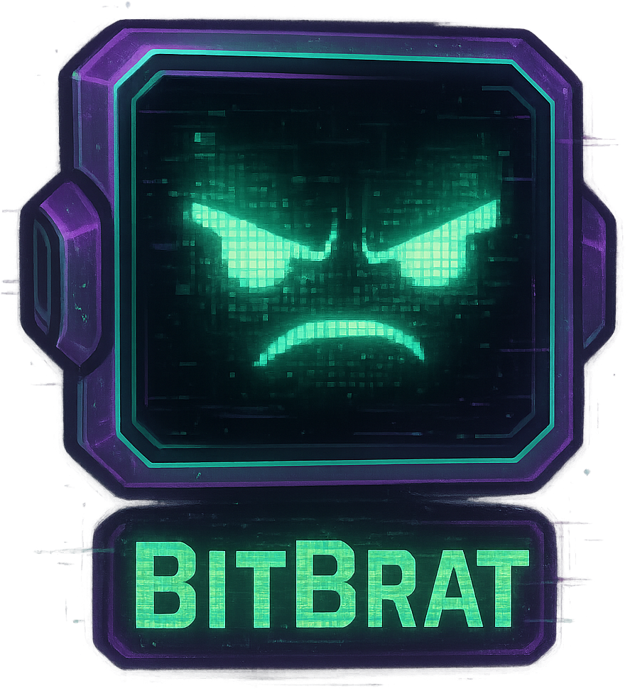

# BitBrat Platform

> [!WARNING]
> **Early & Experimental Development Stage**: This project started as a way for me to better understand scalable LLM Agent collaboration. As is, it has been mainly a work between myself and a Junie LLM coding agent. It is currently in early development. APIs, configuration schemas, and core architectures are subject to significant changes. We do not recommend using this in a production environment yet.
>
> Several design decisions were deliberately fixed to keep scope simple and focus exploration:
> - The only target platforms are Docker Compose and Google Cloud.
> - The only persistence framework supported is Firestore.
> 
> These both could be fairly easily updated to support additoinal options, I have just not focused on them specifically in favor of learning and exploring AI agent orchestration.

<p align="center">
  
</p>

BitBrat Platform is an LLM-powered event orchestration and execution engine currently designed for streamers, though can easily be adapted for a wide range of use cases. It bridges external event sources (like Twitch, Kick, Discord, and Twilio) with internal processing logic and AI-driven reactions.

## Features

- **Multi-Platform Ingress**: Listen to events from Twitch (IRC & EventSub), Discord, and Twilio Conversations.
- **AI-Driven Reactions**: Integration with OpenAI and Model Context Protocol (MCP) to provide intelligent responses and tool execution.
- **Microservices Architecture**: Scalable, cloud-native services deployed on Google Cloud Platform (Cloud Run).
- **Event-Driven**: Built on top of a robust message bus (NATS/PubSub) for asynchronous processing.
- **Extensible**: Easily add new event sources, command processors, or MCP tools.

## Architecture

The platform consists of several core services:

- **Ingress-Egress**: The gateway for external platforms.
- **Auth Service**: Handles user enrichment and authorization.
- **Event Router**: Matches incoming events, enriches them, and routes them through the platform.
- **LLM Bot**: The brain of the platform, processing events using LLMs.
- **Persistence**: Ensures events and states are stored reliably.
- **Scheduler**: Manages periodic tasks and ticks.

For a detailed view, see [architecture.yaml](./architecture.yaml) and the [documentation](./documentation) folder.

## Getting Started

### Prerequisites

- Node.js (v24.x recommended)
- npm
- Docker and Docker Compose
- Google Cloud Project (for project ID)
- OpenAI API Key

### Installation & Setup

1. Clone the repository:
   ```bash
   git clone https://github.com/cnavta/BitBrat.git
   cd BitBrat
   ```

2. Install dependencies:
   ```bash
   npm install
   ```

3. Initialize the platform:
   ```bash
   npm run brat -- setup
   ```
   The `setup` command will guide you through configuring your GCP Project ID, OpenAI API Key, and Bot Name. It will also bootstrap your local environment using Docker.

### Chatting with your Bot

Once setup is complete, you can start an interactive chat session with your bot:
```bash
npm run brat -- chat
```

### Running Locally

To manually start the platform locally using Docker Compose:
```bash
npm run local
```

To stop the local environment:
```bash
npm run local:down
```

### Building and Testing

Build the project:
```bash
npm run build
```

Run tests:
```bash
npm test
```

## Management CLI (brat)

`brat` (BitBrat Rapid Administration Tool) is the primary CLI tool for managing the platform. It simplifies common tasks such as environment validation, service bootstrapping, deployment, and infrastructure management.

**Usage:**
```bash
npm run brat -- <command> [options]
```
*(Note: Use `--` to pass arguments through npm to the underlying script)*

### Global Flags
- `--env <name>`: Specify the environment (e.g., `dev`, `prod`). Can also be set via `BITBRAT_ENV`.
- `--project-id <id>`: Override the Google Cloud Project ID.
- `--region <name>`: Override the GCP region.
- `--dry-run`: Preview changes without applying them.
- `--json`: Output results in JSON format.

### Core Commands

#### Setup & Interaction
- `brat setup [--project-id <id>] [--openai-key <key>] [--bot-name <name>]`: Interactive platform initialization.
- `brat chat [--env <name>] [--url <url>]`: Start an interactive chat session with the platform.

#### Diagnostics & Config
- `brat doctor`: Run diagnostic checks to ensure required tools (`gcloud`, `terraform`, `docker`) are installed.
- `brat config show`: Display the resolved platform configuration.
- `brat config validate`: Validate `architecture.yaml` against the platform schema.

#### Service Management
- `brat service bootstrap --name <name> [--mcp] [--force]`: Create a new service from a template. Use `--mcp` for Model Context Protocol servers.

#### Deployment
- `brat deploy services --all`: Deploy all services defined in `architecture.yaml`.
- `brat deploy service <name>`: Deploy a specific service (alias: `brat deploy <name>`).

#### Infrastructure (IaC)
- `brat infra plan <module>`: Generate an execution plan for infrastructure changes.
- `brat infra apply <module>`: Apply infrastructure changes.
- **Modules**: `network`, `lb` (load-balancer), `connectors`, `buckets`.

#### Load Balancer
- `brat lb urlmap render`: Generate the GCP Load Balancer URL map YAML.
- `brat lb urlmap import`: Import the rendered URL map into Google Cloud.

#### Google Cloud Platform
- `brat apis enable`: Enable required Google Cloud APIs.
- `brat cloud-run shutdown`: Stop all Cloud Run services in the environment (cost-saving).

#### CI/CD Triggers
- `brat trigger create --name <n> --repo <repo> --branch <regex> --config <path>`: Manage Cloud Build triggers.

## Event Messaging & Architecture

The BitBrat platform follows a robust, event-driven architecture built on a unified message bus (NATS or Google Cloud Pub/Sub) and a standardized internal event contract.

### InternalEventV2

`InternalEventV2` is the canonical event format used throughout the platform. It flattens the legacy V1 envelope and introduces specialized fields for AI-driven orchestration:

- **Metadata**: `correlationId`, `traceId`, `source`, `egressDestination`.
- **Payloads**: 
  - `message`: Normalized chat/text message metadata.
  - `externalEvent`: Normalized platform-specific behavioral events (e.g., follows, subs).
  - `payload`: Fallback for system or non-message data.
- **Enrichment**:
  - `annotations`: A collection of insights produced by services (e.g., intent, sentiment, user profile).
  - `candidates`: Potential replies or actions proposed by processing services.
- **Routing**:
  - `routingSlip`: An array of `RoutingStep` objects defining the remaining processing path.

### Core Messaging Flow

The typical lifecycle of an event involves several specialized microservices:

1. **Ingress**: External platforms (Twitch, Discord, Twilio) hit the `Ingress-Egress` service. It maps the raw payload to `InternalEventV2`, sets the `egressDestination` to its specific instance topic, and publishes to `internal.ingress.v1`.
2. **Auth (User Enrichment)**: The `Auth Service` consumes the event, enriches it with user metadata (roles, tags, notes) from Firestore, and publishes to `internal.user.enriched.v1`.
3. **Event Router**: The `Event Router` evaluates the enriched event against a set of rules (using JsonLogic). It generates a `routingSlip` defining the next processing steps and dispatches the event.
4. **Orchestration & Processing**: Services like `LLM Bot` or `Command Processor` receive events based on the routing slip. They add `annotations` or `candidates`, update the routing step status, and use `BaseServer` helpers (`next()`) to advance the event.
5. **Egress**: Once processing is complete, the event is routed back to the specific `Ingress-Egress` instance via the `egressDestination`. The service selects the best candidate reply and delivers it to the target platform.
6. **Persistence**: The `Persistence` service listens to various topics (including `internal.persistence.finalize.v1`) to store the final state, selections, and errors for auditing and long-term memory.

### Development Primitives

All services leverage `BaseServer` for standardized messaging patterns:

- **`onMessage<T>(topic, handler)`**: Unified subscription to the message bus with automatic V1->V2 conversion.
- **`next(event)`**: Automatically advances the event to the next pending step in the `routingSlip`.
- **`complete(event)`**: Bypasses the remaining routing slip and sends the event directly to `egressDestination`.

## Contributing

We welcome contributions! Please see [CONTRIBUTING.md](./CONTRIBUTING.md) for guidelines.

## License

This project is licensed under the MIT License - see the [LICENSE](./LICENSE) file for details.

## Security

For security-related issues, please refer to [SECURITY.md](./SECURITY.md).
