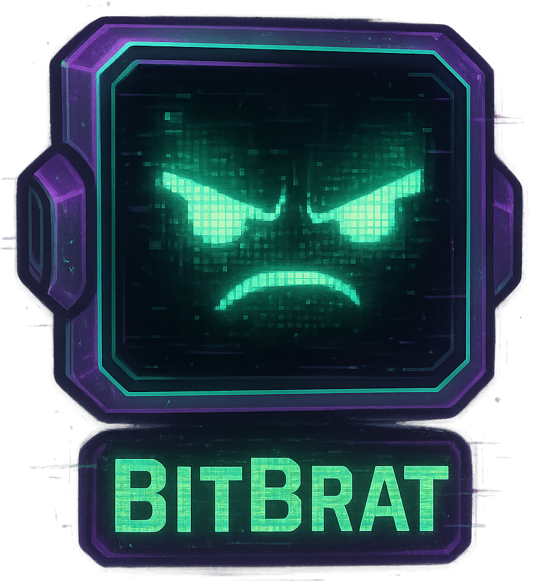
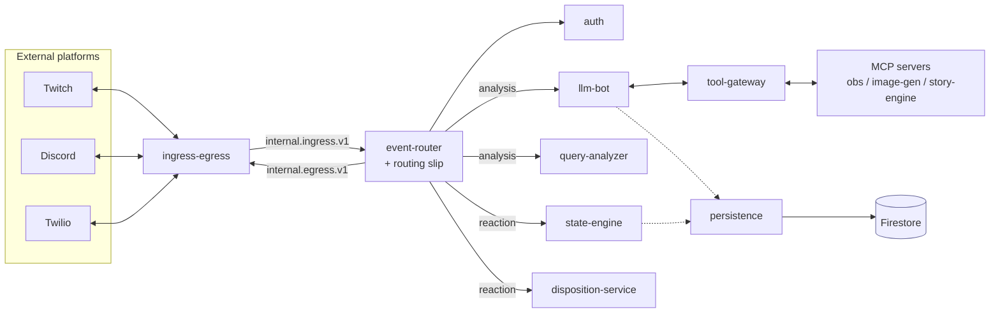

# BitBrat Platform

> [!WARNING]
> **Early & Experimental Development Stage**: This project started as a way for me to better understand scalable LLM Agent collaboration. As is, it has been mainly a work between myself and a Junie LLM coding agent. It is currently in early development. APIs, configuration schemas, and core architectures are subject to significant changes. We do not recommend using this in a production environment yet.
>
> Several design decisions were deliberately fixed to keep scope simple and focus exploration:
> - The only target platforms are Docker Compose and Google Cloud.
> - The only persistence framework supported is Firestore.
> - Logging, persisted data and message verbosity is deliberately high to facilitate ease of learning and debugging.
> 
> These all could be fairly easily updated to support additional options, I have just not focused on them specifically in favor of learning and exploring AI agent orchestration.

<p align="center">
  
</p>

## What is BitBrat?

**BitBrat is an event-driven LLM orchestration engine for building AI agents.** Rather than a single
monolithic "agent" object, BitBrat decomposes the classic agent loop into independent, message-passing
microservices that communicate over a unified bus (NATS locally / Google Cloud Pub/Sub in production).
**Streaming is the reference application** — the shipped services react to Twitch/Discord/Twilio events —
but nothing about the core engine is streaming-specific.

### The agent loop, mapped to BitBrat services

If you are evaluating BitBrat as an **AI agent framework**, this is where "the agent" lives. The familiar
**perceive → plan → act → observe** loop maps directly onto real services defined in
[`architecture.yaml`](./architecture.yaml):

| Agent-loop stage | BitBrat realization | Service(s) |
|---|---|---|
| **Perceive** (ingest) | Normalize external events into an internal `Envelope v1` | `ingress-egress` |
| **Plan** (decide) | Match events against [JsonLogic rules](https://jsonlogic.com/) and attach a **routing slip** describing the remaining steps | `event-router` (+ routing slip) |
| **Act** (reason & use tools) | Run LLM reasoning and call tools via the Model Context Protocol (MCP) | `llm-bot`, `query-analyzer`, `tool-gateway` + MCP servers (`obs-mcp`, `image-gen-mcp`, `story-engine-mcp`) |
| **Observe / Memory** | Persist state, selections, and short-term behavior for auditing and long-term memory | `persistence`, `state-engine`, `disposition-service` |

The **routing slip** is BitBrat's plan representation: an ordered, self-describing list of steps that
travels *with* the message, so orchestration is decentralized and each service simply advances the slip.
See the [Platform Flow Overview](./documentation/concepts/platform-flow.md) for the full lifecycle.

### Why BitBrat (beyond streaming)

The same primitives — typed event ingest, rule-driven planning, an MCP tool layer, and durable
memory — apply to any **event-driven agent**: chat-ops bots, webhook/automation pipelines, customer-support
triage, or IoT/telephony reactions. Swap the `ingress-egress` adapters and the Event Router rules, and the
reasoning/tool/memory planes are reused unchanged.

### Core Agent Concepts

| Concept | In BitBrat | Where it lives |
|---|---|---|
| **Reasoning loop** | The Event Router evaluates rules and advances a **routing slip** step-by-step; analysis services (`llm-bot`, `query-analyzer`) add candidate responses | [Event Router & Rules](./documentation/concepts/event-router-rules.md), [Platform Flow](./documentation/concepts/platform-flow.md) |
| **Tool use** | Tools are exposed to the LLM via **MCP servers** and brokered/secured by `tool-gateway` | `tool-gateway`, `obs-mcp`, `image-gen-mcp`, `story-engine-mcp` |
| **Memory** | Durable state and audit history in Firestore; short-term, TTL-bounded behavior via the disposition service | `persistence`, `state-engine`, `disposition-service` |
| **Message contract** | Every message is an `Envelope v1` carrying `correlationId`, `routingSlip`, etc. | [`envelope.v1.json`](./documentation/schemas/envelope.v1.json), [`routing-slip.v1.json`](./documentation/schemas/routing-slip.v1.json) |

### Extending BitBrat

Adding a new agent capability is a matter of adding a service, an MCP tool, or a routing rule:

- **New service / MCP tool:** scaffold it with `npm run brat -- service bootstrap --name <name> [--mcp]`, then register it under `services:` in [`architecture.yaml`](./architecture.yaml). See the [`brat service bootstrap` reference](./documentation/tools/brat.md#service-management) and the [`extension_points`](./architecture.yaml) block in the canonical file for exactly which files change.
- **New rule / behavior:** add a JsonLogic rule following [Event Router & Rules](./documentation/concepts/event-router-rules.md).
- **Agent-assisted contributors:** BitBrat ships a machine-readable collaboration protocol in **[AGENTS.md](./AGENTS.md)** (a `Plan → Approve → Implement → Validate → Verify → Publish → Retro` sprint workflow) and treats [`architecture.yaml`](./architecture.yaml) as the canonical source of truth. Start there before making changes.

## Features

- **Multi-Platform Ingress**: Listen to events from Twitch (IRC & EventSub), Discord, and Twilio Conversations.
- **AI-Driven Reactions**: Integration with OpenAI and Model Context Protocol (MCP) to provide intelligent responses and tool execution.
- **Microservices Architecture**: Scalable, cloud-native services deployed on Google Cloud Platform (Cloud Run). Every service is a **Bit** — see [The Bit Model](./documentation/concepts/bit-model.md).
- **Universal Control Plane**: **Every Bit speaks MCP** and exposes a mandatory [`bit.*` control plane](./documentation/reference/bit-control-plane.md) that `brat fleet` administers fleet-wide.
- **Event-Driven**: Built on top of a robust message bus (NATS locally / Google Cloud Pub/Sub in production) for asynchronous processing.
- **Rule-Driven Routing**: A central Event Router uses [JsonLogic](https://jsonlogic.com/) rules to match, enrich, and route events through configurable processing stages.
- **Extensible**: Easily add new event sources, command processors, or MCP tools.

## Documentation

The `documentation/` folder contains structured guides for getting started, core concepts, and step-by-step tutorials. Start here:

- **Getting Started**
  - [Quickstart: Local Platform Setup](./documentation/getting-started/quickstart.md)
  - [Evaluator's Guide](./documentation/getting-started/evaluating-bitbrat.md) — try BitBrat in ~5 minutes (offline), what to read first, and how the pieces form an agent.
- **Concepts**
  - [The Bit Model](./documentation/concepts/bit-model.md) — the `Bit` base abstraction, the three rings, and `profile:` / `mcp.exposure:`.
  - [Capability Profiles](./documentation/concepts/capability-profiles.md) — the `profile:` → mixin composition model.
  - [Platform Flow Overview](./documentation/concepts/platform-flow.md) — the ingest → analysis → reaction → egress lifecycle.
  - [Event Router & Rules](./documentation/concepts/event-router-rules.md) — rule format and matching logic.
- **Reference**
  - [Bit Control-Plane Reference](./documentation/reference/bit-control-plane.md) — the mandatory `bit.*` toolset, RBAC scopes, redaction, and exposure model.
- **Guides**
  - [The `brat fleet` Guide](./documentation/guides/brat-fleet.md) — drive the `bit.*` control plane across the fleet.
  - [Managing Seed Data](./documentation/guides/seed-data.md) — initial seeding via `brat setup` and the `firestore:upsert` tool.
- **Tutorials**
  - [Creating a `!lurk` Command](./documentation/tutorials/lurk-command.md) — build your first custom command.
- **Tools**
  - [The `brat` CLI](./documentation/tools/brat.md) — full command reference.
  - [Firestore Upsert Tool](./documentation/tools/firestore-upsert.md) — load JSON data into Firestore.

For the canonical system definition, see [architecture.yaml](./architecture.yaml).

## Architecture

Under the **[Bit model](./documentation/concepts/bit-model.md)**, every service is a **Bit** built on a
single base abstraction. Each Bit always serves a universal [`bit.*` control plane](./documentation/reference/bit-control-plane.md)
(the Platform Ring) that Brat administers uniformly, and composes optional capability
[profiles](./documentation/concepts/capability-profiles.md) (`profile:`) and an `mcp.exposure:` level
declared in [`architecture.yaml`](./architecture.yaml). The platform consists of several core Bits:

- **Ingress-Egress**: The gateway for external platforms. Normalizes inbound events and delivers outbound responses.
- **Auth Service**: Handles user enrichment (roles, tags, `displayName`) and authorization during the analysis stage.
- **Event Router**: Matches incoming events against rules, attaches a routing slip, and advances events through the platform.
- **LLM Bot**: The brain of the platform, processing events using LLMs and MCP tools.
- **Persistence**: Ensures events and states are stored reliably for auditing and long-term memory.
- **Scheduler**: Manages periodic tasks and ticks.

For a detailed view, see [architecture.yaml](./architecture.yaml) and the [Platform Flow Overview](./documentation/concepts/platform-flow.md).
A standalone diagram asset is also available at [`assets/architecture-overview.md`](./assets/architecture-overview.md).


```mermaid
flowchart LR
  subgraph External["External platforms"]
    TW[Twitch]
    DC[Discord]
    TL[Twilio]
  end

  TW & DC & TL <--> IE[ingress-egress]

  IE -->|internal.ingress.v1| ER["event-router<br/>+ routing slip"]
  ER --> AU[auth]
  ER -->|analysis| LB[llm-bot]
  ER -->|analysis| QA[query-analyzer]
  LB <--> TG[tool-gateway]
  TG <--> MCP["MCP servers<br/>obs / image-gen / story-engine"]
  ER -->|reaction| SE[state-engine]
  ER -->|reaction| DS[disposition-service]
  ER -->|internal.egress.v1| IE
  LB -.-> PE[persistence]
  SE -.-> PE
  PE --> FS[(Firestore)]

  classDef store fill:#eef,stroke:#669;
  class FS store;
```

*Perceive → plan → act → observe: `ingress-egress` ingests, `event-router` plans via the routing slip,
`llm-bot`/`query-analyzer` + `tool-gateway`/MCP act, and `state-engine`/`disposition-service`/`persistence`
observe & remember (in Firestore).*

### Capabilities Matrix

| Dimension | Supported today | Notes |
|---|---|---|
| **Ingress/egress platforms** | Twitch (IRC & EventSub), Discord, Twilio Conversations | Add more by extending `ingress-egress` adapters. |
| **LLM providers** | OpenAI (default), **Ollama** (local/offline), vLLM (OpenAI-compatible) | Selected via `LLM_PROVIDER`/`LLM_MODEL`/`LLM_BASE_URL`. |
| **Tooling** | Model Context Protocol (MCP) via `tool-gateway` + MCP servers (`obs-mcp`, `image-gen-mcp`, `story-engine-mcp`) | Tools are exposed to the LLM at the "act" stage. |
| **Message bus** | NATS (local/dev), Google Cloud Pub/Sub (production) | Selected via `MESSAGE_BUS_DRIVER`. |
| **Persistence** | Google Cloud Firestore | Only supported persistence backend (by design, pre-1.0). |
| **Deploy targets** | Docker Compose (local), Google Cloud Run (production) | Only supported targets (by design, pre-1.0). |
| **Control plane** | Universal `bit.*` MCP toolset on every Bit, driven fleet-wide by `brat fleet` | RBAC-scoped (`bit:read` / `bit:operate`); see the [control-plane reference](./documentation/reference/bit-control-plane.md). |

## Getting Started

> The following is a condensed version of the [Quickstart guide](./documentation/getting-started/quickstart.md). Refer to it for full details.

### Prerequisites

- **Node.js** (v24.x or higher)
- **npm**
- **Docker** and Docker Compose
- **Google Cloud SDK (`gcloud`)** — some local configs depend on GCP project structure.
- **Git**
- **OpenAI API Key** — required for the default OpenAI provider. **Optional** if you run fully offline with a local model — see [Offline / Local-LLM Quickstart](#offline--local-llm-quickstart-no-openai-key) below.

### 1. Clone the repository

```bash
git clone https://github.com/cnavta/BitBrat.git
cd BitBrat
```

### 2. Install dependencies

```bash
npm install
```

### 3. Initialize the platform

```bash
npm run brat -- setup
```

The interactive `setup` command guides you through configuring your **GCP Project ID**, **OpenAI API Key**, and **Bot Name**. It also bootstraps your local environment by:

- **Configuration**: Generating `.bitbrat.json` (admin credentials), `.secure.local` (secrets), and `env/local/global.yaml`.
- **Admin Token**: Creating a unique API token for local administration (used by tools like `brat chat`).
- **Initial Seeding**: Populating the local Firestore emulator with default bot **personalities**, base **Event Router rules** (analysis and bot-mention handling), and initial **authentication tokens**.

See [Managing Seed Data](./documentation/guides/seed-data.md) for details on the seeded data and how to extend it.

### 4. Verify your environment

```bash
npm run brat -- doctor
```

Look for all "PASS" results. The tool provides guidance for any failed checks.

### 5. Run the platform locally

```bash
npm run local        # Start the local stack (Docker Compose)
npm run local:logs   # Tail service logs
npm run local:down   # Stop the local environment
```

### 6. Chat with your bot

Once the platform is running, start an interactive chat session to test rules and interactions locally:

```bash
npm run brat -- chat
```

See the [`brat chat` documentation](./documentation/tools/brat.md#brat-chat) for more options.

### Offline / Local-LLM Quickstart (no OpenAI key)

You can try BitBrat **without an OpenAI key or any paid API** by pointing the LLM provider at a local
[Ollama](https://ollama.com) server. BitBrat already ships the [`ai-sdk-ollama`](https://www.npmjs.com/package/ai-sdk-ollama)
provider, so no code changes are needed — only environment variables.

**1. Install and start Ollama, then pull a small model:**

```bash
# Install from https://ollama.com/download, then:
ollama pull llama3        # any chat model works (e.g. llama3, qwen2.5, phi3)
ollama serve              # serves the API on http://localhost:11434
```

**2. Tell BitBrat to use Ollama instead of OpenAI.** The provider is selected entirely by environment
variables, read by every LLM-using service (`llm-bot`, `query-analyzer`):

| Variable | Offline value | Meaning |
|---|---|---|
| `LLM_PROVIDER` | `ollama` | Use the local Ollama provider (default is `openai`). |
| `LLM_MODEL` | `llama3` | The Ollama model you pulled above. |
| `LLM_BASE_URL` | `http://localhost:11434` | Ollama API endpoint (use `http://host.docker.internal:11434` from inside Docker). |
| `LLM_API_KEY` | _unset_ | Not required for Ollama. |

Add these to your local environment file (e.g. `env/local/global.yaml` created by `brat setup`, or your
shell) — when running the stack in Docker, set `LLM_BASE_URL=http://host.docker.internal:11434` so the
containers can reach the Ollama server on your host.

**3. Hello-world agent in ~5 minutes:** run `brat setup` (you can leave the OpenAI key blank), export the
variables above, start the stack with `npm run local`, then `npm run brat -- chat` and send a message. The
Event Router will route it to `llm-bot`, which now reasons using your local model — a complete
perceive → plan → act → observe loop with **zero external API keys**. For a guided walkthrough see the
[Evaluator's Guide](./documentation/getting-started/evaluating-bitbrat.md).

> **Note:** GCP-specific deploy commands (`brat deploy`, `brat infra`) still require a Google Cloud project,
> but the **local agent loop above does not**.

### Building and Testing

```bash
npm run build   # Compile the TypeScript project
npm test        # Run the test suite
```

### Container Builds

All standard services are built from a single, reusable **`Dockerfile.service`** at the repo root.
Per-service behavior is supplied as build arguments derived from `architecture.yaml` — there is no
per-service Dockerfile to maintain:

- `SERVICE_NAME` — the service key in `architecture.yaml`.
- `SERVICE_PORT` — `services.<name>.port` (defaults to `3000`).
- `SERVICE_ENTRY` — `services.<name>.entry` mapped from `src/<x>.ts` to `dist/<x>.js`.

```bash
docker build -f Dockerfile.service \
  --build-arg SERVICE_NAME=llm-bot \
  --build-arg SERVICE_ENTRY=dist/apps/llm-bot-service.js \
  --build-arg SERVICE_PORT=3000 \
  -t llm-bot:latest .
```

The deploy tooling (`infrastructure/deploy-cloud.sh`, Cloud Build, and local Compose) wires these
arguments automatically. **Escape hatch:** a service may still ship its own `Dockerfile.<service>`
when it needs something the standard image cannot express (extra OS packages, a different base
image, a non-`src/` build layout, or a prebuilt `image:`); when present, that file takes precedence.
See [Reusable Standard Service Dockerfile](./documentation/technical-architecture/reusable-service-dockerfile.md)
and the [usage guide](./documentation/technical-architecture/standard-service-dockerfile-usage.md).

## Management CLI (brat)

`brat` (BitBrat Rapid Administration Tool) is the primary CLI tool for managing the platform. It simplifies common tasks such as environment validation, service bootstrapping, deployment, and infrastructure management.

For more details, see the [brat documentation](./documentation/tools/brat.md).

**Usage:**
```bash
npm run brat -- <command> [options]
```
*(Note: Use `--` to pass arguments through npm to the underlying script)*

### Global Flags
- `--env <name>`: Specify the environment (e.g., `local`, `dev`, `prod`). Can also be set via `BITBRAT_ENV`.
- `--project-id <id>`: Override the Google Cloud Project ID.
- `--region <name>`: Override the GCP region.
- `--dry-run`: Preview changes without applying them.
- `--json`: Output results in JSON format.

### Core Commands

#### Setup & Interaction
- `brat setup [--project-id <id>] [--openai-key <key>] [--bot-name <name>]`: Interactive platform initialization and local seeding.
- `brat chat [--env <name>] [--url <url>]`: Start an interactive chat session with the platform.

#### Diagnostics & Config
- `brat doctor`: Run diagnostic checks to ensure required tools (`gcloud`, `terraform`, `docker`) are installed.
- `brat config show`: Display the resolved platform configuration.
- `brat config validate`: Validate `architecture.yaml` against the platform schema.

#### Local Environment
- `brat docker up --env local`: Start the local stack (aliased as `npm run local`).
- `brat docker logs --env local`: Tail local logs (aliased as `npm run local:logs`).
- `brat docker down --env local`: Stop the local stack (aliased as `npm run local:down`).

#### Service Management
- `brat service bootstrap --name <name> [--mcp] [--force]`: Scaffold a new **Bit** from a template. Every Bit serves the universal `bit.*` control plane; use `--mcp` to also scaffold domain tools (`mcp.exposure: platform+domain`).

#### Deployment
- `brat deploy services --all`: Deploy all services defined in `architecture.yaml`.
- `brat deploy service <name>`: Deploy a specific service (alias: `brat deploy <name>`).

#### Infrastructure (IaC)
- `brat infra plan <module>`: Generate an execution plan for infrastructure changes.
- `brat infra apply <module>`: Apply infrastructure changes.
- **Modules**: `network`, `lb` (load-balancer), `connectors`, `buckets`.

#### Load Balancer
- `brat lb urlmap render`: Generate the GCP Load Balancer URL map YAML.
- `brat lb urlmap import`: Import the rendered URL map into Google Cloud.

#### Google Cloud Platform
- `brat apis enable`: Enable required Google Cloud APIs.
- `brat cloud-run shutdown`: Stop all Cloud Run services in the environment (cost-saving).

#### CI/CD Triggers
- `brat trigger create --name <n> --repo <repo> --branch <regex> --config <path>`: Manage Cloud Build triggers.

#### Fleet Control Plane
`brat fleet` turns Brat into a fleet MCP client over the universal [`bit.*` control plane](./documentation/reference/bit-control-plane.md).
By default it drives Bits through the `tool-gateway` fabric (one auth/RBAC/discovery chokepoint), with an
audited `--direct <bit>` break-glass path. Read subcommands need the `bit:read` scope; mutating ones need
`bit:operate`. See the [`brat fleet` guide](./documentation/guides/brat-fleet.md).
- `brat fleet list`: Enumerate live Bits (name, profile, exposure).
- `brat fleet info|health [<bit> | --all]`: Read `bit.info` / `bit.health` for one Bit or the whole fleet.
- `brat fleet config <bit> [--describe]`: Show effective config (secrets redacted).
- `brat fleet flags <bit> get|set [--key K] [--value V]`: Inspect/toggle feature flags (`set` is elevated).
- `brat fleet log <bit> --level <error|warn|info|debug>`: Change runtime log level (elevated).
- `brat fleet drain|shutdown <bit> [--confirm]`: Graceful lifecycle (elevated; fleet-wide mutations need `--confirm`).

#### Versioning & Releases
The platform version has a **single source of truth**: `architecture.yaml` `project.version` (per
AGENTS.md §0, and the runtime value every Bit reports via `bit.info` / `brat fleet info`). `package.json`
and `package-lock.json` mirror it. Use the release tool to bump all three at once and roll the CHANGELOG —
never hand-edit the version in multiple files.

- `brat release <patch|minor|major|x.y.z> [--dry-run] [--tag] [--yes]`: Cut a version. Computes the next
  SemVer (the bump type is always explicit — never guessed; pre-1.0 SemVer), writes `architecture.yaml`
  (only `project.version`, re-validated — Law #2) + `package.json`, syncs `package-lock.json`, asserts all
  three agree, and rolls `CHANGELOG.md` `## [Unreleased]` into a dated `## [<version>]` block with a fresh
  empty `## [Unreleased]`. `--tag` creates a local `git tag v<version>` (never pushes); `--dry-run` writes
  nothing.
- `npm run release -- <bump>` / `npm run release:dry -- <bump>`: npm aliases (note the `--`). The dry-run is
  idempotent and CI-safe — it is wired into `validate_deliverable.sh` so every sprint proves a bump is
  mechanically possible before close.

```bash
npm run release:dry -- patch     # preview 0.7.0 -> 0.7.1, writes nothing
npm run release -- patch         # bump everywhere + roll the CHANGELOG
brat release 1.0.0 --tag         # explicit version + local git tag (no push)
```

## Event Messaging & Flow

The BitBrat platform follows a robust, event-driven architecture built on a unified message bus (NATS locally, Google Cloud Pub/Sub in production) and a standardized internal event contract.

### The Event Lifecycle

Events flow through a series of decoupled stages. For the full breakdown, see the [Platform Flow Overview](./documentation/concepts/platform-flow.md).

1. **Ingest**: External platforms (Twitch, Discord, Twilio) hit the `Ingress-Egress` service. It normalizes the raw payload into the internal event format and publishes to `internal.ingress.v1`.
2. **Analysis**: The event is enriched (e.g., the `Auth Service` populates user metadata such as `displayName`) and evaluated by the **Event Router** against active rules. Matching rules attach a **routing slip** that defines the remaining processing path. Analysis services like the **LLM Bot** or **Query Analyzer** may add annotations or candidate responses, returning the event via `internal.enriched.v1`.
3. **Reaction**: Once analysis is complete, the Event Router advances the event to the `reaction` stage, where reactive services (e.g., **State Engine**, **Disposition Service**) act on it. If a rule's routing slip is empty, `Bit.next()` automatically routes the event to egress.
4. **Egress**: The event is delivered back to the originating `Ingress-Egress` instance, which selects the best candidate reply and sends it to the target platform.
5. **Persistence**: The `Persistence` service stores final state, selections, and errors for auditing and long-term memory.

> **Tip:** Command rules typically trigger during the `analysis` stage (where `user.displayName` is already available), then advance to `reaction` for delivery. See [Event Router & Rules](./documentation/concepts/event-router-rules.md) for the rule format and stage-filtering best practices.

### Development Primitives

All services are **Bits** (built on the `Bit` base abstraction; the former `BaseServer` alias has been
retired). Beyond the always-on [`bit.*` control plane](./documentation/reference/bit-control-plane.md),
the eventing capability provides standardized messaging patterns:

- **`onMessage<T>(topic, handler)`**: Unified subscription to the message bus with automatic event conversion.
- **`next(event)`**: Automatically advances the event to the next pending step in the routing slip (or to egress when the slip is empty).
- **`complete(event)`**: Bypasses the remaining routing slip and sends the event directly to its egress destination.

## Contributing

We welcome contributions! Please see [CONTRIBUTING.md](./CONTRIBUTING.md) for guidelines.

## License

This project is licensed under the MIT License - see the [LICENSE](./LICENSE) file for details.

## Security

For security-related issues, please refer to [SECURITY.md](./SECURITY.md).
