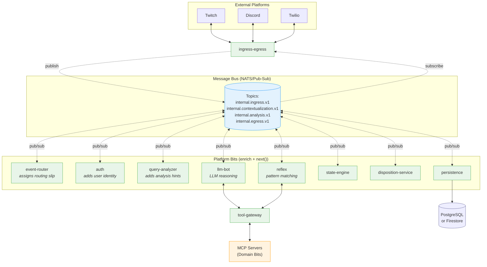

# BitBrat Platform

**BitBrat is an event-driven LLM orchestration engine** that decomposes the classic agent loop (perceive → plan → act → observe) into independent microservices communicating over a message bus. Platform-agnostic by design—runs anywhere Docker and PostgreSQL are available.

**Early Experimental Development:** BitBrat is in active development, exploring scalable LLM agent orchestration patterns through collaboration between human developers and AI coding agents. APIs, configuration schemas, and core architectures are subject to change. Logging and message verbosity are deliberately high to facilitate learning and debugging.

<p align="center">
  
</p>

## Core Concepts

BitBrat implements a **5-stage agent flow model** where each stage maps to independent services that enrich events and advance a routing slip:

| Stage | Purpose | BitBrat Services | Pattern |
|---|---|---|---|
| **Attention** | Match events against rules, attach routing slip | `event-router` | Rule-driven planning via JsonLogic |
| **Contextualization** | Reestablish context (auth, environment) BEFORE analysis | `auth`, `query-analyzer` | Enrich with identity, permissions, state |
| **Analysis** | LLM reasoning OR deterministic pattern-match, tool selection | `llm-bot`, `reflex`, `query-analyzer` | Add candidate responses/actions |
| **Reaction** | Execute actions, mutate state, prepare responses | `tool-gateway` + MCP servers, `state-engine`, `disposition-service` | Tool execution, state mutations |
| **Introspection** | Persist audit logs, collect feedback | `persistence` | Durable event history |

**Key Abstractions:**

| Concept | Description | Where to Learn More |
|---|---|---|
| **Bit** | Every service is a Bit—a unit that extends a common base abstraction and always exposes a universal `bit.*` MCP control plane | [The Bit Model](./documentation/concepts/bit-model.md), [Bit Control Plane](./documentation/reference/bit-control-plane.md) |
| **Routing Slip** | Ordered, self-describing list of processing steps that travels WITH the message; services enrich events and call `next()` to advance the slip | [5-Stage Agent Flow](./documentation/concepts/agent-flow-stages.md), [Agent Flow Patterns](./documentation/concepts/agent-flow-patterns.md) |
| **Envelope** | Every message is an Envelope v1 carrying `correlationId`, `routingSlip`, payload, annotations, and metadata | [`envelope.v1.json`](./documentation/schemas/envelope.v1.json), [`routing-slip.v1.json`](./documentation/schemas/routing-slip.v1.json) |
| **Enrich-and-Next** | Canonical pattern: subscribe to stage topic → enrich event (add annotations/candidates) → call `next()` → acknowledge message | [Agent Flow Patterns](./documentation/concepts/agent-flow-patterns.md), [Building an Enrichment Bit](./documentation/tutorials/building-an-enrichment-bit.md) |
| **MCP Tools** | Tools exposed to LLM via Model Context Protocol servers, brokered by `tool-gateway` with RBAC enforcement | `tool-gateway`, `obs-mcp`, `image-gen-mcp`, `story-engine-mcp` |
| **Memory** | Durable state in PostgreSQL (default, platform-agnostic) or Firestore (legacy, GCP-specific); short-term behavior via `disposition-service` | `persistence`, `state-engine`, `disposition-service` |

**Platform-Agnostic Architecture:**

BitBrat runs anywhere Docker and PostgreSQL are available—cloud providers (AWS ECS, GCP Cloud Run, Azure Container Instances), self-hosted infrastructure, or local development. Docker provides the baseline deployment model; specific platforms (GCP, AWS, Azure) are validated implementation choices, not requirements. No vendor lock-in.

## Why BitBrat

**Streaming is the reference application**—the shipped services react to Twitch/Discord/Twilio events—but nothing about the core engine is streaming-specific. The same primitives (typed event ingest, rule-driven planning, MCP tool layer, durable memory) apply to any event-driven agent: chat-ops bots, webhook automation, customer-support triage, IoT/telephony reactions. Swap the `ingress-egress` adapters and Event Router rules; the reasoning/tool/memory planes are reused unchanged.

## Extending BitBrat

Adding a new agent capability is a matter of adding a service, an MCP tool, or a routing rule:

#### Building an Agent-Flow Bit

Most bits participate in the agent loop by **enriching events** and **advancing the routing slip**:

1. **Subscribe** to a stage-specific topic via `onMessage(topic, handler)`
2. **Enrich** the event by adding annotations, candidates, or context
3. **Advance** the routing slip by calling `next(event)`
4. **Acknowledge** the message with `ctx.ack()`

**Example:**
```typescript
await this.onMessage<InternalEventV2>('internal.contextualization.v1', async (event, attrs, ctx) => {
  event.annotations.push({ kind: 'data', value: 'enrichment', source: this.name, id: randomUUID(), createdAt: new Date().toISOString() });
  await this.next(event);  // Advance routing slip
  await ctx.ack();
});
```

See [Agent Flow Patterns](./documentation/concepts/agent-flow-patterns.md) for the canonical enrich-and-next pattern and [Building an Enrichment Bit](./documentation/tutorials/building-an-enrichment-bit.md) for a step-by-step tutorial.

#### Creating Services & MCP Tools

- **New service / MCP tool:** scaffold it with `npm run brat -- bit create <name> [--profile <p>] [--category <c>] [--exposure <e>] [--register]`.
  - **Profiles**: `core`, `gateway`, `llm`, `mcp-server`
  - **Categories**: `platform` (core orchestration) or `domain` (optional extensions)
  - Use `--register` to auto-add to [`architecture.yaml`](./architecture.yaml). See the [`brat bit create` reference](./documentation/tools/brat.md#bit-lifecycle-management) and the [`extension_points`](./architecture.yaml) block in the canonical file for exactly which files change.

#### Adding Rules & Behaviors

- **New rule / behavior:** add a JsonLogic rule following [Event Router & Rules](./documentation/concepts/event-router-rules.md).

#### Agent-Assisted Development

- **Agent-assisted contributors:** BitBrat ships a machine-readable collaboration protocol in **[AGENTS.md](./AGENTS.md)** (a `Plan → Approve → Implement → Validate → Verify → Publish → Retro` sprint workflow) and treats [`architecture.yaml`](./architecture.yaml) as the canonical source of truth. Start there before making changes.

## Features

- **Multi-Platform Ingress**: Listen to events from Twitch (IRC & EventSub), Discord, and Twilio Conversations.
- **AI-Driven Reactions**: Integration with OpenAI and Model Context Protocol (MCP) to provide intelligent responses and tool execution.
- **Microservices Architecture**: Scalable, cloud-native services deployed on Google Cloud Platform (Cloud Run). Every service is a **Bit** — see [The Bit Model](./documentation/concepts/bit-model.md).
- **Universal Control Plane**: **Every Bit speaks MCP** and exposes a mandatory [`bit.*` control plane](./documentation/reference/bit-control-plane.md) that `brat fleet` administers fleet-wide.
- **Event-Driven**: Built on top of a robust message bus (NATS locally / Google Cloud Pub/Sub in production) for asynchronous processing.
- **Rule-Driven Routing**: The Event Router uses [JsonLogic](https://jsonlogic.com/) rules to match events and assign routing slips; the framework (via `next()`) routes events through configurable processing stages.
- **Extensible**: Easily add new event sources, command processors, or MCP tools.

## Documentation

The `documentation/` folder contains structured guides for getting started, core concepts, and step-by-step tutorials. Start here:

- **Getting Started**
  - [Quickstart: Local Platform Setup](./documentation/getting-started/quickstart.md)
  - [Evaluator's Guide](./documentation/getting-started/evaluating-bitbrat.md) — try BitBrat in ~5 minutes (offline), what to read first, and how the pieces form an agent.
- **Concepts**
  - [The Bit Model](./documentation/concepts/bit-model.md) — the `Bit` base abstraction, the three rings, and `profile:` / `mcp.exposure:`.
  - [Capability Profiles](./documentation/concepts/capability-profiles.md) — the `profile:` → mixin composition model.
  - [Platform Flow Overview](./documentation/concepts/platform-flow.md) — the ingest → analysis → reaction → egress lifecycle.
  - [Event Router & Rules](./documentation/concepts/event-router-rules.md) — rule format and matching logic.
- **Reference**
  - [Bit Control-Plane Reference](./documentation/reference/bit-control-plane.md) — the mandatory `bit.*` toolset, RBAC scopes, redaction, and exposure model.
- **Guides**
  - [The `brat fleet` Guide](./documentation/guides/brat-fleet.md) — drive the `bit.*` control plane across the fleet.
  - [Managing Seed Data](./documentation/guides/seed-data.md) — initial seeding via `brat setup` and the `firestore:upsert` tool.
- **Tutorials**
  - [Creating a `!lurk` Command](./documentation/tutorials/lurk-command.md) — build your first custom command.
- **Tools**
  - [The `brat` CLI](./documentation/tools/brat.md) — full command reference.
  - [Firestore Upsert Tool](./documentation/tools/firestore-upsert.md) — load JSON data into Firestore.

For the canonical system definition, see [architecture.yaml](./architecture.yaml).

## Repository Structure

The BitBrat repository is organized to separate concerns between application code, infrastructure, documentation, and development tooling. Here's what each top-level directory contains:

### Core Directories

- **`src/`** — Application source code (TypeScript)
  - `apps/` — Service entry points (e.g., `llm-bot-service.ts`, `event-router-service.ts`)
  - `common/` — Shared abstractions (`Bit` base class, logging, config, events)
  - `services/` — Service-specific logic organized by domain
  - `types/` — Shared TypeScript types and event schemas

- **`tests/`** — Test suites (Jest)
  - Unit tests alongside source code (`.test.ts`, `.spec.ts`)
  - `integration/` — Integration tests (e.g., `postgres/` for PostgreSQL store tests)

- **`tools/`** — Development and administration tools
  - `brat/` — Platform CLI (config, deploy, fleet management, backup)

- **`scripts/`** — Setup, deployment, and maintenance scripts
  - `postgres/` — PostgreSQL table creation and migration scripts

- **`documentation/`** — Platform guides, concepts, references, and schemas
  - `getting-started/` — Quickstart and evaluation guides
  - `concepts/` — Core architectural concepts (Bit model, agent flow, routing)
  - `guides/` — How-to guides (deployment, backup, PostgreSQL setup)
  - `reference/` — API references (Bit control plane, MCP tools)
  - `tutorials/` — Step-by-step tutorials (building commands, enrichment bits)
  - `schemas/` — JSON schemas for events and messages
  - `migrations/` — Historical PostgreSQL migration documentation (Sprint 343)

- **`planning/`** — Sprint planning, implementation plans, and architecture decisions
  - `sprint-<id>/` — Per-sprint artifacts (backlog, implementation plan, retros)

- **`infrastructure/`** — Cloud deployment configurations
  - `terraform/` — Terraform IaC for GCP resources
  - `docker-compose/` — Docker Compose service definitions
  - `cloudbuild/` — Google Cloud Build configurations

- **`env/`** — Environment-specific configurations
  - `local/` — Local development configs (`global.yaml`, per-service overrides)
  - `staging/` — Staging environment configs
  - `prod/` — Production environment configs

- **`assets/`** — Static assets (logos, diagrams, architecture visuals)

- **`deprecated/`** — Historical code for reference only (DO NOT import or depend on)

### Key Configuration Files

- **`architecture.yaml`** — Canonical source of truth for all system configuration, service definitions, and deployment specifications
- **`package.json`** — Node.js dependencies and npm scripts
- **`tsconfig.json`** — TypeScript compiler configuration (uses `@/*` path aliases)
- **`jest.config.js`** — Jest test runner configuration
- **`eslint.config.mjs`** — ESLint linting configuration
- **`.prettierrc.js`** — Code formatting rules
- **`AGENTS.md`** — LLM collaboration protocol and sprint workflow
- **`CLAUDE.md`** — Instructions for Claude Code AI assistant
- **`README.md`** — This file (platform overview and quickstart)
- **`CHANGELOG.md`** — Version history and release notes
- **`LICENSE`**, **`CONTRIBUTING.md`**, **`CODE_OF_CONDUCT.md`**, **`SECURITY.md`** — Open source project governance

### Build and Deployment Files

- **`Dockerfile.*`** — Multi-stage Docker builds for each service
  - `Dockerfile.service` — Reusable template for most services
  - `Dockerfile.brat` — Brat CLI containerization
  - Per-service Dockerfiles when custom build logic is required
- **`cloudbuild.*.yaml`** — Google Cloud Build configurations for CI/CD
- **`firebase.json`**, **`firestore.rules`**, **`firestore.indexes.json`** — Firebase/Firestore configuration (legacy backend)

### Environment and Secrets

- **`.env.example`** — Example environment variable template
- **`.gitignore`** — Git ignore patterns (logs, build artifacts, secrets)
- **`.nvmrc`** — Node.js version specification

All file moves preserve git history using `git mv`, and validation/log files follow `.gitignore` patterns to keep the repository clean.

## Architecture

Under the **[Bit model](./documentation/concepts/bit-model.md)**, every service is a **Bit** built on a
single base abstraction. Each Bit always serves a universal [`bit.*` control plane](./documentation/reference/bit-control-plane.md)
(the Platform Ring) that Brat administers uniformly, and has a `category` (**platform** or **domain**), composes optional capability
[profiles](./documentation/concepts/capability-profiles.md) (`profile:`) and an `mcp.exposure:` level
declared in [`architecture.yaml`](./architecture.yaml).

### Platform Bits (Core Orchestration)

The **Platform Bits** form the essential **perceive → plan → act → observe** agent loop and cannot be removed without breaking core orchestration:

- **ingress-egress** & **api-gateway**: Perceive & Observe — normalize external events, deliver responses
- **event-router**: Plan — matches rules, attaches routing slips, calls `next()`
- **auth**: Plan — enriches events with user identity and roles
- **llm-bot**: Act — LLM-based reasoning and tool selection (2-10s, higher cost)
- **query-analyzer**: Act — fast pre-analysis for routing hints
- **reflex**: Act — deterministic pattern-match execution (<150ms, low cost)
- **tool-gateway**: Act — MCP tool fabric proxy and RBAC enforcement
- **state-engine**: Observe — persistent state mutations
- **persistence**: Observe — durable event audit trail
- **disposition-service**: Observe — short-term user behavior pattern analysis

### Domain Bits (Optional Extensions)

The **Domain Bits** extend the platform with optional, domain-specific capabilities:

- **obs-mcp**: OBS Studio control tools (streaming)
- **image-gen-mcp**: DALL-E image generation (creative)
- **story-engine-mcp**: Collaborative storytelling tools (narrative)
- **stream-analyst**: Stream analytics and summarization
- **scheduler**: Periodic task scheduling
- **oauth-flow**: OAuth2 authentication flows

For a detailed view, see [architecture.yaml](./architecture.yaml) and the [Platform Flow Overview](./documentation/concepts/platform-flow.md).
A standalone diagram asset is also available at [`assets/architecture-overview.md`](./assets/architecture-overview.md).


```mermaid
flowchart TB
  subgraph External["External Platforms"]
    TW[Twitch]
    DC[Discord]
    TL[Twilio]
  end

  TW & DC & TL <--> IE[ingress-egress]

  subgraph "Message Bus (NATS/Pub-Sub)"
    BUS[("Topics:<br/>internal.ingress.v1<br/>internal.contextualization.v1<br/>internal.analysis.v1<br/>internal.egress.v1")]
  end

  IE -.->|publish| BUS
  BUS -.->|subscribe| IE

  subgraph "Platform Bits (enrich + next())"
    ER[event-router<br/><i>assigns routing slip</i>]
    AU[auth<br/><i>adds user identity</i>]
    QA[query-analyzer<br/><i>adds analysis hints</i>]
    LB[llm-bot<br/><i>LLM reasoning</i>]
    RFX[reflex<br/><i>pattern matching</i>]
    SE[state-engine]
    DS[disposition-service]
    PE[persistence]
  end

  BUS <-.->|pub/sub| ER
  BUS <-.->|pub/sub| AU
  BUS <-.->|pub/sub| QA
  BUS <-.->|pub/sub| LB
  BUS <-.->|pub/sub| RFX
  BUS <-.->|pub/sub| SE
  BUS <-.->|pub/sub| DS
  BUS <-.->|pub/sub| PE

  LB <--> TG[tool-gateway]
  RFX <--> TG
  TG <--> MCP["MCP Servers<br/>(Domain Bits)"]
  PE --> DB[(PostgreSQL<br/>or Firestore)]

  classDef store fill:#eef,stroke:#669;
  classDef platform fill:#e8f5e9,stroke:#4caf50;
  classDef domain fill:#fff3e0,stroke:#ff9800;
  classDef bus fill:#e3f2fd,stroke:#2196f3;
  class DB store;
  class IE,ER,AU,LB,QA,RFX,TG,SE,DS,PE platform;
  class MCP domain;
  class BUS bus;
```

**Example Flow (dynamic, configured via routing slip):**
1. `ingress-egress` publishes to `internal.ingress.v1`
2. `event-router` subscribes, assigns routing slip, calls `next()` → framework publishes to first step's topic
3. `auth` subscribes to `internal.contextualization.v1`, enriches, calls `next()` → framework publishes to next topic
4. `llm-bot` or `reflex` subscribes to `internal.analysis.v1`, enriches, calls `next()` → framework publishes
5. Framework eventually publishes to `internal.egress.v1`
6. `ingress-egress` subscribes, delivers response to external platform

**Key Point:** Services enrich events and call `next()`. The **message bus + framework** routes events through the slip. There is no central orchestrator. **Green = Platform Bits, Orange = Domain Bits, Blue = Message Bus.**

### Capabilities Matrix

| Dimension | Supported Today | Platform Examples | Notes |
|---|---|---|---|
| **Persistence** | **PostgreSQL** (default), Firestore (legacy) | AWS RDS, GCP Cloud SQL, Azure PostgreSQL, self-hosted PostgreSQL | Platform-agnostic. Selected via `PERSISTENCE_DRIVER`. Firestore is GCP-specific and deprecated. |
| **Deploy Targets** | Docker (Docker Compose, container platforms) | AWS ECS, GCP Cloud Run, Azure Container Instances, self-hosted Docker | Platform-agnostic. Docker provides baseline; cloud platforms are validated options, not requirements. |
| **Message Bus** | NATS (local/dev), Google Cloud Pub/Sub (production) | NATS (platform-agnostic), GCP Pub/Sub, AWS SQS/SNS, Azure Service Bus | Selected via `MESSAGE_BUS_DRIVER`. NATS is platform-agnostic default. |
| **Ingress/Egress** | Twitch (IRC & EventSub), Discord, Twilio Conversations | Any platform with webhook/WebSocket APIs | Add more by extending `ingress-egress` adapters. |
| **LLM Providers** | OpenAI (default), **Ollama** (local/offline), vLLM (OpenAI-compatible) | Any OpenAI-compatible API | Selected via `LLM_PROVIDER`/`LLM_MODEL`/`LLM_BASE_URL`. |
| **Tooling** | Model Context Protocol (MCP) via `tool-gateway` + MCP servers | `obs-mcp`, `image-gen-mcp`, `story-engine-mcp` | Tools are exposed to LLM during analysis/reaction stages. |
| **Control Plane** | Universal `bit.*` MCP toolset on every Bit, driven fleet-wide by `brat fleet` | RBAC-scoped (`bit:read`, `bit:operate`) | See [Bit Control Plane Reference](./documentation/reference/bit-control-plane.md). |

## Getting Started

> The following is a condensed version of the [Quickstart guide](./documentation/getting-started/quickstart.md). Refer to it for full details.

### Prerequisites

**Core Requirements:**
- **Node.js** (v24.x or higher)
- **npm**
- **Docker** and Docker Compose
- **Git**
- **PostgreSQL** (local instance, Docker container, or managed service) — for persistence. See [PostgreSQL Setup Guide](./documentation/guides/postgres-setup.md).

**Optional:**
- **OpenAI API Key** — required for the default OpenAI LLM provider. Skip if running fully offline with Ollama — see [Offline / Local-LLM Quickstart](#offline--local-llm-quickstart-no-openai-key).
- **Google Cloud SDK (`gcloud`)** — only required if deploying to GCP Cloud Run or using Firestore (legacy). Not needed for Docker-based deployments with PostgreSQL.
- **Coding Agent** (for `brat code` AI-assisted development):
  - **Claude Code** (recommended): `npm install -g @anthropic-ai/claude-code`
  - **Aider**: `pip install aider-chat`
  - **Continue**: `npm install -g continue`
  - **OpenHands**: `pip install openhands`

### 1. Clone the repository

```bash
git clone https://github.com/cnavta/BitBrat.git
cd BitBrat
```

### 2. Install dependencies

```bash
npm install
```

### 3. Initialize the platform

```bash
npm run brat -- setup
```

The interactive `setup` command guides you through configuring your **PostgreSQL connection**, **OpenAI API Key**, and **Bot Name**. It also bootstraps your local environment by:

- **Configuration**: Generating `.bitbrat.json` (admin credentials), `.secure.local` (secrets), and `env/local/global.yaml`.
- **Admin Token**: Creating a unique API token for local administration (used by tools like `brat chat`).
- **Initial Seeding**: Populating your PostgreSQL database (or Firestore emulator if using legacy mode) with default bot **personalities**, base **Event Router rules** (analysis and bot-mention handling), and initial **authentication tokens**.

**Platform-Agnostic:** The setup process works with any PostgreSQL service (local Docker, AWS RDS, GCP Cloud SQL, Azure PostgreSQL, self-hosted). For GCP deployments, you'll also configure your GCP Project ID during setup.

See [Managing Seed Data](./documentation/guides/seed-data.md) for details on the seeded data and how to extend it.

### 4. Verify your environment

```bash
npm run brat -- doctor
```

Look for all "PASS" results. The tool provides guidance for any failed checks.

### 4.5 (Optional) Explore with AI Assistance

Before running the full platform, you can use `brat code` to explore BitBrat with AI-powered coding assistance:

```bash
npm run brat -- code
```

This launches a coding agent (Claude Code, Aider, etc.) with full BitBrat context automatically configured. On first run, it will explain the platform architecture and help you navigate the codebase.

**What you get:**
- Automatic project context (CLAUDE.md, architecture.yaml, AGENTS.md, README.md)
- MCP tool integration (Claude Code only)
- First-run welcome: interactive platform introduction
- Zero configuration required

See the [Coding with brat code](./documentation/guides/coding-with-brat-code.md) guide for installation and usage details.

### 5. Run the platform locally

```bash
npm run local        # Start the local stack (Docker Compose)
npm run local:logs   # Tail service logs
npm run local:down   # Stop the local environment
```

### 6. (Optional) Enable Loki Observability Stack

For enhanced local development and debugging, you can optionally deploy the Loki + Promtail centralized logging stack. This provides unlimited log retention (vs ~34 events with Docker logs) and <100ms correlation ID trace queries across the entire fleet.

```bash
# Start with observability stack
docker compose \
  -f docker-compose.yaml \
  -f infrastructure/docker-compose/observability/docker-compose.observability.yaml \
  up
```

**Benefits:**
- 📊 7-day log retention (configurable) vs 2000-line Docker buffer
- ⚡ <100ms distributed trace queries (vs 2-5 seconds)
- 🔍 Indexed correlation ID lookups across all services
- 💾 Logs persist across container restarts
- 🎯 100% trace completeness (no buffer overflow)

The stack auto-detects and uses Loki when available, falling back gracefully to Docker logs if not running. See the [Loki Setup Guide](./documentation/guides/loki-setup.md) for details.

### 7. Chat with your bot

Once the platform is running, start an interactive chat session to test rules and interactions locally:

```bash
npm run brat -- chat
```

See the [`brat chat` documentation](./documentation/tools/brat.md#brat-chat) for more options.

### Offline / Local-LLM Quickstart (no OpenAI key)

You can try BitBrat **without an OpenAI key or any paid API** by pointing the LLM provider at a local
[Ollama](https://ollama.com) server. BitBrat already ships the [`ai-sdk-ollama`](https://www.npmjs.com/package/ai-sdk-ollama)
provider, so no code changes are needed — only environment variables.

**1. Install and start Ollama, then pull a small model:**

```bash
# Install from https://ollama.com/download, then:
ollama pull llama3        # any chat model works (e.g. llama3, qwen2.5, phi3)
ollama serve              # serves the API on http://localhost:11434
```

**2. Tell BitBrat to use Ollama instead of OpenAI.** The provider is selected entirely by environment
variables, read by every LLM-using service (`llm-bot`, `query-analyzer`):

| Variable | Offline value | Meaning |
|---|---|---|
| `LLM_PROVIDER` | `ollama` | Use the local Ollama provider (default is `openai`). |
| `LLM_MODEL` | `llama3` | The Ollama model you pulled above. |
| `LLM_BASE_URL` | `http://localhost:11434` | Ollama API endpoint (use `http://host.docker.internal:11434` from inside Docker). |
| `LLM_API_KEY` | _unset_ | Not required for Ollama. |

Add these to your local environment file (e.g. `env/local/global.yaml` created by `brat setup`, or your
shell) — when running the stack in Docker, set `LLM_BASE_URL=http://host.docker.internal:11434` so the
containers can reach the Ollama server on your host.

**3. Hello-world agent in ~5 minutes:** run `brat setup` (you can leave the OpenAI key blank), export the
variables above, start the stack with `npm run local`, then `npm run brat -- chat` and send a message. The
Event Router will route it to `llm-bot`, which now reasons using your local model — a complete
perceive → plan → act → observe loop with **zero external API keys**. For a guided walkthrough see the
[Evaluator's Guide](./documentation/getting-started/evaluating-bitbrat.md).

> **Note:** GCP-specific deploy commands (`brat deploy`, `brat infra`) still require a Google Cloud project,
> but the **local agent loop above does not**.

### Building and Testing

```bash
npm run build   # Compile the TypeScript project
npm test        # Run the test suite
```

### Container Builds

All standard services are built from a single, reusable **`Dockerfile.service`** at the repo root.
Per-service behavior is supplied as build arguments derived from `architecture.yaml` — there is no
per-service Dockerfile to maintain:

- `SERVICE_NAME` — the service key in `architecture.yaml`.
- `SERVICE_PORT` — `services.<name>.port` (defaults to `3000`).
- `SERVICE_ENTRY` — `services.<name>.entry` mapped from `src/<x>.ts` to `dist/<x>.js`.

```bash
docker build -f Dockerfile.service \
  --build-arg SERVICE_NAME=llm-bot \
  --build-arg SERVICE_ENTRY=dist/apps/llm-bot-service.js \
  --build-arg SERVICE_PORT=3000 \
  -t llm-bot:latest .
```

The deploy tooling (`infrastructure/deploy-cloud.sh`, Cloud Build, and local Compose) wires these
arguments automatically. **Escape hatch:** a service may still ship its own `Dockerfile.<service>`
when it needs something the standard image cannot express (extra OS packages, a different base
image, a non-`src/` build layout, or a prebuilt `image:`); when present, that file takes precedence.
See [Reusable Standard Service Dockerfile](./documentation/technical-architecture/reusable-service-dockerfile.md)
and the [usage guide](./documentation/technical-architecture/standard-service-dockerfile-usage.md).

## Management CLI (brat)

`brat` (BitBrat Rapid Administration Tool) is the primary CLI tool for managing the platform. It simplifies common tasks such as environment validation, service bootstrapping, deployment, and infrastructure management.

For more details, see the [brat documentation](./documentation/tools/brat.md).

**Usage:**
```bash
npm run brat -- <command> [options]
```
*(Note: Use `--` to pass arguments through npm to the underlying script)*

### Global Flags
- `--env <name>`: Specify the environment (e.g., `local`, `dev`, `prod`). Can also be set via `BITBRAT_ENV`.
- `--project-id <id>`: Override the Google Cloud Project ID.
- `--region <name>`: Override the GCP region.
- `--dry-run`: Preview changes without applying them.
- `--json`: Output results in JSON format.

### Core Commands

#### Setup & Interaction
- `brat setup [--project-id <id>] [--openai-key <key>] [--bot-name <name>]`: Interactive platform initialization and local seeding.
- `brat chat [--env <name>] [--url <url>]`: Start an interactive chat session with the platform.
- `brat code [options]`: Launch a coding agent with BitBrat project context automatically configured.

  **Features:**
  - **Auto-Detection**: Discovers installed coding agents (Claude Code, Aider, Continue, OpenHands)
  - **Zero-Config**: Automatically loads CLAUDE.md, architecture.yaml, AGENTS.md, README.md
  - **MCP Integration**: Auto-configures MCP servers and tool-gateway connection (Claude Code)
  - **Preference Memory**: Saves your preferred agent to `~/.bratrc`
  - **First-Run Welcome**: Guided introduction to BitBrat on first use

  **Options:**
  - `--list`, `-l`: List all detected coding agents
  - `--agent <name>`, `-a <name>`: Launch specific agent (claude-code, aider, continue, openhands)
  - `--project-root <path>`, `-p <path>`: Override project root directory

  **Examples:**
  ```bash
  npm run brat -- code                      # Interactive agent selection
  npm run brat -- code --list               # List installed agents
  npm run brat -- code --agent claude-code  # Launch Claude Code
  npm run brat -- code -- --model opus      # Pass flags to agent
  ```

  See the [Coding with brat code](./documentation/guides/coding-with-brat-code.md) guide for installation and full documentation.

#### Diagnostics & Config
- `brat doctor`: Run diagnostic checks to ensure required tools (`gcloud`, `terraform`, `docker`) are installed.
- `brat config show`: Display the resolved platform configuration.
- `brat config validate`: Validate `architecture.yaml` against the platform schema.

#### Local Environment
- `brat docker up --env local`: Start the local stack (aliased as `npm run local`).
- `brat docker logs --env local`: Tail local logs (aliased as `npm run local:logs`).
- `brat docker down --env local`: Stop the local stack (aliased as `npm run local:down`).

#### Bit Lifecycle Management
- `brat bit create <name> [options]`: Create a new **Bit** with profile-aware scaffolding. Every Bit serves the universal `bit.*` control plane.
  - `--profile <p>`: core | gateway | llm | mcp-domain (default: core)
  - `--exposure <e>`: platform-only | platform+domain | none (default: platform-only)
  - `--kind <k>`: pipeline-service | gateway | mcp-server (default: pipeline-service)
  - `--register`: Auto-register in architecture.yaml
  - `--active`: Mark as active (deployable)
  - `--force`: Overwrite existing files

#### Deployment
- `brat deploy services --all`: Deploy all services defined in `architecture.yaml`.
- `brat deploy service <name>`: Deploy a specific service (alias: `brat deploy <name>`).

#### Infrastructure (IaC)
- `brat infra plan <module>`: Generate an execution plan for infrastructure changes.
- `brat infra apply <module>`: Apply infrastructure changes.
- **Modules**: `network`, `lb` (load-balancer), `connectors`, `buckets`.

#### Load Balancer
- `brat lb urlmap render`: Generate the GCP Load Balancer URL map YAML.
- `brat lb urlmap import`: Import the rendered URL map into Google Cloud.

#### Google Cloud Platform
- `brat apis enable`: Enable required Google Cloud APIs.
- `brat cloud-run shutdown`: Stop all Cloud Run services in the environment (cost-saving).

#### CI/CD Triggers
- `brat trigger create --name <n> --repo <repo> --branch <regex> --config <path>`: Manage Cloud Build triggers.

#### Fleet Control Plane
`brat fleet` turns Brat into a fleet MCP client over the universal [`bit.*` control plane](./documentation/reference/bit-control-plane.md).
By default it drives Bits through the `tool-gateway` fabric (one auth/RBAC/discovery chokepoint), with an
audited `--direct <bit>` break-glass path. Read subcommands need the `bit:read` scope; mutating ones need
`bit:operate`. See the [`brat fleet` guide](./documentation/guides/brat-fleet.md).
- `brat fleet list`: Enumerate live Bits (name, profile, exposure).
- `brat fleet info|health [<bit> | --all]`: Read `bit.info` / `bit.health` for one Bit or the whole fleet.
- `brat fleet config <bit> [--describe]`: Show effective config (secrets redacted).
- `brat fleet flags <bit> get|set [--key K] [--value V]`: Inspect/toggle feature flags (`set` is elevated).
- `brat fleet log <bit> --level <error|warn|info|debug>`: Change runtime log level (elevated).
- `brat fleet drain|shutdown <bit> [--confirm]`: Graceful lifecycle (elevated; fleet-wide mutations need `--confirm`).

#### Versioning & Releases
The platform version has a **single source of truth**: `architecture.yaml` `project.version` (per
AGENTS.md §0, and the runtime value every Bit reports via `bit.info` / `brat fleet info`). `package.json`
and `package-lock.json` mirror it. Use the release tool to bump all three at once and roll the CHANGELOG —
never hand-edit the version in multiple files.

- `brat release <patch|minor|major|x.y.z> [--dry-run] [--tag] [--github-release] [--yes]`: Cut a version.
  Computes the next SemVer (the bump type is always explicit — never guessed; pre-1.0 SemVer), writes
  `architecture.yaml` (only `project.version`, re-validated — Law #2) + `package.json`, syncs
  `package-lock.json`, asserts all three agree, and rolls `CHANGELOG.md` `## [Unreleased]` into a dated
  `## [<version>]` block with a fresh empty `## [Unreleased]`. `--tag` creates a local `git tag v<version>`
  (never pushes); `--github-release` creates a GitHub Release via `gh` CLI (requires `--tag`; auto-extracts
  release notes from CHANGELOG.md); `--dry-run` writes nothing.
- `npm run release -- <bump>` / `npm run release:dry -- <bump>`: npm aliases (note the `--`). The dry-run is
  idempotent and CI-safe — it is wired into `validate_deliverable.sh` so every sprint proves a bump is
  mechanically possible before close.

```bash
npm run release:dry -- patch     # preview 0.7.0 -> 0.7.1, writes nothing
npm run release -- patch         # bump everywhere + roll the CHANGELOG
brat release 1.0.0 --tag         # explicit version + local git tag (local only, no push)
```

**Automated GitHub Releases:**
When a PR with a version bump is merged to `main`, a GitHub Actions workflow automatically creates a GitHub Release with LLM-enhanced release notes:

- **Version detection**: Compares `architecture.yaml` `project.version` between commits
- **LLM enhancement**: Uses GPT-4o-mini to generate professional release notes with:
  - **Highlights**: AI-generated 2-3 sentence summary
  - **Categorization**: Features, Fixes, and Breaking Changes automatically sorted
  - **Intelligent fallback**: Uses CHANGELOG.md if LLM unavailable, or generates from git commits if CHANGELOG missing
- **Tag creation**: Creates and pushes `v<version>` git tag
- **Release publication**: Creates GitHub Release with formatted notes

**Setup**:
Configure `OPENAI_API_KEY` as a GitHub repository secret (Settings → Secrets and variables → Actions). If not configured, releases are created using CHANGELOG.md content only.

See `documentation/guides/automated-releases.md` for full workflow details.

## Event Messaging & Flow

The BitBrat platform follows a robust, event-driven architecture built on a unified message bus (NATS locally, Google Cloud Pub/Sub in production) and a standardized internal event contract.

### The Event Lifecycle

Events flow through a series of decoupled stages. For the full breakdown, see the [Platform Flow Overview](./documentation/concepts/platform-flow.md).

1. **Ingest**: External platforms (Twitch, Discord, Twilio) hit the `Ingress-Egress` service. It normalizes the raw payload into the internal event format and publishes to `internal.ingress.v1`.
2. **Analysis**: The event is enriched (e.g., the `Auth Service` populates user metadata such as `displayName`) and evaluated by the **Event Router** against active rules. Matching rules attach a **routing slip** that defines the remaining processing path. The Event Router calls `next()`, and the framework routes the event through the slip. Analysis services like the **LLM Bot** or **Query Analyzer** may add annotations or candidate responses.
3. **Reaction**: Once analysis is complete, services call `next()` to advance the event to the `reaction` stage, where reactive services (e.g., **State Engine**, **Disposition Service**) act on it. If a rule's routing slip is empty, `Bit.next()` automatically routes the event to egress.
4. **Egress**: The event is delivered back to the originating `Ingress-Egress` instance, which selects the best candidate reply and sends it to the target platform.
5. **Persistence**: The `Persistence` service stores final state, selections, and errors for auditing and long-term memory.

> **Tip:** Command rules typically trigger during the `analysis` stage (where `user.displayName` is already available), then advance to `reaction` for delivery. See [Event Router & Rules](./documentation/concepts/event-router-rules.md) for the rule format and stage-filtering best practices.

### Development Primitives

All services are **Bits** (built on the `Bit` base abstraction; the former `BaseServer` alias has been
retired). Beyond the always-on [`bit.*` control plane](./documentation/reference/bit-control-plane.md),
the eventing capability provides standardized messaging patterns:

- **`onMessage<T>(topic, handler)`**: Unified subscription to the message bus with automatic event conversion.
- **`next(event)`**: Automatically advances the event to the next pending step in the routing slip (or to egress when the slip is empty).
- **`complete(event)`**: Bypasses the remaining routing slip and sends the event directly to its egress destination.

## Contributing

We welcome contributions! Please see [CONTRIBUTING.md](./CONTRIBUTING.md) for guidelines.

## License

This project is licensed under the MIT License - see the [LICENSE](./LICENSE) file for details.

## Security

For security-related issues, please refer to [SECURITY.md](./SECURITY.md).
