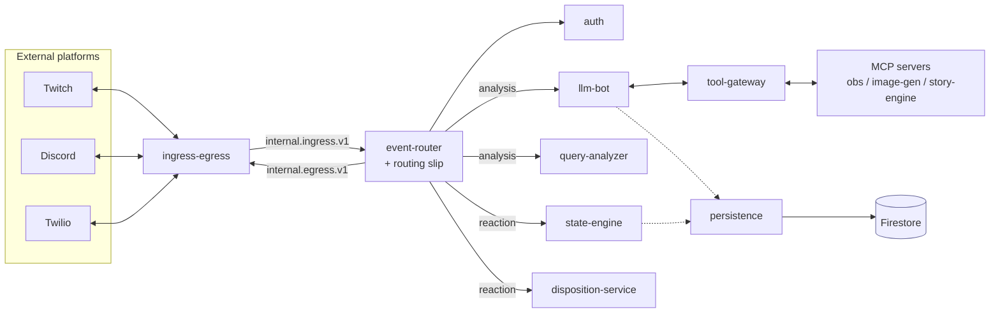

# BitBrat — Architecture Overview (diagram asset)

High-level view of the BitBrat agent loop and its services. This standalone asset is referenced from
the [README](../README.md#architecture); the canonical definition lives in
[`architecture.yaml`](../architecture.yaml) and the full narrative in
[Platform Flow Overview](../documentation/concepts/platform-flow.md).

**Agent loop mapping:** perceive (`ingress-egress`) → plan (`event-router` + routing slip) →
act (`llm-bot` / `query-analyzer` + `tool-gateway`/MCP) → observe & remember
(`state-engine` / `disposition-service` / `persistence`, backed by Firestore).
