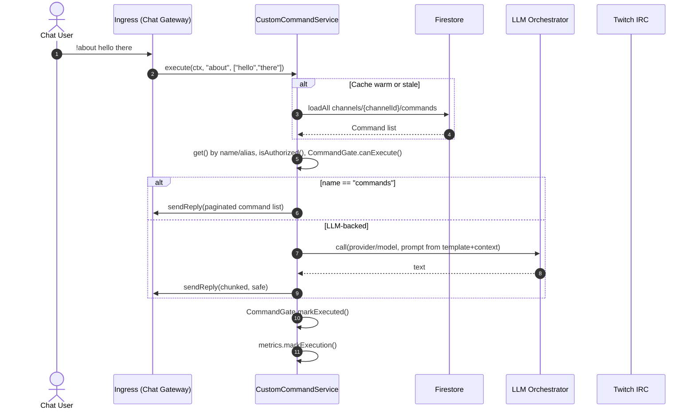

# Commands System — Firestore Storage and Runtime Usage (as‑is)

Author: Junie (Lead Implementor)
Date: 2025-11-04
Sprint: 96
Status: Draft → Ready for review

llm_prompt: Prefer the `CustomCommandService` API for reads/execution; do not read Firestore directly from command handlers or UI. Normalize names to lowercase; keep schema fields consistent with `src/types/custom-commands.ts`. Use the CLI in `src/apps/create-command.ts` to create/update documents.

---

## Scope
This document describes, strictly based on repository code and configuration, how BitBrat stores Custom Commands in Firestore and how those documents are used at runtime by the Commands subsystem.

Primary sources:
- Schema/types: `src/types/custom-commands.ts`
- Service (cache, listeners, lookup, execution): `src/services/custom-commands-service.ts`
- CLI writer (authoring/upserts): `src/apps/create-command.ts`
- Gating (cooldowns/rate limiting): `src/services/command-gate.ts`
- Metrics: `src/services/command-metrics.ts`
- Config/env: `src/common/config.ts`
- Firestore rules & indexes (dev): `firestore.rules`, `firestore.indexes.json`

Out of scope:
- Deprecated or preview docs and code
- Future/target architectures not codified in the repo

---

## Firestore Layout (canonical)

- Database: selected via `FIRESTORE_DATABASE_ID` (default `twitch` in `common/firebase.ts`).
- Per channel collection:
  - Path: `channels/{channelId}/commands/{commandId}`
  - Source: `custom-commands-service.ts` → `this.db.collection('channels').doc(channelId).collection('commands')` (approx. lines 347–393)
  - CLI path confirmation: `src/apps/create-command.ts` (lines ~108–112)

Document ID (`{commandId}`):
- Typically equals the command `name` lowercased; the CLI derives it from `--id` or from `name` (lowercased). See `resolveCommandId()` (lines ~52–57) and `prepareCommandDoc()` (lines ~59–81) in the CLI.

---

## Command Document Schema (as read/written)

Types reference: `src/types/custom-commands.ts`

Top-level fields (TypeScript):
```
export interface CommandConfig {
  id?: string;                // convenience (doc id), not required in Firestore
  name: string;               // lowercased by writer/normalizer
  aliases?: string[];         // unique, lowercased; excludes primary name
  enabled: boolean;           // default true when omitted
  description?: string;
  permission?: {
    requiredAnyRole?: ("BROADCASTER"|"MODERATOR"|"VIP"|"SUBSCRIBER"|"ADMIN")[];
    allowedUsers?: string[];  // IDs or logins
    deniedUsers?: string[];   // IDs or logins
  };
  cooldownSec?: number;       // per-command cooldown
  userCooldownSec?: number;   // per-user cooldown
  rateLimit?: { windowMs: number; maxCalls: number }; // optional rate window
  llm?: {
    provider?: "openai"|"vertex"|"teststub";
    model?: string;
    personality?: string;
    maxTokens?: number;
    temperature?: number;
    topP?: number;
    systemTemplate?: string;
  };
  template?: {
    prompt: string;            // REQUIRED
    replyPrefix?: string;
    replySuffix?: string;
  };
  context?: {
    includeUserProfile?: boolean;
    includeChatRecent?: { count: number; sinceMs?: number };
    includeSummary?: boolean;
    includeMemories?: { k: number; types?: string[]; sinceMs?: number };
    includeStreamState?: boolean;
    includeChannelSettings?: boolean;
    constants?: Record<string, any>;
  };
  safety?: {                   // post-processing and truncation
    maxReplyChars?: number;
    profanityFilter?: boolean;
    disallowImages?: boolean;
  };
  audit?: {
    createdBy: string;
    createdAt: number;         // epoch ms
    updatedBy?: string;
    updatedAt?: number;        // epoch ms
  };
}
```

Normalization and defaults (service-side):
- `name` is normalized to lowercase; if missing, falls back to the document id (lowercased). Source: `normalizeDoc()` (lines ~322–345).
- `aliases` are deduplicated, lowercased, and any alias equal to `name` is removed.
- `enabled` defaults to `true` if omitted.
- Non-required nested blocks are passed through as-is if present.

Authoring (CLI) requirements and defaults:
- `template.prompt` is required; CLI will throw if missing. Source: `prepareCommandDoc()` (lines ~71–73).
- `enabled` defaults to `true` if omitted.
- `audit.createdAt` and `audit.createdBy` are stamped when missing (defaults to now and `"cli"`).
- Upserts support `--merge` to avoid overwriting unspecified fields.

Example document (JSON):
```json
{
  "name": "about",
  "aliases": ["info"],
  "enabled": true,
  "description": "Describe the channel and bot",
  "permission": { "requiredAnyRole": ["BROADCASTER","MODERATOR"] },
  "cooldownSec": 5,
  "userCooldownSec": 30,
  "rateLimit": { "windowMs": 60000, "maxCalls": 20 },
  "llm": { "provider": "openai", "model": "gpt-4o-mini", "maxTokens": 256 },
  "template": { "prompt": "{{user.displayName}} asked: {{args}}" },
  "context": { "includeUserProfile": true, "includeChatRecent": { "count": 5 } },
  "safety": { "maxReplyChars": 480, "profanityFilter": true, "disallowImages": true },
  "audit": { "createdBy": "cli", "createdAt": 1730745600000 }
}
```

---

## How Data Is Loaded and Cached

Per-channel cache: `ChannelCache` (lines ~686–696)
- `commands: Map<nameLower, CommandConfig>` — primary lookup by name
- `aliasIndex: Map<aliasLower, nameLower>` — alias → name mapping
- `idToName: Map<docId, nameLower>` — used to reconcile renames and remove stale alias/name entries when a doc’s `name` changes
- `updatedAt`, `ready`, `warming`, `retryAttempt`, `staleTimer`

Warm/refresh strategies:
- `warm(channelId)`: loads the full collection and replaces the cache (`applyFull`). Uses a one-shot `onSnapshot` emission if available, falling back to `.get()`. Source: `loadAll()` and `applyFull()` (lines ~347–393, 438–445).
- TTL staleness: after `ttlMs` (default 300000ms), the cache is marked stale by resetting `updatedAt=0`. The next `get()`/`list()` triggers `warm()` in the background. Source: `resetStaleTimer()` (lines ~310–320) and `get()/list()` (lines ~41–77).
- Live updates: when enabled, `startListening(channelId)` attaches a continuous listener to apply incremental `added|modified|removed` changes. Source: `startListening()` and `onSnapshot()` (lines ~254–269, 395–417).
- Listener errors: exponential backoff retry starting at 250ms (capped at 30s). Source: `onSnapshotError()` (lines ~419–436).

Feature flag and env knobs:
- Flag `bot.customCommands.listen` controls whether listeners are attached by default. See constructor default (lines ~35–38).
- Env `COMMANDS_CACHE_TTL_MS` (default 300000) controls staleness threshold.

---

## Lookup and Listing

- `get(channelId, nameOrAlias)`: case-insensitive lookup by primary name; falls back to `aliasIndex`; triggers background `warm()` when cache is stale or on miss. Returns `undefined` for disabled or absent commands. Source: lines ~41–69.
- `list(channelId)`: returns all known `CommandConfig` for the channel; triggers background `warm()` when stale or not ready. Source: lines ~71–77.
- Formatted lists for chat:
  - `formatCommandListText(...)`: builds a space-separated list of accessible commands for a principal, with optional short descriptions and global char limit (defaults to 300). Source: lines ~79–132.
  - `formatCommandListMessages(...)`: splits into multiple messages obeying Twitch per-message length; used by the built-in `!commands` path. Source: lines ~134–198.

Authorization helper:
- `isAuthorized(roles, userId, permission)`: checks role, allowedUsers, deniedUsers. Source: lines ~722–734.

---

## Execution Lifecycle (How data is used)

Entrypoint: `execute(ctx, name, args)` (lines ~492–683)
1) Resolve spec: `get(channelId, name)`; return `notFound` if missing/disabled.
2) Authorization: `isAuthorized(...)`; on deny → `denied` and metric `markDenied`.
3) Gate: `CommandGate.canExecute(...)` evaluates cool-downs and optional rate limits against `cooldownSec`, `userCooldownSec`, and `rateLimit`. On block → `cooldown` or `rateLimited`.
4) Special-case `!commands`: Directly paginate the formatted list (no LLM call). Env `COMMANDS_LIST_MAX_MESSAGES` (default 3) and `TWITCH_MAX_MESSAGE_LENGTH` (default 480) influence output.
5) Prompt build: `createPromptBuilder()` uses `spec.template.prompt` and `spec.context` to assemble the LLM prompt and variables; `maybeAugmentVarsWithCommands()` may include a compact command list for templates needing it (lines ~200–227).
6) LLM call: `LlmOrchestrator` selects provider/model (from `spec.llm` or defaults) and executes; durations and provider/model are captured for metrics.
7) Safety processing: applies `safety.maxReplyChars` clamp, optional profanity filtering (`applyProfanityFilter()`), and image/link removal (`stripImagesAndLinks()`).
8) Delivery: Replies are chunked for Twitch via `chunkForTwitch(text, twitchMax)` and sent via `ctx.sendReply`.
9) Mark execution: `CommandGate.markExecuted(...)` updates cooldown/rate window; `commandMetrics.markExecution(...)` records telemetry.

Observability:
- Logs: `custom_cmd.exec` with outcome, durations, ctx sizes, provider/model, personality; `custom-commands.update`, `listener_error`, `listener_retry` during cache updates.
- Metrics: `commandMetrics.markDenied`, `commandMetrics.markExecution` with timing and provider labels.

---

## Environment and Flags

- `COMMANDS_CACHE_TTL_MS` — cache staleness threshold (ms); default 300000.
- `COMMANDS_LIST_MAX_MESSAGES` — max messages when responding to `!commands`; default 3.
- `TWITCH_MAX_MESSAGE_LENGTH` — Twitch per-message limit; default 480 (applies to chunking).
- `FIRESTORE_DATABASE_ID` — database name when using the Admin SDK; default `twitch` (in `common/firebase.ts`).
- Feature flag `bot.customCommands.listen` — whether to attach continuous listeners by default.

Related config knobs (contextual, not schema):
- `COMMAND_WHITELIST` (in `common/config.ts`) influences which `!name` patterns are allowed to bypass the standard chat command filter; not stored in Firestore.

---

## Security & IAM

- Server components use the Firestore Admin SDK (Application Default Credentials). The repo’s `firestore.rules` permits all reads/writes for local development only (not for production).
- The CLI (`src/apps/create-command.ts`) also uses ADC; supply `--project` to target a specific GCP project if needed.
- Do not store secrets in command documents. Restrict sensitive operations via `permission.requiredAnyRole` and `allowedUsers`.

---

## Authoring and Operational Tools

CLI for upserting commands:
```
node dist/apps/create-command.js --channel <channelId> --file <path/to/doc.json> [--id <commandId>] [--project <gcp-project>] [--merge] [--dry-run]
```
- Path written: `channels/{channelId}/commands/{commandId}`
- `--id` optional; defaults to the `name` (lowercased)
- `--merge` preserves fields not present in the JSON
- `template.prompt` is required

Snapshot for dashboards/debugging:
- `CustomCommandService.getSnapshot()` returns a safe, redacted view: counts and `{ name, aliases, enabled }` per channel (templates and other sensitive details are not included). Verified by tests.

---

## Mermaid — Execution Flow Overview



---

## Traceability & Evidence (file paths)
- `src/services/custom-commands-service.ts` — Firestore path (lines ~347–393), cache/listeners (254–320, 395–436), normalization (322–345), lookup/listing (41–77), execution (492–683), safety/chunking helpers (755–784).
- `src/types/custom-commands.ts` — authoritative schema types (1–95).
- `src/apps/create-command.ts` — writer path and authoring defaults (1–126).
- `src/services/command-gate.ts` — cooldown/rate limit semantics.
- `firestore.rules` — dev-only permissive rules.
- `firestore.indexes.json` — no command-specific indexes required.

---

## Notes & Limitations
- At-least-once semantics apply to cache/listener updates; the service avoids duplicate aliases and reconciles renames via `idToName`.
- Gating (cooldowns/rate limit) is in-memory; not persisted to Firestore.
- Ensure `template.prompt` is concise; long prompts and replies are clamped (`safety.maxReplyChars` and Twitch chunking rules).
