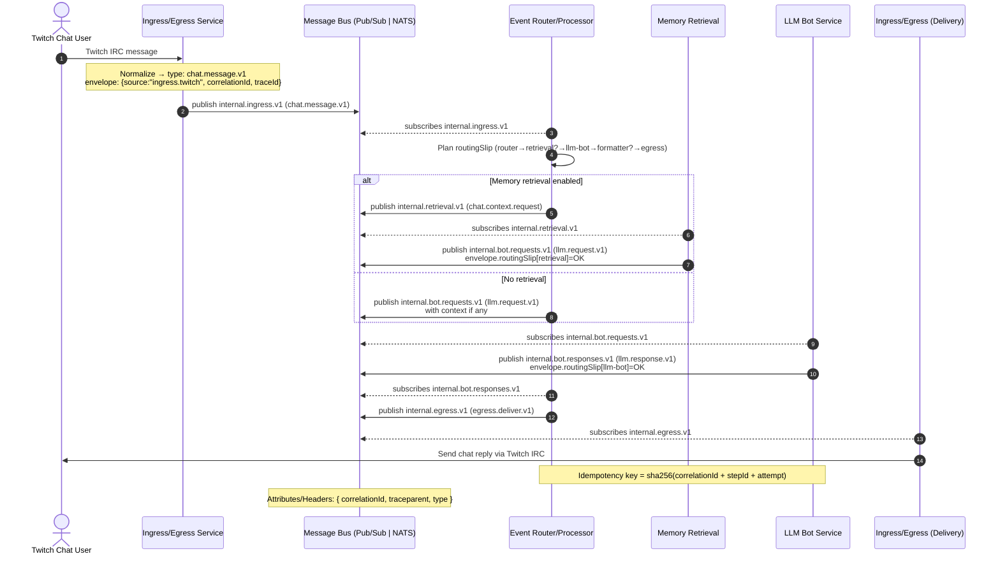

# BitBrat Messaging — Message Flow Diagram (Sprint 76)

Author: Junie (Lead Architect)
Date: 2025-10-21
Status: Draft v1

This diagram illustrates the end-to-end message flows across the swappable Message Bus (GCP Pub/Sub in Cloud mode, NATS JetStream in local mode). It follows the envelope + routing slip pattern described in the Sprint 76 Architecture Overview.

Notes
- At-least-once delivery: all consumers must be idempotent.
- Attributes: correlationId and traceparent are propagated via bus attributes/headers.
- Routing slip: steps are planned by the Router and updated by each worker.



Legend
- internal.ingress.v1: Ingress publishes normalized inbound events
- internal.retrieval.v1: Optional retrieval/enrichment requests
- internal.bot.requests.v1: Router → LLM Bot request channel
- internal.bot.responses.v1: LLM Bot → Router responses
- internal.egress.v1: Final messages for delivery (Ingress consumes)

Routing Slip Example (abridged)
```json
{
  "routingSlip": [
    { "id": "router", "status": "OK" },
    { "id": "retrieval", "status": "PENDING", "nextTopic": "internal.retrieval.v1" },
    { "id": "llm-bot", "status": "PENDING", "nextTopic": "internal.bot.requests.v1" },
    { "id": "egress", "status": "PENDING", "nextTopic": "internal.egress.v1" }
  ]
}
```

Implementation Hints
- Local: MESSAGE_BUS=nats with JetStream; subjects map 1:1 to topic names.
- Cloud: MESSAGE_BUS=pubsub; topics created via IaC and bound by service account IAM.
- Every consumer updates its step in the slip and republishes for continuation.
