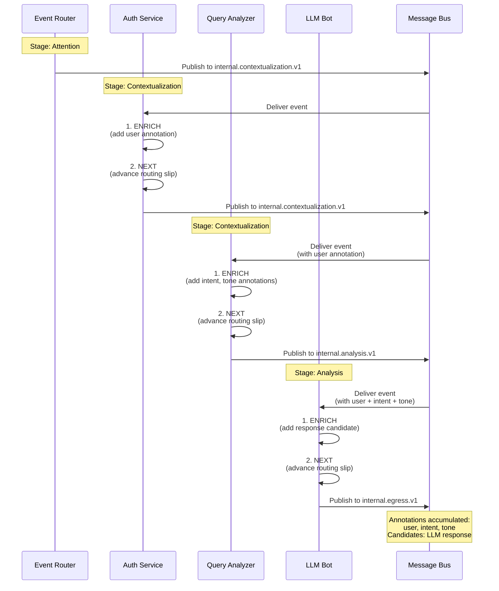
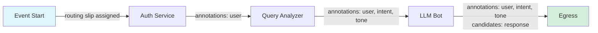
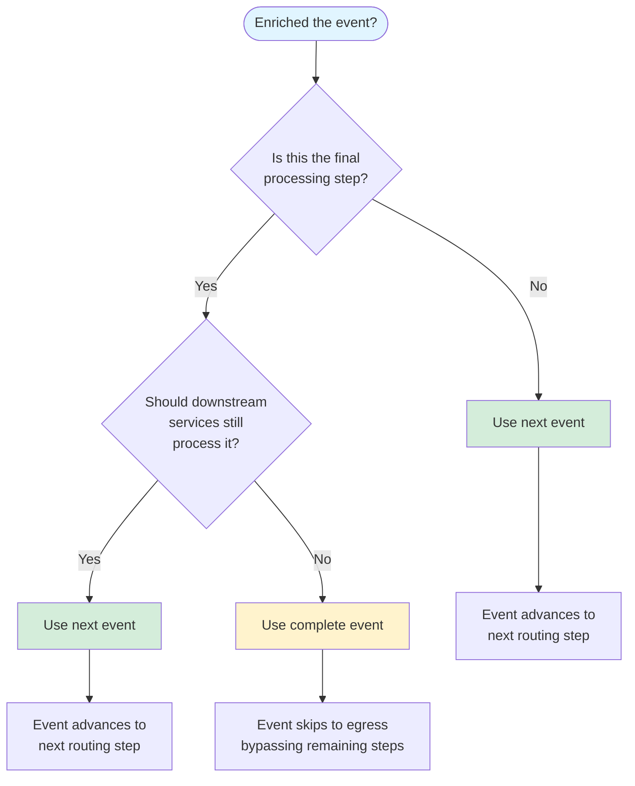

# Agent Flow Patterns: The Enrich-and-Next Pattern

**The canonical pattern for bits participating in agent orchestration**

**Pattern:** ENRICH → NEXT

**Stages:** Primarily Contextualization and Analysis

---

## Quick Example

```typescript
// File: src/apps/sentiment-analyzer.ts
import { Bit } from '../common/base-server';
import { InternalEventV2 } from '../types/events';
import { randomUUID } from 'crypto';

export class SentimentAnalyzer extends Bit {
  async setup(): Promise<void> {
    // Subscribe to events during contextualization stage
    await this.onMessage<InternalEventV2>(
      'internal.contextualization.v1',
      async (event, attrs, ctx) => {

        // 1. ENRICH: Add your contribution to the event
        event.annotations.push({
          kind: 'sentiment',
          value: this.analyzeSentiment(event.message?.text || ''),
          source: this.name,  // REQUIRED: provenance tracking
          id: randomUUID(),   // REQUIRED: unique ID
          createdAt: new Date().toISOString()  // REQUIRED: timestamp
        });

        // 2. NEXT: Advance the routing slip
        await this.next(event);

        // 3. ACKNOWLEDGE: Required (event will stall without this)
        await ctx.ack();
      }
    );
  }

  private analyzeSentiment(text: string): 'positive' | 'negative' | 'neutral' {
    if (/love|great|awesome|excellent/i.test(text)) return 'positive';
    if (/hate|terrible|awful|bad/i.test(text)) return 'negative';
    return 'neutral';
  }
}
```

**RULE: This is THE canonical pattern. Use this for any bit that enriches events and participates in the agent loop.**

---

## 1. Pattern Overview

### 1.1. What is the Enrich-and-Next Pattern?

**Definition:** Bits participate in agent orchestration by **enriching events with annotations or candidates** and **advancing them through the routing slip** by calling `next()`.

**The Two-Step Pattern:**
1. **ENRICH:** Add your bit's contribution to the event (annotations, candidates, context)
2. **NEXT:** Advance the routing slip so downstream services can continue processing

**Why This Pattern Exists:**

```
Problem: How do multiple services collaborate without tight coupling?

Solution: Event enrichment + routing slips
├─ Each service adds its contribution to the event (enrichment)
├─ The routing slip defines the processing order (orchestration)
└─ Services call next() to advance the slip (decoupled progression)
```

**Benefits:**
- **Decoupling:** Services don't know about each other
- **Composability:** Add/remove services via routing slip configuration
- **Provenance:** Every enrichment tracks its source
- **Testability:** Each service's contribution is isolated

---

### 1.2. When to Use This Pattern

**RULE: Use the enrich-and-next pattern when your bit needs to contribute to the agent's understanding or capabilities.**

**Use Cases:**

| Bit Type | Enrichment | Stage | Example |
|----------|------------|-------|---------|
| **Auth** | User identity, permissions | Contextualization | `auth` service (`src/apps/auth-service.ts:67`) |
| **Context Provider** | Environmental context, history | Contextualization | `query-analyzer` (`src/apps/query-analyzer-service.ts:45`) |
| **Analyzer** | Analysis hints, routing suggestions | Contextualization/Analysis | `query-analyzer` (`src/apps/query-analyzer-service.ts:89`) |
| **LLM Bot** | Response candidates, tool calls | Analysis | `llm-bot` (`src/apps/llm-bot-service.ts:123`) |
| **Reflex** | Pattern-matched actions | Analysis | `reflex` (`src/apps/reflex-service.ts:78`) |

**When NOT to Use:**
- **Event Router:** Assigns routing slips, doesn't enrich (Attention stage)
- **Egress:** Delivers responses, doesn't enrich (terminal)
- **Reaction Services:** Execute actions, may use `complete()` instead of `next()`

---

### 1.3. Visual Overview

#### Enrich-and-Next Sequence



**Key Points:**
- Each service adds its contribution **(ENRICH)**
- Each service calls `next()` to advance the routing slip **(NEXT)**
- Annotations **accumulate** as the event progresses
- Downstream services see **all prior enrichments**

#### Annotation Accumulation



**RULE: Services add annotations, never modify existing ones. Annotations are immutable after creation.**

---

## 2. The Pattern in Detail

### 2.1. Step 1: Subscribe to Events

**RULE: Subscribe to the topic corresponding to the stage where your bit runs.**

**Stage-to-Topic Mapping:**

| Stage | Topic | When to Subscribe |
|-------|-------|-------------------|
| Contextualization | `internal.contextualization.v1` | Your bit adds auth, env context |
| Analysis | `internal.analysis.v1` | Your bit performs reasoning, analysis |
| Reaction | `internal.reaction.v1` | Your bit executes actions, mutates state |

**Example:**

```typescript
// File: src/apps/example-service.ts
import { Bit } from '../common/base-server';
import { InternalEventV2 } from '../types/events';

export class ExampleService extends Bit {
  async setup(): Promise<void> {
    // Subscribe to contextualization stage
    await this.onMessage<InternalEventV2>(
      'internal.contextualization.v1',  // Topic for stage 2
      this.handleEvent.bind(this)
    );
  }

  private async handleEvent(
    event: InternalEventV2,
    attrs: Record<string, string>,
    ctx: MessageContext
  ): Promise<void> {
    // Handle event (next step)
  }
}
```

**RULE: Use the `InternalEventV2` type for all event handlers.**

---

### 2.2. Step 2: ENRICH the Event

**RULE: Add your bit's contribution to the event via annotations or candidates.**

**Enrichment Options:**

#### Option A: Add Annotations (Most Common)

**When:** Your bit adds **metadata, context, or analysis** to the event.

**Structure:** `AnnotationV1` (`src/types/events.ts:89`)

```typescript
event.annotations.push({
  kind: 'your-annotation-kind',  // Descriptive kind (e.g., 'sentiment', 'user', 'intent')
  value: yourData,               // Any JSON-serializable value
  source: this.name,             // REQUIRED: provenance (this.name is Bit's name)
  id: randomUUID(),              // REQUIRED: unique ID
  createdAt: new Date().toISOString()  // REQUIRED: ISO timestamp
});
```

**Example (User Identity):**

```typescript
// File: src/apps/auth-service.ts (simplified)
import { randomUUID } from 'crypto';

event.annotations.push({
  kind: 'user',
  value: {
    id: 'user-123',
    displayName: 'StreamerName',
    role: 'subscriber',
    permissions: ['chat', 'command']
  },
  source: 'auth',  // this.name
  id: randomUUID(),
  createdAt: new Date().toISOString()
});
```

#### Option B: Add Response Candidates

**When:** Your bit generates **potential responses** (e.g., LLM bot, reflex).

**Structure:** `ResponseCandidate` (`src/types/events.ts:67`)

```typescript
event.candidates.push({
  kind: 'text',                // or 'tool-call', 'action'
  text: 'Your response text',  // If kind === 'text'
  source: this.name,           // REQUIRED: provenance
  id: randomUUID(),            // REQUIRED: unique ID
  score?: 0.95                 // Optional: confidence score
});
```

**Example (LLM Response):**

```typescript
// File: src/apps/llm-bot-service.ts (simplified)
const llmResponse = await this.callLLM(event);

event.candidates.push({
  kind: 'text',
  text: llmResponse,
  source: 'llm-bot',  // this.name
  id: randomUUID(),
  score: 0.95
});
```

#### Option C: Modify Payload (Rare)

**When:** Your bit **owns** the event type and needs to modify core fields.

**RULE: NEVER modify payload unless you own the event type. Use annotations instead.**

```typescript
// ❌ DON'T (unless you own this event type):
event.payload.customField = 'value';

// ✅ DO (use annotations):
event.annotations.push({
  kind: 'custom-data',
  value: { customField: 'value' },
  source: this.name,
  id: randomUUID(),
  createdAt: new Date().toISOString()
});
```

---

### 2.3. Step 3: NEXT - Advance the Routing Slip

**RULE: Call `next(event)` to advance the routing slip after enriching.**

**Method:** `Bit.next(event)` (`src/common/base-server.ts:845`)

```typescript
await this.next(event);
```

**What `next()` Does:**

1. Increments `event.routing.slip.currentIndex`
2. Publishes event to `nextStep.nextTopic`
3. If no more steps in routing slip, routes to egress (`internal.egress.v1`)

**Example:**

```typescript
// Before next():
event.routing.slip = {
  steps: [
    { id: 'contextualization', nextTopic: 'internal.contextualization.v1' },  // currentIndex = 0
    { id: 'analysis', nextTopic: 'internal.analysis.v1' },
    { id: 'egress', nextTopic: 'internal.egress.v1' }
  ],
  currentIndex: 0
};

// After next():
event.routing.slip.currentIndex = 1;  // Advanced
// Event published to 'internal.analysis.v1'
```

**RULE: `next()` handles routing logic. You don't need to publish manually.**

---

### 2.4. Step 4: ACKNOWLEDGE the Message

**RULE: ALWAYS call `ctx.ack()` after processing.**

```typescript
await ctx.ack();
```

**Why:**
- Message bus requires acknowledgment to mark message as processed
- Without `ack()`, the message will be re-delivered (duplicate processing)
- Unacknowledged messages may stall the event flow

**RULE: Acknowledge AFTER enriching and calling `next()`, but within the same handler.**

---

## 3. Rules: next() vs complete()

**RULE: Use `next()` by default. Use `complete()` ONLY when intentionally short-circuiting the routing slip.**

### 3.1. Decision Tree



**Default Rule: When in doubt, use `next()`.**

### 3.2. When to Use next()

**RULE: Use `next(event)` in these situations:**

**1. You are enriching the event for downstream services**
- Example: `auth` adds user identity → llm-bot needs it → use `next()`

**2. You are NOT the terminal service**
- Example: `query-analyzer` provides hints → llm-bot still needs to run → use `next()`

**3. You want orchestration to continue normally**
- Example: Standard enrichment bit → always use `next()`

**Code:**
```typescript
// Standard pattern
event.annotations.push(/* enrichment */);
await this.next(event);  // ✅ Advance to next routing step
await ctx.ack();
```

---

### 3.3. When to Use complete()

**RULE: Use `complete(event)` in these situations:**

**1. You have already executed the action AND response is ready**
- Example: `reflex` matched a command, called tools, response complete → use `complete()`

**2. You want to skip remaining routing steps**
- Example: Error occurred, send error response immediately → use `complete()`

**3. You are explicitly short-circuiting orchestration**
- Example: Rate limit exceeded, reject event → use `complete()`

**Method:** `Bit.complete(event)` (`src/common/base-server.ts:867`)

```typescript
// Skip routing slip, go directly to egress
await this.complete(event);  // Routes to internal.egress.v1
await ctx.ack();
```

**Example (Reflex - Action Already Executed):**

```typescript
// File: src/apps/reflex-service.ts (simplified)
async handleReflexMatch(event: InternalEventV2, attrs, ctx) {
  // 1. Match stored definition
  const definition = await this.findDefinition(event);

  // 2. Execute tools immediately
  await this.executeBound Tools(definition);

  // 3. Add response candidate
  event.candidates.push({
    kind: 'text',
    text: definition.response,
    source: this.name,
    id: randomUUID()
  });

  // 4. COMPLETE: Action done, skip to egress
  await this.complete(event);  // ✅ Skip analysis, go to egress
  await ctx.ack();
}
```

**RULE: If you're unsure whether to use `next()` or `complete()`, use `next()`.**

---

### 3.4. Comparison Table

| Criteria | next() | complete() |
|----------|--------|------------|
| **Advances routing slip** | Yes (to next step) | No (skips to egress) |
| **Downstream services run** | Yes | No |
| **Use for enrichment** | ✅ Always | ❌ Never |
| **Use when action done** | Sometimes | ✅ Always |
| **Default choice** | ✅ Yes | ❌ No |

---

## 4. Annotation Flow

### 4.1. How Annotations Accumulate

**Concept:** As an event flows through the routing slip, each service **adds** to `event.annotations[]`. Annotations accumulate.

**Example Event Lifecycle:**

```typescript
// 1. Event created (ingress)
event.annotations = [];

// 2. Auth service (contextualization)
event.annotations = [
  { kind: 'user', value: { id: 'user-123', ... }, source: 'auth', ... }
];

// 3. Query analyzer (contextualization)
event.annotations = [
  { kind: 'user', value: { ... }, source: 'auth', ... },
  { kind: 'intent', value: 'greeting', source: 'query-analyzer', ... }
];

// 4. LLM bot (analysis)
event.annotations = [
  { kind: 'user', value: { ... }, source: 'auth', ... },
  { kind: 'intent', value: 'greeting', source: 'query-analyzer', ... },
  { kind: 'llm-reasoning', value: { ... }, source: 'llm-bot', ... }
];
```

**RULE: Annotations are ADDITIVE. Never remove or modify existing annotations.**

---

### 4.2. Reading Annotations from Earlier Services

**Pattern:** Later services can read annotations added by earlier services.

**Example (LLM Bot Reading User Identity):**

```typescript
// File: src/apps/llm-bot-service.ts (simplified)
async handleEvent(event: InternalEventV2, attrs, ctx) {
  // Read user annotation added by auth service
  const userAnnotation = event.annotations.find(a => a.kind === 'user');
  const userId = userAnnotation?.value?.id;

  // Use it in LLM prompt
  const prompt = `User ${userId} asks: ${event.message?.text}`;
  const response = await this.callLLM(prompt);

  // Add response candidate
  event.candidates.push({ kind: 'text', text: response, source: this.name, id: randomUUID() });

  await this.next(event);
  await ctx.ack();
}
```

**RULE: Services can READ all annotations but should only ADD new ones, never modify existing.**

---

### 4.3. Provenance Tracking

**RULE: ALWAYS set `source: this.name` on annotations.**

**Why:**
- **Debugging:** Know which service added which annotation
- **Auditing:** Trace data lineage
- **Trust:** Verify source of sensitive data

**Example:**

```typescript
// ✅ CORRECT: Source is set to this.name
event.annotations.push({
  kind: 'sentiment',
  value: 'positive',
  source: this.name,  // e.g., 'sentiment-analyzer'
  id: randomUUID(),
  createdAt: new Date().toISOString()
});

// ❌ WRONG: Source is hardcoded or missing
event.annotations.push({
  kind: 'sentiment',
  value: 'positive',
  source: 'unknown',  // ❌ Don't hardcode
  // ... missing id, createdAt
});
```

---

## 5. Anti-Patterns

**RULE: Avoid these common mistakes.**

### 5.1. NEVER: Enrich Without Calling next()

**Problem:** Event will stall if you don't advance the routing slip.

```typescript
// ❌ WRONG: Enriches but doesn't call next()
async handleEvent(event: InternalEventV2, attrs, ctx) {
  event.annotations.push({ kind: 'data', value: 'foo', source: this.name, id: randomUUID(), createdAt: new Date().toISOString() });
  await ctx.ack();  // ❌ Event never advances!
}

// ✅ CORRECT: Enrich AND next
async handleEvent(event: InternalEventV2, attrs, ctx) {
  event.annotations.push({ kind: 'data', value: 'foo', source: this.name, id: randomUUID(), createdAt: new Date().toISOString() });
  await this.next(event);  // ✅ Advance routing slip
  await ctx.ack();
}
```

---

### 5.2. NEVER: Use complete() When next() is Appropriate

**Problem:** Skips downstream services that may need to process the event.

```typescript
// ❌ WRONG: complete() when enriching for downstream services
async handleEvent(event: InternalEventV2, attrs, ctx) {
  event.annotations.push({ kind: 'context', value: 'data', source: this.name, id: randomUUID(), createdAt: new Date().toISOString() });
  await this.complete(event);  // ❌ Skips analysis stage!
  await ctx.ack();
}

// ✅ CORRECT: next() to allow downstream processing
async handleEvent(event: InternalEventV2, attrs, ctx) {
  event.annotations.push({ kind: 'context', value: 'data', source: this.name, id: randomUUID(), createdAt: new Date().toISOString() });
  await this.next(event);  // ✅ llm-bot can still run
  await ctx.ack();
}
```

---

### 5.3. NEVER: Modify Payload Instead of Using Annotations

**Problem:** Loses provenance, breaks contract for events you don't own.

```typescript
// ❌ WRONG: Modify payload directly
async handleEvent(event: InternalEventV2, attrs, ctx) {
  event.payload = { ...event.payload, customField: 'value' };  // ❌ No provenance!
  await this.next(event);
  await ctx.ack();
}

// ✅ CORRECT: Use annotations
async handleEvent(event: InternalEventV2, attrs, ctx) {
  event.annotations.push({
    kind: 'custom-data',
    value: { customField: 'value' },
    source: this.name,
    id: randomUUID(),
    createdAt: new Date().toISOString()
  });
  await this.next(event);
  await ctx.ack();
}
```

---

### 5.4. NEVER: Forget ctx.ack()

**Problem:** Message is re-delivered, causing duplicate processing.

```typescript
// ❌ WRONG: No acknowledgment
async handleEvent(event: InternalEventV2, attrs, ctx) {
  event.annotations.push({ kind: 'data', value: 'foo', source: this.name, id: randomUUID(), createdAt: new Date().toISOString() });
  await this.next(event);
  // ❌ Missing ctx.ack()!
}

// ✅ CORRECT: Always acknowledge
async handleEvent(event: InternalEventV2, attrs, ctx) {
  event.annotations.push({ kind: 'data', value: 'foo', source: this.name, id: randomUUID(), createdAt: new Date().toISOString() });
  await this.next(event);
  await ctx.ack();  // ✅
}
```

---

### 5.5. NEVER: Manually Publish Instead of Using next()

**Problem:** Bypasses routing slip logic, loses orchestration.

```typescript
// ❌ WRONG: Manual publish
async handleEvent(event: InternalEventV2, attrs, ctx) {
  event.annotations.push({ kind: 'data', value: 'foo', source: this.name, id: randomUUID(), createdAt: new Date().toISOString() });
  await this.publish('internal.analysis.v1', event);  // ❌ Hardcoded topic!
  await ctx.ack();
}

// ✅ CORRECT: Use next()
async handleEvent(event: InternalEventV2, attrs, ctx) {
  event.annotations.push({ kind: 'data', value: 'foo', source: this.name, id: randomUUID(), createdAt: new Date().toISOString() });
  await this.next(event);  // ✅ Routing slip handles topic
  await ctx.ack();
}
```

---

## 6. Examples in the Wild

**Study these production implementations to see the pattern in action:**

### 6.1. Auth Service (Contextualization)

**File:** `src/apps/auth-service.ts:67`

**Pattern:** Enriches with user identity → calls `next()`

```typescript
// Simplified from actual code
async handleEvent(event: InternalEventV2, attrs, ctx) {
  // 1. ENRICH: Add user identity
  const user = await this.authenticateUser(event);
  event.annotations.push({
    kind: 'user',
    value: user,
    source: this.name,  // 'auth'
    id: randomUUID(),
    createdAt: new Date().toISOString()
  });

  // 2. NEXT: Advance to analysis stage
  await this.next(event);
  await ctx.ack();
}
```

**Takeaway:** **ALWAYS use `next()` in contextualization stage. Downstream services need your enrichment.**

---

### 6.2. LLM Bot (Analysis)

**File:** `src/apps/llm-bot-service.ts:123`

**Pattern:** Reads context annotations → generates response → calls `next()`

```typescript
// Simplified from actual code
async handleEvent(event: InternalEventV2, attrs, ctx) {
  // 1. Read context from earlier services
  const userAnnotation = event.annotations.find(a => a.kind === 'user');

  // 2. ENRICH: Add LLM response candidate
  const response = await this.generateResponse(event, userAnnotation);
  event.candidates.push({
    kind: 'text',
    text: response,
    source: this.name,  // 'llm-bot'
    id: randomUUID()
  });

  // 3. NEXT: Allow reaction stage to execute tools
  await this.next(event);
  await ctx.ack();
}
```

**Takeaway:** **Read annotations from earlier services. Add candidates, not direct responses. Use `next()`.**

---

### 6.3. Query Analyzer (Contextualization/Analysis)

**File:** `src/apps/query-analyzer-service.ts:45`

**Pattern:** Fast pre-analysis → adds routing hints → calls `next()`

```typescript
// Simplified from actual code
async handleEvent(event: InternalEventV2, attrs, ctx) {
  // 1. ENRICH: Add analysis hints (fast, no LLM)
  const intent = this.detectIntent(event.message?.text);
  event.annotations.push({
    kind: 'intent',
    value: intent,
    source: this.name,  // 'query-analyzer'
    id: randomUUID(),
    createdAt: new Date().toISOString()
  });

  // 2. NEXT: llm-bot can use this hint
  await this.next(event);
  await ctx.ack();
}
```

**Takeaway:** **Lightweight enrichment bits run in contextualization. Always use `next()`.**

---

### 6.4. Reflex (Analysis - Special Case)

**File:** `src/apps/reflex-service.ts:78`

**Pattern:** Matches definition → executes action → calls `complete()` (not `next()`)

```typescript
// Simplified from actual code
async handleEvent(event: InternalEventV2, attrs, ctx) {
  const definition = await this.findMatchingDefinition(event);
  if (!definition) {
    // No match, let llm-bot handle it
    await this.next(event);
    await ctx.ack();
    return;
  }

  // 1. Execute bound tools immediately
  await this.executeTools(definition.boundTools);

  // 2. ENRICH: Add response
  event.candidates.push({
    kind: 'text',
    text: definition.response,
    source: this.name,  // 'reflex'
    id: randomUUID()
  });

  // 3. COMPLETE: Action done, skip to egress
  await this.complete(event);  // ✅ Special case
  await ctx.ack();
}
```

**Takeaway:** **`complete()` is appropriate when the action is ALREADY executed and no further processing is needed.**

---

## 7. Advanced Patterns

### 7.1. Conditional Enrichment

**Pattern:** Enrich only if certain conditions are met.

```typescript
async handleEvent(event: InternalEventV2, attrs, ctx) {
  // Only enrich if message contains a question
  if (event.message?.text?.includes('?')) {
    event.annotations.push({
      kind: 'question-detected',
      value: true,
      source: this.name,
      id: randomUUID(),
      createdAt: new Date().toISOString()
    });
  }

  // Always call next(), even if no enrichment
  await this.next(event);
  await ctx.ack();
}
```

**RULE: Always call `next()`, even if you didn't enrich this specific event.**

---

### 7.2. Multi-Stage Bits

**Pattern:** Subscribe to multiple stages if your bit plays different roles.

```typescript
export class HybridService extends Bit {
  async setup(): Promise<void> {
    // Subscribe to contextualization
    await this.onMessage<InternalEventV2>(
      'internal.contextualization.v1',
      this.handleContextualization.bind(this)
    );

    // Subscribe to analysis
    await this.onMessage<InternalEventV2>(
      'internal.analysis.v1',
      this.handleAnalysis.bind(this)
    );
  }

  private async handleContextualization(event: InternalEventV2, attrs, ctx) {
    event.annotations.push({ /* context */ });
    await this.next(event);
    await ctx.ack();
  }

  private async handleAnalysis(event: InternalEventV2, attrs, ctx) {
    event.candidates.push({ /* response */ });
    await this.next(event);
    await ctx.ack();
  }
}
```

---

### 7.3. Error Handling

**Pattern:** Handle errors gracefully and decide whether to continue or abort.

```typescript
async handleEvent(event: InternalEventV2, attrs, ctx) {
  try {
    // Attempt enrichment
    const data = await this.fetchExternalData(event);
    event.annotations.push({
      kind: 'external-data',
      value: data,
      source: this.name,
      id: randomUUID(),
      createdAt: new Date().toISOString()
    });

    // Success: continue normally
    await this.next(event);
    await ctx.ack();

  } catch (error) {
    // Log error
    this.getLogger().error('enrichment_failed', { error, correlationId: event.correlationId });

    // Decision: Continue without enrichment OR abort
    // Option A: Continue (graceful degradation)
    await this.next(event);  // ✅ Let other services try
    await ctx.ack();

    // Option B: Abort (if enrichment is critical)
    // event.candidates.push({ kind: 'text', text: 'Error occurred', source: this.name, id: randomUUID() });
    // await this.complete(event);  // Skip to egress with error
    // await ctx.ack();
  }
}
```

**RULE: Decide error strategy based on whether your enrichment is critical or optional.**

---

## 8. Checklist: Am I Following the Pattern?

**Use this checklist when implementing a new enrichment bit:**

- [ ] **Subscribe:** Using `onMessage<InternalEventV2>()` for the correct stage topic
- [ ] **Enrich:** Adding annotations or candidates (not modifying payload)
- [ ] **Provenance:** All annotations have `source: this.name`, `id`, `createdAt`
- [ ] **Advance:** Calling `next(event)` or `complete(event)` (not both)
- [ ] **Acknowledge:** Calling `ctx.ack()` after processing
- [ ] **Error Handling:** Try/catch with decision on continue vs abort
- [ ] **Testing:** Unit tests verify enrichment and `next()` call
- [ ] **Decision:** Confirmed `next()` vs `complete()` choice is correct

---

## 9. Related Concepts

**Core Architecture:**
- [Agent Flow Stages](./agent-flow-stages.md) — The 5-stage model
- [Platform Flow Overview](./platform-flow.md) — End-to-end event lifecycle
- [The Bit Model](./bit-model.md) — Base abstraction for all services

**Implementation:**
- [EventingProfile](../reference/eventing-api.md) — `onMessage()`, `next()`, `complete()` API
- [Building an Enrichment Bit](../tutorials/building-an-enrichment-bit.md) — Step-by-step tutorial

**Patterns:**
- [Event Router Rules](./event-router-rules.md) — How routing slips are assigned

---

## 10. FAQ

**Q: Can I enrich AND call complete()?**
A: Yes. `complete()` skips the routing slip but still allows enrichment.

**Q: What if I don't have anything to enrich for this event?**
A: Still call `next()`. Don't block the event flow.

**Q: Can I call next() multiple times?**
A: No. Call `next()` once per event. Multiple calls cause duplicate routing.

**Q: What if the routing slip is empty?**
A: `next()` automatically routes to egress. No special handling needed.

**Q: Can I modify annotations added by other services?**
A: No. Annotations are immutable once added. Add a new annotation instead.

**Q: How do I know if my bit should use next() or complete()?**
A: If you're enriching for downstream services → `next()`. If action is done → `complete()`.

---

**Document Status:** Active — This is THE canonical pattern for agent-flow bits

**Next Steps:**
- [Building an Enrichment Bit](../tutorials/building-an-enrichment-bit.md) — Hands-on tutorial
- [Agent Flow Stages](./agent-flow-stages.md) — Understand the 5 stages
- See live examples: `src/apps/auth-service.ts`, `src/apps/llm-bot-service.ts`
