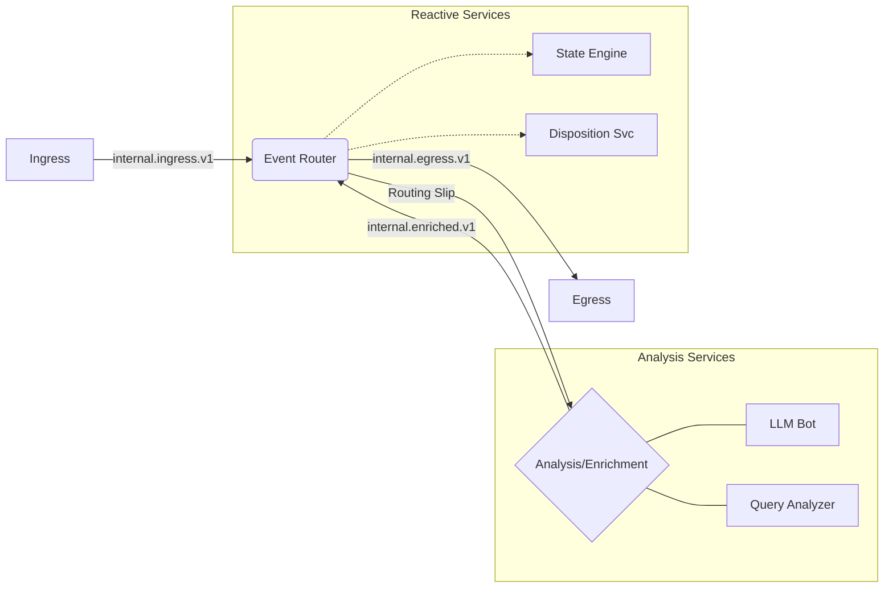

# Concepts: Platform Flow Overview

The BitBrat Platform operates as a series of decoupled microservices communicating via a message bus (Pub/Sub in Google Cloud, or NATS locally). Understanding how an event flows through the system is key to extending its capabilities.

## 1. High-Level Flow

The general lifecycle of an event follows this pattern:

## 2. Stage-by-Stage Breakdown

### Stage 1: Ingest
External events from platforms like Twitch, Discord, or Twilio are captured by the `ingress-egress` service. They are normalized into a standard internal event format and published to the `internal.ingress.v1` topic.

### Stage 2: Routing & Matching
The **Event Router** consumes the ingress event. It evaluates the event against all active rules (see [Event Router & Rules](./event-router-rules.md)). 
- If no rules match, the event may be ignored or just persisted for logs.
- If a rule matches, a **Routing Slip** is attached to the event.

### Stage 3: Analysis & Enrichment (Optional)
If the routing slip includes an analysis step (e.g., sending the event to the **LLM Bot**), the Event Router publishes the event to the specified topic (e.g., `internal.llmbot.v1`).
- The analysis service processes the event (e.g., generates a response using AI).
- The result is published back to `internal.enriched.v1`.
- The Event Router picks it up again to determine the next step in the routing slip.

### Stage 4: Reaction
Once enrichment is complete, the Event Router continues the routing slip. This often involves notifying reactive services:
- **State Engine**: Updates global or user-specific state based on the event.
- **Disposition Service**: Analyzes user behavior patterns over time.

### Stage 5: Egress
The final step in many routing slips is publishing to `internal.egress.v1`.
- The `ingress-egress` service consumes this message.
- It translates the internal response back into the platform-specific format (e.g., a Twitch chat message) and sends it out.

## 3. The Message Bus
All communication between these stages is asynchronous. This allows the platform to be highly resilient:
- If the LLM Bot is slow, it doesn't block the Ingress service.
- If a service is down, messages stay in the queue until the service recovers.
- Services can be scaled independently based on the volume of events they handle.

For more information on the specific technologies used, refer to the [Technical Architecture](../architecture.yaml).
