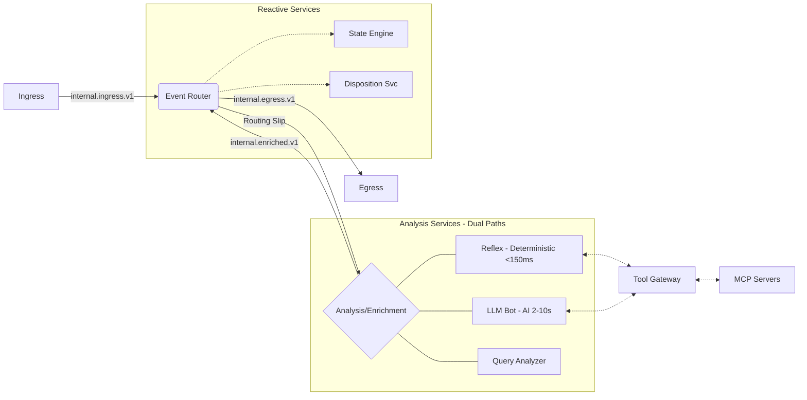

# Concepts: Platform Flow Overview

The BitBrat Platform operates as a series of decoupled microservices communicating via a message bus (Pub/Sub in Google Cloud, or NATS locally). Understanding how an event flows through the system is key to extending its capabilities.

## 1. High-Level Flow

The general lifecycle of an event follows this pattern:

**Key Insight:** BitBrat offers **two execution paths** in the Act stage:
- **Deterministic Path** (Reflex): Pattern-match and execute MCP tools in <150ms, no LLM overhead
- **LLM-Based Path**: Full AI reasoning with tool selection, 2-10 seconds, higher capability and cost

## 2. Stage-by-Stage Breakdown

### Stage 1: Ingest
External events from platforms like Twitch, Discord, or Twilio are captured by the `ingress-egress` service. They are normalized into a standard internal event format and published to the `internal.ingress.v1` topic.

### Stage 2: Routing & Matching
The **Event Router** consumes the ingress event. It evaluates the event against all active rules (see [Event Router & Rules](./event-router-rules.md)). 
- If no rules match, the event may be ignored or just persisted for logs.
- If a rule matches, a **Routing Slip** is attached to the event.

### Stage 3: Analysis & Enrichment (Optional) — Dual Execution Paths

BitBrat offers **two paths** for the Act stage, chosen based on routing rules:

#### Path A: Deterministic (Reflex)
If the routing slip includes a reflex step, the Event Router publishes to `internal.reflex.v1`:
- **Reflex service** pattern-matches the event against stored reflex definitions
- On match, directly executes MCP tools via `tool-gateway` (no LLM inference)
- **Performance**: <150ms end-to-end, low cost
- **Use case**: Repeated, predictable behaviors (chat commands, simple automations)
- Publishes results to `internal.reflex.executed.v1` (success) or `internal.reflex.failed.v1` (errors)

#### Path B: LLM-Based (Traditional)
If the routing slip includes an LLM analysis step, the Event Router publishes to `internal.llmbot.v1` or `internal.query.analysis.v1`:
- **LLM Bot** or **Query Analyzer** processes the event using AI reasoning
- The LLM selects and calls tools via `tool-gateway`
- **Performance**: 2-10 seconds, higher cost
- **Use case**: Novel situations, complex reasoning, creative responses
- Publishes results back to `internal.enriched.v1`

Both paths share the same infrastructure (ingress, router, tool-gateway, persistence) but differ in the analysis mechanism. The Event Router picks up the results and advances the routing slip.

### Stage 4: Reaction
Once enrichment is complete, the Event Router continues the routing slip. This often involves notifying reactive services:
- **State Engine**: Updates global or user-specific state based on the event.
- **Disposition Service**: Analyzes user behavior patterns over time.

### Stage 5: Egress
The final step in many routing slips is publishing to `internal.egress.v1`.
- The `ingress-egress` service consumes this message.
- It translates the internal response back into the platform-specific format (e.g., a Twitch chat message) and sends it out.

## 3. The Message Bus
All communication between these stages is asynchronous. This allows the platform to be highly resilient:
- If the LLM Bot is slow, it doesn't block the Ingress service.
- If a service is down, messages stay in the queue until the service recovers.
- Services can be scaled independently based on the volume of events they handle.

For more information on the specific technologies used, refer to the canonical [architecture.yaml](../../architecture.yaml) (see its `messaging:` and `dataflow:` blocks).
