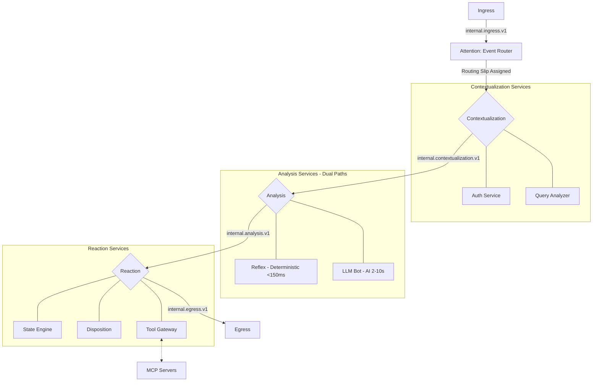

# Concepts: Platform Flow Overview

The BitBrat Platform operates as a series of decoupled microservices communicating via a message bus (Pub/Sub in Google Cloud, or NATS locally). Understanding how an event flows through the system is key to extending its capabilities.

## 1. High-Level Flow

BitBrat implements a **5-stage agent flow model** (see [Agent Flow Stages](./agent-flow-stages.md)):

**Attention** → **Contextualization** → **Analysis** → **Reaction** → **Introspection**

The general lifecycle of an event follows this pattern:



**Key Insight:** BitBrat offers **two execution paths** in the Analysis stage:
- **Deterministic Path** (Reflex): Pattern-match and execute MCP tools in <150ms, no LLM overhead
- **LLM-Based Path**: Full AI reasoning with tool selection, 2-10 seconds, higher capability and cost

**The Enrich-and-Next Pattern:** Services in Contextualization and Analysis stages follow the [enrich-and-next pattern](./agent-flow-patterns.md): they enrich events with annotations and call `next()` to advance the routing slip.

## 2. Stage-by-Stage Breakdown

### Stage 1: Attention — What Events Matter?

**Purpose:** Filter and prioritize incoming events. Determine which events deserve processing and assign routing slips.

**Services:**
- `ingress-egress` (src/apps/ingress-egress-service.ts) — Normalizes external platform events
- `event-router` (src/apps/event-router-service.ts) — Matches events against rules, assigns routing slips

**Flow:**
1. External events from Twitch, Discord, or Twilio arrive at `ingress-egress`
2. Events are normalized into `InternalEventV2` format and published to `internal.ingress.v1`
3. `event-router` consumes the event and evaluates it against active rules (see [Event Router Rules](./event-router-rules.md))
4. If a rule matches, a **routing slip** is attached with the processing pipeline
5. If no rules match, the event may be persisted for logs or ignored

**Key Concept:** The routing slip defines the entire processing pipeline. Services execute steps sequentially via the **enrich-and-next pattern**.

**Typical Duration:** <50ms

---

### Stage 2: Contextualization — Reestablish Context

**Purpose:** Enrich the event with identity, permissions, and environmental context **BEFORE** analysis. Authentication always runs first.

**Services:**
- `auth` (src/apps/auth-service.ts) — Enriches user identity, permissions, role
- `query-analyzer` (src/apps/query-analyzer-service.ts) — Fast pre-analysis, routing hints

**Topics:**
- Consumes: `internal.contextualization.v1`
- Produces: `internal.analysis.v1` (via `next()`)

**Flow:**
1. Event published to `internal.contextualization.v1`
2. `auth` service adds user identity annotation
3. `query-analyzer` (optional) adds intent, tone, risk annotations
4. Each service calls `this.next(event)` to advance routing slip
5. Routing slip progresses to Analysis stage

**Example (Auth Enrichment):**
```typescript
// File: src/apps/auth-service.ts (simplified)
await this.onMessage<InternalEventV2>('internal.contextualization.v1', async (event, attrs, ctx) => {
  // 1. ENRICH: Add user identity
  event.annotations.push({
    kind: 'user',
    value: { id: 'user-123', displayName: 'User', role: 'subscriber' },
    source: this.name,
    id: randomUUID(),
    createdAt: new Date().toISOString()
  });

  // 2. NEXT: Advance routing slip
  await this.next(event);
  await ctx.ack();
});
```

**Typical Duration:** 100-300ms

**Why "Contextualization" (not "Analysis")?**
- Previous terminology conflated contextualization (auth, env) with analysis (reasoning)
- Contextualization is PRE-analysis context gathering
- See [Agent Flow Stages](./agent-flow-stages.md) for full terminology migration details

---

### Stage 3: Analysis — What Does It Mean?

**Purpose:** Determine what the contextualized event means. Select responses or actions via reasoning (LLM or deterministic).

**Services:**
- `llm-bot` (src/apps/llm-bot-service.ts) — Full LLM reasoning with tool selection
- `reflex` (src/apps/reflex-service.ts) — Fast deterministic pattern matching
- `query-analyzer` (src/apps/query-analyzer-service.ts) — Lightweight analysis

**Topics:**
- Consumes: `internal.analysis.v1`, `internal.reflex.v1`
- Produces: `internal.reaction.v1` or `internal.egress.v1` (via `next()` or `complete()`)

**BitBrat offers TWO execution paths in Analysis:**

#### Path A: Deterministic (Reflex)
If the routing slip includes a reflex step, the Event Router publishes to `internal.reflex.v1`:
- **Reflex service** pattern-matches the event against stored reflex definitions
- On match, directly executes MCP tools via `tool-gateway` (no LLM inference)
- **Performance**: <150ms end-to-end, low cost
- **Use case**: Repeated, predictable behaviors (chat commands, simple automations)
- **Result**: Often calls `complete()` to skip remaining steps and go directly to egress

#### Path B: LLM-Based
If the routing slip includes an LLM step, the Event Router publishes to `internal.llmbot.v1`:
- **LLM Bot** performs full AI reasoning
- Selects and calls tools via `tool-gateway` using function calling
- **Performance**: 2-10 seconds, higher cost
- **Use case**: Novel situations, complex reasoning, creative responses
- **Result**: Enriches event with response candidates, calls `next()` to advance to Reaction

**Example (LLM Analysis):**
```typescript
// File: src/apps/llm-bot-service.ts (simplified)
await this.onMessage<InternalEventV2>('internal.analysis.v1', async (event, attrs, ctx) => {
  // 1. ENRICH: Add LLM response candidates
  const response = await this.llmInference(event);
  event.candidates.push({
    kind: 'text',
    text: response,
    source: this.name,
    id: randomUUID()
  });

  // 2. NEXT: Advance routing slip
  await this.next(event);
  await ctx.ack();
});
```

**Typical Duration:** 2-10s (LLM), <150ms (Reflex)

---

### Stage 4: Reaction — Execute Actions

**Purpose:** Execute actions based on the analysis. Mutate state, call tools, prepare egress.

**Services:**
- `state-engine` (src/apps/state-engine-service.ts) — Persistent state mutations
- `disposition-service` (src/apps/disposition-service.ts) — Behavioral analysis, final transformations
- `scheduler` (src/apps/scheduler-service.ts) — Schedule future events
- `tool-gateway` — Execute MCP tools selected by Analysis stage

**Topics:**
- Consumes: `internal.reaction.v1`, service-specific topics
- Produces: `internal.egress.v1` (via `complete()`)

**Flow:**
1. Services execute assigned actions (state updates, tool calls)
2. `disposition-service` applies final transformations
3. Response formatted for egress
4. Services typically call `this.complete(event)` to skip to egress

**Typical Duration:** 100ms-5s

---

### Stage 5: Introspection & Egress

**Purpose (Introspection):** Capture learnings, audit events, update models. **Most events skip this stage.**

**Purpose (Egress):** Translate internal response back to platform-specific format and deliver.

**Services:**
- `persistence` (audit logging, event storage)
- `ingress-egress` (src/apps/ingress-egress-service.ts) — Translates and delivers responses

**Topics:**
- Consumes: `internal.egress.v1`
- Produces: Platform-specific delivery (Twitch chat, Discord message, etc.)

**Flow:**
1. Event published to `internal.egress.v1`
2. `ingress-egress` consumes the message
3. Response translated to platform-specific format (e.g., Twitch chat message)
4. Message delivered to external platform
5. (Optional) Audit log persisted to Firestore

**Typical Duration:** 50-100ms

## 3. The Enrich-and-Next Pattern

**RULE: This is THE canonical pattern for services participating in the agent flow.**

Most services in Contextualization and Analysis stages follow the same pattern:

```typescript
// File: src/apps/your-service.ts
import { Bit } from '../common/base-server';
import { InternalEventV2 } from '../types/events';
import { randomUUID } from 'crypto';

export class YourService extends Bit {
  async setup(): Promise<void> {
    await this.onMessage<InternalEventV2>('internal.your-topic.v1', async (event, attrs, ctx) => {

      // 1. ENRICH: Add your contribution to the event
      event.annotations.push({
        kind: 'your-kind',
        value: 'your-data',
        source: this.name,
        id: randomUUID(),
        createdAt: new Date().toISOString()
      });

      // 2. NEXT: Advance routing slip
      await this.next(event);

      // 3. ACKNOWLEDGE: Required for message bus
      await ctx.ack();
    });
  }
}
```

### Annotation Accumulation

As events progress through the routing slip, **annotations accumulate**:

```
Attention (Event Router)
  ↓ routing slip assigned

Contextualization (auth)
  ↓ annotations: [user identity]

Contextualization (query-analyzer)
  ↓ annotations: [user identity, intent, tone, risk]

Analysis (llm-bot)
  ↓ annotations: [user identity, intent, tone, risk]
  ↓ candidates: [LLM response]

Reaction (disposition)
  ↓ Final transformations

Egress
  ↓ Delivered to user
```

**Key Properties:**
- **Provenance**: Every annotation includes `source: this.name` for traceability
- **Immutability**: Services add annotations, never modify existing ones
- **Composability**: Multiple services can enrich the same event independently

### next() vs complete()

**RULE: Use `next()` by default. Use `complete()` ONLY when intentionally short-circuiting.**

**Decision Tree:**

```
Is this the final processing step for this event?
├─ No → Use next(event)
└─ Yes
    ├─ Should downstream services still process it? → Use next(event)
    └─ Skip all remaining routing steps? → Use complete(event)
```

**Examples:**

| Service | Stage | Calls | Reason |
|---------|-------|-------|--------|
| `auth` | Contextualization | `next()` | Always advance to analysis |
| `query-analyzer` | Contextualization | `next()` | Advance to analysis |
| `llm-bot` | Analysis | `next()` | Allow reaction stage to execute tools |
| `reflex` | Analysis | `complete()` | Action executed, skip to egress |
| `disposition` | Reaction | `complete()` | Final transformations, ready for egress |

See [Agent Flow Patterns](./agent-flow-patterns.md) for complete documentation.

---

## 4. The Message Bus

All communication between these stages is asynchronous. This allows the platform to be highly resilient:
- If the LLM Bot is slow, it doesn't block the Ingress service.
- If a service is down, messages stay in the queue until the service recovers.
- Services can be scaled independently based on the volume of events they handle.

**Technologies:**
- **Local/Dev**: NATS JetStream
- **Production**: Google Cloud Pub/Sub
- **Selection**: Controlled via `MESSAGE_BUS_DRIVER` environment variable

**At-Least-Once Delivery:**
- Messages may be delivered multiple times
- All services MUST be idempotent (dedupe on `correlationId` + routing step)

For more information on the specific technologies used, refer to the canonical [architecture.yaml](../../architecture.yaml) (see its `messaging:` and `dataflow:` blocks).

---

## 5. Related Documentation

**Core Concepts:**
- [Agent Flow Stages](./agent-flow-stages.md) — The 5-stage model in depth
- [Agent Flow Patterns](./agent-flow-patterns.md) — The enrich-and-next pattern (complete reference)
- [Event Router Rules](./event-router-rules.md) — JsonLogic rule format
- [The Bit Model](./bit-model.md) — Base abstraction for all services

**Tutorials:**
- [Building an Enrichment Bit](../tutorials/building-an-enrichment-bit.md) — Hands-on tutorial
- [Creating the !lurk Command](../tutorials/lurk-command.md) — Event router rules walkthrough
