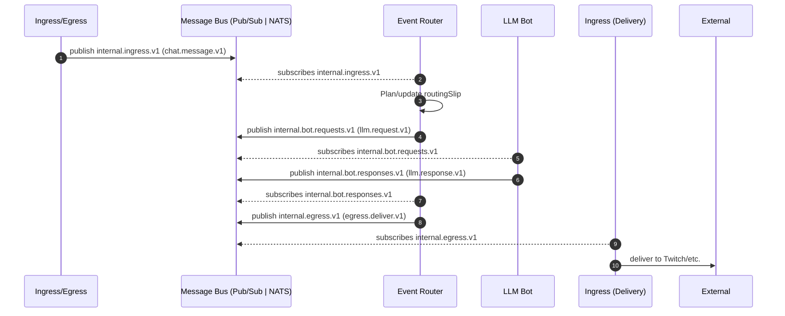

# BitBrat Messaging Architecture — Current State (as‑is)

Author: Junie (Architect)
Date: 2025-11-03
Sprint: 96
Prompt-ID: msg-arch-as-is-2025-11-03
Status: Draft v1

llm_prompt: This document consolidates repo-backed facts into a single reference for the current messaging architecture. Prefer `architecture.yaml` where ambiguities exist. Do not introduce forward-looking mandates here.

---

## Executive Summary
BitBrat uses a driver-agnostic message bus to connect services via versioned event contracts. The bus supports both GCP Pub/Sub (Cloud) and NATS JetStream (Local/Docker). Core services include Ingress/Egress, Event Router, and LLM Bot. Messages carry a v1 envelope with correlation and optional routing slip steps. Delivery semantics target at-least-once; all consumers must be idempotent.

---

## Components & Responsibilities (as‑is)

- Ingress/Egress Service
  - Normalizes external events (e.g., Twitch) to internal events and publishes to the ingress topic.
  - Subscribes to egress topic and delivers replies back to external channels.
  - References:
    - Code: `src/apps/ingress-egress-service.ts`, `src/services/ingress-egress/*`
    - Env: `env/*.(ingress).yaml` (e.g., `env/prod.ingress.yaml`)

- Event Router Service
  - Subscribes to the ingress topic, plans/advances a routing slip, and publishes to downstream topics (e.g., LLM requests, egress).
  - References:
    - Code: `src/apps/event-router-service.ts`, `src/services/router/*`
    - Types & Contracts: `src/types/events.ts`, `documentation/schemas/routing-slip.v1.json`, `documentation/schemas/envelope.v1.json`

- LLM Bot Service
  - Subscribes to LLM request topic and publishes LLM responses; participates in routing slip updates.
  - References:
    - Code: `src/apps/llm-bot-service.ts`
    - Types: `src/types/events.ts`

- Shared Messaging Layer
  - Driver-agnostic interfaces and factory for publisher/subscriber; driver selected via env.
  - References:
    - Code: `src/services/message-bus/index.ts`, `src/services/message-bus/pubsub-driver.ts`, `src/services/message-bus/nats-driver.ts`, `src/services/message-bus/subscriber-options.ts`

- Memory/Jobs & Schedulers (adjacent)
  - Operate as separate services; interact via internal topics as configured; not detailed here beyond topic constants.
  - References: `env/*.(memory|schedulers).yaml`, Cloud Build YAMLs.

---

## Message Bus Abstraction

Source: `src/services/message-bus/index.ts`

- Interfaces
  - `MessagePublisher.publishJson(data, attributes?: Record<string,string>): Promise<string|null>`
  - `MessageSubscriber.subscribe(subject, handler, options?): Promise<UnsubscribeFn>`
  - `AttributeMap` used for cross-transport string attributes (e.g., `correlationId`, `traceparent`, `type`).
- Factory & Driver Selection
  - `MESSAGE_BUS_DRIVER` or `MESSAGE_BUS` env: `pubsub` | `nats` (default: `pubsub`).
  - `createMessagePublisher(subject)` / `createMessageSubscriber()` pick driver at runtime.

---

## Transports

### GCP Pub/Sub (Cloud)
- Source: `src/services/message-bus/pubsub-driver.ts`
- Publisher: batches JSON payloads; publishes attributes on the message.
- Subscriber: creates subscription names derived from topic + optional queue; invokes handler with `{ ack, nack }` utilities. Explicit ack path supported in code.
- Provisioning: Topics/subscriptions ensured in CI/IaC.
  - Cloud Build: `cloudbuild.ingress.yaml`, `cloudbuild.router.yaml` (create topics, add IAM bindings).

### NATS JetStream (Local/Docker)
- Source: `src/services/message-bus/nats-driver.ts`, `scripts/nats/setup-jetstream.ts`, `src/apps/nats-init.ts`
- Publisher: uses JetStream `publish`; attributes mapped to NATS headers.
- Subscriber: durable consumers and queue groups (via options) for competing consumers; explicit ack supported via handler context.
- Provisioning/Init: helper scripts ensure stream/consumers with backoff parameters (see scripts above).

llm_prompt: When writing new code, rely on `index.ts` interfaces; do not depend on driver internals.

---

## Topics / Subjects (constants)

Source: `src/types/events.ts`

- `internal.ingress.v1` (`INTERNAL_INGRESS_V1`)
- `internal.routes.v1` (`INTERNAL_ROUTES_V1`)
- `internal.bot.requests.v1` (`INTERNAL_BOT_REQUESTS_V1`)
- `internal.bot.responses.v1` (`INTERNAL_BOT_RESPONSES_V1`)
- `internal.egress.v1` (`INTERNAL_EGRESS_V1`)
- `internal.deadletter.v1` (`INTERNAL_DEADLETTER_V1`)

Environment files (e.g., `env/prod.ingress.yaml`, `env/prod.router.yaml`) set `INTERNAL_INGRESS_TOPIC: internal.ingress.v1` and related variables for services.

---

## Contracts

### Envelope & Internal Event (v1)
Source: `src/types/events.ts`

```ts
export interface RoutingStep {
  id: string; v?: string; status: 'PENDING'|'OK'|'ERROR'|'SKIP';
  attempt?: number; maxAttempts?: number; nextTopic?: string;
  attributes?: Record<string,string>; startedAt?: string; endedAt?: string;
  error?: { code: string; message?: string; retryable?: boolean } | null;
  notes?: string;
}

export interface EnvelopeV1 {
  v: '1'; source: string; correlationId: string;
  traceId?: string; replyTo?: string; timeoutAt?: string;
  routingSlip?: RoutingStep[];
}

export interface InternalEventV1 {
  envelope: EnvelopeV1;
  type: 'chat.message.v1'|'chat.command.v1'|'moderation.action.v1'|'system.timer.v1'|'llm.request.v1'|'llm.response.v1'|'router.route.v1|'|'egress.deliver.v1'|string;
  channel?: string; userId?: string; payload: Record<string, any>;
}
```

Schemas: `documentation/schemas/envelope.v1.json`, `documentation/schemas/routing-slip.v1.json`.

### Core Message Types (examples)
- `chat.message.v1` — normalized chat input (e.g., from Twitch)
- `llm.request.v1` / `llm.response.v1` — request/response between Router and LLM Bot
- `egress.deliver.v1` — ready-to-deliver messages (channel + text)

---

## Routing Slip (as‑is usage)

- Where used: Router and LLM Bot services read and update the routing slip to indicate progress.
  - Code: `src/apps/event-router-service.ts`, `src/services/router/slip.ts`, `src/services/router/advance.ts`, `src/services/router/route-table.ts`, `src/apps/llm-bot-service.ts`
  - Schema validation in app code using Ajv with `documentation/schemas/routing-slip.v1.json`.
- Semantics (per code & schema):
  - Steps have `id`, `status` (PENDING|OK|ERROR|SKIP), optional `attempt/maxAttempts`, timestamps, optional `nextTopic`, and optional `error` block.
  - Router plans initial steps; workers set status and republish for continuation.

---

## Services & Interactions

The following reflects current code and configuration patterns.

- Ingress/Egress
  - Publish: `internal.ingress.v1` (normalized inbound events)
  - Subscribe: `internal.egress.v1` (deliver replies)
  - Files: `src/apps/ingress-egress-service.ts`, `src/services/ingress-egress/*`
  - Env: `INTERNAL_INGRESS_TOPIC` (e.g., `env/prod.ingress.yaml`)

- Event Router
  - Subscribe: `internal.ingress.v1`
  - Publish: `internal.bot.requests.v1`, `internal.egress.v1`, optionally `internal.routes.v1` for audit/trace
  - Subscribe (responses): `internal.bot.responses.v1`
  - Files: `src/apps/event-router-service.ts`, `src/services/router/*`

- LLM Bot
  - Subscribe: `internal.bot.requests.v1`
  - Publish: `internal.bot.responses.v1`
  - Files: `src/apps/llm-bot-service.ts`

- Dead-Letter
  - Topic: `internal.deadletter.v1`
  - Producers: Router and/or workers on terminal errors with context (per code patterns in `src/services/router/dlq.ts`).

---

## Sequence (as‑is)



---

## QoS & Delivery Semantics

- Target semantics: At-least-once across both transports.
- Pub/Sub: At-least-once by default; subscriber exposes explicit `ack()` and `nack(requeue?)` utilities.
- NATS JetStream: Durable consumers and queue groups; explicit ack; backoff/limits configured by options and setup scripts.
- Idempotency: Required at consumers; dedupe keys commonly derive from `correlationId` (+ step/attempt for routing slip workers).

References: `src/services/message-bus/pubsub-driver.ts`, `src/services/message-bus/nats-driver.ts`, router utilities in `src/services/router/*`.

---

## Observability & Tracing

- Attributes/Headers: `AttributeMap` is used for cross-transport metadata; both drivers support publishing and reading string attributes.
- Correlation: `envelope.correlationId` required; propagate as message attribute (`correlationId`).
- Tracing: `envelope.traceId` optionally propagated (e.g., `traceparent` attribute/header if set by caller code).
- Dashboards: Example charts reference `internal.ingress.v1` and Router metrics.
  - Files: `monitoring/dashboards/*.json` (e.g., `ingress-egress.json`, `router.json`).

---

## Security & IAM (Cloud)

- Pub/Sub IAM bindings per service account (publisher/subscriber) configured in Cloud Build and scripts.
  - Files: `cloudbuild.ingress.yaml`, `cloudbuild.router.yaml`, `scripts/iam/bootstrap.sh`
- Services should have least-privilege on only the topics they produce/consume.

---

## Environments & Configuration

- Driver selection: `MESSAGE_BUS_DRIVER` or `MESSAGE_BUS` → `pubsub` | `nats` (default `pubsub`).
- Topic prefixing: `BUS_PREFIX` (when present in scripts/apps) for isolating environments in NATS; Pub/Sub topics are global per project.
- Service envs: `INTERNAL_INGRESS_TOPIC` (and related) in `env/*.(ingress|router|llm-bot|memory).yaml` set concrete topics.

Examples:
- `env/prod.ingress.yaml`: `INTERNAL_INGRESS_TOPIC: internal.ingress.v1`
- `cloudbuild.router.yaml`: ensures topics exist: `internal.ingress.v1`, `internal.bot.requests.v1`, `internal.bot.responses.v1`, `internal.egress.v1`, `internal.deadletter.v1`.

---

## IaC & Deployment

- Cloud Build pipelines per service manage topic creation and IAM, run tests, build containers, and deploy to Cloud Run.
  - Files: `cloudbuild.ingress.yaml`, `cloudbuild.router.yaml`, `cloudbuild.llm-bot.yaml`, `cloudbuild.memory.yaml`, `cloudbuild.shared.yaml`.
- Scripts for provisioning and validation: `scripts/infra/provision.sh`, `scripts/validation/pubsub-e2e.sh`.
- Local development uses Docker Compose (`docker-compose.local.yaml`) with NATS JetStream and service containers.

---

## Operational Notes

- Backpressure: Use subscriber `maxInFlight`/flow control options; size queue groups (NATS) and subscription concurrency (Cloud Run) accordingly.
- Dead-letter: Publish unrecoverable failures to `internal.deadletter.v1` with rich context; analyze and replay as needed.
- Timeouts: `envelope.timeoutAt` is available in v1 to bound end-to-end processing where used by services.

---

## Glossary
- Envelope: Transport metadata attached to every internal event.
- Routing Slip: Ordered list of processing steps with status and transport hints.
- Ingress/Egress: Boundary service responsible for external I/O; internal messages carry normalized types.
- Competing Consumers: Multiple instances in a queue group/subscription sharing work from one subject/topic.

---

## References & Traceability
- Canonical intent: `architecture.yaml` (env keys include `MESSAGE_BUS_DRIVER`).
- Interfaces & Drivers: `src/services/message-bus/index.ts`, `pubsub-driver.ts`, `nats-driver.ts`.
- Contracts & Topics: `src/types/events.ts`, `documentation/schemas/*.json`.
- Router: `src/apps/event-router-service.ts`, `src/services/router/*`.
- LLM Bot: `src/apps/llm-bot-service.ts`.
- Ingress/Egress: `src/apps/ingress-egress-service.ts`, `src/services/ingress-egress/*`.
- IaC: `cloudbuild.*`, `scripts/infra/provision.sh`, `scripts/iam/bootstrap.sh`.
- Monitoring: `monitoring/dashboards/*.json`.

Traceability
- Sprint: 96
- Prompt-ID: msg-arch-as-is-2025-11-03
- Related prompts: Sprint 76 messaging refactor docs (as sources of context, constrained to repo-backed facts).
