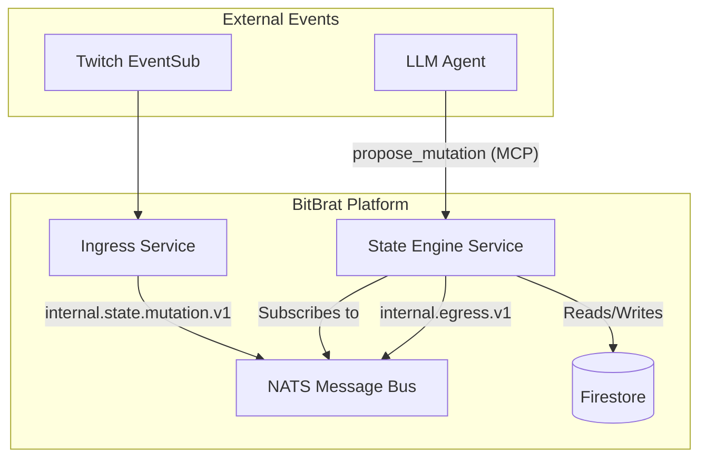

# State Engine Service Technical Overview

## Introduction
The State Engine is a core service in the BitBrat Platform responsible for managing authoritative application state using the **Graph + Mutation** model. It provides a reactive layer over Firestore, allowing the platform to maintain a consistent view of the world while enabling complex automation through rules.

## Core Concepts

### Graph + Mutation Model
Instead of services directly updating a shared database, the platform uses a mutation-based approach:
1.  **Mutation Proposal**: A service or agent proposes a change to a specific state key (e.g., `stream.state = "on"`).
2.  **State Engine**: The engine consumes the proposal, validates it, and applies it to the authoritative snapshot in Firestore.
3.  **State Snapshot**: The current value and version of a key, stored in Firestore.
4.  **Mutation Log**: An immutable audit trail of all accepted and rejected mutations.

### Optimistic Concurrency Control
To prevent race conditions, the State Engine uses version-based optimistic concurrency:
- Every state key has an associated `version` (integer).
- A `MutationProposal` can include an `expectedVersion`.
- If the current version in Firestore does not match `expectedVersion`, the mutation is rejected.
- If successful, the version is incremented.

### Rule Engine
The service includes a reactive rule engine based on [json-logic-js](https://github.com/jwadhams/json-logic-js). 
When a state change is committed, the engine evaluates configured rules. If a rule's condition (`when`) matches, its `actions` (e.g., `publishEgress`) are executed.

## Architecture & Event Flow

### Event Lifecycle
1.  **Ingress**: A platform event (e.g., Twitch Stream Online) is converted into a `MutationProposal` by an ingress adapter.
2.  **Bus**: The proposal is published to the `internal.state.mutation.v1` topic.
3.  **Processing**: The State Engine consumes the event and:
    - Validates the key against `allowedKeys`.
    - Executes a Firestore transaction to update the snapshot and log the mutation.
    - Increments the version number.
4.  **Reactivity**: After a successful commit, rules are evaluated. If a rule matches, it may trigger an egress event (e.g., sending a notification to Discord).

## Interface (MCP)
The State Engine exposes several tools via the Model Context Protocol (MCP) for LLM agents:
- `get_state(keys: string[])`: Retrieve current values and versions for specific keys.
- `get_state_prefix(prefix: string)`: Retrieve all keys matching a prefix.
- `propose_mutation(key, value, reason, expectedVersion?)`: Propose a state change.

## Storage Schema

### `state` Collection
- **Document ID**: State Key (e.g., `obs.scene`)
- **Fields**: `value`, `version`, `updatedAt`, `updatedBy`, `metadata`.

### `mutation_log` Collection
- **Document ID**: Mutation ID (UUID)
- **Fields**: All proposal fields plus `status`, `committedAt`, `resultingVersion`, `error`.
