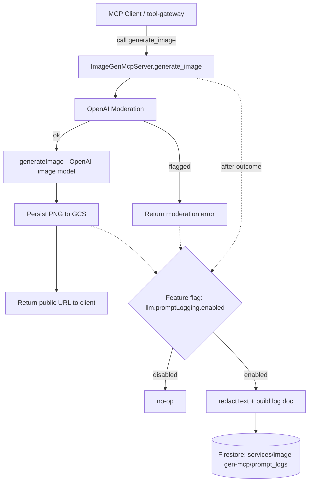

# Technical Architecture – image-gen-mcp Prompt Logging

> **HISTORICAL DESIGN DOCUMENT - FIRESTORE IMPLEMENTATION**
>
> This document describes the original **Firestore-specific** prompt logging design for `image-gen-mcp`.
>
> **Current Implementation:** BitBrat now uses **PostgreSQL** as the default persistence backend. The core concepts (service-specific prompt_logs, fail-soft writes, redaction discipline) remain valid, but storage implementation has evolved. For PostgreSQL implementation, see `src/common/persistence/document-store.ts`.

- **Sprint:** sprint-320-1cc8aa
- **Status:** Proposed (Task 1 deliverable; implementation deferred per AGENTS.md §2.4.1)
- **Author/Role:** Architect
- **Related:** sprint-157 (LLM Prompt Logging), sprint-242 (sub-collection refactor)

## 1. Overview

The `image-gen-mcp` service currently generates images (moderation → generation → GCS persist) but
keeps **no durable record** of the prompts it receives or the images it produces. The `llm-bot` and
`query-analyzer` services already capture every LLM interaction to Firestore for audit, debugging,
and training-data collection.

This document describes how to add **prompt logging to `image-gen-mcp` using the same structure and
patterns** already established by those two services — the same feature flag, the same
`services/{service}/prompt_logs` sub-collection layout, the same fire-and-forget write semantics,
and the same redaction discipline — adapted to the image-generation domain.

> Precedence note (AGENTS.md §0): `architecture.yaml` remains the source of truth. This proposal
> introduces **no new feature flag, collection family, or infrastructure**; it reuses existing
> primitives, so no `architecture.yaml` change is required.

## 2. Goals & Non-Goals

### Goals
- Persist a structured record of each `generate_image` invocation when prompt logging is enabled.
- Mirror the existing pattern exactly so logs across services share a consistent shape and location.
- Be **fail-soft**: logging must never alter, delay materially, or fail the image-generation result.
- Apply the existing redaction to free-text fields.

### Non-Goals
- No new feature flag (the existing `llm.promptLogging.enabled` flag is reused).
- No change to image-generation behavior, the MCP tool contract, or GCS persistence.
- No analytics/dashboards over the logs (out of scope; a future consumer concern).
- No retention/TTL policy change (handled platform-wide, same as existing `prompt_logs`).

## 3. Current Pattern (what we are mirroring)

Established by sprint-157 and refactored to service sub-collections in sprint-242.

### 3.1 Feature flag
Defined once in `src/common/feature-flags.manifest.json` and checked via
`isFeatureEnabled(...)` from `src/common/feature-flags`:

- **Key:** `llm.promptLogging.enabled`
- **Env synonym:** `FF_LLM_PROMPT_LOGGING`
- **Default:** `false`

> Although the key is namespaced `llm.*`, it is the platform-wide "prompt logging" switch and is the
> same flag both existing services gate on. `image-gen-mcp` reuses it for consistency — a single
> operational toggle enables/disables prompt logging everywhere. (An `image-gen-mcp`-specific flag
> was considered and rejected — see §10.)

### 3.2 Storage layout
Both services write to a **service-specific sub-collection** under a shared `services` collection:

```
services/{serviceName}/prompt_logs/{logId}
```

- llm-bot:        `services/llm-bot/prompt_logs/{auto-id}`
- query-analyzer: `services/query-analyzer/prompt_logs/{auto-id}`

The handle is obtained via `getFirestore()` (`src/common/firebase.ts`, firebase-admin + ADC,
emulator-aware), and documents are created with `.add(...)` (auto-generated ID). Writes are issued
**fire-and-forget** — the promise is **not awaited**; a `.catch(...)` logs a warning so a logging
failure never interrupts the main flow:

```ts
// query-analyzer/llm-provider.ts (abridged)
db.collection('services').doc('query-analyzer').collection('prompt_logs').add({
  correlationId: corr,
  prompt: redactText(fullPrompt),
  response: redactText(JSON.stringify(object)),
  model: modelName,
  platform: providerName,
  processingTimeMs,
  usage: usage ? { promptTokens, completionTokens, totalTokens } : undefined,
  createdAt: new Date(),
}).catch((e) => logger.error('query-analyzer.prompt_logging_failed', { correlationId: corr, error: e?.message }));
```

### 3.3 Shared base fields
| Field | Type | Notes |
|-------|------|-------|
| `correlationId` | string | Traces the request across services. |
| `prompt` | string | The full assembled prompt, **redacted** via `redactText`. |
| `response` | string | The model output, **redacted**. |
| `model` | string | Model name used. |
| `platform` | string | Provider/platform (e.g. `openai`, `twitch`). |
| `processingTimeMs` | number | Wall-clock duration of the model call. |
| `usage` | object? | `{ promptTokens, completionTokens, totalTokens }` when available. |
| `createdAt` | Date | Server-side log timestamp. |

Each service then **adds domain-specific fields** (llm-bot: `toolCalls`, `behaviorProfile`,
`personalityNames`; query-analyzer: `entities`, `topic`). `image-gen-mcp` follows the same
"shared base + domain extension" approach (§5).

## 4. Component Diagram



## 5. Detailed Design

### 5.1 Storage path
```
services/image-gen-mcp/prompt_logs/{auto-id}
```
Consistent with `llm-bot` and `query-analyzer`. No index changes are required for write-only logging
(ad-hoc/console queries are sufficient; if future querying by `createdAt`/`status` is needed, a
composite index can be added then — out of scope here).

### 5.2 Document schema
Shared base fields, with the **text-oriented `prompt`/`response` mapped onto the image domain**:

| Field | Type | Source / Notes |
|-------|------|----------------|
| `correlationId` | string | See §5.4. |
| `prompt` | string | The user's image prompt, **redacted** via `redactText`. |
| `response` | string | The resulting image's GCS public URL (the service's "output"). On rejection/failure, a short status string. |
| `model` | string | `IMAGE_GEN_MODEL` config (default `gpt-image-1`). |
| `platform` | string | `"openai"` (the image provider). |
| `processingTimeMs` | number | Wall-clock duration of `generateImage(...)`. |
| `status` | string | `"success" \| "rejected" \| "error"` (image-domain extension; see §5.3). |
| `aspectRatio` | string | Tool arg: `1:1` \| `16:9` \| `9:16`. |
| `size` | string | Resolved pixel size sent to the model (e.g. `1024x1024`). |
| `image` | object? | On success: `{ url, bucket, fileName, contentType: 'image/png' }`. |
| `moderation` | object? | `{ flagged: boolean, categories: string[] }` from the moderation step. |
| `userId` | string | From MCP `extra._meta` (`anonymous` if absent). |
| `error` | string? | Redacted error message when `status: 'error'`. |
| `usage` | object? | Omitted by default — the image API does not return token usage; reserved for parity/future use. |
| `createdAt` | Date | `new Date()` at log time. |

> Field-mapping rationale: `image-gen-mcp` produces an **image**, not model prose. To keep the
> cross-service schema consistent, `prompt` holds the (redacted) request text and `response` holds
> the primary human-meaningful output (the image URL). The richer, structured details live in the
> `image`/`moderation`/`status` extension fields — exactly how `query-analyzer` keeps `response` as
> the JSON string while also exposing `entities`/`topic` as first-class fields.

### 5.3 What to log, and when
The handler has three terminal outcomes; all three are logged (when the flag is on) so the dataset
captures rejections and failures, not just successes:

1. **Success** (image generated + persisted): `status: 'success'`, `response = publicUrl`,
   populated `image` and `moderation`, `processingTimeMs` set.
2. **Moderation rejection**: `status: 'rejected'`, `moderation.flagged = true` with `categories`,
   `response = 'moderation_rejected'`, no `image`.
3. **Error** (generation or GCS failure): `status: 'error'`, redacted `error`, `response = 'error'`.

In all cases the log write is **fire-and-forget** and occurs **just before** the handler returns its
`CallToolResult`, so it never sits on the critical path of the response payload.

### 5.4 correlationId strategy (MCP-specific)
Unlike `llm-bot`/`query-analyzer`, which read `correlationId` from the `InternalEventV2` envelope,
`image-gen-mcp` is an MCP **request/response** tool with no event envelope. Resolution order:

1. `extra._meta?.correlationId` if the caller (tool-gateway) propagates one;
2. otherwise generate one with `uuidv4()` (already imported in `index.ts`).

This keeps each log row traceable while not requiring a contract change. (Propagating a real
correlationId end-to-end through the MCP `_meta` is a desirable follow-up but is **not** required
for this sprint.)

### 5.5 Integration point (illustrative pseudo-code)
Implemented inside the `generate_image` handler in `src/services/image-gen-mcp/index.ts`, factored
into a small private `logPrompt(...)` helper to keep the three call sites (success/rejected/error)
DRY:

```ts
import { getFirestore } from '../../common/firebase';
import { isFeatureEnabled } from '../../common/feature-flags';
import { redactText } from '../../common/prompt-assembly/redaction';

private logPrompt(entry: {
  correlationId: string; prompt: string; response: string; status: string;
  model: string; aspectRatio: string; size?: string; userId: string;
  processingTimeMs?: number; image?: object; moderation?: object; error?: string;
}) {
  if (!isFeatureEnabled('llm.promptLogging.enabled')) return;
  try {
    const db = getFirestore();
    db.collection('services').doc('image-gen-mcp').collection('prompt_logs').add({
      ...entry,
      prompt: redactText(entry.prompt),
      response: redactText(entry.response),
      error: entry.error ? redactText(entry.error) : undefined,
      platform: 'openai',
      createdAt: new Date(),
    }).catch((e: any) =>
      this.getLogger().warn('image_gen_mcp.prompt_logging_failed',
        { correlationId: entry.correlationId, error: e?.message }));
  } catch (e: any) {
    this.getLogger().warn('image_gen_mcp.prompt_logging_failed',
      { correlationId: entry.correlationId, error: e?.message });
  }
}
```

The handler calls `logPrompt(...)` at each terminal branch (before `return`), passing the matching
`status` and fields. The `try/catch` guards even the synchronous `getFirestore()`/build path so a
misconfiguration cannot throw into the tool result.

## 6. Security & Privacy
- **Redaction:** `redactText` is applied to `prompt`, `response`, and `error` — identical to the
  existing services.
- **Access control:** `prompt_logs` are written by the Admin SDK (firebase-admin), which **bypasses
  Firestore rules** (per the note in `firestore.rules`). No client-facing rule change is needed; the
  collection is server-owned, same as today's `services/*/prompt_logs`.
- **Secrets:** No API keys or credentials are logged. The OpenAI key is fetched via `getSecret` and
  never enters a log document.
- **Backups:** `prompt_logs` is already classified as a **log/event collection that is excluded**
  from the `brat backup` config export (sprint-319) — adding the `image-gen-mcp` sub-collection
  requires no change, since the exclusion is by collection name (`prompt_logs`).

## 7. Performance Considerations
- Writes are **not awaited** (fire-and-forget), so added latency on the tool response is negligible.
- One small document per generation; volume is bounded by the existing per-user rate limit
  (`IMAGE_GEN_RATE_LIMIT_MS`, default 1 per 5 min), so cost/throughput impact is minimal.
- Logging is fully short-circuited when the flag is `false` (the default), so there is **zero**
  overhead in the default configuration.

## 8. Testing Strategy (future implementation task)
Model the unit tests on `tests/services/llm-bot/prompt-logging.test.ts`:
- **Flag off:** `generate_image` performs **no** Firestore write.
- **Flag on, success:** exactly one write to `services/image-gen-mcp/prompt_logs` with
  `status: 'success'`, redacted `prompt`, and `image.url` set.
- **Flag on, moderation rejection:** one write with `status: 'rejected'` and `moderation.flagged`.
- **Flag on, error path:** one write with `status: 'error'` and a redacted `error`.
- **Fail-soft:** when the Firestore `.add()` rejects, the tool still returns its normal result and a
  warning is logged.
Firestore and the OpenAI/moderation/GCS calls are mocked (no live calls), consistent with DoD §5.

## 9. Rollout
1. **Ship dark:** merge behind the existing `llm.promptLogging.enabled` flag (default `false`) — no
   behavior change on deploy.
2. **Enable in staging:** set `FF_LLM_PROMPT_LOGGING=true` for `image-gen-mcp` in
   `env/staging/*`; verify documents appear under `services/image-gen-mcp/prompt_logs` and that
   redaction is applied.
3. **Enable in production** once validated. Disabling is a single flag flip.

## 10. Alternatives Considered
- **New `image-gen-mcp`-specific feature flag** — rejected: fragments the operational toggle and
  diverges from the established single-switch pattern. Reuse keeps parity with llm-bot/query-analyzer.
- **Top-level `prompt_logs` collection (pre-sprint-242 layout)** — rejected: sprint-242 deliberately
  moved to per-service sub-collections for scalability/isolation; this design conforms to that.
- **Cloud Logging only** — rejected: harder to query structurally and inconsistent with where the
  existing prompt corpus lives (Firestore).
- **Awaiting the write** — rejected: would add latency and could fail the tool on a logging error;
  fire-and-forget matches the existing fail-soft contract.

## 11. Traceability
- Sprint: `sprint-320-1cc8aa`; Request: REQ-001 (`planning/sprint-320-1cc8aa/request-log.md`).
- Reference implementations: `src/services/llm-bot/processor.ts` (step "6. Prompt Logging"),
  `src/services/query-analyzer/llm-provider.ts` ("Prompt Logging (Fire and forget)").
- Target: `src/services/image-gen-mcp/index.ts` (`generate_image` tool handler).
- Shared primitives: `src/common/feature-flags.manifest.json` (`llm.promptLogging.enabled`),
  `src/common/firebase.ts` (`getFirestore`), `src/common/prompt-assembly/redaction.ts` (`redactText`).
