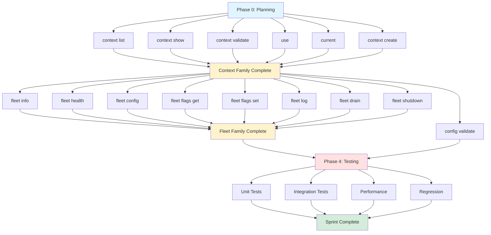

# Sprint 360: Execution Plan - Bulk oclif Command Migration
## Context, Fleet, and Config Command Families

**Sprint**: 360
**Lead Implementor**: AI Agent (Sprint Protocol v3)
**Duration**: 1 sprint (~3-5 days)
**Start Date**: 2026-07-24 (continued from Sprint 359)
**Target Completion**: 2026-07-29

---

## Executive Summary

Sprint 360 continues the oclif migration established in Sprint 359 by migrating **14 high-priority commands** organized into three cohesive families:

1. **Context Commands** (6 commands) - Execution context management
2. **Fleet Commands** (7 commands) - Complete fleet control plane
3. **Config Commands** (1 command) - Configuration validation

**Success Criteria**: All 14 commands migrated, tests passing, zero regressions, patterns validated.

**Foundation**: Sprint 359 successfully established:
- ✅ BratCommand base class with logging, context resolution, DI
- ✅ 5 PoC commands demonstrating all migration patterns
- ✅ Testing framework and documentation
- ✅ Build system and oclif configuration

---

## Sprint Objectives

### Primary Objectives (P0 - Must Complete)

| ID | Objective | Success Metric | Acceptance Criteria |
|----|-----------|----------------|---------------------|
| OBJ-1 | Context family complete | 6/6 context commands migrated | All context commands pass tests, help text validated |
| OBJ-2 | Fleet family complete | 7/7 fleet commands migrated | All fleet commands pass tests, MCP integration working |
| OBJ-3 | Config validate migrated | 1/1 config commands migrated | config validate passes tests |
| OBJ-4 | Zero regressions | All existing tests pass | npm test shows 100% pass rate on migrated commands |
| OBJ-5 | Help text polished | All commands have examples | Every command has --help with usage examples |

### Secondary Objectives (P1 - Should Complete)

| ID | Objective | Success Metric | Acceptance Criteria |
|----|-----------|----------------|---------------------|
| OBJ-6 | Test coverage maintained | ≥80% on new code | Jest coverage report shows adequate coverage |
| OBJ-7 | Performance validated | No regression vs Sprint 359 | Startup time < 200ms, help < 50ms |
| OBJ-8 | Documentation updated | Migration guide enhanced | Lessons learned from bulk migration documented |

### Stretch Goals (P2 - Nice to Have)

| ID | Objective | Success Metric | Acceptance Criteria |
|----|-----------|----------------|---------------------|
| OBJ-9 | Backward compat hooks | Aliases for legacy paths | Old `brat context list` → new `brat context list` with warning |
| OBJ-10 | Auto-completion scaffold | Shell completion framework | Basic tab completion for commands |

---

## Command Inventory & Migration Status

### Sprint 359: Completed (5 commands)
- [x] `setup` - Interactive platform setup
- [x] `doctor` - System diagnostics
- [x] `fleet list` - List all Bits
- [x] `config show` - Display configuration
- [x] `release` - Version management

### Sprint 360: Target (14 commands)

#### Context Family (6 commands) - Priority 1
- [ ] `context list` - List all execution contexts
- [ ] `context show <name>` - Display context configuration
- [ ] `context create <name>` - Create new execution context
- [ ] `context validate <name>` - Validate context configuration
- [ ] `use <context>` - Switch to different context
- [ ] `current` - Show current context

**Rationale**: Context commands are foundational. Many other commands depend on context resolution (already in base class). Completing this family enables full context-aware CLI.

#### Fleet Family (7 commands) - Priority 2
- [ ] `fleet info [--bit <name>]` - Get bit.info from Bits
- [ ] `fleet health <bit>` - Get bit.health from specific Bit
- [ ] `fleet config <bit> [--describe]` - View effective config
- [ ] `fleet flags <bit> get --key <k>` - Inspect feature flag
- [ ] `fleet flags <bit> set --key <k> --value <v>` - Toggle feature flag
- [ ] `fleet log <bit> --level <level>` - Change runtime log level
- [ ] `fleet drain <bit> --confirm` - Graceful drain
- [ ] `fleet shutdown <bit> --confirm` - Shutdown Bit

**Rationale**: Complete the fleet namespace started in Sprint 359. Fleet commands are MCP-based, well-structured, and follow consistent patterns.

#### Config Family (1 command) - Priority 3
- [ ] `config validate` - Validate architecture.yaml

**Rationale**: Low-hanging fruit. Simple validation command, rounds out config namespace.

### Future Sprints (21+ commands)
- Data/Migration commands (8 commands)
- Deploy commands (3 commands)
- Infra commands (5 commands)
- Dev commands (3 commands)
- Bit commands (1 command)
- Trigger commands (1 command)

---

## Phase Breakdown

### Phase 0: Planning & Setup (Day 1, 2-4 hours)

**Objective**: Analyze command complexity, validate dependencies, create backlog

**Tasks**:
1. Read all source implementations for 14 commands
2. Identify shared business logic to extract
3. Create task backlog with time estimates
4. Validate BratCommand base class sufficiency
5. Review Sprint 359 lessons learned

**Deliverables**:
- `backlog.yaml` - Prioritized task list with time estimates
- `complexity-analysis.md` - Command complexity assessment
- `shared-logic-map.md` - Business logic extraction plan

**Dependencies**: None (Sprint 359 complete)

**Validation**:
```bash
# All Sprint 359 commands still work
./node dist/tools/brat/src/oclif-entry.js setup --help
./node dist/tools/brat/src/oclif-entry.js doctor
./node dist/tools/brat/src/oclif-entry.js fleet list
./node dist/tools/brat/src/oclif-entry.js config show
./node dist/tools/brat/src/oclif-entry.js release --help

# Build succeeds
npm run build

# Tests pass
npm test -- tools/brat/src/oclif-commands
```

---

### Phase 1: Context Commands (Day 1-2, 6-8 hours)

**Objective**: Migrate all 6 context management commands

#### 1.1: context list (1.5 hours)

**Current**: `src/commands/context/list.ts` - executeContextList()

**Target**: `src/oclif-commands/context/list.ts`

**Pattern**: Simple table/JSON output (Pattern 2)

**Tasks**:
1. Create oclif Command class
2. Extract business logic (already separated)
3. Add flags: `--format <table|json|yaml>`
4. Implement table formatter
5. Write tests

**Acceptance Criteria**:
- ✅ `brat context list` displays table
- ✅ `brat context list --format json` outputs JSON
- ✅ `brat context list --format yaml` outputs YAML
- ✅ Columns: NAME, TYPE, DESCRIPTION, TAGS
- ✅ Current context marked with `*`

**Validation**:
```bash
./bin/run context list
./bin/run context list --format json
./bin/run context list --format yaml
```

#### 1.2: context show (1.5 hours)

**Current**: `src/commands/context/show.ts` - executeContextShow()

**Target**: `src/oclif-commands/context/show.ts`

**Pattern**: Config display with smart redaction (Pattern 2)

**Tasks**:
1. Create oclif Command class
2. Add argument: `<name>` (context name)
3. Add flags: `--raw` (show unredacted)
4. Preserve redaction logic from `config show`
5. Write tests

**Acceptance Criteria**:
- ✅ `brat context show local` displays YAML
- ✅ Passwords/tokens redacted by default
- ✅ `brat context show local --raw` shows unredacted
- ✅ Environment variable interpolation redacted (${VAR} → ${********})

**Validation**:
```bash
./bin/run context show local
./bin/run context show staging --raw
```

#### 1.3: context create (2-3 hours)

**Current**: `src/commands/context/create.ts` - executeContextCreate()

**Target**: `src/oclif-commands/context/create.ts`

**Pattern**: Interactive wizard with non-interactive mode (Pattern 5)

**Tasks**:
1. Create oclif Command class
2. Add argument: `<name>` (context name)
3. Add flags for non-interactive mode:
   - `--type <docker-compose|cloud-run|k8s>`
   - `--description <desc>`
   - `--persistence-driver <postgres|firestore>`
   - `--pg-host`, `--pg-port`, `--pg-database`, `--pg-username`, `--pg-password`
   - `--docker-host`, `--docker-remote-dir`
   - `--gcp-project`, `--gcp-region`
   - `--gateway-url`, `--gateway-auth-token`
   - `--env-path`, `--tags`
   - `--non-interactive`
4. Implement interactive prompts (inquirer)
5. Preserve environment scaffolding logic
6. Write tests

**Acceptance Criteria**:
- ✅ `brat context create prod` runs interactive wizard
- ✅ `brat context create prod --type cloud-run --non-interactive ...` works
- ✅ Scaffolds env/<context>/ directory
- ✅ Creates global.yaml, infra.yaml
- ✅ Updates architecture.yaml
- ✅ Validates context name (no spaces, lowercase)

**Validation**:
```bash
# Interactive mode
./bin/run context create test-context

# Non-interactive mode
./bin/run context create test2 \
  --type docker-compose \
  --description "Test context" \
  --persistence-driver postgres \
  --pg-host localhost \
  --non-interactive
```

#### 1.4: context validate (1 hour)

**Current**: `src/commands/context/validate.ts` - executeContextValidate()

**Target**: `src/oclif-commands/context/validate.ts`

**Pattern**: Simple validation (Pattern 1)

**Tasks**:
1. Create oclif Command class
2. Add argument: `<name>` (context name)
3. Add flags: `--format <text|json>`, `--verbose`
4. Preserve validation logic
5. Write tests

**Acceptance Criteria**:
- ✅ `brat context validate local` runs validation checks
- ✅ Exit code 0 on success, 1 on failure
- ✅ `--format json` outputs structured results
- ✅ `--verbose` shows detailed validation steps

**Validation**:
```bash
./bin/run context validate local
./bin/run context validate staging --format json
./bin/run context validate invalid --verbose
echo $? # Should be 1
```

#### 1.5: use (0.5 hours)

**Current**: `src/commands/use.ts` - executeUse()

**Target**: `src/oclif-commands/use.ts`

**Pattern**: Simple mutation (Pattern 1)

**Tasks**:
1. Create oclif Command class
2. Add argument: `<context>` (context name)
3. Preserve ~/.bratrc update logic
4. Write tests

**Acceptance Criteria**:
- ✅ `brat use staging` switches to staging context
- ✅ Updates ~/.bratrc with currentContext
- ✅ Validates context exists before switching
- ✅ Prints confirmation message

**Validation**:
```bash
./bin/run use local
cat ~/.bratrc | grep currentContext
./bin/run use nonexistent # Should fail
```

#### 1.6: current (0.5 hours)

**Current**: `src/commands/current.ts` - executeCurrent()

**Target**: `src/oclif-commands/current.ts`

**Pattern**: Simple query (Pattern 1)

**Tasks**:
1. Create oclif Command class
2. Read ~/.bratrc and display currentContext
3. Write tests

**Acceptance Criteria**:
- ✅ `brat current` displays current context name
- ✅ Handles missing ~/.bratrc gracefully
- ✅ Falls back to "local" if not set

**Validation**:
```bash
./bin/run current
# Should print: local (or current context)
```

---

### Phase 2: Fleet Commands (Day 2-3, 7-10 hours)

**Objective**: Complete the fleet control plane namespace

**Dependencies**: Phase 1 complete (context commands working)

**Common Patterns**:
- All fleet commands use FleetClient with MCP transport
- All require bit:read or bit:operate scope
- All support `--context` flag (inherited from BratCommand)
- All support `--json` flag for structured output
- All use dependency injection for testability

#### 2.1: fleet info (2 hours)

**Current**: `src/cli/fleet.ts` - cmdFleet('info')

**Target**: `src/oclif-commands/fleet/info.ts`

**Pattern**: Fleet with DI (Pattern 3)

**Tasks**:
1. Create oclif Command class extending BratCommand
2. Add flag: `--bit <name>` (optional, default: all bits)
3. Implement FleetClient.getBitInfo() calls
4. Support `--json` and `--yaml` output
5. Preserve dependency injection pattern
6. Write tests

**Acceptance Criteria**:
- ✅ `brat fleet info` gets info from all Bits
- ✅ `brat fleet info --bit api-gateway` gets info from specific Bit
- ✅ `--json` outputs structured JSON
- ✅ Table format shows: BIT, VERSION, UPTIME, PROFILE
- ✅ DI pattern allows test mocking

**Validation**:
```bash
npm run local # Start local stack
./bin/run fleet info
./bin/run fleet info --bit api-gateway
./bin/run fleet info --json
```

#### 2.2: fleet health (1.5 hours)

**Current**: `src/cli/fleet.ts` - cmdFleet('health')

**Target**: `src/oclif-commands/fleet/health.ts`

**Pattern**: Fleet with DI (Pattern 3)

**Tasks**:
1. Create oclif Command class
2. Add argument: `<bit>` (bit name, required)
3. Implement FleetClient.getBitHealth() call
4. Support `--json` output
5. Write tests

**Acceptance Criteria**:
- ✅ `brat fleet health api-gateway` gets health status
- ✅ Exit code 0 if healthy, 1 if unhealthy
- ✅ `--json` outputs structured JSON
- ✅ Shows: status, checks, uptime, memory

**Validation**:
```bash
./bin/run fleet health api-gateway
echo $? # Should be 0 if healthy
./bin/run fleet health nonexistent
echo $? # Should be 1
```

#### 2.3: fleet config (2 hours)

**Current**: `src/cli/fleet.ts` - cmdFleet('config')

**Target**: `src/oclif-commands/fleet/config.ts`

**Pattern**: Fleet with DI + smart redaction (Pattern 3)

**Tasks**:
1. Create oclif Command class
2. Add argument: `<bit>` (bit name, required)
3. Add flags: `--describe` (show all config), `--key <key>` (get specific key)
4. Implement FleetClient.getBitConfig() call
5. Apply smart redaction (reuse from config show)
6. Write tests

**Acceptance Criteria**:
- ✅ `brat fleet config api-gateway --describe` shows all config
- ✅ `brat fleet config api-gateway --key PORT` shows specific key
- ✅ Sensitive values redacted by default
- ✅ `--json` outputs structured JSON

**Validation**:
```bash
./bin/run fleet config api-gateway --describe
./bin/run fleet config api-gateway --key PORT
./bin/run fleet config api-gateway --describe --json
```

#### 2.4: fleet flags get (1 hour)

**Current**: `src/cli/fleet.ts` - cmdFleet('flags', 'get')

**Target**: `src/oclif-commands/fleet/flags/get.ts`

**Pattern**: Fleet with DI (Pattern 3)

**Tasks**:
1. Create oclif Command class
2. Add argument: `<bit>` (bit name, required)
3. Add flag: `--key <key>` (flag name, required)
4. Implement FleetClient.getBitFlag() call
5. Write tests

**Acceptance Criteria**:
- ✅ `brat fleet flags <bit> get --key enableFeatureX` gets flag value
- ✅ `--json` outputs structured JSON
- ✅ Shows: key, value, type, description

**Validation**:
```bash
./bin/run fleet flags api-gateway get --key enableCors
./bin/run fleet flags api-gateway get --key enableCors --json
```

#### 2.5: fleet flags set (1 hour)

**Current**: `src/cli/fleet.ts` - cmdFleet('flags', 'set')

**Target**: `src/oclif-commands/fleet/flags/set.ts`

**Pattern**: Fleet with DI (Pattern 3)

**Tasks**:
1. Create oclif Command class
2. Add argument: `<bit>` (bit name, required)
3. Add flags: `--key <key>` (required), `--value <value>` (required)
4. Implement FleetClient.setBitFlag() call
5. Require bit:operate scope
6. Write tests

**Acceptance Criteria**:
- ✅ `brat fleet flags <bit> set --key k --value v` sets flag
- ✅ Requires bit:operate scope (should fail without permission)
- ✅ `--json` outputs confirmation
- ✅ Validates flag exists before setting

**Validation**:
```bash
./bin/run fleet flags api-gateway set --key enableCors --value true
./bin/run fleet flags api-gateway get --key enableCors # Should show new value
```

#### 2.6: fleet log (1 hour)

**Current**: `src/cli/fleet.ts` - cmdFleet('log')

**Target**: `src/oclif-commands/fleet/log.ts`

**Pattern**: Fleet with DI (Pattern 3)

**Tasks**:
1. Create oclif Command class
2. Add argument: `<bit>` (bit name, required)
3. Add flag: `--level <debug|info|warn|error>` (required)
4. Implement FleetClient.setBitLogLevel() call
5. Require bit:operate scope
6. Write tests

**Acceptance Criteria**:
- ✅ `brat fleet log api-gateway --level debug` changes log level
- ✅ Requires bit:operate scope
- ✅ Validates log level is valid
- ✅ Prints confirmation message

**Validation**:
```bash
./bin/run fleet log api-gateway --level debug
./bin/run fleet log api-gateway --level invalid # Should fail
```

#### 2.7: fleet drain (1.5 hours)

**Current**: `src/cli/fleet.ts` - cmdFleet('drain')

**Target**: `src/oclif-commands/fleet/drain.ts`

**Pattern**: Fleet with DI + confirmation (Pattern 3)

**Tasks**:
1. Create oclif Command class
2. Add argument: `<bit>` (bit name, required)
3. Add flag: `--confirm` (required, safety check)
4. Implement FleetClient.drainBit() call
5. Require bit:operate scope
6. Write tests

**Acceptance Criteria**:
- ✅ `brat fleet drain api-gateway --confirm` initiates graceful drain
- ✅ Requires `--confirm` flag (fails without it)
- ✅ Requires bit:operate scope
- ✅ Shows drain progress
- ✅ Waits for drain completion

**Validation**:
```bash
./bin/run fleet drain api-gateway # Should fail (no --confirm)
./bin/run fleet drain api-gateway --confirm # Should drain
```

#### 2.8: fleet shutdown (1.5 hours)

**Current**: `src/cli/fleet.ts` - cmdFleet('shutdown')

**Target**: `src/oclif-commands/fleet/shutdown.ts`

**Pattern**: Fleet with DI + confirmation (Pattern 3)

**Tasks**:
1. Create oclif Command class
2. Add argument: `<bit>` (bit name, required)
3. Add flag: `--confirm` (required, safety check)
4. Implement FleetClient.shutdownBit() call
5. Require bit:operate scope
6. Write tests

**Acceptance Criteria**:
- ✅ `brat fleet shutdown api-gateway --confirm` shuts down Bit
- ✅ Requires `--confirm` flag (fails without it)
- ✅ Requires bit:operate scope
- ✅ Shows shutdown confirmation

**Validation**:
```bash
./bin/run fleet shutdown api-gateway # Should fail (no --confirm)
./bin/run fleet shutdown api-gateway --confirm # Should shutdown
```

---

### Phase 3: Config Validate (Day 3, 1 hour)

**Objective**: Complete the config namespace

**Dependencies**: Phase 1-2 complete

#### 3.1: config validate (1 hour)

**Current**: `src/cli/index.ts` - cmdConfigValidate()

**Target**: `src/oclif-commands/config/validate.ts`

**Pattern**: Simple validation (Pattern 1)

**Tasks**:
1. Create oclif Command class
2. Add flag: `--json` (structured output)
3. Implement architecture.yaml validation
4. Check for required fields
5. Validate schema compliance
6. Write tests

**Acceptance Criteria**:
- ✅ `brat config validate` validates architecture.yaml
- ✅ Exit code 0 on success, 1 on validation errors
- ✅ `--json` outputs structured validation results
- ✅ Shows: warnings, errors, suggestions

**Validation**:
```bash
./bin/run config validate
./bin/run config validate --json
# Introduce error in architecture.yaml
./bin/run config validate # Should exit 1
```

---

### Phase 4: Testing & Validation (Day 3-4, 4-6 hours)

**Objective**: Ensure zero regressions, comprehensive test coverage

**Tasks**:
1. Run full test suite
2. Manual E2E testing of all 14 commands
3. Performance benchmarking
4. Documentation updates
5. Code review

#### 4.1: Unit Tests (2 hours)

**Per Command**:
- Command class initialization
- Flag parsing and validation
- Help text generation
- Error handling
- Output formatting

**Test Files to Create**:
```
tools/brat/src/oclif-commands/
├── context/
│   ├── list.test.ts
│   ├── show.test.ts
│   ├── create.test.ts
│   └── validate.test.ts
├── fleet/
│   ├── info.test.ts
│   ├── health.test.ts
│   ├── config.test.ts
│   ├── log.test.ts
│   ├── drain.test.ts
│   ├── shutdown.test.ts
│   └── flags/
│       ├── get.test.ts
│       └── set.test.ts
├── config/
│   └── validate.test.ts
├── use.test.ts
└── current.test.ts
```

**Validation**:
```bash
# All new tests pass
npm test -- tools/brat/src/oclif-commands/context
npm test -- tools/brat/src/oclif-commands/fleet
npm test -- tools/brat/src/oclif-commands/config
npm test -- tools/brat/src/oclif-commands/use.test.ts
npm test -- tools/brat/src/oclif-commands/current.test.ts

# Coverage check
npm test -- --coverage
```

#### 4.2: Integration Tests (2 hours)

**Scenarios**:
- Context creation → validation → switch → show
- Fleet list → info → health → config
- Fleet flags get → set → get (verify change)
- Config show → validate

**Validation**:
```bash
# Start local stack
npm run local

# Context workflow
./bin/run context create test-ctx --type docker-compose --non-interactive ...
./bin/run context validate test-ctx
./bin/run use test-ctx
./bin/run current # Should show test-ctx
./bin/run context show test-ctx

# Fleet workflow
./bin/run fleet list
./bin/run fleet info
./bin/run fleet info --bit api-gateway
./bin/run fleet health api-gateway
./bin/run fleet config api-gateway --describe

# Config workflow
./bin/run config show
./bin/run config validate
```

#### 4.3: Performance Benchmarking (1 hour)

**Metrics**:
```bash
# Startup time
time ./bin/run --version  # Target: < 200ms

# Help generation
time ./bin/run context list --help  # Target: < 50ms
time ./bin/run fleet info --help    # Target: < 50ms

# Command execution
time ./bin/run context list         # Baseline
time ./bin/run fleet list           # Compare to Sprint 359
```

**Acceptance**:
- No regression vs Sprint 359 baseline
- Startup time < 200ms
- Help generation < 50ms

#### 4.4: Regression Testing (1 hour)

**Checklist**:
- [ ] All Sprint 359 commands still work
- [ ] All existing business logic tests pass
- [ ] No changes to non-CLI code
- [ ] architecture.yaml unchanged
- [ ] No breaking changes to public APIs

**Validation**:
```bash
# Full test suite
npm test

# Sprint 359 commands
./bin/run setup --help
./bin/run doctor
./bin/run fleet list
./bin/run config show
./bin/run release --help

# Compare outputs
node dist/cli/index.js context list > old.txt
./bin/run context list > new.txt
diff old.txt new.txt # Should be identical
```

---

## Task Dependencies & Critical Path



**Critical Path**:
1. Planning (4h)
2. context create (3h) ← Most complex context command
3. Fleet drain/shutdown (1.5h each) ← Most complex fleet commands
4. Testing (6h)
**Total Critical Path**: ~18 hours

---

## Success Metrics

### Quantitative Metrics

| Metric | Target | Measurement |
|--------|--------|-------------|
| Commands migrated | 14/14 (100%) | Count of working commands |
| Test coverage | ≥80% | Jest coverage on new code |
| Test pass rate | 100% | All tests green |
| Performance (startup) | < 200ms | `time ./bin/run --version` |
| Performance (help) | < 50ms | `time ./bin/run context list --help` |
| Zero regressions | 100% | All existing tests pass |

### Qualitative Metrics

| Metric | Target | Measurement |
|--------|--------|-------------|
| Help text quality | Excellent | Every command has examples |
| Code maintainability | Improved | Follow oclif patterns |
| DI pattern consistency | 100% | All fleet commands use DI |
| Error messages | Clear | User-friendly error messages |

---

## Risk Management

### High Risk Items

| Risk | Probability | Impact | Mitigation |
|------|-------------|--------|------------|
| context create complexity | Medium | High | Allocate 3h, validate early |
| Fleet MCP integration breaks | Low | High | Use DI, mock in tests |
| Too many commands | Medium | Medium | Prioritize, defer if needed |

### Medium Risk Items

| Risk | Probability | Impact | Mitigation |
|------|-------------|--------|------------|
| Test suite time increases | High | Low | Run tests in parallel |
| Inconsistent help text | Medium | Low | Template-based approach |

---

## Definition of Done

Sprint 360 is complete when:

### Code
- [ ] All 14 commands migrated to oclif
- [ ] All commands follow BratCommand patterns
- [ ] All commands have help text with examples
- [ ] Zero regressions (all existing tests pass)
- [ ] New tests written (≥80% coverage)

### Documentation
- [ ] Migration guide updated with bulk migration learnings
- [ ] CLAUDE.md updated with new command examples
- [ ] Help text polished for all commands

### Validation
- [ ] All unit tests pass
- [ ] All integration tests pass
- [ ] Manual E2E testing successful
- [ ] Performance benchmarks met
- [ ] Code reviewed

### Process
- [ ] Retrospective completed
- [ ] Learnings documented
- [ ] Backlog updated for Sprint 361

---

## Next Sprint Preview (Sprint 361)

Sprint 361 will focus on:

1. **Data/Migration Commands** (8 commands)
   - data backup list/export/import
   - data migrate collection/all/tokens/api-tokens
   - data seed
   - data validate

2. **Deploy Commands** (3 commands)
   - deploy services/service
   - deploy docker (up/down/logs/ps)

3. **Infra Commands** (5 commands)
   - infra plan/apply
   - apis enable
   - cloud-run shutdown
   - lb urlmap render/import

**Estimated Effort**: 16 commands (~2 sprints)

---

## Appendix A: Time Estimates

### Context Commands (6 commands, 8 hours)
- context list: 1.5h
- context show: 1.5h
- context create: 3h (most complex)
- context validate: 1h
- use: 0.5h
- current: 0.5h

### Fleet Commands (7 commands, 10 hours)
- fleet info: 2h
- fleet health: 1.5h
- fleet config: 2h
- fleet flags get: 1h
- fleet flags set: 1h
- fleet log: 1h
- fleet drain: 1.5h
- fleet shutdown: 1.5h (includes fleet flags subcommands)

### Config Commands (1 command, 1 hour)
- config validate: 1h

### Testing (4 commands, 6 hours)
- Unit tests: 2h
- Integration tests: 2h
- Performance: 1h
- Regression: 1h

**Total Estimate**: 25 hours (3-4 days at 6-8h/day)

---

**Document Version**: 1.0
**Last Updated**: 2026-07-24
**Next Review**: End of Day 2 (midpoint check)
