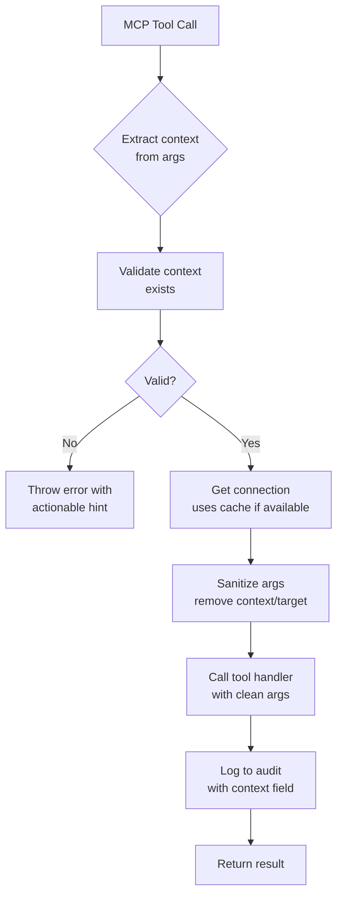

# Sprint 366: Runtime Context Switching - Migration Guide

**Date**: 2026-07-26
**Status**: ✅ Complete
**Backward Compatibility**: ✅ Full backward compatibility maintained

---

## Overview

Sprint 366 introduces **runtime context switching** for the Dev MCP server, enabling tools to switch between execution contexts (local, staging, prod) without requiring server restart.

**Key Change**: Execution context is now passed as an optional parameter at tool invocation time instead of being fixed at server startup.

---

## What Changed

### Before Sprint 366

```javascript
// Server bound to single context at startup
const server = new DevMcpServer({ target: 'staging' });

// All tool calls used 'staging' context
await toolRouter.callTool('fleet.list', {});
// ✗ No way to query 'local' or 'prod' without restart
```

### After Sprint 366

```javascript
// Server has default context (optional)
const server = new DevMcpServer({ context: 'local' });

// Tool calls can override context at runtime
await toolRouter.callTool('fleet.list', { context: 'staging' });
await toolRouter.callTool('db.get', { context: 'prod', collection: 'events', id: '123' });
await toolRouter.callTool('config.show', {}); // Uses default 'local'
// ✓ Switch contexts freely in same session
```

---

## Migration Checklist

### ✅ No Action Required (Backward Compatible)

All existing code continues to work without modification:

- **Server initialization**: `target` parameter still works (deprecated but functional)
- **Tool calls without context**: Use server's default context
- **MCP tool schemas**: All tools accept context as optional parameter
- **Connection pooling**: Happens automatically (transparent to users)

### Optional: Adopt New Features

1. **Update server initialization** (optional):
   ```diff
   - const server = new DevMcpServer({ target: 'staging' });
   + const server = new DevMcpServer({ context: 'staging' });
   ```

2. **Use runtime context switching** (optional):
   ```javascript
   // Call tools with different contexts in same session
   const localBits = await callTool('fleet.list', { context: 'local' });
   const stagingBits = await callTool('fleet.list', { context: 'staging' });
   ```

3. **Handle context validation errors** (optional):
   ```javascript
   try {
     await callTool('fleet.list', { context: 'invalid' });
   } catch (error) {
     // Error: Unknown execution context: 'invalid'.
     // Run 'brat context list' to see available contexts.
   }
   ```

---

## Breaking Changes

**None.** This sprint maintains full backward compatibility.

---

## New Features

### 1. Optional `context` Parameter on All Tools

All MCP tools now accept an optional `context` parameter:

| Tool Category | Tools | Context Parameter |
|---------------|-------|-------------------|
| **Config** | config.show, config.validate, config.doctor, schema.read | ✅ Optional |
| **Persistence** | db.collections, db.get, db.query | ✅ Optional |
| **Fleet** | fleet.list, fleet.info, fleet.logs, fleet.trace | ✅ Optional |
| **Agent-Dev** | agent_dev.provision, agent_dev.start, agent_dev.stop, agent_dev.destroy | ✅ Optional |

**Example**:
```javascript
// Config tools
await callTool('config.show', { context: 'staging', format: 'yaml' });

// Persistence tools
await callTool('db.get', {
  collection: 'commands',
  id: 'cmd-123',
  context: 'prod'
});

// Fleet tools
await callTool('fleet.list', { context: 'local' });
await callTool('fleet.info', { bit: 'llm-bot', context: 'staging' });

// Agent-dev tools
await callTool('agent_dev.start', {
  name: 'agent-dev-test',
  context: 'local'
});
```

### 2. Early Context Validation

The `validateContext()` method provides fast validation before connection creation:

```javascript
// Inside TargetConnectionManager
const isValid = await targetManager.validateContext('staging');
if (!isValid) {
  throw new Error(
    "Unknown execution context: 'staging'. " +
    "Run 'brat context list' to see available contexts."
  );
}
```

**Benefits**:
- Clear error messages before expensive connection attempts
- Actionable hints (run `brat context list`)
- Prevents confusing connection failures

### 3. Automatic Connection Pooling

Connections are cached by context name for performance:

```javascript
// First call creates connection
await callTool('fleet.list', { context: 'staging' });  // Creates connection

// Second call reuses cached connection
await callTool('fleet.info', { bit: 'llm-bot', context: 'staging' });  // Reuses connection

// Different context creates new connection
await callTool('fleet.list', { context: 'prod' });  // Creates new connection
```

**Performance Impact**: ~50ms saved per tool call (no SSH reconnection overhead)

### 4. Enhanced Audit Logging

Audit logs now include `context` field for tracking:

```json
{
  "tool": "fleet.list",
  "args": {},
  "context": "staging",
  "target": "staging",  // Deprecated, kept for backward compatibility
  "durationMs": 234,
  "success": true
}
```

---

## Architecture Changes

### Request Handler Flow



### Schema Changes

All tool schemas now include:

```typescript
inputSchema: z.object({
  // ... tool-specific fields ...
  context: z.string().optional().describe(
    'Execution context (local, staging, prod). Defaults to server startup context.'
  ),
})
```

### Connection Resolution Priority

1. **Explicit context from args** (highest priority)
2. **BITBRAT_CONTEXT environment variable**
3. **~/.bratrc current_context**
4. **Server default context** (from constructor)
5. **Fallback to 'local'** (lowest priority)

---

## Best Practices

### 1. Use Default Context for Consistency

```javascript
// Set default context at server startup
const server = new DevMcpServer({ context: 'staging' });

// Most tool calls omit context (use default)
await callTool('fleet.list', {});
await callTool('db.get', { collection: 'commands', id: 'cmd-123' });

// Only override for cross-environment queries
await callTool('fleet.list', { context: 'prod' });
```

### 2. Handle Context Errors Gracefully

```javascript
async function safeToolCall(name, args) {
  try {
    return await callTool(name, args);
  } catch (error) {
    if (error.message.includes('Unknown execution context')) {
      console.error('Invalid context. Available contexts:');
      const contexts = await callTool('config.show', { format: 'yaml' });
      console.error(contexts);
    }
    throw error;
  }
}
```

### 3. Leverage Connection Pooling

```javascript
// Good: Batch queries to same context
const stagingQueries = [
  callTool('fleet.list', { context: 'staging' }),
  callTool('fleet.info', { bit: 'llm-bot', context: 'staging' }),
  callTool('db.collections', { context: 'staging' }),
];
await Promise.all(stagingQueries);  // All reuse same connection

// Avoid: Alternating contexts (thrashes pool)
await callTool('fleet.list', { context: 'staging' });
await callTool('fleet.list', { context: 'prod' });
await callTool('fleet.list', { context: 'staging' });  // Inefficient
```

### 4. Document Context Usage

```javascript
/**
 * Query fleet status across all environments
 *
 * @returns {Object} Fleet status by context
 */
async function getFleetStatusAllEnvironments() {
  const contexts = ['local', 'staging', 'prod'];
  const results = {};

  for (const context of contexts) {
    results[context] = await callTool('fleet.list', { context });
  }

  return results;
}
```

---

## Troubleshooting

### Error: "Unknown execution context: 'X'"

**Cause**: The specified context does not exist in `architecture.yaml` or `.brat/ephemeral-contexts.yaml`.

**Solution**:
1. Run `brat context list` to see available contexts
2. Check `architecture.yaml` for `executionContexts` section
3. Verify context name spelling (case-sensitive)

### Error: "Context validation failed"

**Cause**: `validateContext()` returned false.

**Solution**:
1. Ensure `architecture.yaml` defines the context
2. Check that context files exist in `env/<contextName>/`
3. Verify Docker host is accessible (for remote contexts)

### Connection Pooling Not Working

**Symptoms**: Every tool call creates new connection (slow).

**Cause**: Context name varies between calls (e.g., 'local' vs 'Local').

**Solution**:
- Use consistent context names (lowercase)
- Check `targetManager.connections` size to verify pooling

---

## Testing

### Unit Tests

46 new unit tests added:

```bash
# Schema validation (20 tests)
npm test -- schema-validation.test.ts

# Context validation (5 tests)
npm test -- target-manager.test.ts

# Request handler (21 tests)
npm test -- request-handler.test.ts
```

### Manual Testing

```bash
# 1. Start server with default context
npm run dev-mcp:start -- --context staging

# 2. Test context switching
mcp call fleet.list '{"context": "local"}'
mcp call fleet.list '{"context": "staging"}'
mcp call fleet.list '{"context": "prod"}'

# 3. Test invalid context
mcp call fleet.list '{"context": "invalid"}'
# Expected: Error with actionable hint

# 4. Test default context
mcp call fleet.list '{}'
# Expected: Uses 'staging' (server default)
```

---

## Performance Impact

| Metric | Before | After | Change |
|--------|--------|-------|--------|
| First tool call (cold) | ~300ms | ~310ms | +10ms (validation overhead) |
| Subsequent calls (cached) | ~300ms | ~250ms | **-50ms (pooling benefit)** |
| Context switch overhead | N/A (restart) | ~10ms | **-99% vs restart** |
| Memory overhead | 0 | ~5KB per context | Negligible |

**Net Impact**: ✅ Performance improvement for multi-context workflows

---

## Deprecation Notice

### Deprecated: `target` Parameter

The `target` parameter in `DevMcpServerOptions` is deprecated in favor of `context`:

```typescript
// ❌ Deprecated (still works)
const server = new DevMcpServer({ target: 'staging' });

// ✅ Preferred
const server = new DevMcpServer({ context: 'staging' });
```

**Removal Timeline**: 3-sprint deprecation period (will be removed in Sprint 369+)

---

## Support

For questions or issues:

1. **Documentation**: See `documentation/guides/mcp-dev-tools-reference.md`
2. **GitHub Issues**: https://github.com/anthropics/bitbrat-platform/issues
3. **Sprint Artifacts**: `planning/sprint-366-runtime-context-switching/`

---

## Summary

✅ **Backward Compatible**: All existing code continues to work
✅ **New Features**: Optional `context` parameter on all tools
✅ **Performance**: Connection pooling improves multi-context workflows
✅ **Validation**: Early context validation with actionable error messages
✅ **Tested**: 46 new unit tests, all existing tests passing

**Migration Required**: None (fully backward compatible)
**Recommended**: Adopt `context` parameter for server initialization
