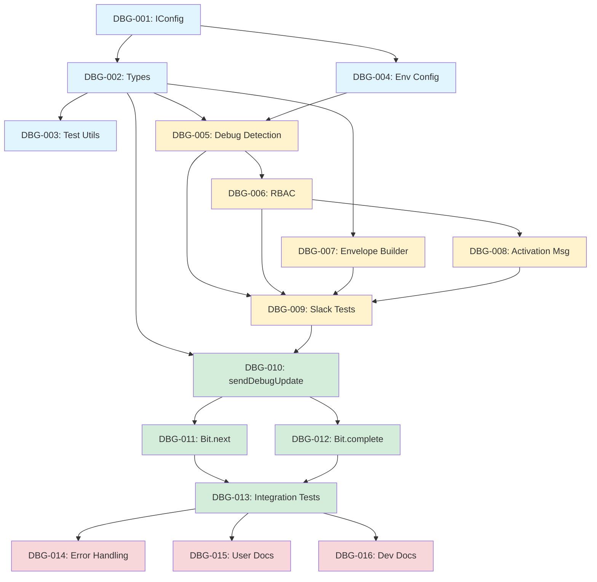

# Sprint 371: Debug Mode - Execution Plan

**Sprint ID:** sprint-371
**Status:** Planning Phase
**Created:** 2026-07-28
**Lead Implementor:** Agent
**Estimated Duration:** 5-7 days

---

## Executive Summary

This execution plan breaks down the Debug Mode implementation into **4 phases** with **16 trackable tasks**. The plan prioritizes getting a working prototype (Phase 1) before investing in polish and extensibility (Phases 2-4).

**Critical Path:** Configuration → Type Definitions → Slack Connector → Base Server → Testing

**Risk Areas:**
1. Base server changes (`Bit.next()`, `Bit.complete()`) - high-traffic code paths
2. Egress feedback mechanism - new pattern not yet validated
3. Test coverage for real-time feedback loops

---

## Phase 1: Foundation (P0 - Must Have)

**Goal:** Establish type definitions, configuration, and test infrastructure

**Duration:** 1-2 days

**Tasks:**
- DBG-001: Add debug configuration to IConfig interface
- DBG-002: Define debug event metadata types
- DBG-003: Create debug test utilities and fixtures
- DBG-004: Update environment configuration files

**Why First:**
- Zero dependencies on existing code
- Unblocks all downstream work
- Validates configuration pattern early

---

## Phase 2: Slack Connector Integration (P0 - Must Have)

**Goal:** Implement debug detection and feedback in Slack connector

**Duration:** 2-3 days

**Tasks:**
- DBG-005: Implement debug detection in SlackIngressClient
- DBG-006: Add RBAC authorization check at ingress
- DBG-007: Update Slack envelope builder for debug metadata
- DBG-008: Implement activation confirmation message
- DBG-009: Unit tests for Slack debug detection and RBAC

**Why Second:**
- Self-contained (no base server changes yet)
- Can be tested independently
- Validates user experience early

**Deliverable:** Users can send `!debug` command and receive activation confirmation

---

## Phase 3: Base Server Debug Flow (P0 - Must Have)

**Goal:** Implement real-time progress updates in event routing

**Duration:** 2-3 days

**Tasks:**
- DBG-010: Implement sendDebugUpdate helper in Bit base class
- DBG-011: Add debug progress logging to Bit.next()
- DBG-012: Add debug completion summary to Bit.complete()
- DBG-013: Integration tests for end-to-end debug flow

**Why Third:**
- Depends on Slack connector (Phase 2)
- Core value proposition (real-time feedback)
- Most complex integration point

**Deliverable:** Debug events show progress updates at each stage transition

---

## Phase 4: Polish & Documentation (P1 - Should Have)

**Goal:** Production readiness, error handling, documentation

**Duration:** 1-2 days

**Tasks:**
- DBG-014: Add error handling and graceful degradation
- DBG-015: Write user documentation (setup guide, RBAC)
- DBG-016: Write developer documentation (adding debug to new connector)

**Why Last:**
- Can be deferred if sprint runs long
- Quality improvements, not core functionality
- Documentation can iterate based on feedback

**Deliverable:** Production-ready debug mode with comprehensive docs

---

## Task Dependencies

---

## Implementation Order & Rationale

### 1. Configuration First (DBG-001, DBG-004)
**Why:** Establish the contract for how debug mode is configured. Enables parallel work on types and connector.

**Validation:** Can we load debug user lists from environment variables?

---

### 2. Types & Test Utils (DBG-002, DBG-003)
**Why:** Type definitions drive implementation. Test utilities enable TDD.

**Validation:** Can we write a test that creates a debug event and validates metadata?

---

### 3. Slack Detection & RBAC (DBG-005, DBG-006)
**Why:** Validates user experience early. Self-contained (no base server changes).

**Validation:** Can authorized users trigger debug mode? Are unauthorized users rejected?

---

### 4. Envelope Builder (DBG-007)
**Why:** Bridges connector detection and base server consumption.

**Validation:** Does debug metadata propagate through envelope creation?

---

### 5. Activation Message (DBG-008)
**Why:** Immediate user feedback. Proves egress path works.

**Validation:** Do users receive "Debug mode ON" confirmation?

---

### 6. Slack Tests (DBG-009)
**Why:** Lock in connector behavior before moving to base server.

**Validation:** 100% test coverage for debug detection, RBAC, envelope building.

---

### 7. Base Server Helper (DBG-010)
**Why:** Reusable feedback mechanism for `next()` and `complete()`.

**Validation:** Can we send a debug update via egress topic?

---

### 8. Progress Updates (DBG-011)
**Why:** Core value proposition. Real-time stage transition feedback.

**Validation:** Do users receive progress updates at each `next()` call?

---

### 9. Completion Summary (DBG-012)
**Why:** Provides closure and summary metrics.

**Validation:** Do users receive final summary with duration and stages?

---

### 10. Integration Tests (DBG-013)
**Why:** Validates end-to-end flow across multiple services.

**Validation:** Can we trace a debug event from ingress → auth → llm-bot → egress?

---

### 11. Error Handling (DBG-014)
**Why:** Production readiness. Graceful degradation if egress fails.

**Validation:** Does debug mode degrade gracefully? Are errors logged?

---

### 12. Documentation (DBG-015, DBG-016)
**Why:** Enables adoption by operators and future connector developers.

**Validation:** Can a new developer enable debug mode following docs?

---

## Risk Mitigation

### Risk 1: Base Server Performance Impact

**Risk:** Debug logic in `Bit.next()` adds latency to all events.

**Mitigation:**
- Early-exit if `qos.tracer !== true` (< 1ms overhead)
- Async debug update (fire-and-forget, no blocking)
- Measure latency in integration tests (assertion: <5ms overhead)

**Owner:** DBG-011

---

### Risk 2: Egress Feedback Loops

**Risk:** Debug updates create new egress events, potentially causing infinite loops.

**Mitigation:**
- Debug feedback events have `qos.tracer = false` (no recursion)
- Separate correlation IDs (`debug-${uuid}` prefix)
- Integration test validates no feedback loops

**Owner:** DBG-010

---

### Risk 3: RBAC Bypass

**Risk:** User could bypass RBAC by manipulating platform metadata.

**Mitigation:**
- RBAC check uses platform-provided user ID (trusted source)
- Audit logging for all debug activations (authorized + unauthorized)
- Test unauthorized access explicitly (DBG-009)

**Owner:** DBG-006

---

### Risk 4: Sensitive Data Exposure

**Risk:** Debug messages could leak auth tokens, API keys, etc.

**Mitigation:**
- Document redaction requirements (phase 4)
- Future: Auto-redact `event.identity.auth`, `event.metadata.secrets`
- Defer to future sprint if time-constrained

**Owner:** DBG-014 (deferred to P1)

---

## Testing Strategy

### Unit Tests
- **Scope:** Individual functions (detection, RBAC, formatting)
- **Location:** `src/services/ingress/slack/*.test.ts`, `src/common/base-server.test.ts`
- **Coverage Target:** 90%+ for debug-related code

### Integration Tests
- **Scope:** End-to-end debug flow (ingress → base server → egress)
- **Location:** `src/apps/ingress-egress-service.test.ts`
- **Scenarios:**
  - Authorized user receives all updates
  - Unauthorized user receives no updates
  - Debug event completes successfully
  - Debug event fails (DLQ) - deferred to future sprint

### Manual Testing
- **Environment:** Local development (Docker Compose)
- **Platform:** Slack Socket Mode
- **Checklist:**
  - [ ] Send `!debug @bot test` as authorized user → receive confirmation
  - [ ] Send `!debug @bot test` as unauthorized user → no response
  - [ ] Observe progress updates in Slack channel
  - [ ] Verify completion summary includes duration and stages

---

## Rollback Plan

### If Debug Mode Breaks Production

**Scenario:** Debug logic causes crashes or performance degradation.

**Rollback Steps:**
1. Set `DEBUG_USERS_SLACK=""` in environment (disables feature)
2. Restart `ingress-egress` service (no code changes needed)
3. Verify non-debug events flow normally

**Prevention:**
- Feature flag: `DEBUG_ENABLED` (default: true)
- Kill switch: Empty `DEBUG_USERS_*` disables all debug RBAC

---

## Success Criteria

### Functional
- [ ] Authorized Slack users can activate debug mode via `!debug` prefix
- [ ] Unauthorized users receive no debug feedback (silent ignore)
- [ ] Debug events show progress at each stage transition (auth, llm-bot, egress)
- [ ] Completion summary includes duration, stages, final status
- [ ] Debug mode works end-to-end in local environment

### Non-Functional
- [ ] Debug feedback arrives within 500ms of stage transition
- [ ] Non-debug events have <5ms latency overhead
- [ ] Unit test coverage ≥90% for debug code
- [ ] Integration tests validate end-to-end flow
- [ ] Documentation enables self-service setup

### Quality
- [ ] No regressions in existing Slack connector tests
- [ ] No regressions in existing base server tests
- [ ] Linting and TypeScript compilation pass
- [ ] Code review approval from 1+ team member

---

## Out of Scope (Future Sprints)

### Deferred to Sprint 372+
- [ ] DLQ notifications (when event goes to dead letter queue)
- [ ] Retry notifications (when step retries due to failure)
- [ ] Error detail enrichment (include stack traces in debug feedback)
- [ ] Stage-level metrics (aggregate timing per stage)
- [ ] Sensitive data redaction (auto-redact auth tokens, secrets)

### Deferred to Sprint 373+
- [ ] Multi-platform support (Twitch, Discord, Twilio)
- [ ] Connector interface standardization (`DebugCapableConnector`)
- [ ] BaseDebugConnector abstract class
- [ ] Compliance test suite for all connectors

---

## Timeline

### Day 1: Foundation
- [ ] DBG-001: IConfig extension (1h)
- [ ] DBG-002: Type definitions (2h)
- [ ] DBG-003: Test utilities (2h)
- [ ] DBG-004: Environment config (1h)

### Day 2-3: Slack Connector
- [ ] DBG-005: Debug detection (3h)
- [ ] DBG-006: RBAC check (2h)
- [ ] DBG-007: Envelope builder (2h)
- [ ] DBG-008: Activation message (2h)
- [ ] DBG-009: Unit tests (4h)

### Day 4-5: Base Server
- [ ] DBG-010: sendDebugUpdate helper (3h)
- [ ] DBG-011: Bit.next() integration (3h)
- [ ] DBG-012: Bit.complete() integration (2h)
- [ ] DBG-013: Integration tests (4h)

### Day 6-7: Polish
- [ ] DBG-014: Error handling (3h)
- [ ] DBG-015: User docs (3h)
- [ ] DBG-016: Dev docs (2h)

**Total Estimated Effort:** 40-45 hours
**Sprint Duration:** 5-7 days (assuming 6-8 hours/day)

---

## Sign-Off Checklist

Before marking sprint complete:

- [ ] All P0 tasks (DBG-001 through DBG-013) completed
- [ ] Integration tests pass in local environment
- [ ] Manual testing checklist completed
- [ ] Code review approved
- [ ] Documentation merged (P1 tasks)
- [ ] Validate deliverable script passes
- [ ] Staging deployment successful (if applicable)

---

**End of Execution Plan**
