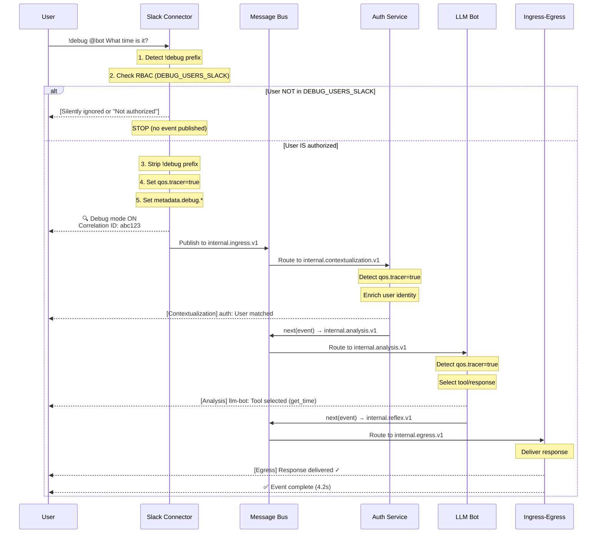

# Debug Mode: Real-Time Event Tracing for Privileged Users

> **NOTE:** This document describes the implementation plan for Sprint 371.
> For the **standardized connector architecture** approach (future-facing), see [connector-debug-interface.md](./connector-debug-interface.md).

## 1. Executive Summary

**Problem:** Platform operators need real-time visibility into event processing for debugging, without relying on aggregated logs or external tracing tools.

**Solution:** Implement a `!debug` command prefix that enables privileged users to receive real-time updates as events progress through the 5-stage agent flow, including routing transitions, retries, DLQ deliveries, and final completion.

**Scope:** Slack integration (Sprint 348 framework) initially; extensible to other Ingress/Egress Framework connectors.

**Key Constraint:** RBAC must be enforced at ingress **before** auth service enrichment to enable debugging of the entire flow including auth failures.

---

## 2. Core Concepts

### 2.1. Debug Mode Activation

**User Experience:**

```
User: !debug @bitbrat_the_ai What time is it?

Bot: 🔍 Debug mode ON
     Correlation ID: 7f3a1b2c-9d4e-5f6a-7b8c-9d0e1f2a3b4c
     Watching event flow...

Bot: [Stage: Contextualization] auth: User matched (user_123, roles: [admin, debug])
Bot: [Stage: Contextualization] query-analyzer: Intent detected (time_query)
Bot: [Stage: Analysis] llm-bot: Tool selected (get_current_time)
Bot: [Stage: Reaction] Tool executed: {"time": "2026-07-28T10:15:00Z"}
Bot: [Egress] Response delivered ✓

Bot: ✅ Event complete (4.2s)
     Final status: FINALIZED
     Stages: Attention → Contextualization → Analysis → Reaction → Introspection
```

**Debug Command Format:**

```
!debug <original_message>
```

- **Prefix:** `!debug` (case-insensitive)
- **Stripping:** Prefix removed before envelope creation
- **Flag:** `event.qos.tracer = true` set to enable platform-wide debug behavior

---

### 2.2. Debug User Authorization

**RBAC Enforcement Location:** Ingress connectors (before InternalEventV2 envelope creation)

**Why Ingress?**
1. **Full flow visibility:** Debug mode must observe auth service enrichment itself
2. **Early rejection:** Prevent unauthorized debug events from entering the message bus
3. **Connector-specific:** Each platform has different user identity resolution (Slack User ID, Twitch username, Discord snowflake)

**Authorization Check:**

```typescript
// In connector (e.g., SlackIngressClient)
const debugAllowedUsers = config.debugUsers || []; // From environment
const isDebugAllowed = debugAllowedUsers.includes(platformUserId);

if (isDebugRequest && !isDebugAllowed) {
  // Silently ignore (strip !debug prefix, treat as normal message)
  // OR send ephemeral "Not authorized" message (Slack-specific)
  logger.warn('debug.unauthorized', { platformUserId, channel });
  return;
}
```

**Configuration:**

```yaml
# env/local/global.yaml
DEBUG_USERS_SLACK: "U0123456789,U9876543210"  # Comma-separated Slack User IDs
DEBUG_USERS_TWITCH: "christophernavta,admin_user"  # Comma-separated Twitch usernames

# architecture.yaml (service-level)
services:
  ingress-egress:
    env:
      DEBUG_USERS_SLACK
      DEBUG_USERS_TWITCH
```

---

### 2.3. Debug Event Metadata

**QoS Tracer Flag:**

```typescript
interface QOSV1 {
  persistenceTtlSec?: number;
  tracer?: boolean;  // ← Debug mode indicator
  maxResponseMs?: number;
}
```

**When `tracer: true`:**
- **Persistence:** High-verbosity event snapshots captured at every stage transition
- **Logging:** Debug-level logs emitted with full event payload
- **Real-time feedback:** Progress updates sent to user via egress channel

**InternalEventV2 Extension:**

```typescript
interface InternalEventV2 {
  // ... existing fields
  qos?: QOSV1;
  metadata?: {
    debug?: {
      enabled: true;
      initiatedBy: string;  // Platform user ID
      feedbackChannel: string;  // Channel/DM for debug messages
      startedAt: string;  // ISO timestamp
    };
    [key: string]: any;
  };
}
```

---

## 3. Architecture Components

### 3.1. Component Responsibilities

| Component | Responsibility | Changes Required |
|-----------|----------------|------------------|
| **Ingress Connector** (e.g., `SlackIngressClient`) | 1. Detect `!debug` prefix<br>2. Enforce RBAC (check `DEBUG_USERS_*`)<br>3. Strip prefix<br>4. Set `qos.tracer = true`<br>5. Set `metadata.debug.*`<br>6. Send initial "Debug ON" confirmation | **Modify:** `handleMessage()` in platform-specific clients |
| **Envelope Builder** (e.g., `buildSlackEnvelope`) | Pass through `qos` and `metadata.debug` from caller | **Modify:** Accept optional `debugMetadata` parameter |
| **Base Server (`Bit.next()`)** | 1. Detect `qos.tracer = true`<br>2. Emit debug log before publish<br>3. Send progress update to `metadata.debug.feedbackChannel` | **Modify:** `src/common/base-server.ts:858` |
| **Base Server (`Bit.complete()`)** | Send final "Event complete" summary | **Modify:** `src/common/base-server.ts:976` |
| **Persistence Service** | Capture high-verbosity snapshots when `qos.tracer = true` | **Modify:** Snapshot capture logic |
| **Dead Letter Handler** | Send DLQ notification to debug feedback channel | **New:** DLQ debug notification |

---

### 3.2. Event Flow with Debug Mode



---

## 4. Implementation Details

### 4.1. Ingress Connector Changes

**File:** `src/services/ingress/slack/slack-ingress-client.ts:218` (`handleMessage`)

**Before:**

```typescript
private async handleMessage(body: any): Promise<void> {
  // ... existing filter logic

  const envelope = buildSlackEnvelope({
    type: actualEvent.type,
    user: actualEvent.user,
    channel: actualEvent.channel,
    text: actualEvent.text,
    ts: actualEvent.ts,
    thread_ts: actualEvent.thread_ts,
    team: actualEvent.team || body?.team_id,
    event_ts: actualEvent.event_ts,
  });

  await this.publisher.publish(envelope);
  this.counters.published++;
}
```

**After:**

```typescript
private async handleMessage(body: any): Promise<void> {
  // ... existing filter logic

  const text = actualEvent.text || '';
  const userId = actualEvent.user;
  const channel = actualEvent.channel;

  // Debug mode detection
  const debugMatch = /^!debug\s+/i.exec(text);
  const isDebugRequest = !!debugMatch;
  let strippedText = text;
  let debugMetadata: any = undefined;

  if (isDebugRequest) {
    // RBAC check (before envelope creation)
    const debugUsers = (this.config?.debugUsersSlack || '').split(',').map(u => u.trim()).filter(Boolean);
    const isAuthorized = debugUsers.includes(userId);

    if (!isAuthorized) {
      logger.warn('slack.debug.unauthorized', { userId, channel });
      // Option 1: Silent ignore (strip prefix, process as normal)
      strippedText = text.replace(/^!debug\s+/i, '');
      // Option 2: Send ephemeral "Not authorized" (requires WebClient)
      // await this.webClient.chat.postEphemeral({ channel, user: userId, text: '⚠️ Debug mode requires authorization' });
      // return;
    } else {
      // Strip prefix and enable debug mode
      strippedText = text.replace(/^!debug\s+/i, '');
      const correlationId = randomUUID();

      debugMetadata = {
        enabled: true,
        initiatedBy: userId,
        feedbackChannel: channel,
        startedAt: new Date().toISOString(),
      };

      // Send initial confirmation
      logger.info('slack.debug.activated', { userId, channel, correlationId });
      await this.webClient.chat.postMessage({
        channel,
        text: `🔍 *Debug mode ON*\nCorrelation ID: \`${correlationId}\`\nWatching event flow...`,
      });
    }
  }

  const envelope = buildSlackEnvelope({
    type: actualEvent.type,
    user: actualEvent.user,
    channel: actualEvent.channel,
    text: strippedText,  // ← Stripped text
    ts: actualEvent.ts,
    thread_ts: actualEvent.thread_ts,
    team: actualEvent.team || body?.team_id,
    event_ts: actualEvent.event_ts,
  }, { debugMetadata });  // ← Pass debug metadata

  await this.publisher.publish(envelope);
  this.counters.published++;
}
```

---

### 4.2. Envelope Builder Changes

**File:** `src/services/ingress/slack/envelope-builder.ts:55`

**Before:**

```typescript
export function buildSlackEnvelope(
  event: SlackEventMeta,
  opts?: {
    uuid?: () => string;
    nowIso?: () => string;
  }
): InternalEventV2 {
  // ... existing implementation

  return {
    v: '2',
    type: 'chat.message.v1',
    correlationId,
    // ... rest of envelope
    routing: {
      stage: 'initial',
      slip: [],
      history: [],
    }
  };
}
```

**After:**

```typescript
export function buildSlackEnvelope(
  event: SlackEventMeta,
  opts?: {
    uuid?: () => string;
    nowIso?: () => string;
    debugMetadata?: {
      enabled: true;
      initiatedBy: string;
      feedbackChannel: string;
      startedAt: string;
    };
  }
): InternalEventV2 {
  // ... existing implementation

  const debugEnabled = !!opts?.debugMetadata;

  return {
    v: '2',
    type: 'chat.message.v1',
    correlationId,
    // ... rest of envelope
    qos: debugEnabled ? { tracer: true } : undefined,
    metadata: debugEnabled ? { debug: opts.debugMetadata } : undefined,
    routing: {
      stage: 'initial',
      slip: [],
      history: [],
    }
  };
}
```

---

### 4.3. Base Server `next()` Changes

**File:** `src/common/base-server.ts:858`

**Before:**

```typescript
protected async next(event: InternalEventV2, stepStatus?: RoutingStatus): Promise<void> {
  // ... existing idempotency check

  // Find next pending step or fall back to egress
  const nextStep = event.routing.slip.find(s => s.status === 'PENDING');
  const topic = nextStep?.nextTopic || event.egress?.destination || INTERNAL_EGRESS_V1;

  // Publish
  await publisher.publishJson(event, busAttrsFromEvent(event));

  // Log and capture snapshot
  logger.info('routing.next', { correlationId, topic, stepId });
  await publishPersistenceSnapshot(...);
}
```

**After:**

```typescript
protected async next(event: InternalEventV2, stepStatus?: RoutingStatus): Promise<void> {
  // ... existing idempotency check

  const isDebugMode = event.qos?.tracer === true;
  const debugChannel = event.metadata?.debug?.feedbackChannel;

  // Find next pending step or fall back to egress
  const nextStep = event.routing.slip.find(s => s.status === 'PENDING');
  const topic = nextStep?.nextTopic || event.egress?.destination || INTERNAL_EGRESS_V1;

  // Debug: Send progress update BEFORE publish
  if (isDebugMode && debugChannel) {
    try {
      const currentStepId = this.getCurrentStepId?.(event) || 'unknown';
      const stage = event.routing.stage;
      const nextStepId = nextStep?.id || 'egress';

      await this.sendDebugUpdate(debugChannel, event.egress.connector, {
        type: 'progress',
        correlationId: event.correlationId,
        message: `[Stage: ${stage}] ${currentStepId}: Processing → ${nextStepId}`,
        metadata: {
          currentStep: currentStepId,
          nextStep: nextStepId,
          stage,
          topic,
        }
      });
    } catch (err: any) {
      logger.warn('debug.feedback.failed', { error: err.message, correlationId: event.correlationId });
    }
  }

  // Publish
  await publisher.publishJson(event, busAttrsFromEvent(event));

  // Log and capture snapshot
  logger.info('routing.next', { correlationId, topic, stepId });
  await publishPersistenceSnapshot(...);
}
```

---

### 4.4. Debug Feedback Helper

**File:** `src/common/base-server.ts` (new protected method)

```typescript
/**
 * Send debug feedback message to user via egress connector.
 *
 * Requires connectorManager to be accessible (e.g., via resource or singleton).
 * For now, we'll use a simple message bus publish to the egress topic.
 */
protected async sendDebugUpdate(
  channel: string,
  connector: ConnectorType,
  update: {
    type: 'progress' | 'error' | 'complete';
    correlationId: string;
    message: string;
    metadata?: Record<string, any>;
  }
): Promise<void> {
  // Create a minimal egress event to deliver debug feedback
  const debugEvent: InternalEventV2 = {
    v: '2',
    type: 'egress.deliver.v1',
    correlationId: `debug-${randomUUID()}`,
    ingress: {
      ingressAt: new Date().toISOString(),
      source: 'debug.feedback',
      connector: 'system',
    },
    identity: {
      external: {
        id: 'system',
        platform: 'debug',
      }
    },
    egress: {
      destination: '', // Will be routed to connector's egress topic
      connector,
      channel,
      type: 'chat',
    },
    candidates: [{
      id: randomUUID(),
      kind: 'text',
      source: 'debug.feedback',
      createdAt: new Date().toISOString(),
      status: 'selected',
      priority: 0,
      text: update.message,
      format: 'plain',
    }],
    routing: {
      stage: 'response',
      slip: [],
      history: [],
    },
  };

  // Publish directly to egress topic (bypasses routing slip)
  const publisher = this.getResource<PublisherResource>('publisher');
  if (publisher) {
    const egressPublisher = publisher.create(INTERNAL_EGRESS_V1);
    await egressPublisher.publishJson(debugEvent, {
      correlationId: debugEvent.correlationId,
      type: 'egress.deliver.v1',
    });
  } else {
    logger.warn('debug.feedback.no_publisher', { correlationId: update.correlationId });
  }
}
```

---

### 4.5. Complete Event Summary

**File:** `src/common/base-server.ts:976` (`complete()` method)

**After:**

```typescript
protected async complete(event: InternalEventV2, stepStatus?: RoutingStatus): Promise<void> {
  // ... existing idempotency check

  const isDebugMode = event.qos?.tracer === true;
  const debugChannel = event.metadata?.debug?.feedbackChannel;
  const startedAt = event.metadata?.debug?.startedAt;

  // Publish to egress
  await publisher.publishJson(event, busAttrsFromEvent(event));

  // Debug: Send completion summary
  if (isDebugMode && debugChannel && startedAt) {
    try {
      const duration = ((Date.now() - new Date(startedAt).getTime()) / 1000).toFixed(1);
      const stages = [...new Set(event.routing.history.map(h => h.stage || 'unknown'))].join(' → ');
      const finalStatus = event.routing.history[event.routing.history.length - 1]?.status || 'UNKNOWN';

      await this.sendDebugUpdate(debugChannel, event.egress.connector, {
        type: 'complete',
        correlationId: event.correlationId,
        message: `✅ *Event complete* (${duration}s)\nFinal status: ${finalStatus}\nStages: ${stages}`,
        metadata: {
          duration,
          stages,
          finalStatus,
        }
      });
    } catch (err: any) {
      logger.warn('debug.complete.feedback.failed', { error: err.message, correlationId: event.correlationId });
    }
  }

  // ... existing snapshot capture
}
```

---

## 5. Configuration

### 5.1. Environment Variables

```yaml
# env/local/global.yaml
DEBUG_USERS_SLACK: "U0123ABCDEF,U9876ZYXWVU"
DEBUG_USERS_TWITCH: "christophernavta,admin_user"
DEBUG_USERS_DISCORD: "123456789012345678,987654321098765432"

# Optional: Enable auto-snapshot for debug events
DEBUG_PERSISTENCE_ENABLED: "true"  # Default: true
DEBUG_SNAPSHOT_INTERVAL: "every-step"  # every-step | every-stage | final-only
```

### 5.2. Service Configuration

```yaml
# architecture.yaml
services:
  ingress-egress:
    env:
      DEBUG_USERS_SLACK
      DEBUG_USERS_TWITCH
      DEBUG_USERS_DISCORD
```

### 5.3. IConfig Extension

```typescript
// src/types/config.ts
export interface IConfig {
  // ... existing fields

  /** Slack user IDs authorized for debug mode (comma-separated) */
  debugUsersSlack?: string;

  /** Twitch usernames authorized for debug mode (comma-separated) */
  debugUsersTwitch?: string;

  /** Discord user IDs authorized for debug mode (comma-separated) */
  debugUsersDiscord?: string;

  /** Enable automatic persistence snapshots for debug events */
  debugPersistenceEnabled?: boolean;

  /** Debug snapshot capture frequency */
  debugSnapshotInterval?: 'every-step' | 'every-stage' | 'final-only';
}
```

---

## 6. Security Considerations

### 6.1. RBAC Enforcement

**Why Ingress-Level Authorization?**

1. **Full flow visibility:** Debug mode must observe auth service enrichment failures
2. **Attack surface:** Prevent unauthorized users from flooding debug channels
3. **Platform-specific:** User identity resolution happens at ingress (Slack User ID, Twitch username, etc.)

**Authorization Flow:**

```
1. User sends: !debug @bot test
2. Ingress connector extracts platform user ID (e.g., Slack User ID)
3. Check: userId IN DEBUG_USERS_SLACK?
4. If NO → Strip prefix, process as normal message (or send ephemeral "Not authorized")
5. If YES → Enable debug mode, send confirmation
```

### 6.2. Sensitive Data Exposure

**Risk:** Debug mode may expose sensitive user data, API keys, or internal state.

**Mitigations:**

1. **Redaction:** Automatically redact `event.identity.auth`, `event.metadata.secrets`, etc.
2. **Channel restrictions:** Debug feedback only sent to authorized channels (no public channels)
3. **Audit logging:** All debug mode activations logged with `userId`, `channel`, `correlationId`
4. **Rate limiting:** Prevent debug mode spam (e.g., max 10 debug events per user per minute)

**Implementation:**

```typescript
// In sendDebugUpdate()
function redactSensitiveFields(event: InternalEventV2): Partial<InternalEventV2> {
  return {
    correlationId: event.correlationId,
    type: event.type,
    routing: event.routing,
    // EXCLUDE: identity.auth, metadata.secrets, etc.
  };
}
```

---

## 7. Testing Strategy

### 7.1. Unit Tests

**File:** `src/services/ingress/slack/slack-ingress-client.test.ts`

```typescript
describe('SlackIngressClient - Debug Mode', () => {
  it('should detect !debug prefix and enable tracer', async () => {
    const event = { type: 'message', user: 'U123', channel: 'C456', text: '!debug test' };
    const envelope = await client.handleMessage({ event });
    expect(envelope.qos?.tracer).toBe(true);
    expect(envelope.message?.text).toBe('test'); // Prefix stripped
  });

  it('should enforce RBAC for unauthorized users', async () => {
    config.debugUsersSlack = 'U999'; // Only U999 authorized
    const event = { type: 'message', user: 'U123', channel: 'C456', text: '!debug test' };
    const envelope = await client.handleMessage({ event });
    expect(envelope.qos?.tracer).toBeUndefined(); // Debug mode NOT enabled
  });

  it('should send initial debug confirmation', async () => {
    config.debugUsersSlack = 'U123';
    const event = { type: 'message', user: 'U123', channel: 'C456', text: '!debug test' };
    await client.handleMessage({ event });
    expect(webClient.chat.postMessage).toHaveBeenCalledWith({
      channel: 'C456',
      text: expect.stringContaining('Debug mode ON'),
    });
  });
});
```

### 7.2. Integration Tests

**File:** `src/apps/ingress-egress-service.test.ts`

```typescript
describe('Debug Mode - End-to-End', () => {
  it('should send progress updates at each stage transition', async () => {
    // 1. Publish debug event to internal.ingress.v1
    // 2. Subscribe to egress topic for debug feedback messages
    // 3. Assert progress updates received:
    //    - [Contextualization] auth: ...
    //    - [Analysis] llm-bot: ...
    //    - [Reaction] Tool executed: ...
    //    - ✅ Event complete
  });

  it('should send DLQ notification when event fails', async () => {
    // 1. Publish debug event that will fail (e.g., invalid routing slip)
    // 2. Assert DLQ notification received with error details
  });
});
```

### 7.3. Manual Testing

**Local Development:**

```bash
# 1. Configure debug user
echo 'DEBUG_USERS_SLACK=U0123ABCDEF' >> env/local/global.yaml

# 2. Start local stack
npm run local

# 3. Send debug command via Slack
#    !debug @bitbrat_the_ai What time is it?

# 4. Observe real-time feedback in Slack channel
```

**Staging:**

```bash
# 1. Configure staging debug users
brat config set DEBUG_USERS_SLACK "U0123ABCDEF,U9876ZYXWVU" --context staging

# 2. Deploy ingress-egress service
brat deploy service ingress-egress --context staging

# 3. Test via Slack workspace
```

---

## 8. Future: Connector-Based Architecture

### 8.1. Vision

The implementation described in this document (sections 4-7) is **tactical**: it gets debug mode working for Slack in Sprint 371 with minimal changes.

The **strategic** direction is to make debug mode a **first-class connector capability** with standardized interfaces. See [connector-debug-interface.md](./connector-debug-interface.md) for the full specification.

### 8.2. Key Differences

**Sprint 371 (This Document):**
- Debug logic embedded in `SlackIngressClient.handleMessage()`
- Base server sends debug updates via generic egress events
- Platform-specific formatting hardcoded in connector

**Future (Connector Interface):**
- `DebugCapableConnector` interface with standard hooks:
  - `detectDebugRequest(text, platformMeta): DebugRequest | null`
  - `authorizeDebugUser(userId): Promise<DebugAuthResult>`
  - `sendDebugUpdate(update: DebugUpdate, channel): Promise<void>`
  - `formatDebugUpdate(update): string | object`
- `BaseDebugConnector` abstract class provides 80% of logic
- Compliance test suite ensures all connectors behave consistently
- New platforms get debug support with <100 lines of code

### 8.3. Migration Path

**Sprint 371 → 372:** Extract Slack debug logic into `SlackDebugMixin extends BaseDebugConnector`

**Sprint 372 → 373:** Update base server to use `connector.sendDebugUpdate()` instead of generic egress

**Sprint 373+:** Migrate Twitch, Discord, Twilio to new interface

---

## 9. Rollout Plan

### Phase 1: Core Implementation (Sprint 371)

- [ ] **Ingress changes:** Detect `!debug`, enforce RBAC, strip prefix, set `qos.tracer`
- [ ] **Envelope builder:** Pass `debugMetadata` through
- [ ] **Base server `next()`:** Send progress updates
- [ ] **Base server `complete()`:** Send completion summary
- [ ] **IConfig extension:** Add `debugUsers*` fields
- [ ] **Unit tests:** Slack connector debug mode
- [ ] **Integration tests:** End-to-end debug flow
- [ ] **Documentation:** User guide, RBAC setup

**Deliverable:** Debug mode working for Slack integration (Socket Mode only)

### Phase 2: Extended Visibility (Sprint 372)

- [ ] **DLQ notifications:** Send debug update when event goes to DLQ
- [ ] **Retry notifications:** Send debug update on step retry
- [ ] **Error details:** Include error message/code in debug feedback
- [ ] **Stage summaries:** Aggregate stage-level metrics (e.g., "Contextualization: 3 services, 180ms")

### Phase 3: Multi-Platform Support (Sprint 373+)

- [ ] **Twitch:** Add debug mode support to `TwitchIrcClient`
- [ ] **Discord:** Add debug mode support to `DiscordIngressClient`
- [ ] **Twilio:** Add debug mode support to `TwilioIngressClient`
- [ ] **Generic webhook:** Add debug mode support to webhook handlers

---

## 9. Alternative Approaches Considered

### 9.1. Centralized Debug Service

**Approach:** Create a dedicated `debug-service` that subscribes to all topics and emits debug feedback.

**Pros:**
- Separation of concerns (debug logic isolated)
- Easier to disable/enable without modifying core services

**Cons:**
- Requires all topics to be multi-subscriber (not feasible with NATS queue groups)
- Additional latency (debug service is always "late" to the event)
- Cannot observe events that fail before routing (e.g., auth failures)

**Decision:** Rejected in favor of inline debug logic in `Bit.next()`.

---

### 9.2. External Tracing (OpenTelemetry)

**Approach:** Use existing OpenTelemetry tracing infrastructure for debug visibility.

**Pros:**
- Standard observability tooling
- No custom debug implementation needed

**Cons:**
- Requires external tools (Jaeger, Zipkin, etc.)
- Not real-time for end users (operators only)
- Doesn't provide user-facing feedback (debug messages in chat)

**Decision:** Complementary, not a replacement. Debug mode provides real-time user feedback; OpenTelemetry provides deep operator analysis.

---

### 9.3. RBAC via Auth Service

**Approach:** Rely on auth service to check `debug` role instead of ingress-level RBAC.

**Pros:**
- Centralized RBAC (auth service already has user roles)
- Consistent with other permission checks

**Cons:**
- Cannot debug auth service failures (chicken-and-egg problem)
- Auth service runs AFTER ingress, so unauthorized debug events would enter the message bus
- Increases attack surface (malicious users could flood debug topics)

**Decision:** Rejected. RBAC must happen at ingress for full flow visibility.

---

## 10. Open Questions

### 10.1. Debug Feedback Format

**Question:** Should debug messages be plain text, structured JSON, or rich Slack blocks?

**Options:**
1. **Plain text:** Simple, works everywhere
2. **Structured JSON:** Machine-parseable, but harder to read
3. **Rich formatting:** Slack blocks with buttons, colors, etc.

**Recommendation:** Start with plain text (Phase 1), add rich formatting later (Phase 2).

---

### 10.2. Debug Mode Timeout

**Question:** Should debug mode auto-disable after a timeout (e.g., 30 seconds)?

**Risk:** Long-running events (e.g., multi-step tool executions) may exceed timeout.

**Recommendation:** No timeout in Phase 1. Add optional `DEBUG_TIMEOUT_MS` in Phase 2 if spam becomes an issue.

---

### 10.3. Debug History Persistence

**Question:** Should we persist debug mode activations for audit trails?

**Recommendation:** Yes. Capture:
- `correlationId`
- `userId` (platform-specific)
- `channel`
- `command` (full `!debug ...` text)
- `timestamp`
- `authorized` (true/false)

Store in `debug_sessions` collection (PostgreSQL or Firestore).

---

## 11. Success Criteria

**Functional:**
- [ ] Slack users with `DEBUG_USERS_SLACK` can activate debug mode via `!debug` prefix
- [ ] Unauthorized users receive no debug feedback (silently ignored or ephemeral "Not authorized")
- [ ] Debug events show real-time progress at each stage transition
- [ ] Completion summary includes duration, stages, and final status
- [ ] Debug mode works end-to-end (ingress → auth → llm-bot → egress)

**Non-Functional:**
- [ ] Debug feedback messages arrive within 500ms of stage transition
- [ ] Debug mode does NOT impact non-debug event latency (< 5ms overhead)
- [ ] No sensitive data (auth tokens, API keys) exposed in debug messages
- [ ] Debug mode activations logged for audit trails

**Documentation:**
- [ ] User guide: How to enable debug mode for a platform
- [ ] Operator guide: How to authorize debug users
- [ ] Architecture doc: Debug mode design and implementation

---

## 12. References

### 12.1. Codebase

- `src/services/ingress/slack/slack-ingress-client.ts:218` - Message handler
- `src/services/ingress/slack/envelope-builder.ts:55` - Envelope builder
- `src/common/base-server.ts:858` - `next()` method
- `src/common/base-server.ts:976` - `complete()` method
- `src/types/events.ts:179` - `QOSV1` interface

### 12.2. Documentation

- `documentation/concepts/agent-flow-stages.md` - 5-stage agent flow model
- `documentation/guides/slack-app-setup.md` - Slack integration setup
- `CLAUDE.md` - Ingress/Egress Framework patterns

### 12.3. Related Sprints

- Sprint 348: Slack Integration (Ingress/Egress Framework)
- Sprint 341: 5-Stage Agent Flow Model
- Sprint 107: InternalEventV2 contract
- Sprint 77: Envelope + Routing Slip pattern

---

## Appendix A: Debug Message Examples

### A.1. Success Flow

```
User: !debug @bitbrat_the_ai What's the weather in SF?

Bot: 🔍 Debug mode ON
     Correlation ID: 7f3a1b2c-9d4e-5f6a-7b8c-9d0e1f2a3b4c
     Watching event flow...

Bot: [Contextualization] auth: User matched (user_123, roles: [admin, debug])
Bot: [Contextualization] query-analyzer: Intent detected (weather_query, location: SF)
Bot: [Analysis] llm-bot: Tool selected (get_weather)
Bot: [Reaction] Tool execution started (get_weather, location: SF)
Bot: [Reaction] Tool result: {"temp": 65, "conditions": "Partly cloudy"}
Bot: [Egress] Response delivered ✓

Bot: ✅ Event complete (6.8s)
     Final status: FINALIZED
     Stages: Attention → Contextualization → Analysis → Reaction → Introspection
```

### A.2. Error Flow

```
User: !debug @bitbrat_the_ai Crash test

Bot: 🔍 Debug mode ON
     Correlation ID: abc-123
     Watching event flow...

Bot: [Contextualization] auth: User matched (user_456, roles: [debug])
Bot: [Analysis] llm-bot: Tool selected (crash_test)
Bot: [Reaction] Tool execution failed: TimeoutError (max 5s exceeded)

Bot: ❌ Event failed (5.1s)
     Error: TimeoutError - Tool execution exceeded 5s
     DLQ: internal.deadletter.v1
     Last step: crash_test (Reaction)
```

### A.3. Unauthorized User

```
User: !debug @bitbrat_the_ai test

[No response or ephemeral message visible only to user:]
Bot (ephemeral): ⚠️ Debug mode requires authorization. Contact admin to be added to DEBUG_USERS_SLACK.
```

---

**End of Technical Architecture**
