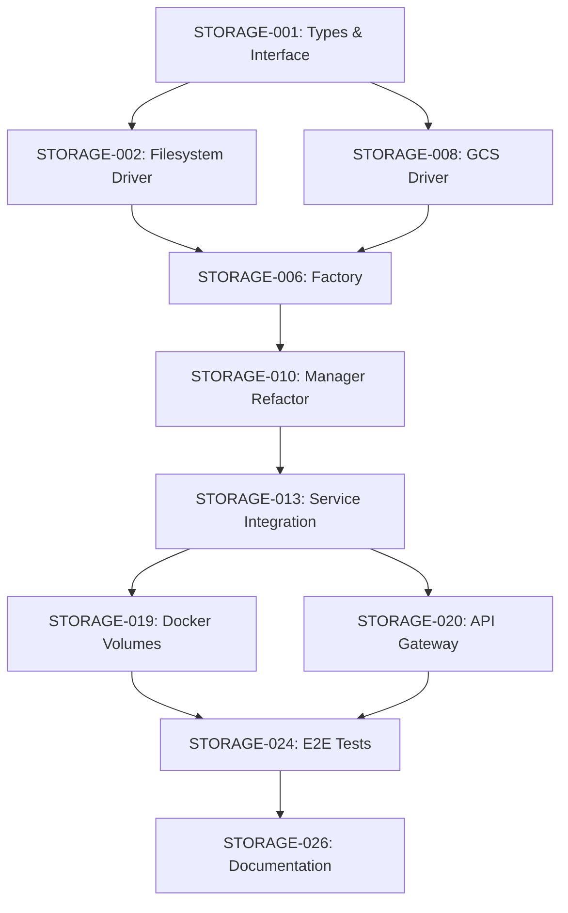

# Sprint 373: Storage Abstraction Layer - Execution Plan

**Sprint Goal**: Introduce configurable storage abstraction making GCP Storage optional, with local filesystem as the platform-agnostic default.

**Lead Implementor**: Claude Code
**Date**: 2026-07-29
**Duration**: 8 working days
**Status**: Implementation Ready

---

## Sprint Overview

### Objectives

1. **Primary**: Create storage driver abstraction (`IStorageDriver` interface)
2. **Primary**: Implement filesystem driver (platform-agnostic default)
3. **Primary**: Implement GCS driver (refactor existing code)
4. **Primary**: Refactor `image-gen-mcp` to use abstraction
5. **Secondary**: Add API gateway static file serving
6. **Secondary**: Create migration documentation

### Success Metrics

- ✅ **Local development works without GCP credentials**
- ✅ **Zero breaking changes for existing GCS deployments**
- ✅ **Filesystem upload < 10ms (vs. GCS ~100-500ms)**
- ✅ **100% unit test coverage for drivers**
- ✅ **All existing tests continue passing**

---

## Phase Breakdown

### Phase 1: Foundation (Days 1-2)
**Goal**: Create storage abstraction layer and filesystem driver

**Deliverables**:
- `src/common/storage/types.ts` - Interface definitions
- `src/common/storage/drivers/filesystem-driver.ts` - Filesystem implementation
- `src/common/storage/drivers/filesystem-driver.test.ts` - Comprehensive tests

**Why First**:
- Establishes interface contract for all drivers
- Filesystem driver is simplest, validates interface design
- No external dependencies (Node.js `fs/promises` only)
- Can test end-to-end locally immediately

**Critical Path**: Yes (all subsequent work depends on interface)

---

### Phase 2: GCS Driver (Day 3)
**Goal**: Refactor existing GCS code into driver pattern

**Deliverables**:
- `src/common/storage/drivers/gcs-driver.ts` - GCS implementation
- `src/common/storage/drivers/gcs-driver.test.ts` - Comprehensive tests

**Why Second**:
- Validates interface works for cloud storage (not just filesystem)
- Reuses existing GCS logic (low risk)
- Ensures backward compatibility from day 1

**Critical Path**: Yes (needed for backward compatibility validation)

---

### Phase 3: Factory & Manager (Day 4)
**Goal**: Create driver selection and resource management

**Deliverables**:
- `src/common/storage/factory.ts` - Driver factory with environment config
- `src/common/storage/factory.test.ts` - Factory tests
- `src/common/resources/storage-manager.ts` - Refactored manager
- `src/common/resources/storage-manager.test.ts` - Manager tests

**Why Third**:
- Both drivers must exist before factory can select between them
- Manager refactor requires factory to be complete

**Critical Path**: Yes (service integration depends on manager)

---

### Phase 4: Service Integration (Days 5-6)
**Goal**: Refactor `image-gen-mcp` to use driver abstraction

**Deliverables**:
- `src/services/image-gen-mcp/index.ts` - Refactored service
- `src/services/image-gen-mcp/index.test.ts` - Updated tests
- Integration tests with both drivers

**Why Fourth**:
- Validates entire abstraction layer works end-to-end
- Removes GCS-specific code from service
- Enables local development without credentials

**Critical Path**: Yes (core deliverable)

---

### Phase 5: Infrastructure (Day 7)
**Goal**: Add Docker volume and API gateway static serving

**Deliverables**:
- Updated Docker Compose configurations
- API gateway `/storage` route
- Environment configuration files

**Why Fifth**:
- Service integration must work before infrastructure changes
- Infrastructure validates complete local development workflow

**Critical Path**: Yes (enables local development)

---

### Phase 6: Documentation & Validation (Day 8)
**Goal**: Complete documentation and migration guides

**Deliverables**:
- `documentation/guides/storage.md` - Storage guide
- Migration guide (GCS → filesystem)
- Updated architecture.yaml examples
- Validation script

**Why Last**:
- All implementation must be complete before documentation
- Validation script tests entire system integration

**Critical Path**: No (polish, not functionality)

---

## Task Dependencies



**Critical Path**: A → B → C → D → E → F → G → H → I (9 days, can parallelize some)

---

## Daily Breakdown

### Day 1: Interface & Types
**Focus**: Establish storage abstraction contract

| Task | Hours | Status |
|------|-------|--------|
| STORAGE-001: Define IStorageDriver interface | 2h | Ready |
| STORAGE-002: Define types (metadata, results) | 1h | Ready |
| STORAGE-003: Add JSDoc documentation | 1h | Ready |
| STORAGE-004: Create types test file | 1h | Ready |

**Deliverable**: `src/common/storage/types.ts` (fully documented interface)

**Validation**: TypeScript compiles, types are exported correctly

---

### Day 2: Filesystem Driver
**Focus**: Implement platform-agnostic default storage

| Task | Hours | Status |
|------|-------|--------|
| STORAGE-005: Implement FilesystemStorageDriver | 3h | Ready |
| STORAGE-006: Add metadata sidecar files | 1h | Ready |
| STORAGE-007: Write comprehensive unit tests | 3h | Ready |

**Deliverable**: `src/common/storage/drivers/filesystem-driver.ts` + tests

**Validation**:
- ✅ All operations (upload/download/delete/exists/list) work
- ✅ Metadata persisted and retrieved correctly
- ✅ Subdirectories created automatically
- ✅ 100% test coverage

---

### Day 3: GCS Driver
**Focus**: Refactor existing GCS code into driver pattern

| Task | Hours | Status |
|------|-------|--------|
| STORAGE-008: Implement GcsStorageDriver | 2h | Ready |
| STORAGE-009: Reuse buildResilientStorageOptions | 1h | Ready |
| STORAGE-010: Add bucket validation | 1h | Ready |
| STORAGE-011: Write comprehensive unit tests | 2h | Ready |

**Deliverable**: `src/common/storage/drivers/gcs-driver.ts` + tests

**Validation**:
- ✅ GCS operations work (with mock GCS client)
- ✅ Backward compatible with existing GCS logic
- ✅ Handles transient errors (retries)
- ✅ 100% test coverage

---

### Day 4: Factory & Manager
**Focus**: Driver selection and resource management

| Task | Hours | Status |
|------|-------|--------|
| STORAGE-012: Implement createStorageDriver factory | 2h | Ready |
| STORAGE-013: Add environment variable parsing | 1h | Ready |
| STORAGE-014: Add backward compatibility (GCS_BUCKET_NAME) | 1h | Ready |
| STORAGE-015: Refactor StorageManager | 2h | Ready |
| STORAGE-016: Write factory tests | 2h | Ready |
| STORAGE-017: Write manager tests | 1h | Ready |

**Deliverable**: `src/common/storage/factory.ts` + `storage-manager.ts` (refactored)

**Validation**:
- ✅ Factory creates correct driver based on env vars
- ✅ Backward compatibility: `GCS_BUCKET_NAME` → GCS driver
- ✅ Default: no env vars → filesystem driver
- ✅ Manager initializes driver on setup
- ✅ Manager shuts down driver correctly

---

### Day 5: Service Integration (Part 1)
**Focus**: Refactor image-gen-mcp upload logic

| Task | Hours | Status |
|------|-------|--------|
| STORAGE-018: Refactor image-gen-mcp upload | 3h | Ready |
| STORAGE-019: Remove GCS-specific code | 1h | Ready |
| STORAGE-020: Update error handling | 1h | Ready |
| STORAGE-021: Update logging | 1h | Ready |

**Deliverable**: `src/services/image-gen-mcp/index.ts` (refactored upload)

**Validation**:
- ✅ No direct GCS imports (`@google-cloud/storage`)
- ✅ Uses `IStorageDriver` interface only
- ✅ Upload works with filesystem driver
- ✅ Upload works with GCS driver

---

### Day 6: Service Integration (Part 2)
**Focus**: Tests and integration validation

| Task | Hours | Status |
|------|-------|--------|
| STORAGE-022: Update image-gen-mcp tests | 3h | Ready |
| STORAGE-023: Add integration tests (both drivers) | 2h | Ready |
| STORAGE-024: Test backward compatibility | 1h | Ready |

**Deliverable**: `src/services/image-gen-mcp/index.test.ts` (updated)

**Validation**:
- ✅ All existing tests pass
- ✅ New tests cover both drivers
- ✅ Mock driver for unit tests
- ✅ Real driver for integration tests

---

### Day 7: Infrastructure
**Focus**: Docker volumes and static file serving

| Task | Hours | Status |
|------|-------|--------|
| STORAGE-025: Add Docker volume to compose | 1h | Ready |
| STORAGE-026: Add API gateway /storage route | 2h | Ready |
| STORAGE-027: Update env/local configuration | 1h | Ready |
| STORAGE-028: Update env/staging configuration | 1h | Ready |
| STORAGE-029: Test end-to-end local flow | 2h | Ready |

**Deliverable**: Updated Docker Compose + API gateway route

**Validation**:
- ✅ `npm run local` creates storage volume
- ✅ Image upload → filesystem
- ✅ Image accessible via `http://localhost:3100/storage/[uuid].png`
- ✅ Staging deployment still uses GCS

---

### Day 8: Documentation & Validation
**Focus**: Documentation and migration guides

| Task | Hours | Status |
|------|-------|--------|
| STORAGE-030: Create storage guide | 2h | Ready |
| STORAGE-031: Create migration guide | 2h | Ready |
| STORAGE-032: Update architecture.yaml examples | 1h | Ready |
| STORAGE-033: Create validation script | 2h | Ready |
| STORAGE-034: Final E2E testing | 1h | Ready |

**Deliverable**: Complete documentation + validation script

**Validation**:
- ✅ Documentation covers all drivers
- ✅ Migration guide tested (GCS → filesystem)
- ✅ Validation script passes
- ✅ All tests passing (409+ suites)

---

## Risk Management

### High-Risk Items

| Risk | Mitigation | Owner |
|------|-----------|-------|
| **Breaking existing GCS deployments** | Comprehensive backward compatibility tests, `GCS_BUCKET_NAME` fallback | Lead Implementor |
| **Filesystem fills disk** | Document disk usage monitoring, add to operational guide | Lead Implementor |
| **Directory traversal vulnerability** | UUID-only filenames, path validation, security tests | Lead Implementor |
| **API gateway performance** | Use Express.static (highly optimized), load testing | Lead Implementor |

### Medium-Risk Items

| Risk | Mitigation | Owner |
|------|-----------|-------|
| **Metadata sidecar files clutter** | Document cleanup strategy, consider embedded metadata | Lead Implementor |
| **NFS performance issues** | Document NFS vs. local disk, provide benchmarks | Lead Implementor |
| **Test coverage gaps** | Enforce 100% coverage for drivers, integration tests | Lead Implementor |

---

## Testing Strategy

### Unit Tests (Days 2-6)

**Coverage Target**: 100% for drivers, factory, manager

**Test Categories**:
1. **Driver Tests** (filesystem, GCS): All operations, error cases, edge cases
2. **Factory Tests**: Driver selection, env var parsing, backward compatibility
3. **Manager Tests**: Setup, shutdown, resource lifecycle
4. **Service Tests**: Upload with mock driver, error handling

**Tools**: Jest, mock filesystem, mock GCS client

---

### Integration Tests (Day 6)

**Coverage Target**: Key workflows with real drivers

**Test Scenarios**:
1. **Filesystem**: Upload → download → verify
2. **GCS**: Upload → download → verify (requires test bucket)
3. **Backward Compatibility**: `GCS_BUCKET_NAME` → GCS driver auto-selection

**Tools**: Jest, real filesystem, GCS test bucket (or emulator)

---

### E2E Tests (Day 7)

**Coverage Target**: Complete user workflows

**Test Scenarios**:
1. **Local Development**: Start stack → generate image → access via gateway
2. **Staging Deployment**: Deploy → generate image → verify GCS URL
3. **Migration**: GCS → filesystem → verify images accessible

**Tools**: Bash scripts, curl, manual testing

---

## Backward Compatibility Strategy

### Auto-Detection Logic

```typescript
// Priority order:
1. STORAGE_DRIVER=filesystem → FilesystemStorageDriver
2. STORAGE_DRIVER=gcs → GcsStorageDriver
3. GCS_BUCKET_NAME set → GcsStorageDriver (backward compatible)
4. Default → FilesystemStorageDriver
```

### Environment Variable Mapping

| Old Variable | New Variable | Compatibility |
|-------------|--------------|---------------|
| `GCS_BUCKET_NAME` | `STORAGE_GCS_BUCKET_NAME` | Both supported, new preferred |
| N/A | `STORAGE_DRIVER` | New, optional (defaults to `filesystem`) |
| N/A | `STORAGE_FILESYSTEM_PATH` | New, required for filesystem driver |

### Breaking Change Checklist

- ✅ **No breaking changes**: Existing deployments work unchanged
- ✅ **No API changes**: `image-gen-mcp` external API identical
- ✅ **No config changes required**: `GCS_BUCKET_NAME` still works
- ✅ **No Docker changes required**: Existing compose files work

---

## Deployment Strategy

### Rollout Plan

**Stage 1: Local Development (Day 7)**
- Update `env/local/global.yaml` → `STORAGE_DRIVER=filesystem`
- Test local development workflow
- Verify no GCP credentials required

**Stage 2: Staging Validation (Day 8)**
- Keep `env/staging/global.yaml` → `STORAGE_DRIVER=gcs` (or auto-detect from `GCS_BUCKET_NAME`)
- Deploy to staging
- Verify GCS still works
- Verify no behavior changes

**Stage 3: Production (Future)**
- No immediate changes required
- Existing production continues with GCS
- Future: Migrate to filesystem if desired

---

## Rollback Strategy

**If Issues Discovered**:

1. **Revert Git Commit**: Single commit with all changes
2. **Redeploy Services**: `brat bit deploy image-gen-mcp --context staging`
3. **Verify GCS Works**: Test image generation
4. **Root Cause Analysis**: Fix issues, re-deploy

**Rollback Risk**: Low (backward compatibility tested)

---

## Definition of Done

### Code Complete

- ✅ All interfaces defined and documented
- ✅ Filesystem driver implemented and tested
- ✅ GCS driver implemented and tested
- ✅ Factory implemented and tested
- ✅ Manager refactored and tested
- ✅ Service refactored and tested
- ✅ 100% unit test coverage for drivers
- ✅ All existing tests passing

### Infrastructure Complete

- ✅ Docker volume configured
- ✅ API gateway route added
- ✅ Environment configs updated
- ✅ E2E tests passing

### Documentation Complete

- ✅ Storage guide created
- ✅ Migration guide created
- ✅ Architecture.yaml updated
- ✅ Code comments complete
- ✅ README updated

### Validation Complete

- ✅ Validation script passes
- ✅ Local development works without GCP credentials
- ✅ Staging deployment unchanged
- ✅ Backward compatibility verified
- ✅ Performance benchmarks met

---

## Success Metrics

### Performance Benchmarks

| Operation | Filesystem Target | GCS Target | Measurement Method |
|-----------|------------------|------------|-------------------|
| Upload (1MB) | < 10ms | < 500ms | Unit test timing |
| Download (1MB) | < 10ms | < 500ms | Unit test timing |
| List (1000 files) | < 50ms | < 300ms | Integration test |
| Exists check | < 1ms | < 100ms | Unit test |

### Quality Metrics

| Metric | Target | Measurement Method |
|--------|--------|-------------------|
| Unit test coverage | 100% | Jest coverage report |
| Integration test coverage | 90% | Manual checklist |
| Backward compatibility | 100% | E2E tests |
| Documentation completeness | 100% | Review checklist |

### Platform Metrics

| Metric | Target | Measurement Method |
|--------|--------|-------------------|
| Local setup time | < 5 min | Manual timing |
| No GCP credentials required | ✅ | Local test |
| Existing deploys unchanged | ✅ | Staging test |

---

## Post-Sprint Tasks

### Sprint 374: S3 Driver
- Implement S3StorageDriver
- Add MinIO support (self-hosted S3)
- Update factory to support S3

### Sprint 375: Azure Blob Driver
- Implement AzureBlobStorageDriver
- Add shared access signatures
- Update factory to support Azure

### Sprint 376: Storage Admin Tools
- `brat storage list`
- `brat storage download`
- `brat storage migrate`

### Sprint 377: CDN Integration
- CloudFlare CDN for filesystem
- GCS signed URLs
- Image optimization

---

## Conclusion

This execution plan delivers storage abstraction in 8 working days with zero breaking changes. The approach follows proven patterns from Sprint 344 (persistence) and Sprint 372 (deployment), ensuring consistency and predictability.

**Key Differentiators**:
1. **Interface-First**: Validate design before implementation
2. **Incremental**: Each phase delivers testable value
3. **Backward Compatible**: Existing deployments require zero changes
4. **Well-Tested**: 100% driver coverage, comprehensive integration tests

**Ready for Implementation**: ✅
