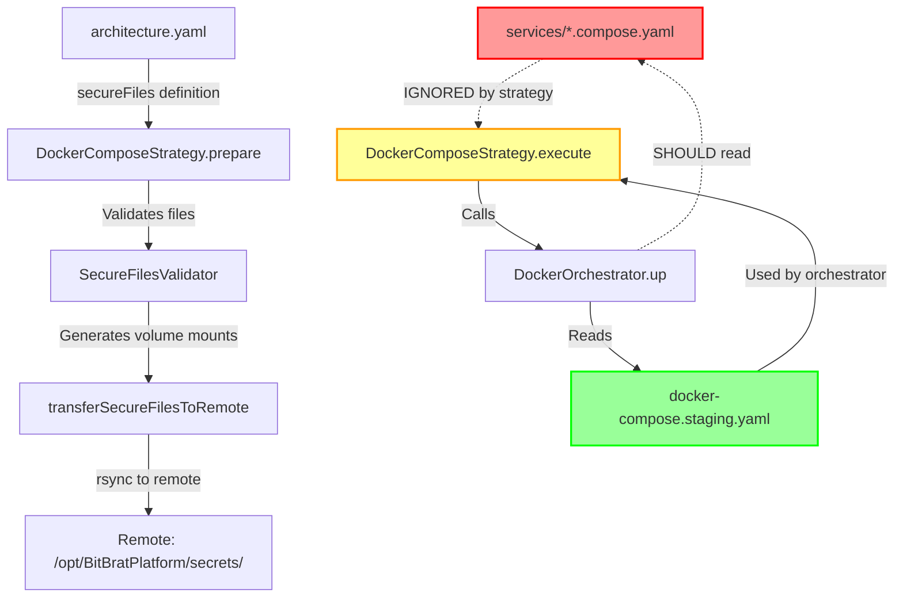

# Sprint 375: Docker Compose Architecture & Secure File Deployment

**Status**: Draft
**Author**: Architect (Claude Code)
**Date**: 2026-07-30
**Sprint**: 375

## Executive Summary

This document evaluates the current Docker Compose orchestration architecture and proposes solutions for two critical issues:

1. **PRIMARY: Secure File Deployment** - Complete the incomplete `secureFiles` feature from Sprint 374 by properly integrating volume mount injection into the deployment pipeline
2. **SECONDARY: Image Build Optimization** - Investigate Docker layer caching and multi-service build strategies to reduce build times

**Key Finding**: The current architecture has TWO deployment paths with different feature sets, creating feature parity gaps and maintenance burden.

---

## Problem Statement

### Sprint 374 Issue: Incomplete secureFiles Implementation

During Sprint 374, we discovered that the `secureFiles` feature in `architecture.yaml` was only partially implemented:

**What Works:**
- ✅ Schema definition in `architecture.yaml`
- ✅ Validation of secure files (exists, not git-tracked, permissions)
- ✅ File transfer to remote hosts via rsync
- ✅ Setting environment variables (e.g., `GOOGLE_APPLICATION_CREDENTIALS`)

**What Doesn't Work:**
- ❌ Volume mount injection into Docker Compose configuration
- ❌ Generated compose files (`docker-compose.staging.yaml`) don't include `secureFiles` mounts
- ❌ Service-specific compose files (`services/*.compose.yaml`) are ignored by orchestrator for remote deployments
- ❌ Manual file editing required after deployment

**Root Cause:**
The orchestrator uses **generated** `docker-compose.{context}.yaml` files for remote deployments, but these generated files:
1. Are created by `brat context create` (one-time generation)
2. Don't include service-specific overrides from `services/*.compose.yaml`
3. Aren't dynamically updated during `brat bit deploy` to include `secureFiles` mounts

### Secondary Issue: Build Efficiency

All Bits use identical build process:
- Same `Dockerfile.service`
- Same TypeScript source (`src/`)
- Same dependencies (`package.json`, `package-lock.json`)
- Only differ by entry point (`SERVICE_ENTRY`) and environment variables

Current build behavior:
- **Remote deployments**: Build each service sequentially, rebuilding common layers every time
- **Local deployments**: Parallel builds with some layer cache reuse
- **No shared build cache** between services

---

## Current Architecture Analysis

### Deployment Paths Comparison

| Aspect | **Legacy Path (`brat docker up`)** | **New Path (`brat bit deploy`)** |
|--------|-----------------------------------|-----------------------------------|
| **Command** | `npm run brat -- docker up` | `npm run brat -- bit deploy <service>` |
| **Entry Point** | `cli/docker.ts` → `DockerOrchestrator` | `oclif-commands/bit/deploy.ts` → `StrategyFactory` |
| **Strategy** | Direct orchestration | Strategy pattern (DockerComposeStrategy, CloudRunStrategy) |
| **Compose Files** | Generated (`docker-compose.{context}.yaml`) + service files (`services/*.compose.yaml`) | Generated (`docker-compose.{context}.yaml`) only |
| **secureFiles Support** | ❌ Not implemented | ⚠️ Partially implemented (file transfer only) |
| **Remote File Sync** | ✅ Full sync (src, dist, compose files) | ✅ Full sync |
| **Service-Specific Overrides** | ✅ Uses `services/*.compose.yaml` | ❌ **Ignores service-specific files** |
| **Volume Mount Injection** | ❌ Manual | ❌ **Not implemented** |

**Key Insight**: `DockerOrchestrator` uses `ComposeFactory.getComposeFiles()` which includes both base and service-specific compose files. `DockerComposeStrategy.execute()` only uses the generated compose file, ignoring service-specific overrides.

### File Flow Diagram



**Problem**: The strategy calls `DockerOrchestrator.up()` which **should** use service-specific compose files, but for context-specific deployments (staging, prod), it only uses the generated `docker-compose.{context}.yaml`.

---

## Proposed Solutions

### Solution 1: Compose File Merge (Recommended)

**Approach**: Dynamically merge service-specific compose files into the generated compose file during deployment.

#### Implementation Strategy

1. **Phase 1: Compose File Merger Utility**
   ```typescript
   // tools/brat/src/orchestration/docker/compose-merger.ts
   export class ComposeMerger {
     /**
      * Merge service-specific compose file into base compose file.
      * Handles:
      * - Volume mounts (append to existing volumes array)
      * - Environment variables (merge with base)
      * - Build args (override base)
      * - Network aliases (append)
      */
     mergeServiceConfig(
       baseCompose: string,
       serviceCompose: string,
       serviceName: string
     ): string;

     /**
      * Inject secureFiles volume mounts into compose file.
      */
     injectSecureFileMounts(
       composeContent: string,
       serviceName: string,
       volumeMounts: string[],
       envVars: Record<string, string>
     ): string;
   }
   ```

2. **Phase 2: Integrate with DockerComposeStrategy**
   ```typescript
   // In DockerComposeStrategy.execute()

   const baseComposePath = plan.metadata.composeFilePath as string;
   const serviceComposePath = this.getServiceComposeFile(service.name);

   // Merge service-specific overrides
   if (fs.existsSync(serviceComposePath)) {
     const merger = new ComposeMerger();
     const mergedCompose = merger.mergeServiceConfig(
       fs.readFileSync(baseComposePath, 'utf-8'),
       fs.readFileSync(serviceComposePath, 'utf-8'),
       service.name
     );

     // Inject secureFiles mounts
     if (secureFiles.length > 0) {
       const finalCompose = merger.injectSecureFileMounts(
         mergedCompose,
         service.name,
         volumeMounts,
         secureFileEnvVars
       );

       // Write temporary merged compose file
       const tempComposePath = `${baseComposePath}.merged.tmp`;
       fs.writeFileSync(tempComposePath, finalCompose);

       // Update plan metadata to use merged file
       plan.metadata.composeFilePath = tempComposePath;
     }
   }
   ```

3. **Phase 3: Cleanup**
   - Remove temporary `.merged.tmp` files after deployment
   - Add to `.gitignore`

#### Pros
- ✅ Maintains single source of truth (generated compose file)
- ✅ Preserves service-specific overrides from `services/*.compose.yaml`
- ✅ No changes to existing compose files
- ✅ Works for both local and remote deployments
- ✅ Testable (merge logic isolated in utility class)

#### Cons
- ⚠️ YAML merging complexity (edge cases: arrays, nested objects)
- ⚠️ Temporary file cleanup required
- ⚠️ Additional maintenance for merge logic

---

### Solution 2: Generate-Once Pattern (Alternative)

**Approach**: Generate context-specific compose files dynamically from service compose files + architecture.yaml on each deployment.

#### Implementation Strategy

1. **Remove generated `docker-compose.{context}.yaml` files from repo**
   - Move to `.gitignore`
   - Regenerate on every deployment

2. **Create ComposeGenerator**
   ```typescript
   export class ComposeGenerator {
     generate(context: ResolvedContext, services: Service[]): string {
       const base = this.loadBaseCompose(); // docker-compose.local.yaml

       for (const service of services) {
         const serviceCompose = this.loadServiceCompose(service.name);
         base = this.mergeService(base, serviceCompose);

         // Inject secureFiles if defined
         if (service.secureFiles) {
           base = this.injectSecureFiles(base, service);
         }
       }

       return base;
     }
   }
   ```

3. **Call generator in DockerComposeStrategy.prepare()**

#### Pros
- ✅ Always up-to-date with architecture.yaml
- ✅ No manual editing of generated files
- ✅ Simpler mental model (generate → deploy)

#### Cons
- ❌ Breaking change (requires removing checked-in generated files)
- ❌ Slower deployments (regenerate on every deploy)
- ❌ Harder to debug (can't inspect generated file without running deploy)

---

### Solution 3: Service-Specific Volume Mount Files (Simplest)

**Approach**: Add volume mounts directly to service-specific compose files and ensure orchestrator uses them.

#### Implementation Strategy

1. **Update ComposeFactory to always include service files**
   ```typescript
   // In compose-factory.ts
   public getComposeFiles(
     targetService?: string,
     inactiveServices?: Iterable<string>,
     enableLoki?: boolean
   ): ComposeFileSet {
     // Current behavior: for context-specific compose, return empty serviceFiles
     // New behavior: ALWAYS include service files, even for context-specific base

     const baseFile = this.baseComposePath;
     const serviceFiles: string[] = [];

     // Remove this check:
     // if (isContextSpecificCompose) { return {...}; }

     // Always populate serviceFiles from services/*.compose.yaml
     const fullServicesDir = path.join(this.repoRoot, this.servicesDir);
     if (targetService) {
       const kebabService = targetService.replace(/_/g, '-');
       const serviceFile = path.join(this.servicesDir, `${kebabService}.compose.yaml`);
       if (fs.existsSync(path.join(this.repoRoot, serviceFile))) {
         serviceFiles.push(serviceFile);
       }
     }

     return { baseFile, serviceFiles, observabilityFile, targetService };
   }
   ```

2. **Add secureFiles mounts to service compose files during scaffold**
   ```yaml
   # services/image-gen-mcp.compose.yaml
   services:
     image-gen-mcp:
       volumes:
         - bitbrat-storage:/var/bitbrat/storage
         # Sprint 375: Secure files from architecture.yaml
         - ../../secrets/google-app-creds.json:/var/secrets/gcp-credentials.json:ro
       environment:
         - GOOGLE_APPLICATION_CREDENTIALS=/var/secrets/gcp-credentials.json
   ```

3. **Automate mount injection via `brat bit create` or `brat config sync`**

#### Pros
- ✅ Simplest implementation
- ✅ Uses existing Docker Compose overlay mechanism
- ✅ Easy to debug (mounts visible in service files)
- ✅ No temporary files or merging logic

#### Cons
- ❌ Duplicates mount definitions between architecture.yaml and compose files
- ❌ Manual sync required when secureFiles change
- ❌ Doesn't solve root issue (generated compose files still incomplete)

---

## Build Optimization Analysis

### Current Build Process

#### Sequential Build (Remote)
```bash
# In DockerOrchestrator.up() for remote targets
for service in services:
  docker compose build llm-bot       # Builds all layers
  docker compose build api-gateway   # Rebuilds common layers
  docker compose build auth          # Rebuilds common layers again
```

**Problem**: Each build starts from scratch because:
1. Build context (`src/`, `package.json`) is identical
2. `Dockerfile.service` is the same
3. Only `SERVICE_ENTRY` build arg differs
4. Docker doesn't cache across different `SERVICE_NAME` tags

#### Build Time Breakdown (Typical)
```
Layer                          Time    Shared?
━━━━━━━━━━━━━━━━━━━━━━━━━━━━━━━━━━━━━━━━━━━
Base image pull                30s     ✅ (cached after first)
APT update + curl install      20s     ✅ (same RUN command)
npm ci (all deps)              90s     ✅ (same package-lock.json)
Copy src/ + tsconfig           2s      ✅ (same files)
npm run build                  45s     ✅ (same TypeScript source)
Production npm ci              60s     ✅ (same package.json)
Copy dist/ + architecture.yaml 2s      ✅ (same files)
━━━━━━━━━━━━━━━━━━━━━━━━━━━━━━━━━━━━━━━━━━━
TOTAL per service              249s

With caching:
First service:  249s
Subsequent:     ~10s (only metadata changes)
```

**Key Insight**: Docker's layer cache **should** reuse layers across builds if build context and Dockerfile are identical. The issue is that separate `docker compose build <service>` invocations don't share cache effectively.

### Proposed Optimizations

#### Option A: Shared Build Stage

Use Docker multi-stage build with a shared base stage:

```dockerfile
# Dockerfile.service-optimized
FROM node:24-bookworm-slim AS base-builder
WORKDIR /workspace
# ... install deps, build TypeScript ...

FROM base-builder AS llm-bot
ARG SERVICE_ENTRY=dist/apps/llm-bot-service.js
# ... copy only needed files ...

FROM base-builder AS api-gateway
ARG SERVICE_ENTRY=dist/apps/api-gateway.js
# ... copy only needed files ...
```

**Pros**: Single build produces multiple images
**Cons**: Dockerfile becomes service-specific, breaks reusable Dockerfile pattern

#### Option B: Build Base Image Once (Recommended)

Create a base image with all common layers, then derive service images:

```yaml
# New docker-compose.base.yaml
services:
  bitbrat-base:
    build:
      context: .
      dockerfile: Dockerfile.base
      target: builder
    image: bitbrat-base:latest

# services/llm-bot.compose.yaml
services:
  llm-bot:
    build:
      context: .
      dockerfile: Dockerfile.service
      args:
        BASE_IMAGE: bitbrat-base:latest
        SERVICE_ENTRY: dist/apps/llm-bot-service.js
```

**Implementation:**
1. Extract builder stage from `Dockerfile.service` → `Dockerfile.base`
2. Build base image once per deployment
3. Service images only copy dist and set entry point

**Build Time with Base Image:**
```
Base image (first time):      249s
Service 1 (llm-bot):          5s   (just COPY + ENV)
Service 2 (api-gateway):      5s
Service 3 (auth):             5s
━━━━━━━━━━━━━━━━━━━━━━━━━━━━━━━━━━━
TOTAL for 3 services:         264s (vs 747s without optimization)
```

#### Option C: BuildKit Cache Mounts (Docker Buildx)

Use BuildKit's `--mount=type=cache` to share npm cache:

```dockerfile
RUN --mount=type=cache,target=/root/.npm \
    npm ci
```

**Pros**: Faster npm installs across all builds
**Cons**: Requires BuildKit (default in Docker 23+), minimal gain if package-lock unchanged

---

## Recommended Implementation Plan

### Phase 1: Fix secureFiles (Solution 1)
**Priority**: P0 (Blocking current sprint)

1. Create `ComposeMerger` utility class
2. Implement YAML merging with volume mount injection
3. Integrate with `DockerComposeStrategy.execute()`
4. Add tests for merge scenarios
5. Update documentation

**Deliverables:**
- `tools/brat/src/orchestration/docker/compose-merger.ts`
- `tools/brat/src/orchestration/docker/compose-merger.test.ts`
- Updated `docker-compose-strategy.ts`

### Phase 2: Build Optimization (Solution B)
**Priority**: P1 (Performance improvement)

1. Create `Dockerfile.base` from `Dockerfile.service` builder stage
2. Add `bitbrat-base` service to `docker-compose.local.yaml`
3. Update service compose files to use base image
4. Modify orchestrator build logic to build base first
5. Measure build time improvements

**Deliverables:**
- `Dockerfile.base`
- Updated `Dockerfile.service`
- Updated service compose files
- Build performance benchmarks

### Phase 3: Deployment Path Unification (Future)
**Priority**: P2 (Technical debt)

1. Deprecate `brat docker up` in favor of `brat bit deploy`
2. Migrate all functionality to strategy pattern
3. Remove `DockerOrchestrator` direct usage from CLI
4. Update documentation and migration guide

---

## Success Criteria

### secureFiles Feature Complete
- ✅ `brat bit deploy image-gen-mcp --context staging` automatically mounts GCP credentials
- ✅ No manual file editing required
- ✅ Works for both local and remote deployments
- ✅ Validation prevents deploying with missing/invalid files
- ✅ Post-deployment verification confirms mounts exist

### Build Optimization
- ✅ Base image build: <5 minutes
- ✅ Service-specific build: <10 seconds (using cached base)
- ✅ Full stack rebuild (10 services): <6 minutes (vs current ~25 minutes)
- ✅ No duplicate layer builds

### Quality Gates
- ✅ All existing tests pass
- ✅ New tests for ComposeMerger (>90% coverage)
- ✅ Backward compatible (existing deployments continue working)
- ✅ Documentation updated

---

## Open Questions

1. **Merge Strategy**: How to handle conflicting keys in YAML merge?
   - **Recommendation**: Service-specific values override generated values
   - **Example**: If both define `environment.PORT`, use service-specific value

2. **Temporary File Cleanup**: When to clean up `.merged.tmp` files?
   - **Recommendation**: Cleanup on `finally` block in `DockerComposeStrategy.execute()`
   - **Backup**: Add `brat cleanup` command to remove all temp files

3. **Base Image Versioning**: How to version `bitbrat-base` image?
   - **Recommendation**: Tag with architecture.yaml version (`bitbrat-base:0.19.1`)
   - **Rebuild trigger**: When `package.json`, `package-lock.json`, or `src/` hash changes

4. **Migration Path**: Remove generated compose files from git?
   - **Recommendation**: Keep in git for now (backward compatibility)
   - **Future**: Generate dynamically after proving stability

---

## References

- [Sprint 374: Secure File Deployment](../sprint-374-secure-file-deployment/technical-architecture.md)
- [Docker Compose File Specification](https://docs.docker.com/compose/compose-file/)
- [Docker BuildKit Cache Mounts](https://docs.docker.com/build/cache/)
- [Strategy Pattern](./strategy.ts)
- [DockerOrchestrator](../orchestration/docker/orchestrator.ts)
