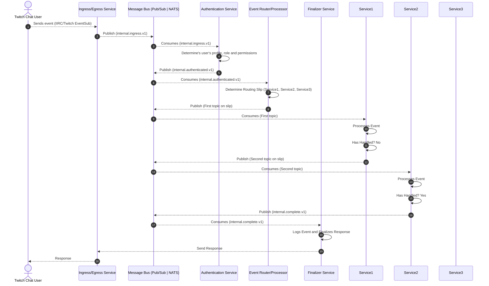

# BitBrat Platform

## Overview
The BitBrat platform is a streamer-centric, comprehensive solution for building and managing event-driven systems and conversational AI applications. It provides a unified messaging architecture that supports multiple message buses, including Google Cloud Pub/Sub and NATS, allowing developers to build scalable and resilient stream management systems.

## Architecture
The BitBrat Platform uses an event based, service oriented architecture. Each service is focused on its responsibilities, and communicates with other services through a unified messaging infrastructure. 

All services must live within a secured VPC, with an internal LB to direct internal traffic and an external global load balancer to route external traffic where allowed.

### Messaging
Asynchronous messaging patterns are embraced throughout. Each event, on ingress, is validated, normalized, put in a standard, routable envelope then published internally. 

A Routing Service listens to the ingress topic and determines how to handle the event, and assigning an appropriate routing slip to it, adding its egress topic to it if a response is needed, and setting the completion destination. Then it publishes the envelope to the first destination on the slip.

From that point forward, each service on the slip processes the event as needed, and if successful, sends it to the next destination on the slip. 

A service may always mark the envelope as 'handled', which indicates that no further processing is needed. When this happens a service must do one of two things:
 - If there is an Egress destination on the envelope, the service must send a message back to that destination.
 - If there is no Egress on the envelope, the service must send the envelope to the completion destination.

At any time, if the service encounters an error or other anomalous situation, it may mark the envelope as 'failed' and send it to the completion destination.

If for some reason there is no completion destination on the envelope, the service must send the envelope to a DLQ.

### Services
Each service is a single container that must expose the required health endpoints, consume messages from zero or more topics, publish to zero or more topics, and may expose other HTTP endpoints. 

It receives non-sensitive configuration via Environment Variables and sensitive configuration via the secure secrets provider of the platform it is running on.

Each service must have IaC that provisions, configures, and deploys it and any infrastructure it solely depends on to both a Local environment and at least one Cloud environment.

### Core Services
These services form the functional backbone of the platform:
- Ingress/Egress: Handles all event entry and exit. Primary integration point for external event sources and destinations. Creates the Envelope and sets the egress destination.
- Auth: Authenticates the event's source user and determines permissions, adding these to the Envelope.
- Router: Based on the message and its context, assigns a Routing Slip to the Envelope and sends it to the first destination. Note, a message should not return to the Router unless it needs a new Routing Slip.
- Finalizer: Logs the final state of the event.
- DLQ Handler: Handles all messages that are not successfully processed by other services. Can be the same process as the Finalizer.

In addition to the above, there are other more specialized services that are composed together to react and respond to events.

## Example Flow


## Example Envelope
```typescript
interface RoutingStep {
  id: string;                 // logical step id: e.g., "router", "retrieval", "llm-bot", "formatter", "egress"
  v?: string;                 // optional version of the step contract, default "1"
  status: 'PENDING' | 'OK' | 'ERROR' | 'SKIP';
  attempt?: number;           // 0-based attempt counter
  maxAttempts?: number;       // default 3
  destination?: string;         // Destination topic to send event for this step
  attributes?: Record<string, string>; // transport hints (e.g., traceparent, priority)
  startedAt?: string;         // ISO timestamp when work began
  endedAt?: string;           // ISO timestamp when work ended
  error?: { code: string; message?: string; retryable?: boolean } | null;
  notes?: string;             // freeform (JSON string recommended)
}

interface Envelope {
  v: string;                 // version of the envelope contract, default "1"
  id: string;                 // unique id for the event
  correlationId: string;      // unique id for the event's correlation
  traceId: string;           // unique id for the event's trace
  timestamp: string;         // ISO timestamp when event was received
  type: string;               // event type
  source: {
    platform: string;         // platform name
    channel: string;          // channel name
    channelId: string;        // channel id
    egressDestination?: string; // optional egress destination topic
  };
  user: {
    id: string;               // user id
    name: string;             // user name
    displayName: string;      // user display name
    profileImageUrl: string;  // user profile image url
    role: string;             // user role
  };
  routingSlip: RoutingStep[]; // ordered list of steps in the routing slip
  finalizationDestination: string; // destination topic for finalization
  payload: Record<string, any>; // event payload
}
```

```json
{
  "v": "1",
  "id": "1234567890",
  "correlationId": "1234567890",
  "traceId": "fd89j34saf",
  "timestamp": "2022-01-01T00:00:00.000Z",
  "type": "external.chat.message.v1",
  "source": {
    "platform": "twitch",
    "channel": "my_channel",
    "channelId": "424325252",
    "egressDestination": "internal.egress1.v1"
  },
  "user": {
    "id": "1234567890",
    "name": "an_admin_user",
    "displayName": "An Admin User",
    "profileImageUrl": "https://my_image.png",
    "role": "admin"
  },
  "routingSlip": [
    { "id": "service1", "status": "PENDING", "destination": "internal.service1.v1" },
    { "id": "service2", "status": "PENDING", "destination": "internal.service2.v1" },
    { "id": "service3", "status": "PENDING", "destination": "internal.service3.v1" }
  ],
  "finalizationDestination": "internal.finalizer.v1",
  "payload": {
    "text": "Hello World!"
  }
}
    
```

## Tech Stack
- **Backend**: Node.js 24 with TypeScript
- **Web Framework**: Express.js
- **Cloud Services**: Google Cloud Platform
- **Database**: Firestore (Firebase)
- **Twitch Integration**: Twurple libraries
- **Streaming**: OBS WebSocket
- **LLM Agent Framework**: @joshuacalpuerto/mcp-agent
- **AI Platform Targets**: OpenAI and Google Vertex AI
- **Containerization**: Docker
- **Artifact & Container Registry**: Google Cloud Artifact Registry
- **Cloud Deployment Target**: Google Cloud Run
- **Cloud Messaging**: Google Cloud PubSub
- **Local Deployment Target**: Docker Compose
- **Local Messaging**: NATS Jetstream