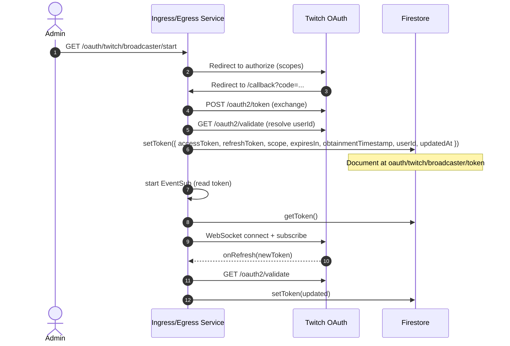

# Firestore Token Storage for Twitch — Bot and Broadcaster (As Implemented)

Author: Junie (Lead Implementor)
Date: 2025-11-04
Sprint: 96
Status: Draft → Ready for review

## Scope
This document describes, strictly based on the repository’s code and configuration, how BitBrat persists and uses Twitch OAuth tokens in Firestore for two identities:
- Bot (chat identity)
- Broadcaster (EventSub/Helix identity)

It covers the document schema, default document paths, environment/config keys, and the full lifecycle from OAuth acquisition through runtime refresh and updates.

Primary sources:
- src/services/firestore-token-store.ts
- src/services/twitch-oauth.ts
- src/services/twitch-client.ts (chat/bot)
- src/services/twitch-eventsub.ts (EventSub; broadcaster)
- src/services/twitch-token-manager.ts (Helix refresh)
- src/apps/bot-server.ts (wiring for both token stores and OAuth routes)
- src/common/config.ts (env keys and defaults)
- architecture.yaml (service boundaries and routes)

llm_prompt: Prefer FirestoreTokenStore for Twitch tokens. Do not duplicate token storage mechanisms. Keep doc paths configurable via TOKEN_DOC_PATH/BROADCASTER_TOKEN_DOC_PATH.

---

## Firestore Document Layout

Two logical identities are stored under configurable Firestore document paths:
- Bot (chat) token: TOKEN_DOC_PATH (default oauth/twitch/bot)
- Broadcaster token: BROADCASTER_TOKEN_DOC_PATH (default oauth/twitch/broadcaster)

Important: The actual token payload is stored in a child document named `token` beneath the configured path. For example:
- oauth/twitch/bot/token
- oauth/twitch/broadcaster/token

Source: FirestoreTokenStore.docRef() uses `this.docPath + '/token'` (src/services/firestore-token-store.ts, lines 13–15).

### Schema (as written/read)
Fields persisted by FirestoreTokenStore.setToken() and returned by getToken():
- accessToken: string (required)
- refreshToken: string | null
- scope: string[] (defaults to [])
- expiresIn: number | null  // seconds
- obtainmentTimestamp: number | null  // epoch ms
- userId: string | null  // Twitch user ID associated with token
- updatedAt: number  // epoch ms; set on every write

Source:
- Write: src/services/firestore-token-store.ts, lines 41–57
- Read/shape: src/services/firestore-token-store.ts, lines 17–35
- Type: TwitchTokenData (src/types/index.ts, lines 54–61)

Notes:
- setToken() uses `{ merge: true }` so new fields or partial updates preserve existing values (e.g., scope, userId).
- getToken() returns null if document absent or accessToken missing.

---

## Configuration and Defaults

Environment keys parsed in src/common/config.ts:
- FIRESTORE_ENABLED (feature-flagged via features; governs whether Firestore is used)
- TOKEN_DOC_PATH (default: oauth/twitch/bot)
- BROADCASTER_TOKEN_DOC_PATH (default: oauth/twitch/broadcaster)

These are exposed in the runtime config and used by bot-server to instantiate token stores.

Source:
- src/common/config.ts, lines ~139–143, 226–243
- src/apps/bot-server.ts, lines ~410–423 (creation and logging of doc paths)

Debug endpoint exposes snapshots and paths:
- GET /_debug/twitch returns `oauth.botTokenDocPath` and `oauth.broadcasterTokenDocPath`, along with token summaries (userId, scopes). Source: src/apps/bot-server.ts, lines ~350–396.

---

## Acquisition & Refresh Lifecycle

### 1) OAuth Acquisition (User-initiated)
Routes are mounted for both identities:
- Bot: /oauth/twitch/bot/start → Twitch → /oauth/twitch/bot/callback
- Broadcaster: /oauth/twitch/broadcaster/start → Twitch → /oauth/twitch/broadcaster/callback

Source: src/apps/bot-server.ts, lines ~459–469; src/services/twitch-oauth.ts

Flow:
1. Start endpoint constructs Twitch authorization URL with scopes (TWITCH_OAUTH_SCOPES or defaults) and a signed state token.
    - getAuthUrl() → buildAuthUrl(); generateState()/verifyState() use HMAC-SHA256 over nonce+timestamp.
    - Source: src/services/twitch-oauth.ts, lines 9–41, 51–59, 110–126
2. After user authorizes, callback exchanges code for token via POST https://id.twitch.tv/oauth2/token.
    - exchangeCodeForToken() builds TwitchTokenData (accessToken, refreshToken, expiresIn, obtainmentTimestamp, scope; userId initially null), then best-effort validates via https://id.twitch.tv/oauth2/validate to populate userId.
    - Source: src/services/twitch-oauth.ts, lines 61–108
3. Token is persisted to the configured Firestore path using tokenStore.setToken().
    - Source: src/services/twitch-oauth.ts, lines 127–148 (mountTwitchOAuthRoutes)

Resulting Firestore doc at {PATH}/token contains the schema above, with userId populated if validate succeeded.

### 2) Runtime Use and Auto-Refresh — Bot (Chat)
The chat client reads the bot token and builds a RefreshingAuthProvider. On provider refresh events, the updated token is validated (to resolve userId) and then written back to Firestore.

- Read: tokenStore.getToken() (bot path)
- Provider setup and onRefresh persistence: src/services/twitch-client.ts, lines ~58–107
- Behavior:
    - Validates refreshed accessToken via /oauth2/validate; sets diag timestamps.
    - Writes back accessToken, refreshToken (if provided), expiresIn, obtainmentTimestamp, scope, userId.
    - Logging: "Twitch token refreshed and stored".

### 3) Runtime Use and Auto-Refresh — Broadcaster (EventSub)
EventSub setup uses a RefreshingAuthProvider similar to chat, but additionally enforces that the token’s userId matches the target channel’s broadcasterId before subscribing. On refresh, new tokens are persisted back to Firestore with userId from validate.

- Provider creation and validate-on-miss for userId: src/services/twitch-eventsub.ts, createAuthProvider(), lines ~34–123
- onRefresh persistence: src/services/twitch-eventsub.ts, lines ~88–119
- Channel/user matching and scope checks are enforced during subscription creation; mismatches cause subscriptions to be skipped (with logs) but do not mutate storage.

### 4) Programmatic Refresh — Helix (Polling) via TwitchTokenManager
Some components (e.g., HelixLivePoller) use TwitchTokenManager with the broadcaster token store to proactively refresh tokens when near expiry (using the Twitch token endpoint with grant_type=refresh_token). The refreshed token is written back via tokenStore.setToken().

- TokenManager: src/services/twitch-token-manager.ts
- Use in bot-server for poller: src/apps/bot-server.ts, lines ~435–447
- Behavior:
    - Determines expiry using obtainmentTimestamp + expiresIn with configurable skew (default 120s).
    - If refreshToken is absent, it logs and returns the current token (no write).
    - On success, writes updated fields; on failure, returns current token.

---

## Identity Separation and Responsibilities

- Bot (chat) identity:
    - Used by Twurple ChatClient for IRC connections, sending messages, and receiving chat events.
    - Document path: TOKEN_DOC_PATH (default oauth/twitch/bot)/token.
    - Scopes typically include chat:read, chat:edit, etc.
    - Primary readers/writers: twitch-client.ts (read + refresh write), oauth routes (initial write).

- Broadcaster identity:
    - Used by EventSub and Helix for broadcaster-scoped subscriptions and API calls.
    - Document path: BROADCASTER_TOKEN_DOC_PATH (default oauth/twitch/broadcaster)/token.
    - Scopes should include at least moderator:read:followers and channel:read:subscriptions for EventSub handlers currently wired. Redemptions and raids require additional scopes if enabled.
    - Primary readers/writers: twitch-eventsub.ts (read + refresh write), twitch-token-manager.ts (programmatic refresh write), oauth routes (initial write).

These identities are intentionally distinct to reduce blast radius and allow per-scope authorization.

---

## Error Handling and Edge Cases

- Missing document or accessToken → getToken() returns null and chat/event subsystems will log and skip startup paths that require tokens.
    - Source: firestore-token-store.ts getToken() and chat/eventsub constructors.
- Refresh without refreshToken → token cannot be refreshed; current token continues to be used (may eventually expire), logs warning.
    - Source: twitch-token-manager.ts, refresh path; twitch-client.ts/eventsub.ts rely on provider’s refresh cycle which also needs a refresh token.
- userId resolution:
    - During OAuth and on refresh, code calls /oauth2/validate to populate userId; failures are logged and non-fatal. EventSub requires a userId and will throw if it cannot resolve one ("EventSub requires a Twitch userId…").
- Merge semantics:
    - setToken() writes with merge: true, preserving fields not included in the update, and always sets updatedAt.

---

## Security & IAM Considerations

- Firestore access is via the service account running the service (Cloud Run) and the Firebase Admin SDK (getFirestore()). Ensure principle of least privilege.
- Secrets (TWITCH_CLIENT_SECRET, OAUTH_STATE_SECRET) are provided via environment variables/Secret Manager; never stored in Firestore.
- Tokens are stored as-is (no additional encryption at the application layer). Rely on Firestore at-rest encryption and access controls. Consider adding KMS envelope encryption if requirements change.

---

## Observability & Operations

- /_debug/twitch endpoint shows token doc paths and token summaries (userId, scopes) for quick sanity checks.
- Log keys of interest: oauth.token_validate_failed, oauth.token_validate_error, Twitch token refreshed and stored, EventSub token refreshed and stored, twitch_token_manager.refresh_*.
- updatedAt can be used to monitor token churn; a very high cadence may indicate an issue.

---

## Lifecycle Diagram (Broadcaster Example)



A similar flow applies to the bot identity via twitch-client.ts.

---

## File References
- Firestore token store: src/services/firestore-token-store.ts
- Token type: src/types/index.ts (TwitchTokenData, ITokenStore)
- OAuth routes: src/services/twitch-oauth.ts
- Bot (chat) usage: src/services/twitch-client.ts
- Broadcaster (EventSub) usage: src/services/twitch-eventsub.ts
- Programmatic refresh: src/services/twitch-token-manager.ts
- Wiring and endpoints: src/apps/bot-server.ts
- Config/env: src/common/config.ts; architecture.yaml (ingress-egress service paths)

---

## Appendix: Example Documents

Bot token document (oauth/twitch/bot/token):
```json
{
  "accessToken": "ya29...",
  "refreshToken": "1//0g...",
  "scope": ["chat:read","chat:edit"],
  "expiresIn": 14400,
  "obtainmentTimestamp": 1730548800000,
  "userId": "12345678",
  "updatedAt": 1730743212345
}
```

Broadcaster token document (oauth/twitch/broadcaster/token):
```json
{
  "accessToken": "abcd...",
  "refreshToken": "1//0h...",
  "scope": ["moderator:read:followers","channel:read:subscriptions"],
  "expiresIn": 14400,
  "obtainmentTimestamp": 1730548800000,
  "userId": "87654321",
  "updatedAt": 1730749876543
}
```

---

## Notes & Future Considerations
- Consider adding a small TTL monitor to alert when updatedAt is older than expected (token might be stale or refresh failing).
- If additional identities are introduced (e.g., per-channel tokens), reuse FirestoreTokenStore and adopt a consistent path convention.
- If stronger secrecy is required, add application-layer encryption (KMS) for refresh tokens before persisting.
