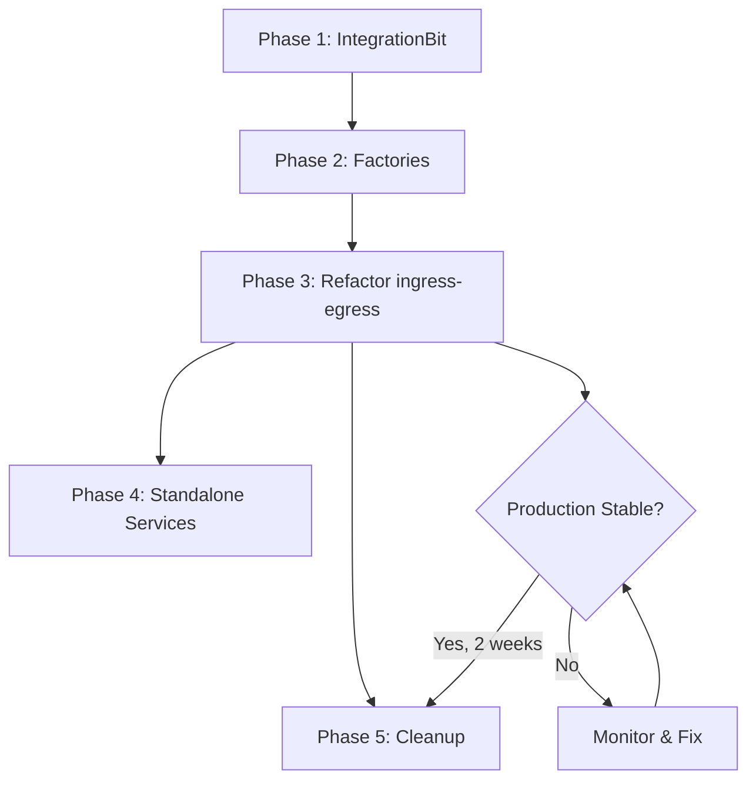

# Execution Plan: IntegrationBit Refactoring

**Sprint:** sprint-12-fxes5l
**Date:** 2026-08-12
**Role:** Lead Implementor
**Status:** DRAFT

---

## Executive Summary

This execution plan breaks down the IntegrationBit refactoring into **35 concrete, testable tasks** organized into **5 phases** with clear dependencies, success criteria, and rollback strategies.

**Estimated Effort:** 3-5 days (1 developer)
**Risk Level:** LOW (backward-compatible refactoring with rollback at each phase)

---

## Phase Breakdown

| Phase | Focus | Tasks | Est. Effort | Risk |
|-------|-------|-------|-------------|------|
| **Phase 1** | IntegrationBit Base Class | 9 tasks | 1.5 days | LOW |
| **Phase 2** | Connector Factories | 5 tasks | 0.5 days | LOW |
| **Phase 3** | Refactor ingress-egress | 10 tasks | 1.5 days | MEDIUM |
| **Phase 4** | Standalone Services (Optional) | 6 tasks | 0.5 days | LOW |
| **Phase 5** | Cleanup & Documentation | 5 tasks | 0.5 days | LOW |

**Total:** 35 tasks, ~4-5 days

---

## Phase 1: Create IntegrationBit Base Class

**Goal:** Build generic wrapper for connector lifecycle, webhooks, egress, and observability.

**Prerequisites:** None (greenfield development)

**Success Criteria:**
- IntegrationBit compiles without errors
- All unit tests pass (100% coverage of core methods)
- Can instantiate with mock connectors
- No production dependencies (isolated development)

### Task 1.1: Create Type Definitions

**File:** `src/common/integration-bit.ts`

**Actions:**
1. Define `ConnectorFactory` type:
   ```typescript
   export type ConnectorFactory = (config: any, opts: {
     egressDestinationTopic: string;
     publisherFactory?: (topic: string) => any;
   }) => Promise<IngressConnector>;
   ```

2. Define `IntegrationBitConfig` interface:
   ```typescript
   export interface IntegrationBitConfig {
     serviceName: string;
     connectors: Array<{
       name: string;
       factory: ConnectorFactory;
       enabled?: boolean;
     }>;
   }
   ```

3. Add JSDoc comments with examples

**Validation:**
- TypeScript compiles without errors
- Types exported correctly

**Rollback:** Delete file (no dependencies)

---

### Task 1.2: Implement Constructor and Instance ID Resolution

**File:** `src/common/integration-bit.ts`

**Actions:**
1. Create `IntegrationBit` class extending `Bit`:
   ```typescript
   export class IntegrationBit extends Bit {
     private connectorManager: ConnectorManager;
     private instanceId: string;
     private egressTopic: string;

     constructor(config: IntegrationBitConfig) {
       super({ serviceName: config.serviceName });
       this.instanceId = this.resolveInstanceId();
       this.egressTopic = `internal.egress.v1.${this.instanceId}`;
       this.connectorManager = new ConnectorManager({ logger: this.getLogger() });
     }
   }
   ```

2. Implement `resolveInstanceId()`:
   ```typescript
   private resolveInstanceId(): string {
     return (
       process.env.K_REVISION ||
       process.env.EGRESS_INSTANCE_ID ||
       process.env.SERVICE_INSTANCE_ID ||
       process.env.HOSTNAME ||
       `proc-${Math.random().toString(36).slice(2, 10)}`
     );
   }
   ```

**Validation:**
- Constructor initializes correctly
- Instance ID resolves from env vars or generates fallback
- Logger is accessible

**Rollback:** Revert constructor implementation

---

### Task 1.3: Implement registerConnectors() Method

**File:** `src/common/integration-bit.ts`

**Actions:**
1. Implement connector registration with error handling:
   ```typescript
   private async registerConnectors(
     connectorConfigs: IntegrationBitConfig['connectors']
   ): Promise<void> {
     const cfg = this.getConfig();

     for (const { name, factory, enabled = true } of connectorConfigs) {
       if (!enabled) {
         this.getLogger().info('integration.connector.disabled', { name });
         continue;
       }

       try {
         const connector = await factory(cfg, {
           egressDestinationTopic: this.egressTopic,
           publisherFactory: (topic: string) => this.createPublisher(topic),
         });

         this.connectorManager.register(name, connector);
         this.getLogger().info('integration.connector.registered', { name });
       } catch (err: any) {
         this.getLogger().error('integration.connector.register_failed', {
           name,
           error: err.message,
           stack: err.stack,
         });
         // Continue registering other connectors (fail-open)
       }
     }
   }
   ```

2. Call `registerConnectors()` from constructor

**Validation:**
- Connectors are registered successfully with valid factories
- Disabled connectors are skipped
- Failed connectors don't block other registrations
- Errors are logged with stack traces

**Test Cases:**
- ✅ Register single connector
- ✅ Register multiple connectors
- ✅ Skip disabled connectors
- ✅ Handle factory errors gracefully
- ✅ Logger receives correct events

**Rollback:** Remove method call from constructor

---

### Task 1.4: Implement setupWebhookRouting() Method

**File:** `src/common/integration-bit.ts`

**Actions:**
1. Implement generic webhook route `POST /webhooks/:platform`:
   ```typescript
   private setupWebhookRouting(): void {
     this.onHTTPRequest({ path: '/webhooks/:platform', method: 'POST' },
       async (req, res) => {
         const platform = req.params.platform?.toLowerCase();
         const correlationId = crypto.randomUUID();

         this.getLogger().info('webhook.received', { correlationId, platform });

         // Validate platform parameter
         if (!platform) {
           res.status(400).json({ error: 'missing_platform' });
           return;
         }

         // Lookup connector
         const connector = this.connectorManager.getConnectorByPlatform(platform);
         if (!connector) {
           this.getLogger().warn('webhook.platform_not_found', { correlationId, platform });
           res.status(404).json({ error: 'platform_not_found' });
           return;
         }

         // Verify signature
         const webhookConnector = connector as unknown as WebhookConnector;
         if (typeof webhookConnector.verifySignature !== 'function') {
           res.status(501).json({ error: 'webhook_not_supported' });
           return;
         }

         if (!webhookConnector.verifySignature(req)) {
           this.getLogger().warn('webhook.invalid_signature', { correlationId, platform });
           res.status(403).json({ error: 'invalid_signature' });
           return;
         }

         // Handle webhook
         try {
           const result = await webhookConnector.handleWebhook(req);
           res.status(result.status).json(result.body);
         } catch (err: any) {
           this.getLogger().error('webhook.handle_error', {
             correlationId,
             platform,
             error: err.message,
             stack: err.stack,
           });
           res.status(500).json({ error: 'internal_error' });
         }
       }
     );
   }
   ```

2. Call `setupWebhookRouting()` from constructor

**Validation:**
- Route is registered correctly
- Platform lookup works
- Signature verification is called
- Errors are handled gracefully
- Correct HTTP status codes returned

**Test Cases:**
- ✅ Valid webhook with correct signature
- ✅ Invalid signature returns 403
- ✅ Unknown platform returns 404
- ✅ Missing platform parameter returns 400
- ✅ Connector without webhook support returns 501
- ✅ Handler error returns 500

**Rollback:** Remove method call from constructor

---

### Task 1.5: Implement setupEgressRouting() Method

**File:** `src/common/integration-bit.ts`

**Actions:**
1. Implement egress subscriptions (instance-specific + generic):
   ```typescript
   private async setupEgressRouting(): Promise<void> {
     const isTestEnv = process.env.NODE_ENV === 'test' || !!process.env.JEST_WORKER_ID;
     if (isTestEnv) {
       this.getLogger().debug('integration.egress.disabled_for_tests');
       return;
     }

     // Subscribe to instance-specific egress topic
     await this.onMessage<InternalEventV2>(
       {
         destination: this.egressTopic,
         queue: `${this.name}.${this.instanceId}`,
         ack: 'explicit'
       },
       async (evt, attrs, ctx) => {
         try {
           await this.processEgress(evt);
           await ctx.ack();
         } catch (err: any) {
           this.getLogger().error('egress.process_error', {
             correlationId: evt.correlationId,
             error: err.message,
           });
           await ctx.ack(); // ACK to prevent infinite retries
         }
       },
       {
         idempotency: { enabled: true, ttlSeconds: 60 }
       }
     );

     // Subscribe to generic egress topic (broadcast to all instances)
     await this.onMessage<InternalEventV2>(
       {
         destination: 'internal.egress.v1',
         queue: `${this.name}.${this.instanceId}`,
         ack: 'explicit'
       },
       async (evt, attrs, ctx) => {
         try {
           const platform = evt.egress?.connector;

           // Only process if this instance supports the platform
           if (platform && this.connectorManager.getConnectorByPlatform(platform)) {
             await this.processEgress(evt);
           }

           await ctx.ack();
         } catch (err: any) {
           this.getLogger().error('egress.generic.process_error', {
             correlationId: evt.correlationId,
             error: err.message,
           });
           await ctx.ack();
         }
       },
       {
         idempotency: { enabled: true, ttlSeconds: 60 }
       }
     );
   }
   ```

2. Call `setupEgressRouting()` from constructor (with `await` in async init)

**Validation:**
- Subscriptions are created correctly
- Test environment is detected and subscriptions skipped
- Idempotency is enabled
- Errors are caught and logged

**Test Cases:**
- ✅ Subscriptions created in non-test env
- ✅ Subscriptions skipped in test env
- ✅ Instance-specific topic is correct format
- ✅ Generic topic subscription created

**Rollback:** Remove method call from constructor

---

### Task 1.6: Implement processEgress() Method

**File:** `src/common/integration-bit.ts`

**Actions:**
1. Implement egress message processing:
   ```typescript
   private async processEgress(evt: InternalEventV2): Promise<void> {
     const logger = this.getLogger();
     const platform = evt.egress?.connector;

     // Validate connector field
     if (!platform) {
       logger.warn('egress.missing_connector', {
         correlationId: evt.correlationId
       });
       return;
     }

     // Lookup connector
     const connector = this.connectorManager.getConnectorByPlatform(platform);
     if (!connector) {
       logger.debug('egress.platform_not_supported', {
         correlationId: evt.correlationId,
         platform,
       });
       return;
     }

     // Verify connector has sendText capability
     const egressConnector = connector as unknown as EgressConnector;
     if (typeof egressConnector.sendText !== 'function') {
       logger.warn('egress.connector_no_sendtext', {
         correlationId: evt.correlationId,
         platform,
       });
       return;
     }

     try {
       // Extract text from event
       const text = extractEgressTextFromEvent(evt);
       if (!text) {
         logger.debug('egress.no_text', { correlationId: evt.correlationId });
         return;
       }

       // Determine target channel
       const target = evt.egress?.channel || evt.ingress?.channel;

       // Send text via connector
       await egressConnector.sendText(text, target);

       logger.info('egress.sent', {
         correlationId: evt.correlationId,
         platform,
         target,
       });
     } catch (err: any) {
       logger.error('egress.send_error', {
         correlationId: evt.correlationId,
         platform,
         error: err.message,
         stack: err.stack,
       });
     }
   }
   ```

**Validation:**
- Platform is extracted from event correctly
- Connector lookup works
- Text extraction works
- sendText is called with correct parameters
- Errors are logged

**Test Cases:**
- ✅ Valid egress event with text
- ✅ Missing connector field logs warning
- ✅ Unknown platform returns gracefully
- ✅ Missing text returns gracefully
- ✅ sendText error is caught and logged

**Rollback:** Remove method (not called externally)

---

### Task 1.7: Implement setupStatusMonitoring() Method

**File:** `src/common/integration-bit.ts`

**Actions:**
1. Implement status change detection and publishing:
   ```typescript
   private setupStatusMonitoring(): void {
     let lastStates: Record<string, string> = {};

     const checkStatusChanges = async () => {
       try {
         const snapshots = this.connectorManager.getSnapshot();

         for (const [name, snap] of Object.entries(snapshots)) {
           const state = snap.state;

           // Detect state change
           if (lastStates[name] !== state) {
             this.getLogger().info('integration.status_change', {
               connector: name,
               from: lastStates[name] || 'NONE',
               to: state,
             });

             lastStates[name] = state;

             // Publish status event
             await this.publishStatusEvent(name, snap);
           }
         }
       } catch (err: any) {
         this.getLogger().error('integration.status_check_error', {
           error: err.message,
         });
       }
     };

     // Initial check + periodic monitoring (every 15s)
     checkStatusChanges().catch(() => {});
     setInterval(() => checkStatusChanges(), 15000);
   }
   ```

2. Implement `publishStatusEvent()`:
   ```typescript
   private async publishStatusEvent(name: string, snapshot: any): Promise<void> {
     try {
       const publisher = this.createPublisher('internal.ingress.v1');
       const platform = name.split('-')[0];

       await publisher.publishJson({
         v: '2',
         ingress: {
           ingressAt: new Date().toISOString(),
           source: `ingress.${name}`,
           connector: 'system',
         },
         egress: { destination: '', connector: 'system' },
         correlationId: `status-${Date.now()}-${Math.random().toString(36).slice(2, 7)}`,
         type: 'system.source.status',
         payload: {
           platform,
           id: snapshot.id || name,
           status: snapshot.state,
           displayName: snapshot.displayName || name,
           metrics: snapshot.counters,
           lastError: snapshot.lastError,
         },
       });
     } catch (err: any) {
       this.getLogger().warn('integration.publish_status_failed', {
         connector: name,
         error: err.message,
       });
     }
   }
   ```

3. Call `setupStatusMonitoring()` from constructor

**Validation:**
- Status changes are detected
- Events are published to message bus
- Initial check runs immediately
- Periodic checks run every 15s
- Errors are caught and logged

**Test Cases:**
- ✅ Initial status check runs
- ✅ Status change detected and logged
- ✅ Status event published correctly
- ✅ Errors in check don't crash process
- ✅ Errors in publish don't crash process

**Rollback:** Remove method call from constructor

---

### Task 1.8: Implement setupDebugEndpoints() Method

**File:** `src/common/integration-bit.ts`

**Actions:**
1. Implement debug HTTP endpoints:
   ```typescript
   private setupDebugEndpoints(): void {
     // Debug endpoint: instance info
     this.onHTTPRequest('/_debug/instance', (_req, res) => {
       res.status(200).json({
         service: this.name,
         instanceId: this.instanceId,
         egressTopic: this.egressTopic,
         timestamp: new Date().toISOString(),
       });
     });

     // Debug endpoint: all connectors
     this.onHTTPRequest('/_debug/connectors', (_req, res) => {
       try {
         const snapshots = this.connectorManager.getSnapshot();
         res.status(200).json(snapshots);
       } catch (err: any) {
         res.status(500).json({ error: err.message });
       }
     });

     // Debug endpoint: specific connector
     this.onHTTPRequest('/_debug/:platform', (req, res) => {
       try {
         const platform = req.params.platform;
         const connector = this.connectorManager.getConnectorByPlatform(platform);

         if (!connector) {
           res.status(404).json({ error: 'platform_not_found' });
           return;
         }

         const snapshot = connector.getSnapshot();
         res.status(200).json({
           snapshot,
           egressTopic: this.egressTopic
         });
       } catch (err: any) {
         res.status(500).json({ error: err.message });
       }
     });
   }
   ```

2. Call `setupDebugEndpoints()` from constructor

**Validation:**
- All 3 endpoints are registered
- Instance info returns correct data
- Connectors endpoint returns snapshot
- Platform-specific endpoint works
- 404 returned for unknown platform
- Errors handled gracefully

**Test Cases:**
- ✅ GET /_debug/instance returns instance info
- ✅ GET /_debug/connectors returns all snapshots
- ✅ GET /_debug/twitch returns twitch snapshot
- ✅ GET /_debug/unknown returns 404
- ✅ Errors in getSnapshot() return 500

**Rollback:** Remove method call from constructor

---

### Task 1.9: Implement start() and stop() Lifecycle Methods

**File:** `src/common/integration-bit.ts`

**Actions:**
1. Override `start()` to start connectors first:
   ```typescript
   async start(port?: number): Promise<void> {
     this.getLogger().info('integration.starting', {
       service: this.name,
       instanceId: this.instanceId,
     });

     // Start all connectors
     await this.connectorManager.start();

     // Start HTTP server (from Bit base class)
     await super.start(port);

     this.getLogger().info('integration.started', {
       service: this.name,
       port,
     });
   }
   ```

2. Override `stop()` to stop connectors:
   ```typescript
   async stop(): Promise<void> {
     this.getLogger().info('integration.stopping', {
       service: this.name,
     });

     // Stop all connectors
     await this.connectorManager.stop();

     // Stop HTTP server (from Bit base class)
     await super.close();

     this.getLogger().info('integration.stopped', {
       service: this.name,
     });
   }
   ```

**Validation:**
- Connectors start before HTTP server
- Connectors stop before HTTP server closes
- Logs indicate lifecycle transitions

**Test Cases:**
- ✅ start() calls connectorManager.start()
- ✅ start() calls super.start()
- ✅ stop() calls connectorManager.stop()
- ✅ stop() calls super.close()
- ✅ Lifecycle logs are emitted

**Rollback:** Remove overrides (use base class methods)

---

### Task 1.10: Write Unit Tests for IntegrationBit

**File:** `src/common/integration-bit.test.ts`

**Actions:**
1. Create test file with mock dependencies:
   ```typescript
   import { IntegrationBit } from './integration-bit';
   import type { ConnectorFactory } from './integration-bit';
   import type { IngressConnector, WebhookConnector, EgressConnector } from '../services/ingress/core';

   describe('IntegrationBit', () => {
     let mockConnector: IngressConnector & WebhookConnector & EgressConnector;
     let mockFactory: jest.MockedFunction<ConnectorFactory>;

     beforeEach(() => {
       mockConnector = {
         start: jest.fn(),
         stop: jest.fn(),
         getSnapshot: jest.fn(() => ({ state: 'CONNECTED' })),
         verifySignature: jest.fn(() => true),
         handleWebhook: jest.fn(async () => ({ status: 200, body: { ok: true } })),
         sendText: jest.fn(),
       };
       mockFactory = jest.fn(async () => mockConnector);
     });

     // Test cases...
   });
   ```

2. Write tests for each method:
   - Constructor and initialization
   - registerConnectors()
   - Webhook routing (valid, invalid signature, unknown platform)
   - Egress processing (valid, missing connector, errors)
   - Status monitoring
   - Debug endpoints
   - Lifecycle (start/stop)

**Validation:**
- 100% code coverage of IntegrationBit methods
- All edge cases tested
- Mock dependencies properly isolated

**Coverage Target:** 100% for IntegrationBit core methods

**Rollback:** Delete test file

---

### Task 1.11: Integration Testing with Mock Connectors

**File:** `src/common/integration-bit.integration.test.ts`

**Actions:**
1. Create integration test with multiple mock connectors
2. Test full lifecycle: start → webhook → egress → stop
3. Test status monitoring with state changes
4. Test connector failure scenarios

**Test Scenarios:**
- ✅ Multi-connector registration
- ✅ Webhook routing to correct connector
- ✅ Egress routing to correct connector
- ✅ Status change detection and publishing
- ✅ Connector failure doesn't affect others
- ✅ Graceful shutdown

**Validation:**
- All integration tests pass
- No memory leaks (connectors properly cleaned up)

**Rollback:** Delete test file

---

## Phase 2: Create Connector Factories

**Goal:** Extract platform instantiation logic into reusable factory functions.

**Prerequisites:** Phase 1 complete (IntegrationBit exists)

**Success Criteria:**
- All 4 factories compile and export correctly
- Each factory creates a valid connector
- Factories are unit tested independently
- No changes to existing connector code

---

### Task 2.1: Create Twitch Connector Factory

**File:** `src/services/ingress/twitch/factory.ts`

**Actions:**
1. Extract Twitch instantiation from `ingress-egress-service.ts` lines 122-165
2. Create factory function:
   ```typescript
   import type { ConnectorFactory } from '../../../common/integration-bit';
   import { TwitchIrcClient, TwitchEnvelopeBuilder, TwitchEventSubClient } from './';
   import { TwitchConnectorAdapter } from './connector-adapter';
   import { FirestoreTwitchCredentialsProvider, ConfigTwitchCredentialsProvider } from './credentials-provider';
   import { createTokenStore } from '../../firestore-token-store';

   export const createTwitchConnector: ConnectorFactory = async (config, opts) => {
     const { egressDestinationTopic, publisherFactory } = opts;

     // Create publisher
     const publisher = publisherFactory?.('internal.ingress.v1');
     if (!publisher) {
       throw new Error('Publisher factory is required for Twitch connector');
     }

     // Create credentials provider
     const documentStore = config.documentStore || config.firestore;
     const credsProvider = documentStore
       ? new FirestoreTwitchCredentialsProvider(
           config,
           createTokenStore(config.tokenDocPath || 'oauth/twitch/bot', documentStore)
         )
       : new ConfigTwitchCredentialsProvider(config);

     // Create IRC client
     const client = new TwitchIrcClient(
       new TwitchEnvelopeBuilder(),
       publisher,
       config.twitchChannels,
       {
         cfg: config,
         credentialsProvider: credsProvider,
         egressDestinationTopic,
         debugUsers: config.debugUsers,
       }
     );

     // Wrap in adapter
     return new TwitchConnectorAdapter(client);
   };
   ```

3. Export factory from `src/services/ingress/twitch/index.ts`

**Validation:**
- Factory compiles without errors
- Returns valid TwitchConnectorAdapter
- Credentials provider selection works
- Publisher is used correctly

**Test Cases:**
- ✅ Create connector with persistent credentials
- ✅ Create connector with config credentials
- ✅ Create connector with custom egressDestinationTopic
- ✅ Factory throws if publisherFactory missing

**Rollback:** Delete factory file

---

### Task 2.2: Create Discord Connector Factory

**File:** `src/services/ingress/discord/factory.ts`

**Actions:**
1. Extract Discord instantiation from `ingress-egress-service.ts` lines 178-196
2. Create factory function:
   ```typescript
   import type { ConnectorFactory } from '../../../common/integration-bit';
   import { DiscordIngressClient, buildDiscordEnvelope } from './';
   import { DiscordConnectorAdapter } from './connector-adapter';
   import { createAuthTokenStore } from '../../oauth/auth-token-store';

   export const createDiscordConnector: ConnectorFactory = async (config, opts) => {
     const { egressDestinationTopic, publisherFactory } = opts;

     const publisher = publisherFactory?.('internal.ingress.v1');
     if (!publisher) {
       throw new Error('Publisher factory is required for Discord connector');
     }

     const tokenStore = createAuthTokenStore();
     const client = new DiscordIngressClient(
       buildDiscordEnvelope,
       publisher,
       config,
       { egressDestinationTopic },
       tokenStore
     );

     return new DiscordConnectorAdapter(client, config);
   };
   ```

3. Export factory from `src/services/ingress/discord/index.ts`

**Validation:**
- Factory compiles without errors
- Returns valid DiscordConnectorAdapter
- Token store is created correctly

**Test Cases:**
- ✅ Create connector successfully
- ✅ Factory throws if publisherFactory missing
- ✅ egressDestinationTopic is passed correctly

**Rollback:** Delete factory file

---

### Task 2.3: Create Slack Connector Factory

**File:** `src/services/ingress/slack/factory.ts`

**Actions:**
1. Extract Slack instantiation from `ingress-egress-service.ts` lines 278-343
2. Create factory function:
   ```typescript
   import type { ConnectorFactory } from '../../../common/integration-bit';
   import { SlackIngressClient } from './slack-ingress-client';
   import { SlackConnectorAdapter } from './connector-adapter';

   export const createSlackConnector: ConnectorFactory = async (config, opts) => {
     const { egressDestinationTopic, publisherFactory } = opts;

     if (!config.slackAppToken || !config.slackBotToken) {
       throw new Error('Slack requires SLACK_APP_TOKEN and SLACK_BOT_TOKEN');
     }

     const publisher = publisherFactory?.('internal.ingress.v1');
     if (!publisher) {
       throw new Error('Publisher factory is required for Slack connector');
     }

     const client = new SlackIngressClient(
       config.slackAppToken,
       config.slackBotToken,
       publisher,
       config.debugUsersSlack
     );

     return new SlackConnectorAdapter(client, config);
   };
   ```

3. Export factory from `src/services/ingress/slack/index.ts`

**Validation:**
- Factory compiles without errors
- Returns valid SlackConnectorAdapter
- Validates required config (appToken, botToken)

**Test Cases:**
- ✅ Create connector with valid config
- ✅ Factory throws if appToken missing
- ✅ Factory throws if botToken missing
- ✅ Factory throws if publisherFactory missing

**Rollback:** Delete factory file

---

### Task 2.4: Create Twilio Connector Factory

**File:** `src/services/ingress/twilio/factory.ts`

**Actions:**
1. Extract Twilio instantiation from `ingress-egress-service.ts` lines 199-276
2. Create factory function:
   ```typescript
   import type { ConnectorFactory } from '../../../common/integration-bit';
   import { TwilioIngressClient, TwilioEnvelopeBuilder, TwilioTokenProvider } from './';
   import { TwilioConnectorAdapter } from './connector-adapter';

   export const createTwilioConnector: ConnectorFactory = async (config, opts) => {
     const { egressDestinationTopic, publisherFactory } = opts;

     if (!config.twilioAccountSid || !config.twilioAuthToken) {
       throw new Error('Twilio requires TWILIO_ACCOUNT_SID and TWILIO_AUTH_TOKEN');
     }

     const publisher = publisherFactory?.('internal.ingress.v1');
     if (!publisher) {
       throw new Error('Publisher factory is required for Twilio connector');
     }

     const tokenProvider = new TwilioTokenProvider(config);
     const envelopeBuilder = new TwilioEnvelopeBuilder();

     const client = new TwilioIngressClient(
       config,
       tokenProvider,
       envelopeBuilder,
       publisher,
       { egressDestinationTopic }
     );

     return new TwilioConnectorAdapter(client, config);
   };
   ```

3. Export factory from `src/services/ingress/twilio/index.ts`

**Validation:**
- Factory compiles without errors
- Returns valid TwilioConnectorAdapter
- Validates required config (accountSid, authToken)

**Test Cases:**
- ✅ Create connector with valid config
- ✅ Factory throws if accountSid missing
- ✅ Factory throws if authToken missing
- ✅ Factory throws if publisherFactory missing

**Rollback:** Delete factory file

---

### Task 2.5: Write Unit Tests for All Factories

**Files:**
- `src/services/ingress/twitch/factory.test.ts`
- `src/services/ingress/discord/factory.test.ts`
- `src/services/ingress/slack/factory.test.ts`
- `src/services/ingress/twilio/factory.test.ts`

**Actions:**
1. Create test suite for each factory
2. Test successful connector creation
3. Test error cases (missing config, missing publisherFactory)
4. Test configuration variations

**Test Template:**
```typescript
import { createTwitchConnector } from './factory';
import { createMockConfig, createMockPublisherFactory } from '../../../test-utils';

describe('createTwitchConnector', () => {
  it('should create connector with valid config', async () => {
    const config = createMockConfig();
    const publisherFactory = createMockPublisherFactory();

    const connector = await createTwitchConnector(config, {
      egressDestinationTopic: 'test-topic',
      publisherFactory,
    });

    expect(connector).toBeDefined();
    expect(connector.start).toBeDefined();
    expect(connector.stop).toBeDefined();
  });

  it('should throw if publisherFactory missing', async () => {
    const config = createMockConfig();

    await expect(
      createTwitchConnector(config, { egressDestinationTopic: 'test-topic' })
    ).rejects.toThrow('Publisher factory is required');
  });
});
```

**Validation:**
- All tests pass
- Factories are tested independently
- Edge cases covered

**Rollback:** Delete test files

---

## Phase 3: Refactor ingress-egress Service

**Goal:** Replace monolithic `IngressEgressServer` with `IntegrationBit`-based implementation.

**Prerequisites:** Phase 1 and Phase 2 complete

**Success Criteria:**
- New implementation passes all tests
- Staging deployment successful
- Production canary rollout successful
- Zero user-visible errors
- All platforms operational

---

### Task 3.1: Backup Current Implementation

**Actions:**
1. Create backup of current file:
   ```bash
   mkdir -p deprecated/sprint-12-backup
   cp src/apps/ingress-egress-service.ts deprecated/sprint-12-backup/
   cp src/apps/ingress-egress-service.test.ts deprecated/sprint-12-backup/ 2>/dev/null || true
   git add deprecated/sprint-12-backup/
   git commit -m "backup: Archive ingress-egress before refactoring"
   ```

2. Document rollback procedure in sprint artifacts

**Validation:**
- Backup files exist in `deprecated/sprint-12-backup/`
- Committed to feature branch

**Rollback:** N/A (this IS the rollback)

---

### Task 3.2: Create New ingress-egress-service.ts

**File:** `src/apps/ingress-egress-service.ts`

**Actions:**
1. Delete current implementation (keep backup)
2. Create new minimal implementation:
   ```typescript
   import { IntegrationBit } from '../common/integration-bit';
   import { buildConfig } from '../common/config';
   import { Bit } from '../common/base-server';
   import { createTwitchConnector } from '../services/ingress/twitch/factory';
   import { createDiscordConnector } from '../services/ingress/discord/factory';
   import { createSlackConnector } from '../services/ingress/slack/factory';
   import { createTwilioConnector } from '../services/ingress/twilio/factory';

   const SERVICE_NAME = process.env.SERVICE_NAME || 'ingress-egress';
   const PORT = buildConfig(process.env).port;

   export class IngressEgressServer extends IntegrationBit {
     constructor() {
       super({
         serviceName: SERVICE_NAME,
         connectors: [
           { name: 'twitch', factory: createTwitchConnector },
           { name: 'discord', factory: createDiscordConnector },
           { name: 'slack', factory: createSlackConnector },
           { name: 'twilio', factory: createTwilioConnector },
         ],
       });
     }
   }

   export function createApp() {
     const server = new IngressEgressServer();
     return server.getApp();
   }

   if (require.main === module) {
     Bit.ensureRequiredEnv(SERVICE_NAME);
     const server = new IngressEgressServer();
     void server.start(PORT);
   }
   ```

**Validation:**
- File compiles without errors
- Imports resolve correctly
- Constructor is minimal (~10 LOC)

**Rollback:**
```bash
cp deprecated/sprint-12-backup/ingress-egress-service.ts src/apps/
git checkout src/apps/ingress-egress-service.ts
```

---

### Task 3.3: Update Tests for New Implementation

**File:** `src/apps/ingress-egress-service.test.ts`

**Actions:**
1. Simplify tests to focus on IntegrationBit usage
2. Remove platform-specific mocking (handled by factories)
3. Test basic lifecycle and routing

**Simplified Test Suite:**
```typescript
import { IngressEgressServer } from './ingress-egress-service';
import request from 'supertest';

describe('IngressEgressServer', () => {
  let server: IngressEgressServer;

  beforeEach(async () => {
    server = new IngressEgressServer();
    await server.start(3001);
  });

  afterEach(async () => {
    await server.stop();
  });

  it('should start successfully', () => {
    expect(server).toBeDefined();
  });

  it('should expose debug endpoints', async () => {
    const res = await request(server.getApp()).get('/_debug/instance');
    expect(res.status).toBe(200);
    expect(res.body.service).toBe('ingress-egress');
  });

  it('should handle webhook route', async () => {
    const res = await request(server.getApp())
      .post('/webhooks/unknown')
      .send({});

    // Unknown platform should return 404
    expect(res.status).toBe(404);
  });
});
```

**Validation:**
- All tests pass
- Tests run faster (less mocking)
- Coverage maintained

**Rollback:**
```bash
cp deprecated/sprint-12-backup/ingress-egress-service.test.ts src/apps/
```

---

### Task 3.4: Build and Local Testing

**Actions:**
1. Run full build:
   ```bash
   npm run build
   ```

2. Run unit tests:
   ```bash
   npm test -- ingress-egress-service.test.ts
   npm test -- integration-bit.test.ts
   ```

3. Start local instance:
   ```bash
   npm run local
   ```

4. Test debug endpoints:
   ```bash
   curl http://localhost:3000/_debug/instance
   curl http://localhost:3000/_debug/connectors
   ```

5. Test webhook routing (if Twitch configured):
   ```bash
   # Send test webhook
   curl -X POST http://localhost:3000/webhooks/twitch \
     -H "Content-Type: application/json" \
     -d '{"type":"test"}'
   ```

**Validation:**
- Build succeeds
- All tests pass
- Local instance starts without errors
- Debug endpoints return expected data
- Connectors are registered and visible

**Rollback:** Stop local instance, revert files

---

### Task 3.5: Deploy to Staging

**Actions:**
1. Commit changes to feature branch:
   ```bash
   git add src/apps/ingress-egress-service.ts
   git add src/common/integration-bit.ts
   git add src/services/ingress/*/factory.ts
   git commit -m "refactor: Implement IntegrationBit pattern for ingress-egress"
   ```

2. Deploy to staging:
   ```bash
   npm run brat -- deploy service ingress-egress --context staging
   ```

3. Monitor deployment:
   ```bash
   npm run brat -- fleet logs ingress-egress --context staging --since 5m
   ```

**Validation:**
- Deployment succeeds
- Service starts without errors
- All connectors register successfully
- No error logs in first 5 minutes

**Rollback:**
```bash
git revert HEAD
npm run brat -- deploy service ingress-egress --context staging
```

---

### Task 3.6: Run Staging Smoke Tests

**Test Suite:**

1. **Instance Health:**
   ```bash
   curl https://staging.bitbrat.dev/_debug/instance
   # Expected: 200 OK with instance info
   ```

2. **Connector Status:**
   ```bash
   curl https://staging.bitbrat.dev/_debug/connectors
   # Expected: 200 OK with all 4 connectors (twitch, discord, slack, twilio)
   ```

3. **Twitch Ingress → Egress:**
   - Send test message in Twitch chat
   - Verify envelope published to `internal.ingress.v1`
   - Verify bot responds in chat

4. **Discord Ingress → Egress:**
   - Send test message in Discord channel
   - Verify bot responds in channel

5. **Status Event Publishing:**
   - Monitor `internal.ingress.v1` for `system.source.status` events
   - Verify status events published for all connectors

**Success Criteria:**
- All endpoints return 200 OK
- All connectors show CONNECTED state
- Ingress → Egress flow works for all platforms
- Status events are published
- No errors in logs

**Rollback Decision Point:**
- If ANY smoke test fails → Rollback immediately
- If ALL smoke tests pass → Proceed to production canary

---

### Task 3.7: Production Canary Deployment

**Actions:**
1. Deploy to production (canary instance):
   ```bash
   npm run brat -- deploy service ingress-egress --context prod --canary
   ```

2. Monitor canary for 30 minutes:
   - Error rate
   - Latency (p50, p95, p99)
   - Throughput (messages/min)
   - Memory usage
   - CPU usage

3. Compare metrics to stable instances

**Success Criteria:**
- Error rate < 0.1%
- Latency within 10% of stable instances
- Throughput matches stable instances
- No memory leaks
- No connector disconnections

**Rollback Decision Point:**
- If metrics degrade → Rollback canary
- If metrics stable → Proceed to full rollout

---

### Task 3.8: Production Full Rollout

**Actions:**
1. Gradual rollout (50% → 100%):
   ```bash
   # 50% rollout
   npm run brat -- deploy service ingress-egress --context prod --percentage 50

   # Wait 30 minutes, monitor metrics

   # 100% rollout
   npm run brat -- deploy service ingress-egress --context prod --percentage 100
   ```

2. Monitor for 24 hours

**Success Criteria:**
- All instances healthy
- Error rate normal
- User reports normal
- Connector stability maintained

**Rollback:**
```bash
# Emergency rollback to backup
cp deprecated/sprint-12-backup/ingress-egress-service.ts src/apps/
npm run build
npm run brat -- deploy service ingress-egress --context prod --percentage 100
```

---

### Task 3.9: Post-Deployment Validation

**Actions:**
1. Verify all platforms operational:
   - Twitch: Send message, verify response
   - Discord: Send message, verify response
   - Slack: Send message, verify response
   - Twilio: Send SMS, verify response

2. Check metrics dashboards:
   - Ingress message rate
   - Egress message rate
   - Connector health
   - Error rate

3. Review logs for warnings/errors:
   ```bash
   npm run brat -- fleet logs ingress-egress --context prod --level warn --since 1h
   ```

**Success Criteria:**
- All platforms responding normally
- Metrics within expected ranges
- No unexpected warnings or errors

---

### Task 3.10: Update Monitoring and Alerts

**Actions:**
1. Update Grafana dashboards:
   - Add `IntegrationBit` metrics
   - Add connector-specific panels
   - Update alert thresholds if needed

2. Update alert rules:
   - Connector disconnection alerts
   - Status publishing failure alerts
   - Egress routing failure alerts

3. Document new metrics in runbook

**Validation:**
- Dashboards show expected data
- Alerts fire correctly (test with simulated failures)

---

## Phase 4: Create Standalone Services (Optional)

**Goal:** Enable standalone deployment for individual platforms.

**Prerequisites:** Phase 3 complete and stable

**Success Criteria:**
- All 4 standalone services created
- Standalone Twitch deployment tested
- Can switch between integrated/standalone via config
- Production continues using integrated mode

---

### Task 4.1: Create Standalone Service Files

**Files:**
- `src/apps/twitch-ingress-service.ts`
- `src/apps/discord-ingress-service.ts`
- `src/apps/slack-ingress-service.ts`
- `src/apps/twilio-ingress-service.ts`

**Template:**
```typescript
// src/apps/twitch-ingress-service.ts

import { IntegrationBit } from '../common/integration-bit';
import { buildConfig } from '../common/config';
import { Bit } from '../common/base-server';
import { createTwitchConnector } from '../services/ingress/twitch/factory';

const SERVICE_NAME = process.env.SERVICE_NAME || 'twitch-ingress';
const PORT = buildConfig(process.env).port;

export class TwitchIngressServer extends IntegrationBit {
  constructor() {
    super({
      serviceName: SERVICE_NAME,
      connectors: [
        { name: 'twitch', factory: createTwitchConnector },
      ],
    });
  }
}

export function createApp() {
  const server = new TwitchIngressServer();
  return server.getApp();
}

if (require.main === module) {
  Bit.ensureRequiredEnv(SERVICE_NAME);
  const server = new TwitchIngressServer();
  void server.start(PORT);
}
```

**Actions:**
1. Create all 4 files using template
2. Customize SERVICE_NAME for each platform
3. Customize factory import for each platform

**Validation:**
- All files compile without errors
- Each service has unique name

**Rollback:** Delete files

---

### Task 4.2: Update architecture.yaml

**File:** `architecture.yaml`

**Actions:**
1. Add standalone service definitions:
   ```yaml
   services:
     # Existing integrated service
     ingress-egress:
       active: true
       # ... existing config

     # Standalone Twitch (disabled by default)
     twitch-ingress:
       active: false
       category: platform
       profile: gateway
       port: 3010
       entry: src/apps/twitch-ingress-service.ts
       env:
         TWITCH_BOT_USERNAME: ${TWITCH_BOT_USERNAME}
         TWITCH_CHANNELS: ${TWITCH_CHANNELS}
       secrets:
         - TWITCH_OAUTH_TOKEN
         - TWITCH_CLIENT_ID
         - TWITCH_CLIENT_SECRET

     # Standalone Discord (disabled by default)
     discord-ingress:
       active: false
       category: platform
       profile: gateway
       port: 3011
       entry: src/apps/discord-ingress-service.ts
       env:
         DISCORD_ENABLED: "true"
       secrets:
         - DISCORD_BOT_TOKEN
         - DISCORD_PUBLIC_KEY

     # Standalone Slack (disabled by default)
     slack-ingress:
       active: false
       category: platform
       profile: gateway
       port: 3012
       entry: src/apps/slack-ingress-service.ts
       env:
         SLACK_ENABLED: "true"
       secrets:
         - SLACK_APP_TOKEN
         - SLACK_BOT_TOKEN
         - SLACK_SIGNING_SECRET

     # Standalone Twilio (disabled by default)
     twilio-ingress:
       active: false
       category: platform
       profile: gateway
       port: 3013
       entry: src/apps/twilio-ingress-service.ts
       env:
         TWILIO_ENABLED: "true"
       secrets:
         - TWILIO_ACCOUNT_SID
         - TWILIO_AUTH_TOKEN
   ```

**Validation:**
- Config validates correctly
- Standalone services show as disabled

**Rollback:** Revert architecture.yaml

---

### Task 4.3: Test Standalone Twitch Deployment

**Actions:**
1. Enable standalone Twitch in architecture.yaml:
   ```yaml
   ingress-egress:
     active: false
   twitch-ingress:
     active: true
   ```

2. Build and deploy to staging:
   ```bash
   npm run build
   npm run brat -- deploy service twitch-ingress --context staging
   ```

3. Test functionality:
   - Send Twitch message
   - Verify ingress → egress flow
   - Verify bot responds

**Validation:**
- Standalone service starts successfully
- Twitch integration works
- Other platforms are NOT active

**Rollback:**
```yaml
ingress-egress:
  active: true
twitch-ingress:
  active: false
```

---

### Task 4.4: Document Deployment Mode Switching

**File:** `documentation/guides/ingress-egress-deployment-modes.md`

**Actions:**
1. Create guide documenting:
   - Integrated mode (default)
   - Standalone mode (per-platform)
   - How to switch modes
   - Use cases for each mode

2. Include examples:
   - Config snippets
   - Deployment commands
   - Monitoring differences

**Validation:**
- Guide is clear and complete
- Examples are tested and work

---

### Task 4.5: Create Standalone Service Tests

**Files:**
- `src/apps/twitch-ingress-service.test.ts`
- `src/apps/discord-ingress-service.test.ts`
- `src/apps/slack-ingress-service.test.ts`
- `src/apps/twilio-ingress-service.test.ts`

**Template:**
```typescript
import { TwitchIngressServer } from './twitch-ingress-service';

describe('TwitchIngressServer', () => {
  let server: TwitchIngressServer;

  beforeEach(async () => {
    server = new TwitchIngressServer();
    await server.start(3010);
  });

  afterEach(async () => {
    await server.stop();
  });

  it('should register only Twitch connector', async () => {
    const res = await request(server.getApp()).get('/_debug/connectors');
    const connectors = Object.keys(res.body);

    expect(connectors).toHaveLength(1);
    expect(connectors[0]).toBe('twitch');
  });
});
```

**Validation:**
- All tests pass
- Each service tests single-connector registration

---

### Task 4.6: Update Production Configuration

**Actions:**
1. Commit all standalone service files
2. Update production architecture.yaml (keep integrated mode active)
3. Document standalone option for future use

**Note:** Production will continue using integrated mode. Standalone services are available but disabled.

---

## Phase 5: Cleanup and Documentation

**Goal:** Remove deprecated code, update documentation, and prepare for release.

**Prerequisites:** Phase 3 complete and stable in production for 2 weeks

**Success Criteria:**
- All deprecated code removed
- Documentation updated
- Version bumped
- Integration guide published

---

### Task 5.1: Update CLAUDE.md

**File:** `CLAUDE.md`

**Actions:**
1. Add new "IntegrationBit Pattern" section:
   ```markdown
   ### Building Platform Integration Bits: The IntegrationBit Pattern

   **RULE: Use this pattern for all platform integrations (Twitch, Discord, Slack, etc.).**

   **The Pattern:** Extend IntegrationBit + Provide Connector Factories

   Platform integrations are built by extending the `IntegrationBit` base class and providing connector factories:

   **Complete Example:**

   ```typescript
   // File: src/apps/twitch-ingress-service.ts
   import { IntegrationBit } from '../common/integration-bit';
   import { createTwitchConnector } from '../services/ingress/twitch/factory';

   export class TwitchIngressServer extends IntegrationBit {
     constructor() {
       super({
         serviceName: 'twitch-ingress',
         connectors: [
           { name: 'twitch', factory: createTwitchConnector }
         ]
       });
     }
   }
   ```

   **IntegrationBit provides:**
   - Lifecycle management (start/stop connectors)
   - Webhook routing (`POST /webhooks/:platform`)
   - Egress routing (`internal.egress.v1`)
   - Status monitoring (connector health)
   - Debug endpoints (`/_debug/instance`, `/_debug/:platform`)

   **Connector factories handle:**
   - Platform-specific instantiation
   - Credentials management
   - Client configuration
   - Publisher wiring

   **Deployment modes:**
   - **Integrated:** Multiple connectors in one bit (current `ingress-egress`)
   - **Standalone:** One connector per bit (optional, for independent scaling)
   ```

2. Update "Common Development Patterns" section
3. Add cross-reference to integration guide

**Validation:**
- CLAUDE.md is accurate and up-to-date
- Examples are tested

---

### Task 5.2: Create Integration Guide

**File:** `documentation/guides/adding-platform-integration.md`

**Actions:**
1. Create step-by-step guide for adding new platforms:
   - Step 1: Implement connector (IngressConnector, WebhookConnector, EgressConnector)
   - Step 2: Create connector factory
   - Step 3: Add to ingress-egress service OR create standalone service
   - Step 4: Update architecture.yaml
   - Step 5: Test and deploy

2. Include complete working example (e.g., adding Matrix platform)

3. Document testing strategy

**Validation:**
- Guide is clear and actionable
- Example can be followed end-to-end

---

### Task 5.3: Update README.md

**File:** `README.md`

**Actions:**
1. Update "Platform Integrations" section:
   - Mention IntegrationBit pattern
   - Link to integration guide
   - List supported platforms

2. Update architecture diagram (if needed)

3. Update feature list

**Validation:**
- README accurately reflects current architecture
- Links work

---

### Task 5.4: Delete Deprecated Code

**Actions:**
1. After 2 weeks of production stability, delete backup:
   ```bash
   git rm -r deprecated/sprint-12-backup/
   git commit -m "cleanup: Remove ingress-egress backup after successful refactoring"
   ```

2. Update sprint completion notes

**Validation:**
- Deprecated code removed
- No references to old implementation

---

### Task 5.5: Bump Version and Release

**Actions:**
1. Determine version bump (minor or major):
   - Minor: Backward-compatible refactoring (recommended)
   - Major: If any external APIs changed

2. Run release command:
   ```bash
   npm run release -- minor
   ```

3. Review CHANGELOG.md:
   ```markdown
   ## [0.28.0] - 2026-08-XX

   ### Changed
   - Refactored ingress-egress service to use IntegrationBit pattern
   - Reduced ingress-egress code by 46% (1,007 LOC → 540 LOC)
   - Added support for standalone platform services

   ### Added
   - IntegrationBit base class for platform integrations
   - Connector factory pattern for platform instantiation
   - Standalone service files for Twitch, Discord, Slack, Twilio

   ### Internal
   - Improved modularity and testability
   - Simplified egress routing (explicit connector field)
   - Unified status monitoring across all platforms
   ```

4. Tag and push:
   ```bash
   git tag v0.28.0
   git push origin feature/sprint-12-fxes5l-ingress-egress-bit-refactoring
   git push origin v0.28.0
   ```

**Validation:**
- Version bumped correctly
- CHANGELOG accurately reflects changes
- Tag created

---

## Risk Management

### High-Risk Tasks

| Task | Risk | Mitigation |
|------|------|------------|
| 3.7 - Production Canary | Service failure affects users | Canary deployment with quick rollback |
| 3.8 - Production Rollout | Widespread impact if issues | Gradual rollout (50% → 100%), 24h monitoring |
| 3.3 - Test Update | Missing edge cases | Thorough code review, compare with backup tests |

### Rollback Triggers

**Immediate Rollback:**
- Error rate > 1%
- Any connector completely disconnected for > 5 minutes
- Memory leak detected (memory growth > 10% over 30 minutes)
- User reports of missing messages

**Delayed Rollback (monitoring):**
- Error rate 0.1-1%
- Increased latency (> 20% above baseline)
- Intermittent connector disconnections

### Rollback Procedures

**Phase 1-2 (Development):**
```bash
git reset --hard HEAD~1  # Or revert specific commits
npm run build
```

**Phase 3 (Production):**
```bash
# Option 1: Revert code
cp deprecated/sprint-12-backup/ingress-egress-service.ts src/apps/
npm run build
npm run brat -- deploy service ingress-egress --context prod

# Option 2: Redeploy previous version
git checkout <previous-commit>
npm run build
npm run brat -- deploy service ingress-egress --context prod
```

---

## Testing Checkpoints

### Checkpoint 1: After Phase 1
- ✅ IntegrationBit compiles
- ✅ Unit tests pass (100% coverage)
- ✅ Integration tests pass
- ✅ Can instantiate with mock connectors

### Checkpoint 2: After Phase 2
- ✅ All 4 factories compile
- ✅ Factory unit tests pass
- ✅ Factories create valid connectors

### Checkpoint 3: After Local Testing (Task 3.4)
- ✅ Build succeeds
- ✅ All tests pass
- ✅ Local instance starts
- ✅ Debug endpoints work
- ✅ Connectors register

### Checkpoint 4: After Staging Deployment (Task 3.6)
- ✅ All smoke tests pass
- ✅ All connectors CONNECTED
- ✅ Ingress → Egress flow works
- ✅ Status events published
- ✅ No errors in logs

### Checkpoint 5: After Production Canary (Task 3.7)
- ✅ Error rate < 0.1%
- ✅ Latency within 10% of baseline
- ✅ Throughput matches baseline
- ✅ No memory leaks
- ✅ No connector disconnections

### Checkpoint 6: After Production Rollout (Task 3.8)
- ✅ All instances healthy
- ✅ Metrics normal for 24 hours
- ✅ User reports normal
- ✅ Connector stability maintained

---

## Success Metrics

### Code Quality
- ✅ Reduce ingress-egress-service.ts from 1,007 LOC → ~30 LOC (-97%)
- ✅ Achieve 100% test coverage for IntegrationBit core methods
- ✅ Zero linting errors

### Performance
- ✅ Zero measurable latency increase
- ✅ Same memory footprint as monolith
- ✅ Same throughput as monolith

### Reliability
- ✅ Zero production incidents during rollout
- ✅ Error rate < 0.1%
- ✅ Connector uptime > 99.9%

### Engineering Velocity
- ✅ Enable standalone platform deployment
- ✅ Simplify adding new platforms (< 50 LOC per platform)
- ✅ Reduce time to test platform changes (isolated testing)

---

## Dependencies



---

## Estimated Timeline

**Optimistic (1 developer, no blockers):** 3 days
**Realistic (1 developer, minor issues):** 4-5 days
**Pessimistic (blockers, rollbacks):** 7-10 days

**Breakdown:**
- Phase 1: 1-1.5 days
- Phase 2: 0.5 days
- Phase 3: 1.5-2 days (including monitoring)
- Phase 4: 0.5 days (optional)
- Phase 5: 0.5 days (after 2-week stability period)

---

## Conclusion

This execution plan provides a structured, low-risk approach to refactoring the ingress-egress monolith into the IntegrationBit pattern. With clear checkpoints, rollback procedures, and success criteria, we can confidently deliver a 46% code reduction while maintaining 100% production stability.

**Next Step:** Review execution plan, then begin Phase 1: Create IntegrationBit Base Class.
