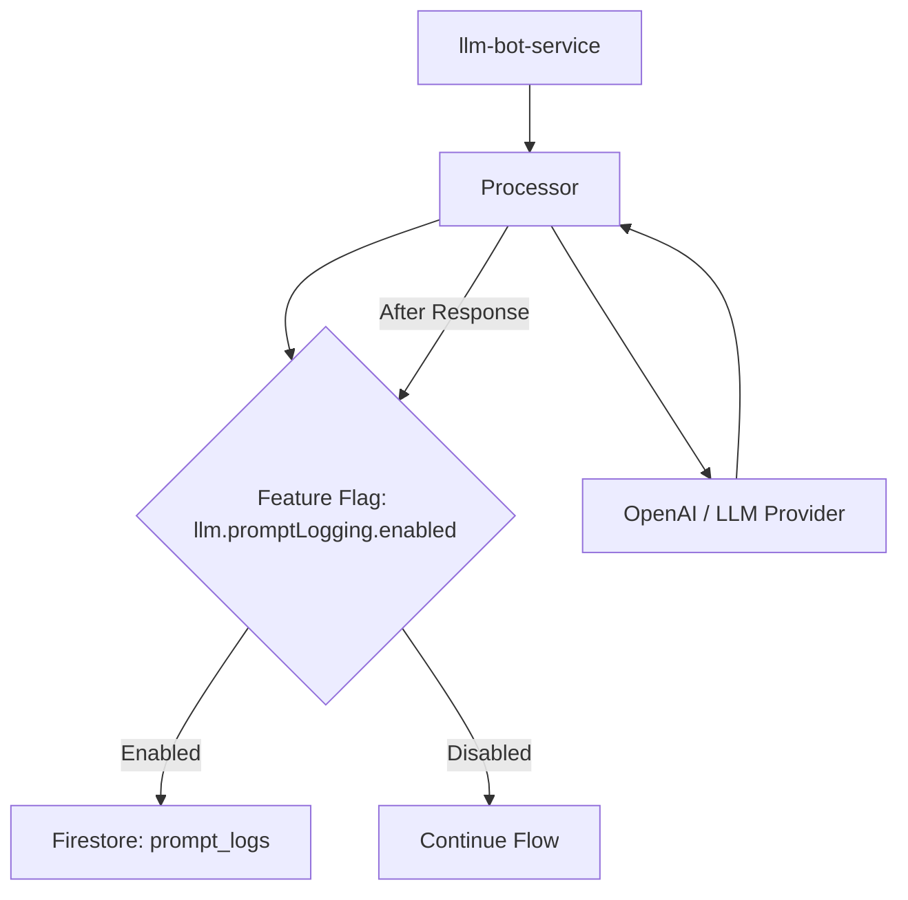

# Technical Architecture – LLM Prompt Logging

## Overview
To improve LLM prompt engineering, we need to capture the exact prompts sent to the LLM and the responses received. This document outlines the architectural approach to implement this logging mechanism using Firestore and a feature flag for control.

## Component Diagram


## Detailed Design

### 1. Feature Flag
A new entry in `src/common/feature-flags.manifest.json`:
- **Key**: `llm.promptLogging.enabled`
- **Env Synonym**: `FF_LLM_PROMPT_LOGGING`
- **Default**: `false`

### 2. Firestore Schema
Collection: `prompt_logs`
Document Fields:
- `correlationId` (string): From the triggering event.
- `prompt` (string): The full, assembled text sent to the LLM.
- `response` (string): The raw text response received from the LLM.
- `model` (string): The model name used (e.g., `gpt-5-mini`).
- `createdAt` (timestamp): Server-side timestamp of the log entry.

### 3. Implementation in `processor.ts`
The logging logic will be placed in the `call_model` node of the `StateGraph` in `src/services/llm-bot/processor.ts`.

**Pseudo-code:**
```typescript
const isLoggingEnabled = isFeatureEnabled('llm.promptLogging.enabled');
if (isLoggingEnabled) {
  try {
    const db = getFirestore();
    await db.collection('prompt_logs').add({
      correlationId: corr,
      prompt: input,
      response: llmText,
      model: model,
      createdAt: new Date()
    });
  } catch (err) {
    logger.warn('llm_bot.prompt_logging_failed', { error: err.message });
    // Fail-soft: do not throw to avoid interrupting the main flow
  }
}
```

### 4. Performance Considerations
- Firestore writes are asynchronous.
- We will NOT `await` the logging call if we want to minimize latency, OR we will wrap it in a `try-catch` to ensure it doesn't block the main response if it fails.
- Given the goal is "safe place" and "gather data", a slight latency increase during the `call_model` node is acceptable.

### 5. Security & Privacy
- **Redaction**: We should ensure `redactText` is applied if there are known sensitive patterns, although the requirement asks for "full text". We will follow existing redaction patterns used in `processor.ts`.
- **Access Control**: Firestore rules should restrict access to this collection to authorized service accounts/administrators only.

## Alternatives Considered
- **Cloud Logging**: Easier to set up but harder to query for structured analysis across thousands of prompts compared to Firestore.
- **BigQuery**: Better for massive scale, but Firestore is already used in the project and sufficient for the current phase of "gather data in a safe place".
