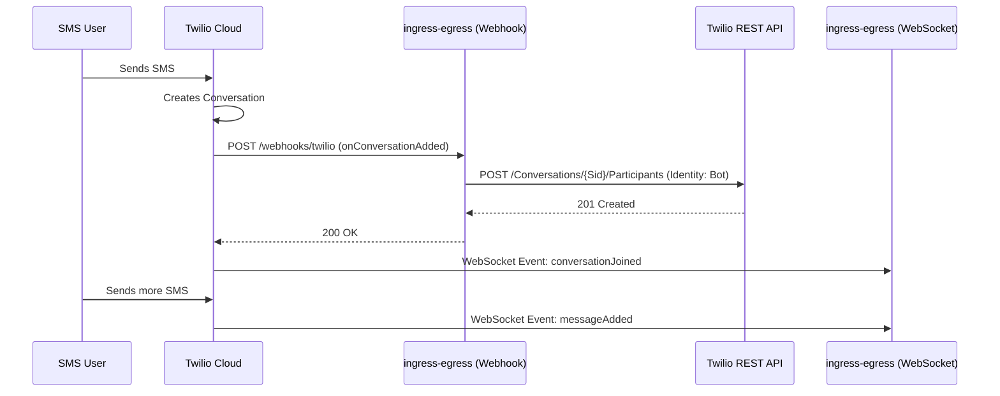

# Technical Architecture: Twilio Hybrid Approach

## 1. Executive Summary
This document outlines the hybrid integration strategy for Twilio Conversations within the BitBrat Platform. By combining the real-time capabilities of the WebSocket SDK with the management power of the REST API, we ensure that the bot reliably participates in all relevant conversations, specifically those initiated via SMS.

## 2. Problem Statement
The current WebSocket-only implementation relies on the bot identity being pre-added to conversations. When a new SMS is received, Twilio creates a conversation but does not automatically add the bot identity. Consequently, the WebSocket client—which only receives events for conversations where it is a participant—never sees the new conversation or its messages.

## 3. Proposed Hybrid Approach
The hybrid approach uses a **Service-Side Webhook** to react to conversation lifecycle events and the **Twilio REST API** to manage participation.

### 3.1 Implementation Flow
1. **SMS Ingress**: An external user sends an SMS to the Twilio Phone Number.
2. **Conversation Creation**: Twilio auto-creates a new Conversation resource.
3. **Webhook Trigger**: Twilio fires an `onConversationAdded` webhook event to the BitBrat Platform.
4. **Participant Injection**: The BitBrat `ingress-egress` service receives the webhook and uses the Twilio REST API to add the bot identity (`TWILIO_IDENTITY`) as a participant.
5. **WebSocket Synchronization**: The `TwilioIngressClient` (already connected via WebSocket) receives a `conversationJoined` event and automatically starts listening for `messageAdded` events.

## 4. Technical Design

### 4.1 Sequence Diagram


### 4.2 Webhook Specification
- **Endpoint**: `/webhooks/twilio`
- **Method**: `POST`
- **Authentication**: Twilio Signature Validation (using `X-Twilio-Signature` and `TWILIO_AUTH_TOKEN`).
- **Payload**: `application/x-www-form-urlencoded`
- **Key Fields**:
    - `EventType`: `onConversationAdded`
    - `ConversationSid`: The unique identifier for the conversation.

### 4.3 REST API Integration
The `TwilioIngressClient` or a new `TwilioWebhookHandler` will use the `twilio` npm package:
```typescript
import twilio from 'twilio';

const client = twilio(accountSid, authToken);
await client.conversations.v1.conversations(conversationSid)
  .participants
  .create({ identity: botIdentity });
```

## 5. Configuration Requirements

### 5.1 Environment Variables (ingress-egress)
No new variables are required if existing credentials are used, but we must ensure `TWILIO_AUTH_TOKEN` is available for signature validation.

### 5.2 Twilio Console Setup
1. **Webhook URL**: Set the Service-level Webhook URL to `https://api.bitbrat.ai/webhooks/twilio`.
2. **Event Filters**: Enable `onConversationAdded` in the "Post-event Webhooks" section.

## 6. Scalability & Resilience
- **Idempotency**: Adding a participant who is already present returns a `400` or `409` error (depending on Twilio version/config); the handler should treat "Participant already exists" as a success.
- **Retries**: Twilio webhooks have built-in retry logic.
- **Concurrency**: Since the `ingress-egress` service is scaled, multiple instances might receive the same webhook if Twilio retries. REST API calls must be idempotent.

## 7. Implementation Roadmap
1. **Phase 1**: Add `/webhooks/twilio` endpoint to `ingress-egress-service.ts`.
2. **Phase 2**: Implement Twilio Signature validation.
3. **Phase 3**: Implement the "Add Participant" logic using the REST SDK.
4. **Phase 4**: Update Load Balancer rules in `architecture.yaml` to route `/webhooks/twilio`.
5. **Phase 5**: Update `TwilioEnvelopeBuilder` to capture and include participant metadata (FriendlyName, ChannelType).
6. **Phase 6**: Update `auth` service to use metadata for profile creation.
7. **Phase 7**: Update Twilio Console configuration.

## 8. User Identification & Profile Creation
To ensure the `auth` service can appropriately create and manage user profiles, the platform must capture and transmit rich participant metadata from Twilio.

### 8.1 Data Capture Strategy
The `TwilioIngressClient` and its corresponding `TwilioEnvelopeBuilder` will be enhanced to fetch and transmit participant details.

**Key fields to be captured:**
- **Primary Identifier**: The `Author` identity. For SMS/WhatsApp, this is the E.164 phone number.
- **Display Name**: Derived from `Participant.friendlyName`. If empty, it falls back to a masked version of the phone number (e.g., `+1...1234`) or the raw identity.
- **Channel Context**: The `MessagingBinding` type (e.g., `sms`, `whatsapp`, `chat`).
- **Metadata**: Custom attributes from the Twilio Participant record.

### 8.2 Event Enrichment (auth service)
The `auth` service's `enrichEvent` logic (specifically `mapTwilioEnrichment`) will use this data to:
1. **Unique ID**: Create a `twilio:<identity>` composite ID for stable user lookup.
2. **Profile Creation**: Auto-create a `users` document if one does not exist.
3. **Metadata Sync**: Store the `conversationSid` and `channelType` in the user's profile to track the last used communication method.

### 8.3 Sequence Detail: Participant Metadata
When a message arrives via WebSocket:
1. `TwilioIngressClient` receives `messageAdded`.
2. The client retrieves the `Participant` object for the message author from the conversation's participant list.
3. The `TwilioEnvelopeBuilder` includes `participant.friendlyName` and `participant.attributes` in the `rawPlatformPayload`.
4. The `InternalEventV2` is published with this rich context.
