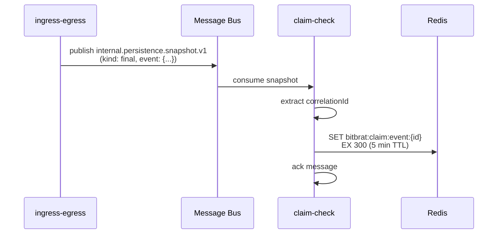
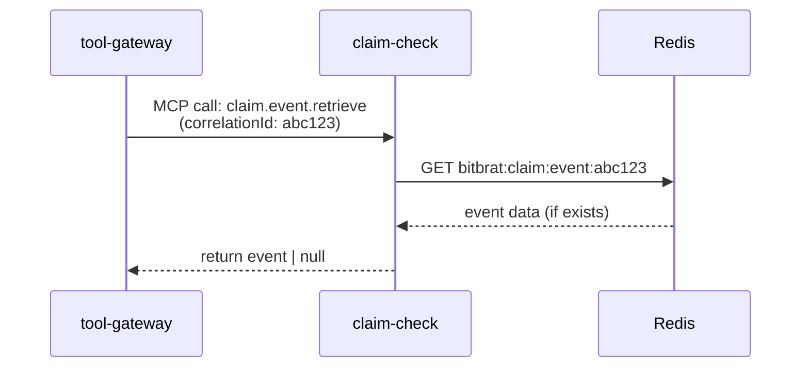
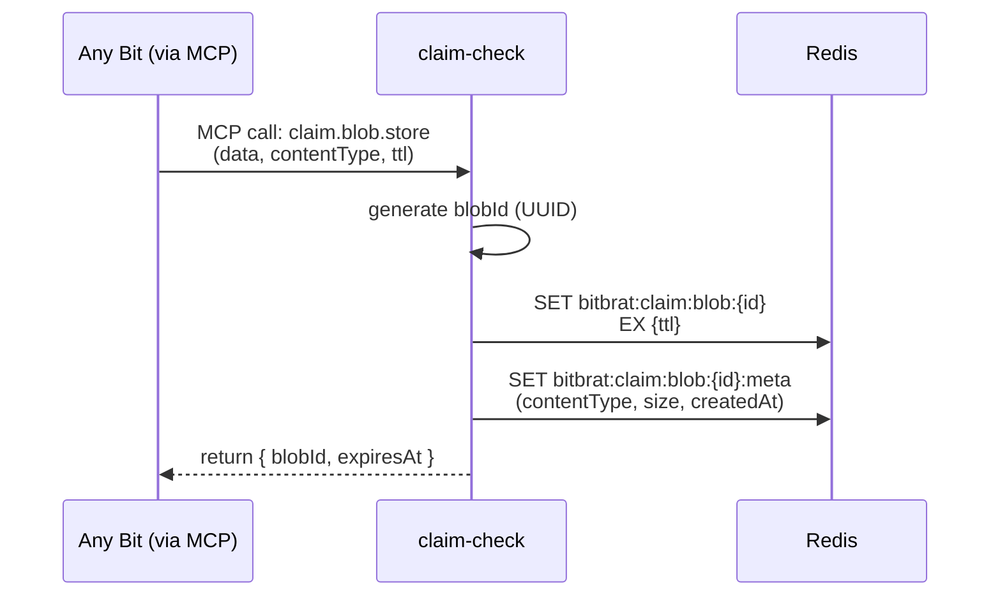

# Technical Architecture: Claim Check Bit
## Sprint 24 (sprint-24-jxvb9x)

**Architect**: Claude Code (Architect Role)
**Owner**: claude
**Created**: 2026-08-23
**Status**: Planning

---

## Executive Summary

This document provides a comprehensive technical architecture for implementing a **Claim Check Bit** that provides platform-wide temporary storage for events and large content blobs. The Claim Check pattern enables Bits to offload content to Redis-backed temporary storage and reference it by ID, solving two critical use cases: cross-bit event access and multi-modal content handling.

**Current State**: Bits have no mechanism to access events outside their routing slip scope. The tool-gateway cannot access the source event when tools are invoked (needed for progress messages). Multi-modal content (images, videos, files) has no standard storage pattern.

**Target State**: A dedicated claim-check Bit providing:
1. Event claim check service (stores successfully persisted events in Redis by correlationId)
2. Blob storage service (stores multi-modal content with aggressive TTL)
3. MCP tools for storing and retrieving checked content
4. Client utilities integrated into base Bit class

**Key Deliverables**:
1. New claim-check Bit (core profile, platform-only MCP exposure)
2. Redis-backed storage with configurable TTL (default: 5 minutes)
3. Event snapshot listener (consumes `internal.persistence.snapshot.v1`)
4. MCP tools: `claim.store`, `claim.retrieve`, `claim.exists`, `claim.delete`
5. Base Bit integration for easy access
6. Comprehensive testing and documentation

**Out of Scope** (deferred to future sprints):
- Multi-modal content auto-detection in integration Bits
- Reference annotation pattern for multi-modal content
- Long-term storage migration (Redis → Object Storage)
- Advanced features (partial retrieval, compression, encryption)

---

## Table of Contents

1. [Problem Statement](#1-problem-statement)
2. [Current State Analysis](#2-current-state-analysis)
3. [Requirements](#3-requirements)
4. [Architecture Principles](#4-architecture-principles)
5. [Proposed Architecture](#5-proposed-architecture)
6. [Detailed Design](#6-detailed-design)
7. [Data Model](#7-data-model)
8. [API Specification](#8-api-specification)
9. [Implementation Plan](#9-implementation-plan)
10. [Testing Strategy](#10-testing-strategy)
11. [Deployment Strategy](#11-deployment-strategy)
12. [Success Metrics](#12-success-metrics)
13. [Future Enhancements](#13-future-enhancements)
14. [Alternatives Considered](#14-alternatives-considered)

---

## 1. Problem Statement

### 1.1 Cross-Bit Event Access Problem

**Use Case**: Tool-gateway needs access to the source event when an agent invokes a tool.

**Example** (Progress Message Tool - Sprint 22):
```typescript
// In llm-bot service
const toolResult = await this.mcpClient.callTool('agent.sendProgressUpdate', {
  message: 'Analyzing your code...'
});

// Problem: tool-gateway receives tool call but has NO ACCESS to:
// - Original user request
// - Event ingress metadata (platform, channel, user ID)
// - Event egress configuration (how to deliver the progress message)
// - Routing context (correlationId, routing slip)
```

**Current Workaround**: None. Tool-gateway cannot implement features requiring source event context.

**Impact**:
- Progress messages cannot be sent from tools (Sprint 22 blocker)
- Tools cannot access user identity/permissions from parent event
- Tools cannot trace back to original request for logging/debugging
- Cross-Bit coordination is difficult without shared event context

### 1.2 Multi-Modal Content Problem

**Use Case**: Integration Bits receive multi-modal content (images, videos, files) that must flow through the agent orchestration pipeline.

**Example** (Discord image upload):
```typescript
// Discord bot receives message with image attachment
const event: InternalEventV2 = {
  v: '2',
  type: 'internal.ingress.v1',
  message: { role: 'user', text: 'What is in this image?' },
  payload: {
    // PROBLEM: Where does the image data go?
    attachments: [{ url: 'https://cdn.discord.com/...', size: '2.5MB', type: 'image/png' }]
  },
  // Event flows through: router → auth → llm-bot → egress
  // Image URL may expire before llm-bot processes it
  // Event payload becomes bloated if we embed the binary data
};
```

**Current State**: No standard pattern for multi-modal content.

**Impact**:
- Events become bloated with binary data
- CDN URLs expire before processing completes
- No separation of concerns (content vs metadata)
- Difficult to implement image analysis, transcription, etc.

### 1.3 The Gap

**We need**:
1. **Temporary event storage**: Store successfully persisted events by correlationId for cross-Bit access
2. **Blob storage**: Store large content separate from events with aggressive TTL
3. **Simple API**: MCP tools for store/retrieve operations
4. **Bit integration**: Easy access pattern from any Bit

---

## 2. Current State Analysis

### 2.1 Existing Storage Infrastructure

#### A. Redis Infrastructure (Sprint 1)

**Current Use**: Distributed idempotency tracking

**Location**: `src/common/resources/redis-manager.ts`

**Pattern**:
```typescript
// Singleton Redis connection manager
const redis = await RedisManager.setup(context);

// Atomic operations
await redis.set(key, 'processed', { NX: true, EX: ttlSeconds });
```

**Capabilities**:
- Singleton connection with auto-reconnect
- Health checks and graceful shutdown
- Fail-open resilience strategy
- Environment-driven configuration (`REDIS_URL`)
- Already deployed in all environments

**Architecture** (from architecture.yaml:235-270):
```yaml
caching:
  service: redis
  image: redis:7-alpine
  command:
    - redis-server
    - '--maxmemory'
    - 512mb
    - '--maxmemory-policy'
    - allkeys-lru
    - '--appendonly'
    - 'yes'
```

**Assessment**: ✅ Redis is production-ready and suitable for claim check storage.

#### B. Persistence Snapshot System

**Topic**: `internal.persistence.snapshot.v1`

**Purpose**: Audit logging of successfully persisted events

**Location**: `src/common/events/persistence-snapshots.ts`

**Publishers** (from architecture.yaml):
- `ingress-egress` (line 598)
- `api-gateway` (line 756)
- `scheduler` (line 829)

**Consumer**:
- `persistence` service (line 76 of persistence-service.ts)

**Event Schema**:
```typescript
interface PersistenceSnapshotEventV1 {
  v: '1';
  correlationId: string;
  kind: 'initial' | 'intermediate' | 'final' | 'deadletter';
  capturedAt: string;
  sourceService: string;
  sourceTopic: string;
  idempotencyKey: string;
  stage?: RoutingStage;
  stepId?: string;
  attempt?: number;
  changeSummary?: string;
  delivery?: SnapshotDeliveryV1;
  deadletter?: SnapshotDeadletterV1;
  event: InternalEventV2;  // Full event snapshot
}
```

**Assessment**: ✅ Persistence snapshots provide the exact event data we need. The claim-check Bit can subscribe to `internal.persistence.snapshot.v1` and store events in Redis.

#### C. MCP Infrastructure

**Bit Model** (Sprint 324):
- Every Bit exposes MCP control plane
- `registerTool()` for tool registration
- `McpClientProfile` mixin for tool consumption
- Tool discovery via `internal.mcp.registration.v1`

**Tool Gateway**:
- Proxies MCP tools from all Bits
- Enforces RBAC
- Routes tool calls to appropriate Bit

**Assessment**: ✅ MCP infrastructure is mature. Claim check tools follow established patterns.

### 2.2 Related Patterns

#### A. RedisManager Resource Pattern

**File**: `src/common/resources/redis-manager.ts:18-90`

**Pattern**:
```typescript
export class RedisManager implements ResourceManager<RedisClientType> {
  async setup(context: SetupContext): Promise<RedisClientType> {
    // Singleton memoization
    if (memoizedClient) return memoizedClient;

    // Create client with retry strategy
    const client = createClient({
      url: redisUrl,
      socket: { reconnectStrategy: (retries) => Math.min(500 * Math.pow(1.5, retries), 3000) }
    });

    // Validate connection
    await client.connect();
    const pong = await client.ping();
    if (pong !== 'PONG') throw new Error('Redis PING failed');

    memoizedClient = client;
    return client;
  }
}
```

**Assessment**: ✅ Claim check Bit will reuse existing RedisManager pattern.

#### B. Idempotency Key Format

**File**: `src/common/idempotency-middleware.ts:89-113`

**Pattern**:
```typescript
function generateIdempotencyKey(config: IdempotencyConfig): string {
  const normalizedTopic = normalizeTopic(config.topic);
  const parts = ['bitbrat', 'idempotency', normalizedTopic, config.correlationId];
  if (config.source) parts.push(config.source);
  return parts.join(':');
}

// Example: bitbrat:idempotency:internal:egress:v1:abc123:ingress-egress
```

**Assessment**: ✅ Claim check will follow similar key naming: `bitbrat:claim:{type}:{id}`

### 2.3 Gap Analysis

| Capability | Current State | Required | Gap |
|------------|---------------|----------|-----|
| Redis connection | ✅ RedisManager exists | Redis storage | None |
| Event snapshots | ✅ Published to topic | Consume snapshots | New subscriber |
| Event storage | ❌ Not implemented | Store by correlationId | New functionality |
| Blob storage | ❌ Not implemented | Store binary/large data | New functionality |
| Retrieval API | ❌ Not implemented | MCP tools | New tools |
| TTL management | ✅ Redis supports | Aggressive expiry | Configuration |
| Base Bit integration | ❌ Not implemented | Easy access pattern | New helper methods |

**Conclusion**: Infrastructure exists. Need to implement claim check logic and MCP API.

---

## 3. Requirements

### 3.1 Functional Requirements

#### FR1: Event Claim Check

**Requirement**: Store successfully persisted events in Redis for cross-Bit retrieval.

**Acceptance Criteria**:
- Subscribe to `internal.persistence.snapshot.v1` topic
- Store events with `kind: 'final'` (successful completions)
- Index by `correlationId` for fast retrieval
- Automatic expiration after configurable TTL (default: 5 minutes)
- Support retrieval by correlationId from any Bit via MCP tools

#### FR2: Blob Storage

**Requirement**: Store arbitrary binary/large content blobs with generated IDs.

**Acceptance Criteria**:
- Accept blob data (Buffer, base64, JSON) via MCP tool
- Generate unique blob ID (UUID or custom)
- Store in Redis with metadata (contentType, size, createdAt)
- Return blob ID for reference in events/annotations
- Retrieve blob by ID
- Automatic expiration after configurable TTL (default: 5 minutes)

#### FR3: MCP Tools API

**Requirement**: Expose claim check operations via MCP tools.

**Tools**:
1. `claim.event.retrieve` - Get event by correlationId
2. `claim.event.exists` - Check if event exists
3. `claim.blob.store` - Store blob, return ID
4. `claim.blob.retrieve` - Get blob by ID
5. `claim.blob.exists` - Check if blob exists
6. `claim.blob.delete` - Explicit deletion (optional, TTL handles most cases)

#### FR4: Base Bit Integration

**Requirement**: Provide convenient access from any Bit.

**Pattern**:
```typescript
// In any Bit that has McpClientProfile
const event = await this.getClaimedEvent(correlationId);
const blobId = await this.storeBlob(buffer, { contentType: 'image/png' });
const blob = await this.retrieveBlob(blobId);
```

### 3.2 Non-Functional Requirements

#### NFR1: Performance

- **Latency**: Store/retrieve operations < 50ms (p95)
- **Throughput**: Support 100 req/sec on single instance
- **Scalability**: Horizontal scaling via Redis clustering (future)

#### NFR2: Reliability

- **Availability**: 99.9% (follows Redis availability)
- **Durability**: Best-effort (Redis AOF enabled, but acceptable to lose on crash)
- **Fail-open**: Service degradation on Redis failure (log warning, return null)

#### NFR3: Security

- **Isolation**: Separate key namespaces for events vs blobs
- **TTL enforcement**: Aggressive expiration to prevent data accumulation
- **Size limits**: Max event size 1MB, max blob size 10MB (configurable)

#### NFR4: Observability

- **Logging**: All store/retrieve operations logged with correlationId
- **Metrics**: Cache hit/miss rates, storage utilization, TTL distribution
- **Health checks**: Redis connectivity check via `bit.health` tool

### 3.3 Constraints

1. **Redis-only**: No fallback storage backend (PostgreSQL/Object Storage)
2. **Temporary storage**: Not designed for long-term retention
3. **No versioning**: Latest value overwrites previous (by key)
4. **No transactions**: Individual operations are atomic, but no multi-key ACID
5. **Platform Bit**: Must be deployed for platform to function (added to core orchestration)

---

## 4. Architecture Principles

### 4.1 Design Principles

#### P1: Separation of Concerns
- Event claim check vs blob storage are separate logical domains
- Separate Redis key namespaces: `bitbrat:claim:event:*` vs `bitbrat:claim:blob:*`
- Separate MCP tools for clarity

#### P2: Fail-Open Resilience
- Redis unavailable → log warning, return null (don't crash)
- Invalid data → log error, return null
- Follows existing platform pattern (idempotency middleware)

#### P3: Simple API
- 5 MCP tools total (event: 2, blob: 3)
- No complex query interfaces (get by ID only)
- No pagination, filtering, searching (out of scope)

#### P4: Aggressive TTL
- Default TTL: 300 seconds (5 minutes)
- Configurable per-claim via tool parameters
- Max TTL: 3600 seconds (1 hour)
- Prevents Redis memory bloat

#### P5: Composability
- Claim check is infrastructure, not business logic
- Other Bits compose with claim check via MCP tools
- No direct coupling (all access via MCP)

### 4.2 Integration Patterns

#### Pattern A: Event Claim Check (Push)



#### Pattern B: Event Retrieval (Pull)



#### Pattern C: Blob Storage



### 4.3 Bit Profile

**Claim Check Bit Configuration**:

```yaml
# architecture.yaml
services:
  claim-check:
    active: true
    category: platform
    profile: core
    kind: pipeline-service
    mcp:
      exposure: platform-only  # Tools are platform-internal
    port: 3008
    entry: src/apps/claim-check-service.ts
    stage: persist  # Operates in persist stage
    topics:
      consumes:
        - internal.persistence.snapshot.v1
      produces: []  # No event publishing (pure storage service)
    env:
      REDIS_URL: ${REDIS_URL}
      CLAIM_CHECK_DEFAULT_TTL_SECONDS: 300
      CLAIM_CHECK_MAX_EVENT_SIZE_BYTES: 1048576  # 1MB
      CLAIM_CHECK_MAX_BLOB_SIZE_BYTES: 10485760  # 10MB
      CLAIM_CHECK_ENABLED: true
    resources:
      - redis
```

**Reasoning**:
- **category: platform**: Core infrastructure, not domain extension
- **profile: core**: Standard Bit, no LLM/gateway capabilities needed
- **mcp.exposure: platform-only**: Tools are for platform Bits only (not exposed to external agents)
- **stage: persist**: Logical stage (storage/audit), though not in main event flow
- **consumes: internal.persistence.snapshot.v1**: Passive listener, no active routing

---

## 5. Proposed Architecture

### 5.1 System Context

```
┌────────────────────────────────────────────────────────────┐
│                    BitBrat Platform                         │
│                                                              │
│  ┌─────────────┐    ┌──────────────┐    ┌──────────────┐  │
│  │ ingress-    │───▶│ persistence  │───▶│ claim-check  │  │
│  │ egress      │    │ snapshots    │    │              │  │
│  └─────────────┘    │ topic        │    │ • Event store│  │
│                      └──────────────┘    │ • Blob store │  │
│  ┌─────────────┐                         │ • MCP tools  │  │
│  │ tool-       │◀────────MCP─────────────│              │  │
│  │ gateway     │    claim.event.retrieve └──────────────┘  │
│  └─────────────┘                                │          │
│                                                  ▼          │
│  ┌─────────────┐                         ┌──────────────┐  │
│  │ llm-bot     │◀────────MCP─────────────│   Redis      │  │
│  │             │    claim.blob.store     │              │  │
│  └─────────────┘                         │ • allkeys-lru│  │
│                                           │ • 512MB max  │  │
│                                           │ • AOF persist│  │
│                                           └──────────────┘  │
└────────────────────────────────────────────────────────────┘
```

### 5.2 Component Architecture

```
┌─────────────────────────────────────────────────┐
│            Claim Check Bit                       │
├─────────────────────────────────────────────────┤
│  MCP Server (platform-only exposure)             │
│  ┌─────────────────────────────────────────┐   │
│  │ claim.event.retrieve                     │   │
│  │ claim.event.exists                       │   │
│  │ claim.blob.store                         │   │
│  │ claim.blob.retrieve                      │   │
│  │ claim.blob.exists                        │   │
│  └─────────────────────────────────────────┘   │
├─────────────────────────────────────────────────┤
│  Message Bus Subscriber                          │
│  ┌─────────────────────────────────────────┐   │
│  │ onMessage(persistence.snapshot.v1)       │   │
│  │  → storeEventClaim(correlationId, event) │   │
│  └─────────────────────────────────────────┘   │
├─────────────────────────────────────────────────┤
│  ClaimCheckService (Business Logic)              │
│  ┌─────────────────────────────────────────┐   │
│  │ storeEventClaim(id, event, ttl)          │   │
│  │ retrieveEventClaim(id)                   │   │
│  │ eventClaimExists(id)                     │   │
│  │ storeBlobClaim(data, meta, ttl)          │   │
│  │ retrieveBlobClaim(id)                    │   │
│  │ blobClaimExists(id)                      │   │
│  │ deleteBlobClaim(id)                      │   │
│  └─────────────────────────────────────────┘   │
├─────────────────────────────────────────────────┤
│  RedisManager (Infrastructure)                   │
│  ┌─────────────────────────────────────────┐   │
│  │ Singleton connection                     │   │
│  │ Auto-reconnect with backoff              │   │
│  │ Health checks                            │   │
│  │ Graceful shutdown                        │   │
│  └─────────────────────────────────────────┘   │
└─────────────────────────────────────────────────┘
```

### 5.3 Data Flow

#### Use Case 1: Tool-gateway accesses source event

```
1. User sends message: "What is the status?"
   └─▶ ingress-egress publishes internal.ingress.v1
       └─▶ router → auth → llm-bot (routing slip)

2. llm-bot decides to call tool
   └─▶ calls MCP tool: agent.sendProgressUpdate({ message: "Checking status..." })
       └─▶ tool-gateway receives tool call
           ├─ Problem: How to send progress to original user?
           └─▶ Solution: Get source event from claim check

3. Meanwhile, ingress-egress published final snapshot
   └─▶ internal.persistence.snapshot.v1
       └─▶ claim-check consumes
           └─▶ stores event in Redis: bitbrat:claim:event:{correlationId}

4. tool-gateway retrieves event
   └─▶ MCP call: claim.event.retrieve({ correlationId })
       └─▶ claim-check: GET bitbrat:claim:event:{correlationId}
           └─▶ returns full event with ingress/egress metadata
               └─▶ tool-gateway can now publish progress to user!
```

#### Use Case 2: Discord image processing

```
1. User uploads image to Discord
   └─▶ Discord integration receives image
       ├─ Downloads image from CDN (binary data)
       └─▶ Calls claim.blob.store({ data: buffer, contentType: 'image/png' })
           └─▶ claim-check stores blob in Redis
               └─▶ returns { blobId: 'blob-abc123', expiresAt: '...' }

2. Integration creates event with reference
   └─▶ internal.ingress.v1:
       {
         message: { text: "What is in this image?" },
         annotations: [{
           kind: 'media_reference',
           value: { blobId: 'blob-abc123', contentType: 'image/png' }
         }]
       }

3. LLM-bot processes event
   └─▶ Sees media_reference annotation
       └─▶ MCP call: claim.blob.retrieve({ blobId: 'blob-abc123' })
           └─▶ claim-check: GET bitbrat:claim:blob:blob-abc123
               └─▶ returns image data
                   └─▶ llm-bot sends to vision API
```

---

## 6. Detailed Design

### 6.1 Service Structure

**File**: `src/apps/claim-check-service.ts`

```typescript
import { Bit } from '../common/base-server';
import { ClaimCheckService } from '../services/claim-check/claim-check-service';
import { PersistenceSnapshotEventV1 } from '../types/events';
import type { RedisClientType } from 'redis';
import { z } from 'zod';

export class ClaimCheckBit extends Bit {
  private claimService!: ClaimCheckService;

  async setup(): Promise<void> {
    // Initialize Redis-backed claim check service
    const redis = this.resources.redis as RedisClientType;
    if (!redis) {
      this.logger.error('claim_check.redis_unavailable', {
        message: 'Redis not available - claim check disabled'
      });
      return;
    }

    this.claimService = new ClaimCheckService(redis, this.config, this.logger);

    // Register MCP tools
    this.registerEventClaimTools();
    this.registerBlobClaimTools();

    // Subscribe to persistence snapshots
    await this.subscribeToSnapshotTopic();
  }

  private registerEventClaimTools(): void {
    this.registerTool(
      'claim.event.retrieve',
      'Retrieve a claimed event by correlationId',
      z.object({
        correlationId: z.string().describe('Correlation ID of the event to retrieve')
      }),
      async (args) => {
        const event = await this.claimService.retrieveEventClaim(args.correlationId);
        return {
          content: [{ type: 'text', text: event ? JSON.stringify(event, null, 2) : 'Event not found' }],
          isError: !event
        };
      }
    );

    this.registerTool(
      'claim.event.exists',
      'Check if a claimed event exists by correlationId',
      z.object({
        correlationId: z.string().describe('Correlation ID to check')
      }),
      async (args) => {
        const exists = await this.claimService.eventClaimExists(args.correlationId);
        return {
          content: [{ type: 'text', text: JSON.stringify({ exists }) }]
        };
      }
    );
  }

  private registerBlobClaimTools(): void {
    this.registerTool(
      'claim.blob.store',
      'Store a blob and receive a claim ID',
      z.object({
        data: z.string().describe('Base64-encoded blob data'),
        contentType: z.string().optional().describe('MIME type (e.g., image/png)'),
        ttl: z.number().optional().describe('TTL in seconds (default: 300, max: 3600)')
      }),
      async (args) => {
        const buffer = Buffer.from(args.data, 'base64');
        const result = await this.claimService.storeBlobClaim(buffer, {
          contentType: args.contentType,
          ttl: args.ttl
        });
        return {
          content: [{ type: 'text', text: JSON.stringify(result) }]
        };
      }
    );

    this.registerTool(
      'claim.blob.retrieve',
      'Retrieve a blob by claim ID',
      z.object({
        blobId: z.string().describe('Blob claim ID to retrieve')
      }),
      async (args) => {
        const blob = await this.claimService.retrieveBlobClaim(args.blobId);
        if (!blob) {
          return {
            content: [{ type: 'text', text: 'Blob not found or expired' }],
            isError: true
          };
        }
        return {
          content: [{
            type: 'text',
            text: JSON.stringify({
              blobId: args.blobId,
              contentType: blob.contentType,
              size: blob.data.length,
              data: blob.data.toString('base64')
            })
          }]
        };
      }
    );

    this.registerTool(
      'claim.blob.exists',
      'Check if a blob exists by claim ID',
      z.object({
        blobId: z.string().describe('Blob claim ID to check')
      }),
      async (args) => {
        const exists = await this.claimService.blobClaimExists(args.blobId);
        return {
          content: [{ type: 'text', text: JSON.stringify({ exists }) }]
        };
      }
    );
  }

  private async subscribeToSnapshotTopic(): Promise<void> {
    await this.onMessage<PersistenceSnapshotEventV1>(
      'internal.persistence.snapshot.v1',
      async (snapshot, attrs, ctx) => {
        try {
          // Only store final snapshots (successful completions)
          if (snapshot.kind !== 'final') {
            await ctx.ack();
            return;
          }

          const ttl = this.config.CLAIM_CHECK_DEFAULT_TTL_SECONDS || 300;
          await this.claimService.storeEventClaim(
            snapshot.correlationId,
            snapshot.event,
            ttl
          );

          this.logger.debug('claim_check.event.stored', {
            correlationId: snapshot.correlationId,
            sourceService: snapshot.sourceService,
            ttl
          });
        } catch (error: any) {
          this.logger.error('claim_check.snapshot.error', {
            correlationId: snapshot.correlationId,
            error: error.message
          });
        } finally {
          await ctx.ack();
        }
      }
    );
  }
}
```

### 6.2 Core Service Logic

**File**: `src/services/claim-check/claim-check-service.ts`

```typescript
import type { RedisClientType } from 'redis';
import type { Logger } from '../../common/logging';
import type { IConfig, InternalEventV2 } from '../../types';
import { randomUUID } from 'crypto';

export interface BlobMetadata {
  contentType?: string;
  size: number;
  createdAt: string;
  expiresAt: string;
}

export interface BlobStoreResult {
  blobId: string;
  size: number;
  expiresAt: string;
}

export interface BlobRetrieveResult {
  data: Buffer;
  contentType?: string;
  metadata: BlobMetadata;
}

export class ClaimCheckService {
  private readonly maxEventSize: number;
  private readonly maxBlobSize: number;
  private readonly defaultTtl: number;
  private readonly maxTtl: number;

  constructor(
    private redis: RedisClientType,
    private config: IConfig,
    private logger: Logger
  ) {
    this.maxEventSize = parseInt(String(config.CLAIM_CHECK_MAX_EVENT_SIZE_BYTES || '1048576'), 10);
    this.maxBlobSize = parseInt(String(config.CLAIM_CHECK_MAX_BLOB_SIZE_BYTES || '10485760'), 10);
    this.defaultTtl = parseInt(String(config.CLAIM_CHECK_DEFAULT_TTL_SECONDS || '300'), 10);
    this.maxTtl = parseInt(String(config.CLAIM_CHECK_MAX_TTL_SECONDS || '3600'), 10);
  }

  // ─────────────────────────────────────────────────────────
  // Event Claim Check
  // ─────────────────────────────────────────────────────────

  async storeEventClaim(
    correlationId: string,
    event: InternalEventV2,
    ttl?: number
  ): Promise<void> {
    const key = this.eventKey(correlationId);
    const effectiveTtl = this.normalizeTtl(ttl);
    const json = JSON.stringify(event);

    if (Buffer.byteLength(json, 'utf8') > this.maxEventSize) {
      throw new Error(`Event exceeds max size (${this.maxEventSize} bytes)`);
    }

    await this.redis.set(key, json, { EX: effectiveTtl });

    this.logger.info('claim_check.event.stored', {
      correlationId,
      size: json.length,
      ttl: effectiveTtl
    });
  }

  async retrieveEventClaim(correlationId: string): Promise<InternalEventV2 | null> {
    const key = this.eventKey(correlationId);
    const json = await this.redis.get(key);

    if (!json) {
      this.logger.debug('claim_check.event.not_found', { correlationId });
      return null;
    }

    try {
      const event = JSON.parse(json) as InternalEventV2;
      this.logger.debug('claim_check.event.retrieved', { correlationId });
      return event;
    } catch (error: any) {
      this.logger.error('claim_check.event.parse_error', {
        correlationId,
        error: error.message
      });
      return null;
    }
  }

  async eventClaimExists(correlationId: string): Promise<boolean> {
    const key = this.eventKey(correlationId);
    const exists = await this.redis.exists(key);
    return exists === 1;
  }

  // ─────────────────────────────────────────────────────────
  // Blob Claim Check
  // ─────────────────────────────────────────────────────────

  async storeBlobClaim(
    data: Buffer,
    options: { contentType?: string; ttl?: number } = {}
  ): Promise<BlobStoreResult> {
    const blobId = `blob-${randomUUID()}`;
    const effectiveTtl = this.normalizeTtl(options.ttl);

    if (data.length > this.maxBlobSize) {
      throw new Error(`Blob exceeds max size (${this.maxBlobSize} bytes)`);
    }

    const metadata: BlobMetadata = {
      contentType: options.contentType,
      size: data.length,
      createdAt: new Date().toISOString(),
      expiresAt: new Date(Date.now() + effectiveTtl * 1000).toISOString()
    };

    const dataKey = this.blobDataKey(blobId);
    const metaKey = this.blobMetaKey(blobId);

    await Promise.all([
      this.redis.set(dataKey, data, { EX: effectiveTtl }),
      this.redis.set(metaKey, JSON.stringify(metadata), { EX: effectiveTtl })
    ]);

    this.logger.info('claim_check.blob.stored', {
      blobId,
      size: data.length,
      contentType: options.contentType,
      ttl: effectiveTtl
    });

    return {
      blobId,
      size: data.length,
      expiresAt: metadata.expiresAt
    };
  }

  async retrieveBlobClaim(blobId: string): Promise<BlobRetrieveResult | null> {
    const dataKey = this.blobDataKey(blobId);
    const metaKey = this.blobMetaKey(blobId);

    const [dataBuffer, metaJson] = await Promise.all([
      this.redis.getBuffer(dataKey),
      this.redis.get(metaKey)
    ]);

    if (!dataBuffer || !metaJson) {
      this.logger.debug('claim_check.blob.not_found', { blobId });
      return null;
    }

    try {
      const metadata = JSON.parse(metaJson) as BlobMetadata;
      this.logger.debug('claim_check.blob.retrieved', { blobId, size: dataBuffer.length });
      return {
        data: dataBuffer,
        contentType: metadata.contentType,
        metadata
      };
    } catch (error: any) {
      this.logger.error('claim_check.blob.metadata_parse_error', {
        blobId,
        error: error.message
      });
      return null;
    }
  }

  async blobClaimExists(blobId: string): Promise<boolean> {
    const dataKey = this.blobDataKey(blobId);
    const exists = await this.redis.exists(dataKey);
    return exists === 1;
  }

  async deleteBlobClaim(blobId: string): Promise<void> {
    const dataKey = this.blobDataKey(blobId);
    const metaKey = this.blobMetaKey(blobId);
    await Promise.all([
      this.redis.del(dataKey),
      this.redis.del(metaKey)
    ]);
    this.logger.info('claim_check.blob.deleted', { blobId });
  }

  // ─────────────────────────────────────────────────────────
  // Key Generation
  // ─────────────────────────────────────────────────────────

  private eventKey(correlationId: string): string {
    return `bitbrat:claim:event:${correlationId}`;
  }

  private blobDataKey(blobId: string): string {
    return `bitbrat:claim:blob:${blobId}`;
  }

  private blobMetaKey(blobId: string): string {
    return `bitbrat:claim:blob:${blobId}:meta`;
  }

  private normalizeTtl(ttl?: number): number {
    if (!ttl || ttl <= 0) return this.defaultTtl;
    return Math.min(ttl, this.maxTtl);
  }
}
```

### 6.3 Base Bit Helper Methods

**File**: `src/common/base-server.ts` (additions)

```typescript
// Add to Bit class

/**
 * Retrieve a claimed event by correlationId (requires McpClientProfile)
 */
protected async getClaimedEvent(correlationId: string): Promise<InternalEventV2 | null> {
  if (!this.mcpClient) {
    this.logger.warn('base_server.claim.no_mcp_client', {
      method: 'getClaimedEvent',
      message: 'McpClientProfile required to access claim check'
    });
    return null;
  }

  try {
    const result = await this.mcpClient.callTool('claim.event.retrieve', { correlationId });
    if (result.isError || !result.content?.[0]?.text) {
      return null;
    }
    const parsed = JSON.parse(result.content[0].text);
    return parsed || null;
  } catch (error: any) {
    this.logger.error('base_server.claim.retrieve_error', {
      correlationId,
      error: error.message
    });
    return null;
  }
}

/**
 * Store a blob and receive a claim ID (requires McpClientProfile)
 */
protected async storeBlob(
  data: Buffer,
  options: { contentType?: string; ttl?: number } = {}
): Promise<string | null> {
  if (!this.mcpClient) {
    this.logger.warn('base_server.claim.no_mcp_client', {
      method: 'storeBlob',
      message: 'McpClientProfile required to access claim check'
    });
    return null;
  }

  try {
    const base64 = data.toString('base64');
    const result = await this.mcpClient.callTool('claim.blob.store', {
      data: base64,
      contentType: options.contentType,
      ttl: options.ttl
    });
    if (result.isError || !result.content?.[0]?.text) {
      return null;
    }
    const parsed = JSON.parse(result.content[0].text);
    return parsed.blobId || null;
  } catch (error: any) {
    this.logger.error('base_server.claim.store_error', {
      size: data.length,
      error: error.message
    });
    return null;
  }
}

/**
 * Retrieve a blob by claim ID (requires McpClientProfile)
 */
protected async retrieveBlob(blobId: string): Promise<Buffer | null> {
  if (!this.mcpClient) {
    this.logger.warn('base_server.claim.no_mcp_client', {
      method: 'retrieveBlob',
      message: 'McpClientProfile required to access claim check'
    });
    return null;
  }

  try {
    const result = await this.mcpClient.callTool('claim.blob.retrieve', { blobId });
    if (result.isError || !result.content?.[0]?.text) {
      return null;
    }
    const parsed = JSON.parse(result.content[0].text);
    return parsed.data ? Buffer.from(parsed.data, 'base64') : null;
  } catch (error: any) {
    this.logger.error('base_server.claim.retrieve_blob_error', {
      blobId,
      error: error.message
    });
    return null;
  }
}
```

---

## 7. Data Model

### 7.1 Redis Key Schema

**Event Claims**:
```
Key:     bitbrat:claim:event:{correlationId}
Value:   JSON-serialized InternalEventV2
TTL:     300 seconds (default)
Example: bitbrat:claim:event:abc123-def456-ghi789
```

**Blob Claims (Data)**:
```
Key:     bitbrat:claim:blob:{blobId}
Value:   Raw binary data (Buffer)
TTL:     300 seconds (default)
Example: bitbrat:claim:blob:blob-abc123-def456-ghi789
```

**Blob Claims (Metadata)**:
```
Key:     bitbrat:claim:blob:{blobId}:meta
Value:   JSON-serialized BlobMetadata
TTL:     300 seconds (same as data)
Example: bitbrat:claim:blob:blob-abc123-def456-ghi789:meta

{
  "contentType": "image/png",
  "size": 2048576,
  "createdAt": "2026-08-23T10:30:00.000Z",
  "expiresAt": "2026-08-23T10:35:00.000Z"
}
```

### 7.2 Size Limits

| Item | Default Limit | Configurable | Reasoning |
|------|---------------|--------------|-----------|
| Event | 1 MB | `CLAIM_CHECK_MAX_EVENT_SIZE_BYTES` | InternalEventV2 rarely exceeds 100KB |
| Blob | 10 MB | `CLAIM_CHECK_MAX_BLOB_SIZE_BYTES` | Balance memory vs usability |
| Redis Memory | 512 MB | `--maxmemory 512mb` | Existing constraint |

**Eviction Policy**: `allkeys-lru` (existing Redis config)

**Capacity Estimate**:
- 512MB Redis memory
- Assume 50% for claim check (256MB)
- Average event size: 50KB → ~5,000 events
- Average blob size: 2MB → ~128 blobs
- Sufficient for typical workload with 5-minute TTL

---

## 8. API Specification

### 8.1 MCP Tools

#### Tool: `claim.event.retrieve`

**Description**: Retrieve a claimed event by correlationId

**Input Schema**:
```typescript
{
  correlationId: string  // Required: Correlation ID of event
}
```

**Output**:
- **Success**: Full InternalEventV2 as JSON string
- **Not Found**: "Event not found" with `isError: true`

**Example**:
```typescript
const result = await mcpClient.callTool('claim.event.retrieve', {
  correlationId: 'abc123-def456'
});
// result.content[0].text = "{ v: '2', type: 'internal.ingress.v1', ... }"
```

#### Tool: `claim.event.exists`

**Description**: Check if event exists without retrieving it

**Input Schema**:
```typescript
{
  correlationId: string  // Required: Correlation ID to check
}
```

**Output**:
```typescript
{ exists: boolean }
```

#### Tool: `claim.blob.store`

**Description**: Store a blob and receive a claim ID

**Input Schema**:
```typescript
{
  data: string,           // Required: Base64-encoded blob data
  contentType?: string,   // Optional: MIME type (e.g., "image/png")
  ttl?: number            // Optional: TTL in seconds (default: 300, max: 3600)
}
```

**Output**:
```typescript
{
  blobId: string,         // Generated blob ID
  size: number,           // Blob size in bytes
  expiresAt: string       // ISO timestamp
}
```

**Example**:
```typescript
const buffer = fs.readFileSync('image.png');
const base64 = buffer.toString('base64');
const result = await mcpClient.callTool('claim.blob.store', {
  data: base64,
  contentType: 'image/png',
  ttl: 600  // 10 minutes
});
// result.content[0].text = '{ "blobId": "blob-...", "size": 2048576, "expiresAt": "..." }'
```

#### Tool: `claim.blob.retrieve`

**Description**: Retrieve a blob by claim ID

**Input Schema**:
```typescript
{
  blobId: string  // Required: Blob claim ID
}
```

**Output**:
```typescript
{
  blobId: string,
  contentType?: string,
  size: number,
  data: string  // Base64-encoded
}
```

**Not Found**: `isError: true`, "Blob not found or expired"

#### Tool: `claim.blob.exists`

**Description**: Check if blob exists without retrieving it

**Input Schema**:
```typescript
{
  blobId: string  // Required: Blob claim ID
}
```

**Output**:
```typescript
{ exists: boolean }
```

### 8.2 Usage Examples

#### Example 1: Tool-gateway retrieves source event

```typescript
// In tool-gateway-service.ts
async handleToolCall(toolName: string, args: any, context: ToolCallContext): Promise<CallToolResult> {
  if (toolName === 'agent.sendProgressUpdate') {
    // Get the source event to extract egress metadata
    const sourceEvent = await this.getClaimedEvent(context.correlationId);
    if (!sourceEvent) {
      return {
        content: [{ type: 'text', text: 'Source event not found - cannot send progress' }],
        isError: true
      };
    }

    // Now we have ingress/egress metadata!
    const progressEvent: InternalEventV2 = {
      v: '2',
      type: 'internal.egress.v1',
      correlationId: randomUUID(),
      message: { role: 'assistant', text: args.message },
      ingress: sourceEvent.ingress,  // ✅ Available!
      egress: sourceEvent.egress,    // ✅ Available!
      routing: { stage: 'egress', slip: [] },
      identity: sourceEvent.identity,
      annotations: [{
        kind: 'progress_update',
        value: JSON.stringify({ parentCorrelationId: context.correlationId }),
        source: 'tool-gateway',
        id: randomUUID(),
        createdAt: new Date().toISOString()
      }]
    };

    await this.publish('internal.egress.v1', progressEvent);
    return {
      content: [{ type: 'text', text: 'Progress message sent' }]
    };
  }
}
```

#### Example 2: Discord integration stores image

```typescript
// In discord-connector-adapter.ts
async handleMessageWithAttachment(discordMsg: DiscordMessage): Promise<void> {
  const attachment = discordMsg.attachments[0];

  // Download image from Discord CDN
  const response = await fetch(attachment.url);
  const buffer = Buffer.from(await response.arrayBuffer());

  // Store in claim check
  const blobId = await this.storeBlob(buffer, {
    contentType: attachment.contentType,
    ttl: 600  // 10 minutes
  });

  // Create event with reference
  const event: InternalEventV2 = {
    v: '2',
    type: 'internal.ingress.v1',
    correlationId: randomUUID(),
    message: { role: 'user', text: discordMsg.content },
    annotations: [{
      kind: 'media_reference',
      value: JSON.stringify({
        blobId,
        contentType: attachment.contentType,
        size: buffer.length,
        originalUrl: attachment.url
      }),
      source: 'discord-connector',
      id: randomUUID(),
      createdAt: new Date().toISOString()
    }],
    // ... routing, identity, etc.
  };

  await this.publish('internal.ingress.v1', event);
}
```

#### Example 3: LLM-bot processes image

```typescript
// In llm-bot-service.ts
async processEvent(event: InternalEventV2): Promise<void> {
  // Check for media reference
  const mediaAnnotation = event.annotations?.find(a => a.kind === 'media_reference');
  if (!mediaAnnotation) {
    // Normal text processing
    return this.processTextMessage(event);
  }

  const ref = JSON.parse(mediaAnnotation.value);
  const imageBuffer = await this.retrieveBlob(ref.blobId);
  if (!imageBuffer) {
    this.logger.warn('llm_bot.media.expired', { blobId: ref.blobId });
    // Fallback: try to download from originalUrl if available
    return;
  }

  // Send to vision API
  const visionResult = await this.callVisionAPI(imageBuffer, event.message.text);

  // Add response candidate
  event.candidates.push({
    kind: 'text',
    text: visionResult.description,
    source: this.name,
    id: randomUUID()
  });

  await this.next(event);
}
```

---

## 9. Implementation Plan

See separate `implementation-plan.md` for detailed task breakdown.

**High-Level Phases**:

1. **Phase 1: Core Infrastructure** (P0)
   - Implement ClaimCheckService
   - Implement ClaimCheckBit with MCP tools
   - Redis integration and testing

2. **Phase 2: Event Claim Check** (P0)
   - Subscribe to persistence.snapshot.v1
   - Implement event storage on snapshot receipt
   - Test event retrieval flow

3. **Phase 3: Blob Storage** (P1)
   - Implement blob store/retrieve operations
   - Add base Bit helper methods
   - Test blob lifecycle

4. **Phase 4: Integration & Validation** (P1)
   - Update architecture.yaml
   - Deploy to agent-dev context
   - End-to-end testing with tool-gateway
   - Documentation

---

## 10. Testing Strategy

### 10.1 Unit Tests

**File**: `src/services/claim-check/claim-check-service.test.ts`

**Coverage**:
- Key generation (eventKey, blobDataKey, blobMetaKey)
- TTL normalization (default, custom, max enforcement)
- Size validation (event max, blob max)
- Error handling (Redis errors, parse errors)

**File**: `src/apps/claim-check-service.test.ts`

**Coverage**:
- MCP tool registration
- Tool input validation (Zod schemas)
- Snapshot filtering (kind === 'final')
- Message acknowledgment

### 10.2 Integration Tests

**File**: `src/apps/__tests__/claim-check.integration.test.ts`

**Scenarios**:
1. **Event claim check flow**
   - Publish persistence.snapshot.v1 (kind: final)
   - Verify event stored in Redis
   - Retrieve via MCP tool
   - Verify TTL expiration

2. **Blob storage flow**
   - Store blob via MCP tool
   - Verify data and metadata in Redis
   - Retrieve via MCP tool
   - Verify data integrity (base64 round-trip)

3. **Base Bit helpers**
   - Call `getClaimedEvent()` from test Bit
   - Call `storeBlob()` and `retrieveBlob()`
   - Verify MCP client integration

4. **Failure scenarios**
   - Redis unavailable → fail-open, return null
   - Expired claims → return null
   - Oversized data → error with clear message

### 10.3 Agent-Dev Validation

**Context**: `agent-dev-claim-check-validation`

**Validation Steps**:
1. Deploy full stack with claim-check Bit
2. Send message via ingress-egress
3. Verify event appears in Redis
4. Call claim.event.retrieve from tool-gateway
5. Verify event data matches
6. Monitor Redis memory usage
7. Wait for TTL expiration, verify cleanup

---

## 11. Deployment Strategy

### 11.1 Architecture.yaml Updates

```yaml
services:
  claim-check:
    active: true
    category: platform
    profile: core
    kind: pipeline-service
    mcp:
      exposure: platform-only
    port: 3008
    entry: src/apps/claim-check-service.ts
    dockerfile: Dockerfile.service
    stage: persist
    topics:
      consumes:
        - internal.persistence.snapshot.v1
      produces: []
    env:
      REDIS_URL: ${REDIS_URL}
      REDIS_IDEMPOTENCY_ENABLED: true
      CLAIM_CHECK_ENABLED: true
      CLAIM_CHECK_DEFAULT_TTL_SECONDS: 300
      CLAIM_CHECK_MAX_TTL_SECONDS: 3600
      CLAIM_CHECK_MAX_EVENT_SIZE_BYTES: 1048576
      CLAIM_CHECK_MAX_BLOB_SIZE_BYTES: 10485760
    resources:
      - redis
    secrets: []
    volumes: []
```

### 11.2 Deployment Order

1. **Local development**
   - Add claim-check to `npm run local` (Docker Compose)
   - Verify Redis connectivity
   - Test MCP tool discovery

2. **Agent-dev validation**
   - Deploy to isolated agent-dev context
   - Run integration tests
   - Verify tool-gateway can call claim check tools

3. **Production deployment**
   - Deploy claim-check Bit to all environments
   - Monitor Redis memory usage
   - Verify persistence snapshot consumption

### 11.3 Rollback Plan

**If claim-check fails**:
- Services gracefully degrade (fail-open pattern)
- tool-gateway returns "source event not found" errors
- No impact on core event flow (claim check is passive)

**Rollback steps**:
1. Mark claim-check as `active: false` in architecture.yaml
2. Redeploy stack
3. Investigate logs and fix issues
4. Re-enable when resolved

---

## 12. Success Metrics

### 12.1 Functional Metrics

- ✅ **Event claim check working**: 100% of final snapshots stored in Redis
- ✅ **Tool-gateway integration**: Progress messages sent successfully using claimed events
- ✅ **Blob storage working**: Multi-modal content stored and retrieved
- ✅ **TTL enforcement**: Claims expire after configured TTL (verify via Redis)

### 12.2 Performance Metrics

- **Latency**: Store/retrieve operations < 50ms (p95)
- **Throughput**: Handle 100 req/sec on single instance
- **Memory**: Redis memory < 256MB (50% of 512MB total)

### 12.3 Reliability Metrics

- **Availability**: 99.9% (follows Redis availability)
- **Error rate**: < 0.1% of operations fail
- **Fail-open**: Service continues if Redis unavailable

---

## 13. Future Enhancements

### 13.1 Multi-Modal Auto-Detection (Sprint N+1)

**Goal**: Integration Bits auto-detect multi-modal content and store via claim check

**Pattern**:
```typescript
// In Discord/Twilio connector
if (message.hasAttachment()) {
  const blobId = await this.storeBlob(attachment.data, {
    contentType: attachment.contentType
  });
  event.annotations.push({
    kind: 'media_reference',
    value: JSON.stringify({ blobId, contentType: attachment.contentType })
  });
}
```

### 13.2 Reference Annotation Pattern

**Goal**: Standardize media_reference annotation format

**Schema**:
```typescript
interface MediaReferenceAnnotation {
  kind: 'media_reference';
  value: {
    blobId: string;
    contentType: string;
    size: number;
    originalUrl?: string;  // CDN URL (may expire)
    description?: string;  // User-provided caption
  };
}
```

### 13.3 Long-Term Storage Migration

**Goal**: Move claim check from Redis → Object Storage (GCS/S3) for longer TTL

**Use Cases**:
- User uploads PDF: "Analyze this document" (may take minutes)
- Story Engine: Store character images, scene backgrounds
- Historical replay: Retrieve events from weeks ago

**Challenges**:
- Object Storage has higher latency (~100-500ms vs <10ms for Redis)
- Need separate garbage collection for expired objects
- More complex deployment (cloud credentials, CORS, presigned URLs)

### 13.4 Advanced Features

- **Partial retrieval**: Get only specific fields from claimed event (reduce bandwidth)
- **Compression**: Gzip large blobs before storage (reduce memory)
- **Encryption**: Encrypt sensitive blobs at rest (compliance)
- **Metrics dashboard**: Visualize claim check usage, hit rates, memory trends

---

## 14. Alternatives Considered

### 14.1 PostgreSQL for Claim Check

**Pros**:
- Already deployed
- ACID transactions
- SQL queries for debugging

**Cons**:
- Slower than Redis (50-100ms vs <10ms)
- Connection pool overhead
- No native TTL (need cron job for cleanup)

**Decision**: ❌ Rejected. Redis is faster and has native TTL.

### 14.2 In-Memory Map (No Persistence)

**Pros**:
- Zero dependencies
- Simplest implementation

**Cons**:
- Lost on service restart
- No sharing across instances (if we scale horizontally)
- No TTL enforcement

**Decision**: ❌ Rejected. Not reliable enough.

### 14.3 Message Bus Replay

**Idea**: Instead of storing events, replay from message bus (NATS JetStream)

**Pros**:
- Zero storage cost
- Events already persisted in NATS

**Cons**:
- NATS retention limited (24 hours default)
- Slow (need to scan topic)
- Complex filtering (correlationId not indexed)

**Decision**: ❌ Rejected. Too complex, not real-time.

### 14.4 Firestore for Claim Check

**Pros**:
- Already used for legacy persistence
- Document model fits events well

**Cons**:
- Slow (100-300ms latency)
- No native TTL (need to scan and delete)
- Being migrated away from (Sprint 344)

**Decision**: ❌ Rejected. Moving to PostgreSQL, don't add Firestore dependencies.

### 14.5 Separate Claim Check for Events vs Blobs

**Idea**: Two separate Bits: claim-check-events, claim-check-blobs

**Pros**:
- Clearer separation of concerns
- Can scale independently

**Cons**:
- More services to deploy/monitor
- Shared Redis instance anyway (no real isolation)
- More complex for users (two MCP tool namespaces)

**Decision**: ❌ Rejected. Single Bit is simpler. Can split later if needed.

---

## 15. Appendix

### 15.1 Redis Commands Reference

**Event Storage**:
```redis
SET bitbrat:claim:event:{correlationId} "{json}" EX 300
GET bitbrat:claim:event:{correlationId}
EXISTS bitbrat:claim:event:{correlationId}
```

**Blob Storage**:
```redis
SET bitbrat:claim:blob:{blobId} <binary> EX 300
SET bitbrat:claim:blob:{blobId}:meta "{json}" EX 300
GET bitbrat:claim:blob:{blobId}
GET bitbrat:claim:blob:{blobId}:meta
DEL bitbrat:claim:blob:{blobId}
DEL bitbrat:claim:blob:{blobId}:meta
```

**Debugging**:
```redis
KEYS bitbrat:claim:*        # List all claims (WARNING: slow, dev only)
TTL bitbrat:claim:event:{id}  # Check remaining TTL
MEMORY USAGE bitbrat:claim:event:{id}  # Check memory usage
```

### 15.2 Configuration Reference

| Environment Variable | Default | Description |
|---------------------|---------|-------------|
| `REDIS_URL` | None | Redis connection string |
| `CLAIM_CHECK_ENABLED` | true | Enable/disable claim check |
| `CLAIM_CHECK_DEFAULT_TTL_SECONDS` | 300 | Default TTL (5 minutes) |
| `CLAIM_CHECK_MAX_TTL_SECONDS` | 3600 | Max TTL (1 hour) |
| `CLAIM_CHECK_MAX_EVENT_SIZE_BYTES` | 1048576 | Max event size (1MB) |
| `CLAIM_CHECK_MAX_BLOB_SIZE_BYTES` | 10485760 | Max blob size (10MB) |

---

**End of Technical Architecture Document**

Next Steps:
1. User review and approval
2. Create implementation-plan.md with detailed task breakdown
3. Begin Phase 1 implementation
