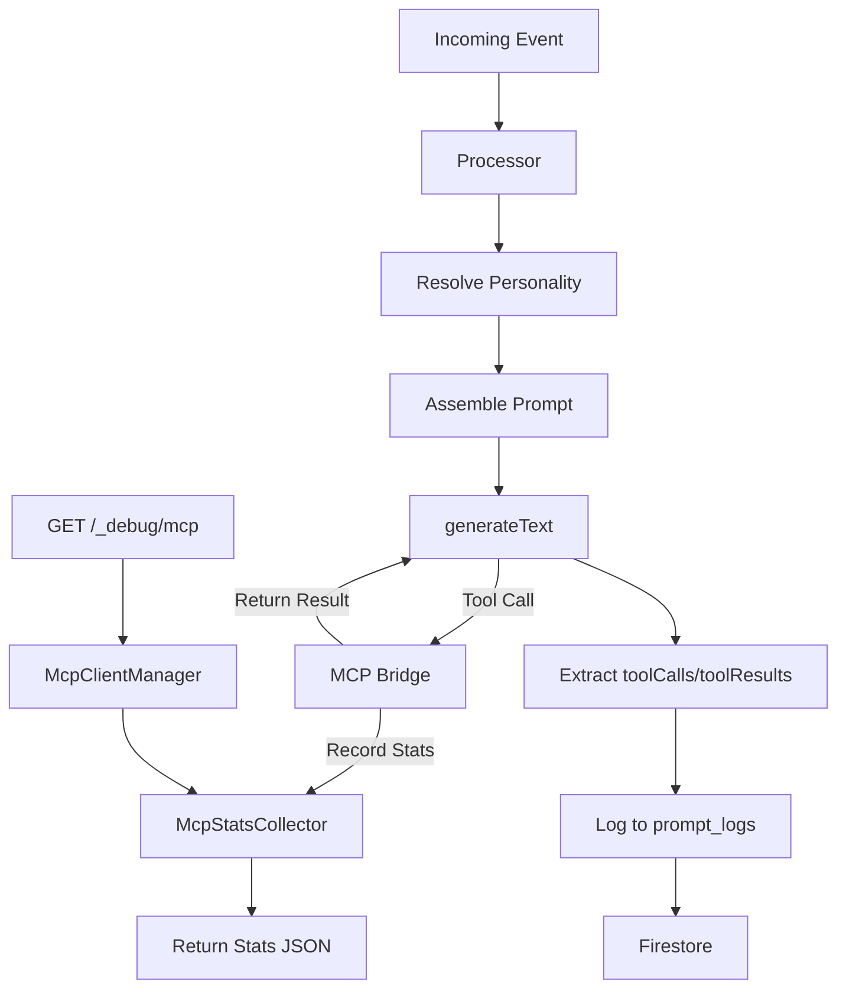

# Technical Architecture – sprint-240-a1b2c3

## Objective
Enhance transparency and debuggability of LLM interactions by expanding MCP (Model Context Protocol) usage visibility. This includes logging tool/resource invocations to Firestore and enhancing the `/_debug/mcp` endpoint with detailed metrics.

## Proposed Changes

### 1. Firestore `prompt_logs` Schema Expansion
The `prompt_logs` collection documents will be expanded to include:
- `personalityName`: The name(s) of the personality(ies) resolved for this interaction.
- `toolCalls`: An array of objects representing tool invocations.
  - `tool`: Tool ID (e.g., `mcp:get_weather`).
  - `args`: Arguments passed to the tool.
  - `result`: The output returned by the tool (redacted if necessary).
  - `error`: Error message if the tool failed.
  - `durationMs`: Execution time of the tool.
- `resourceAccess`: (Future proofing) An array of MCP resource access logs.

### 2. `llm-bot` Processor Enhancements (`processor.ts`)
- **Personality Capture**: During personality resolution, extract the names from the `ResolvedPersonality` objects and store them in a local variable to be used in the logging step.
- **Tool Execution Interception**:
  - The `generateText` result from the Vercel AI SDK contains `toolCalls` and `toolResults`.
  - We will extract these from the `result` object.
  - Since we wrap tools in `processor.ts`, we already have a place to capture errors. However, `generateText`'s `toolResults` is a cleaner way to get the outcomes of all tool calls made during the multi-step interaction.
- **Logging Integration**: Update the fire-and-forget logging block to include the new fields.

### 3. `/_debug/mcp` Endpoint Enhancements
- **Error Rates**: Add an `errorRate` field to each tool's statistics, calculated as `errors / invocations`.
- **Latency Metrics**: Ensure `avgLatencyMs`, `minLatencyMs`, and `maxLatencyMs` are consistently reported for all tools.
- **Resource Stats**: Prepare `McpStatsCollector` to track resource access if/when implemented.

### 4. Data Flow Diagram

## Considerations
- **Redaction**: Ensure that tool results logged to Firestore are redacted using the existing `redactText` utility to prevent PII leakage.
- **Performance**: Logging remains fire-and-forget to avoid adding latency to the main response path.
- **Tool Wrapping**: Continue using the wrapper in `processor.ts` for immediate error reporting to the event's `errors` array, but rely on `generateText` results for the comprehensive `prompt_logs` entry.
