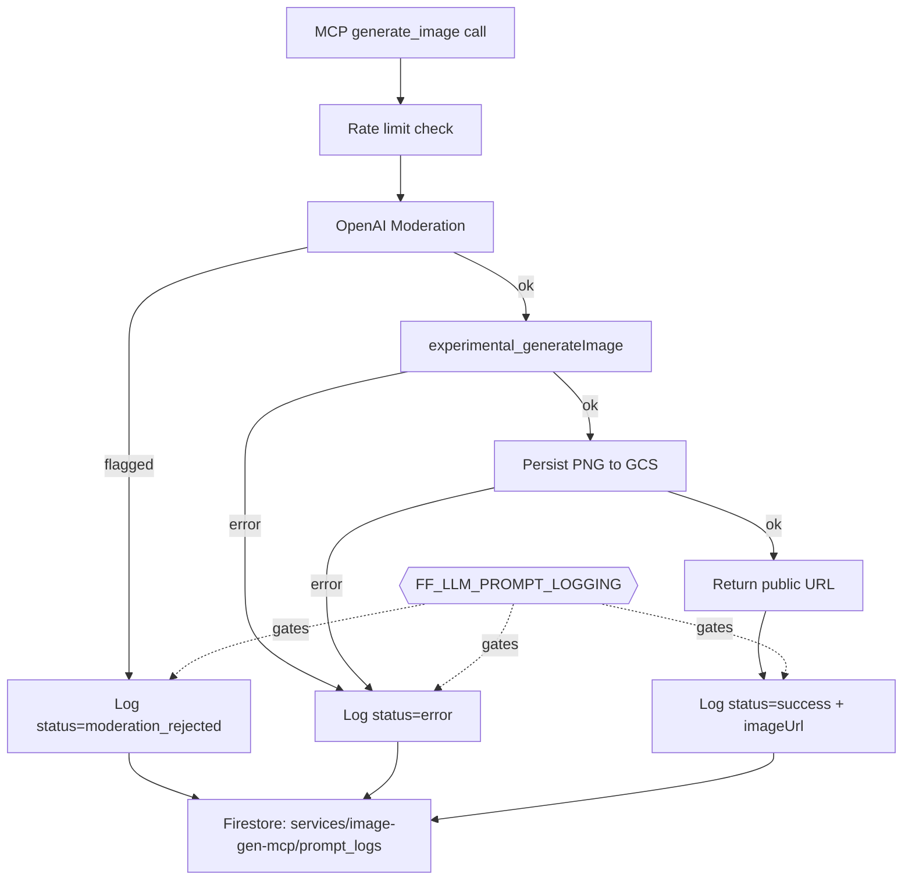

# Technical Architecture – Image-Gen-MCP Prompt Logging (sprint-320-1cc8aa)

## 1. Objective

Add Firestore-backed **prompt logging** to the `image-gen-mcp` service so that every
image-generation request is recorded for audit, debugging, abuse review, and analytics.

The implementation MUST reuse the **existing prompt-logging structure and patterns**
already established for `llm-bot` and `query-analyzer`:

- Same feature-flag gate (`llm.promptLogging.enabled` / `FF_LLM_PROMPT_LOGGING`).
- Same storage convention: `services/{service}/prompt_logs/{logId}`.
- Same fire-and-forget write semantics (logging never blocks or fails the request).
- Same redaction discipline (`redactText`) and core field set
  (`correlationId`, `prompt`, `response`, `platform`, `model`, `processingTimeMs`,
  `createdAt`), extended with image-specific fields.

This document is **architecture only**. No code is written until the implementation plan
is approved (AGENTS.md §2.4).

## 2. Current State

### 2.1 Reference pattern – `llm-bot`
`src/services/llm-bot/processor.ts` (§"6. Prompt Logging") performs, after the LLM call:

```ts
if (isFeatureEnabled('llm.promptLogging.enabled')) {
  const db = getFirestore();
  db.collection('services').doc('llm-bot').collection('prompt_logs').add({
    correlationId: corr,
    prompt: redactText(fullPrompt),
    response: redactText(finalResponse),
    platform: platformName,
    model: modelName,
    processingTimeMs,
    /* …toolCalls, usage, etc… */
    createdAt: new Date(),
  }).catch((e) => logger?.warn?.('llm_bot.prompt_logging_failed', { correlationId: corr, error: e?.message }));
}
```

### 2.2 Reference pattern – `query-analyzer`
`src/services/query-analyzer/llm-provider.ts` follows the identical shape, writing to
`services/query-analyzer/prompt_logs` with `correlationId`, redacted `prompt`/`response`,
`platform`, `model`, `processingTimeMs`, `usage`, and `createdAt`.

### 2.3 Shared building blocks
- **Feature flag**: `src/common/feature-flags.manifest.json` defines the canonical key
  `llm.promptLogging.enabled` → env `FF_LLM_PROMPT_LOGGING` (default `false`).
  Consumed via `isFeatureEnabled(...)` from `src/common/feature-flags`.
- **Firestore accessor**: `getFirestore()` from `src/common/firebase`.
- **Redaction**: `redactText()` from `src/common/prompt-assembly/redaction`.
- **Backup guard**: `tools/brat/src/backup/registry.ts` treats `prompt_logs` as a
  backup-forbidden collection. Keeping image logs under `services/image-gen-mcp/prompt_logs`
  means **no registry change is required** — the existing guard already excludes them.

### 2.4 Target service – `image-gen-mcp`
`src/services/image-gen-mcp/index.ts` defines `ImageGenMcpServer extends McpServer`
(which extends `BaseServer`). The `generate_image` tool currently:

1. Applies per-user rate limiting.
2. Runs an OpenAI **moderation** check on the prompt.
3. Calls `experimental_generateImage` (default model `gpt-image-1`).
4. Persists the PNG to GCS (with retry) and returns a public URL.

It exposes `getLogger()`, `getConfig()`, and `getSecret()` but currently performs **no
prompt logging**. There is no Firestore usage in the service yet.

## 3. Proposed Design

### 3.1 Storage location
Write to:

```
services/image-gen-mcp/prompt_logs/{logId}
```

This mirrors `llm-bot` and `query-analyzer` exactly and inherits the backup-exclusion
guard with no additional configuration.

### 3.2 Document schema
Reuse the shared core fields and add image-specific metadata. Token `usage` does not
apply to image generation and is intentionally omitted.

| Field | Type | Source | Notes |
|-------|------|--------|-------|
| `correlationId` | string \| undefined | request context (`extra`) | Trace ID across services; see §3.6. |
| `prompt` | string | tool `args.prompt` | Redacted via `redactText`. |
| `response` | string | generated public URL / status text | The GCS public URL on success (redacted). |
| `platform` | string | constant `'openai'` | Matches `getLlmProvider({ provider: 'openai' })`. |
| `model` | string | `IMAGE_GEN_MODEL` config | e.g. `gpt-image-1`. |
| `aspectRatio` | string | tool `args.aspect_ratio` | `1:1` \| `16:9` \| `9:16`. |
| `size` | string | derived size | e.g. `1024x1024`, `1536x1024`. |
| `processingTimeMs` | number | measured around generation+persist | Same metric name as reference services. |
| `userId` | string | `extra.userId` | `'anonymous'` when unauthenticated. |
| `moderationFlagged` | boolean | moderation result | `true` when the prompt was rejected. |
| `moderationCategories` | string[] | moderation result | Populated only when flagged. |
| `imageUrl` | string \| undefined | GCS public URL | Present on success; mirrors `response` for convenience. |
| `status` | enum | derived | `success` \| `moderation_rejected` \| `error`. |
| `error` | string \| undefined | catch block | Redacted error message on failure. |
| `createdAt` | Date | `new Date()` | Same as reference services. |

> Rationale: keeping `correlationId`, `prompt`, `response`, `platform`, `model`,
> `processingTimeMs`, and `createdAt` identical to the existing services preserves
> cross-service analytics (e.g., `stream-analyst` normalization of `prompt_logs`),
> while `status`/`moderationFlagged`/`imageUrl` capture the parts of the flow unique
> to image generation.

### 3.3 Logging outcomes (all three paths)
To maximize observability, log on **every terminal outcome**, not just success:

- **`moderation_rejected`** — prompt flagged; record categories, no `imageUrl`.
- **`success`** — image generated + persisted; record `imageUrl`, `size`, timing.
- **`error`** — generation or GCS persistence failed; record redacted `error`.

Each path emits exactly one `prompt_logs` document, all gated by the feature flag.

### 3.4 Integration approach
Two viable options; **Option A is recommended** for consistency with the references.

- **Option A (recommended) – inline helper in `index.ts`.**
  Add a private `logPrompt(entry)` method (or a small module-local helper) on
  `ImageGenMcpServer` that performs the gated fire-and-forget Firestore write, mirroring
  the inline blocks in `processor.ts` / `llm-provider.ts`. Call it at each terminal path
  in the `generate_image` handler. Lowest-risk, matches existing precedent.

- **Option B (optional future refactor) – shared utility.**
  Extract a `logPrompt(service, entry)` helper into `src/common` and retrofit all three
  services. Higher value long-term (DRY) but larger blast radius; out of scope for this
  sprint and noted only as a follow-up.

### 3.5 Feature flag & gating
- Reuse the existing canonical flag `llm.promptLogging.enabled` (env
  `FF_LLM_PROMPT_LOGGING`). No new flag is introduced, keeping a single global control
  for all prompt logging.
- The write block is skipped entirely when the flag is disabled (default), so behavior is
  unchanged for existing deployments until the env var is set.
- `architecture.yaml` `services.image-gen-mcp.env` should add `FF_LLM_PROMPT_LOGGING`
  (and the env templates under `env/*/image-gen-mcp.yaml`, if present) so the flag is
  declared for the service.

### 3.6 Correlation ID
`image-gen-mcp` is invoked as an MCP tool via the tool-gateway. The `extra` argument
passed to the tool handler is the carrier for request context. The implementation should
read a correlation ID from `extra` (e.g. `extra.correlationId`) and fall back to
`undefined` (matching `llm-bot`, which passes `corr` that may be undefined). If no
correlation ID is propagated through MCP today, that is captured as a known limitation
(§6) and a candidate follow-up; logging still proceeds without it.

### 3.7 Resilience & performance
- **Fire-and-forget**: the Firestore `.add(...)` is not awaited; a `.catch()` logs a
  warning (`image_gen_mcp.prompt_logging_failed`) so a logging failure never affects the
  image response — identical to the reference services.
- **Redaction**: `prompt`, `response`/`imageUrl`-derived text, and `error` are passed
  through `redactText` before persistence.
- **No new latency** on the hot path beyond constructing the log object.

## 4. Data Flow



## 5. Testing Strategy (for the implementation sprint)

Mirror `llm-bot`/`query-analyzer` logging tests (e.g.
`src/services/llm-bot/__tests__/processor.logging.spec.ts`,
`tests/services/query-analyzer/llm-provider.test.ts`):

- **Flag off** → no Firestore write occurs.
- **Flag on, success** → one write to `services/image-gen-mcp/prompt_logs` with
  `status: 'success'`, redacted `prompt`, `imageUrl`, `model`, `processingTimeMs`.
- **Flag on, moderation rejected** → one write with `status: 'moderation_rejected'`
  and `moderationCategories`.
- **Flag on, generation/persist error** → one write with `status: 'error'` and a
  redacted `error`.
- **Logging failure is swallowed** → a rejected Firestore `.add` does not fail the tool
  response (asserted via the warn log / resolved tool result).

Mock `getFirestore`, `generateImage`, the moderation `fetch`, and the storage manager,
consistent with existing service test style. Use Jest (`jest.config.js`).

## 6. Considerations, Risks & Open Questions

- **Correlation ID propagation** (§3.6): confirm whether the tool-gateway forwards a
  correlation ID into the MCP `extra` payload; if not, logs will lack cross-service
  traceability until that is added (follow-up).
- **Redaction of image prompts**: image prompts are user-supplied free text; redaction is
  applied, but reviewers should confirm `redactText` heuristics are appropriate for this
  content type.
- **Backup exclusion**: confirmed — `prompt_logs` under `services/*` is backup-forbidden;
  no change to `tools/brat` registry required, and a regression test already guards this.
- **Volume / retention**: image generation is rate-limited (1 / 5 min / user by default),
  so log volume is low; no TTL is proposed in this sprint (consistent with existing
  `prompt_logs`).
- **Scope**: this sprint only adds logging to `image-gen-mcp`; the shared-helper refactor
  (Option B) is explicitly deferred.

## 7. Definition of Done (TA acceptance)

- This document is approved by the user as the basis for the implementation plan.
- The design conforms to `architecture.yaml` and reuses the existing prompt-logging
  flag, storage path, redaction, and fire-and-forget semantics.
- The implementation plan (`implementation-plan.md`) and tests are produced **after**
  approval, per the Sprint Protocol.
