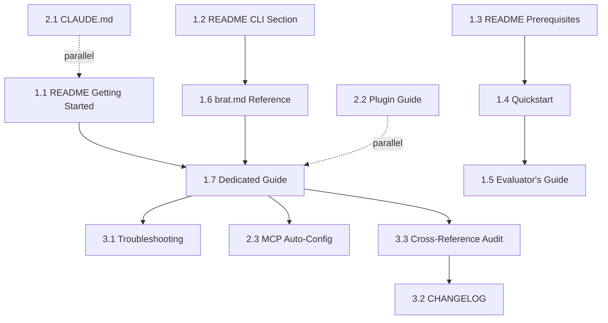

# Execution Plan: Sprint 340 - `brat code` Documentation Update

**Sprint ID:** 340
**Sprint Goal:** Comprehensively update BitBrat documentation to reflect the new `brat code` command and coding agent integration
**Status:** Planning
**Lead Implementor:** Technical Writer
**Created:** 2026-07-13

---

## Objective

Update all user-facing documentation to integrate the `brat code` command into the new user experience, onboarding flows, and developer workflows. The goal is to make `brat code` the **recommended first interaction** for new users exploring BitBrat with AI assistance.

**Success Criteria:**
- New users discover `brat code` within first 3 sections of README
- Quickstart guide prominently features `brat code` as recommended exploration path
- All relevant CLI documentation includes `brat code` with examples
- New dedicated guide explains coding agents integration in detail
- 100% of internal documentation links remain functional
- Zero confusion between setup flow and code exploration flow

---

## Problem Statement / Why

### Current Pain Points

1. **Invisible Feature:**
   - `brat code` was delivered in Sprint 339 but is NOT mentioned in README.md Getting Started
   - Not listed in "Management CLI (brat)" section
   - Not in Quickstart guide
   - Not in Evaluator's Guide
   - Only appears in CLAUDE.md (for LLM context, not users)

2. **Missed Opportunity:**
   - `brat code` is the **fastest way** to explore BitBrat with AI assistance
   - Provides zero-config Claude Code integration with full project context
   - Auto-configures MCP for BitBrat's tool-gateway
   - First-run experience includes welcome prompt explaining the platform
   - Yet new users have no way to discover this capability

3. **Documentation Gaps:**
   - No dedicated guide for coding agent integration
   - Missing from `documentation/tools/brat.md` command reference
   - No mention in Prerequisites section (should list optional coding agents)
   - No installation/troubleshooting guidance for coding agents
   - No plugin development documentation

### Desired Outcome

After this sprint, a new user should:
1. Learn about `brat code` in the README within 30 seconds of reading
2. Be directed to try `brat code` as the recommended exploration path
3. Have clear documentation for all supported coding agents
4. Understand when to use `brat code` vs `brat chat`
5. Be able to troubleshoot common `brat code` issues independently

---

## Grounding / Verified Baseline Facts

### Existing Implementation (Sprint 339 Deliverables)

From the sprint 339 verification report and retro:
- ✅ Complete plugin architecture supporting 4 coding agents (Claude Code, Aider, Continue, OpenHands)
- ✅ Comprehensive MCP auto-configuration system
- ✅ 71 passing unit tests
- ✅ Interactive agent selection with preference persistence (`~/.bratrc`)
- ✅ First-run welcome experience ("Explain the BitBrat project to me")
- ✅ Zero-config on first run
- ✅ Flag pass-through support (`brat code -- --model opus`)

### Key Features to Document

| Feature | Implementation Status | Documentation Status |
|---------|----------------------|---------------------|
| Agent detection | ✅ Complete | ❌ Not documented |
| Claude Code integration | ✅ Complete + MCP auto-config | ❌ Not documented |
| Aider plugin | ✅ Complete | ❌ Not documented |
| Continue plugin | ✅ Complete | ❌ Not documented |
| OpenHands plugin | ✅ Complete | ❌ Not documented |
| Preference persistence | ✅ Complete (`~/.bratrc`) | ❌ Not documented |
| First-run experience | ✅ Complete | ❌ Not documented |
| MCP auto-discovery | ✅ Complete | ❌ Not documented |
| Interactive selection UI | ✅ Complete | ❌ Not documented |

### Current Documentation Inventory

**Files That Need Updates:**
1. **README.md** - Main entry point (NO mention of `brat code`)
2. **documentation/getting-started/quickstart.md** - Setup guide (NO mention)
3. **documentation/getting-started/evaluating-bitbrat.md** - Evaluator flow (NO mention)
4. **documentation/tools/brat.md** - CLI reference (NO `brat code` section)
5. **CLAUDE.md** - LLM guidance (HAS basic mention, needs expansion)

**Files That Don't Exist Yet:**
1. **documentation/guides/coding-with-brat-code.md** - Dedicated `brat code` guide
2. **documentation/guides/coding-agent-plugins.md** - Plugin development guide
3. **documentation/troubleshooting/brat-code-issues.md** - Troubleshooting guide

---

## Scope

### In Scope (P0 - Must Have)

**Phase 1: Core User-Facing Documentation**
- ✅ Update README.md Getting Started section
- ✅ Update README.md Management CLI section
- ✅ Update README.md Prerequisites section
- ✅ Update Quickstart guide
- ✅ Update Evaluator's Guide
- ✅ Update documentation/tools/brat.md CLI reference
- ✅ Create new dedicated guide: coding-with-brat-code.md

**Phase 2: Developer & Advanced Documentation**
- ✅ Expand CLAUDE.md guidance for LLM collaboration
- ✅ Create plugin development guide
- ✅ Document MCP auto-configuration behavior
- ✅ Add coding agent installation instructions

**Phase 3: Supporting Materials**
- ✅ Create troubleshooting guide
- ✅ Update CHANGELOG.md
- ✅ Cross-reference audit and link fixes

### In Scope (P1 - Should Have)

- ✅ Add examples for each supported agent (Claude Code, Aider, Continue, OpenHands)
- ✅ Document `.bratrc` preference file format
- ✅ Document first-run experience and welcome prompt
- ✅ Create decision guide: "When to use `brat code` vs `brat chat`"
- ✅ Add MCP tool discovery documentation

### Out of Scope

- ❌ Code changes to `brat code` implementation (already complete in Sprint 339)
- ❌ Video tutorials or screencasts
- ❌ Agent installation automation (future sprint)
- ❌ Windows/Linux testing (already identified as future work)
- ❌ Internationalization (English only)
- ❌ Custom plugin marketplace features

---

## Implementation Phases

### Phase 1: High-Visibility Documentation (P0)
**Goal:** Update the most-read documentation so new users discover `brat code`

**Estimated Effort:** 8 hours

#### Tasks:

**Task 1.1: Update README.md Getting Started Section**
- **Priority:** P0 (Blocker)
- **Effort:** 1.5 hours
- **Location:** README.md lines ~195-318

**Changes:**
1. Add `brat code` as Step 6.5 (between setup and running local stack)
2. New subsection: "6.5 (Optional) Explore with AI Assistance"
   ```markdown
   ### 6.5 (Optional) Explore with AI Assistance

   Before running the full platform, you can use `brat code` to explore BitBrat with AI-powered coding assistance:

   ```bash
   npm run brat -- code
   ```

   This launches a coding agent (Claude Code, Aider, etc.) with full BitBrat context automatically configured. On first run, it will explain the platform architecture and help you navigate the codebase.

   See the [Coding with brat code](./documentation/guides/coding-with-brat-code.md) guide for details.
   ```
3. Add callout comparing `brat code` vs `brat chat` approaches

**Acceptance Criteria:**
- `brat code` appears before "Running the Platform" section
- Clear that it's optional but recommended for exploration
- Link to detailed guide present

---

**Task 1.2: Update README.md Management CLI Section**
- **Priority:** P0
- **Effort:** 1.5 hours
- **Location:** README.md lines ~351-448

**Changes:**
1. Add new subsection under "Setup & Interaction" (after `brat chat`):
   ```markdown
   #### `brat code`
   Launch a coding agent with BitBrat project context automatically configured.

   ```bash
   npm run brat -- code [options]
   ```

   **Features:**
   - **Auto-Detection**: Discovers installed coding agents (Claude Code, Aider, Continue, OpenHands)
   - **Zero-Config**: Automatically configures agent with CLAUDE.md, architecture.yaml, AGENTS.md, README.md
   - **MCP Integration**: For Claude Code, auto-configures MCP servers and tool-gateway connection
   - **Preference Memory**: Saves your preferred agent to `~/.bratrc`
   - **First-Run Welcome**: On first use, provides guided introduction to BitBrat

   **Options:**
   - `--list`, `-l`: List all detected coding agents
   - `--agent <name>`, `-a <name>`: Launch specific agent (claude-code, aider, continue, openhands)
   - `--project-root <path>`, `-p <path>`: Override project root directory

   **Examples:**
   ```bash
   npm run brat -- code                    # Interactive: select agent
   npm run brat -- code --list             # List installed agents
   npm run brat -- code --agent claude-code  # Launch Claude Code
   npm run brat -- code -- --model opus    # Pass flags to agent
   ```

   See the [Coding with brat code](./documentation/guides/coding-with-brat-code.md) guide for full documentation.
   ```

**Acceptance Criteria:**
- Comprehensive command reference with all flags
- Examples cover common use cases
- Link to detailed guide

---

**Task 1.3: Update README.md Prerequisites Section**
- **Priority:** P0
- **Effort:** 0.5 hours
- **Location:** README.md lines ~199-206

**Changes:**
1. Add new optional prerequisite:
   ```markdown
   - **Coding Agent** (optional, for `brat code`) — one of:
     - **Claude Code**: `npm install -g @anthropic-ai/claude-code` (recommended)
     - **Aider**: `pip install aider-chat`
     - **Continue**: `npm install -g continue`
     - **OpenHands**: `pip install openhands`
   ```

**Acceptance Criteria:**
- Clearly marked as optional
- All supported agents listed
- Installation commands provided

---

**Task 1.4: Update Quickstart Guide**
- **Priority:** P0
- **Effort:** 1 hour
- **Location:** documentation/getting-started/quickstart.md

**Changes:**
1. Add new step after health check (before "Running the Platform"):
   ```markdown
   ## 5.5 (Recommended) Explore with AI Assistance

   Before starting the full Docker stack, explore BitBrat with AI-powered assistance:

   ```bash
   npm run brat -- code
   ```

   If you have Claude Code, Aider, or another supported agent installed, this will:
   - Automatically configure the agent with BitBrat project context
   - Provide a guided introduction to the platform on first run
   - Help you understand the architecture before diving into setup

   **First-time users**: The agent will explain the platform concepts interactively.

   **Developers**: Use it to explore code, understand flows, or get help implementing features.

   See [Coding with brat code](../guides/coding-with-brat-code.md) for installation and usage.
   ```

2. Update "Next Steps" section to mention `brat code` as a learning tool

**Acceptance Criteria:**
- `brat code` positioned as recommended exploration step
- First-run experience highlighted
- Link to installation guide

---

**Task 1.5: Update Evaluator's Guide**
- **Priority:** P0
- **Effort:** 0.5 hours
- **Location:** documentation/getting-started/evaluating-bitbrat.md

**Changes:**
1. Add new section before "What to read first":
   ```markdown
   ## Explore interactively with `brat code` (~2 minutes)

   The fastest way to understand BitBrat is to let it explain itself:

   1. **Install a coding agent** (if not already installed):
      ```bash
      npm install -g @anthropic-ai/claude-code
      ```

   2. **Launch with context**:
      ```bash
      npm install
      npm run brat -- code
      ```

   3. **On first run**, BitBrat will automatically prompt: "Explain the BitBrat project to me" — providing an interactive architecture tour with the full codebase as reference.

   This gives you a guided walkthrough of the agent loop, dual execution paths, and MCP tool integration before reading static docs.
   ```

2. Update checklist:
   ```markdown
   - [ ] Used `brat code` to get an interactive platform explanation
   ```

**Acceptance Criteria:**
- `brat code` positioned as fastest evaluation path
- Installation and usage clear
- Integrated into checklist

---

**Task 1.6: Update brat CLI Reference**
- **Priority:** P0
- **Effort:** 2 hours
- **Location:** documentation/tools/brat.md

**Changes:**
1. Add comprehensive `brat code` section under "Setup & Interaction"
2. Include:
   - Full command syntax
   - All flags and options
   - Examples for each supported agent
   - MCP auto-configuration notes
   - Preference file format (`.bratrc`)
   - Troubleshooting common issues
3. Cross-reference to dedicated guide

**Acceptance Criteria:**
- Complete command reference
- All 4 agent plugins documented
- Examples clear and tested
- Links to deep-dive guide

---

**Task 1.7: Create Dedicated Guide - coding-with-brat-code.md**
- **Priority:** P0
- **Effort:** 3 hours
- **Location:** documentation/guides/coding-with-brat-code.md (NEW FILE)

**Content Outline:**
1. **Introduction**
   - What is `brat code`?
   - Why use it?
   - Comparison with `brat chat`

2. **Getting Started**
   - Installing coding agents
   - First run experience
   - Agent selection UI

3. **Supported Agents**
   - Claude Code (with MCP auto-config details)
   - Aider
   - Continue
   - OpenHands

4. **Features**
   - Auto-detection
   - Project context injection
   - MCP integration
   - Preference persistence
   - Flag pass-through

5. **Configuration**
   - `.bratrc` file format
   - Per-agent settings
   - MCP server discovery

6. **Advanced Usage**
   - Switching agents
   - Custom flags
   - Multiple projects

7. **Troubleshooting**
   - Agent not detected
   - MCP connection issues
   - Preference file errors

8. **Developer Guide**
   - Creating custom plugins
   - Plugin API reference

**Acceptance Criteria:**
- Comprehensive guide covering all features
- Examples for each agent
- Troubleshooting section complete
- Cross-references to relevant docs

---

### Phase 2: Developer & Advanced Documentation (P1)
**Goal:** Support developers contributing to BitBrat and advanced users

**Estimated Effort:** 6 hours

#### Tasks:

**Task 2.1: Expand CLAUDE.md for brat code Context**
- **Priority:** P1
- **Effort:** 1 hour
- **Location:** CLAUDE.md

**Changes:**
1. Add to "Common Development Commands" section:
   ```markdown
   ### Coding Agent Integration
   ```bash
   npm run brat -- code                 # Launch coding agent with BitBrat context
   npm run brat -- code --list          # List detected agents
   npm run brat -- code --agent aider   # Launch specific agent
   ```

   The `brat code` command auto-configures coding agents (Claude Code, Aider, Continue, OpenHands) with:
   - Project context files (CLAUDE.md, architecture.yaml, AGENTS.md, README.md)
   - MCP server discovery and authentication (Claude Code only)
   - First-run welcome experience

   Preferences saved to `~/.bratrc`. See documentation/guides/coding-with-brat-code.md for details.
   ```

2. Add to glossary if needed

**Acceptance Criteria:**
- LLM agents understand `brat code` exists
- Basic usage documented
- Cross-reference to guide

---

**Task 2.2: Create Plugin Development Guide**
- **Priority:** P1
- **Effort:** 3 hours
- **Location:** documentation/guides/coding-agent-plugins.md (NEW FILE)

**Content Outline:**
1. **Introduction**
   - Plugin architecture overview
   - When to create a custom plugin

2. **Plugin API**
   - `CodingAgentPlugin` interface
   - `detect()` method
   - `prepareConfig()` method
   - `launch()` method
   - Optional `preflight()` method

3. **Implementation Guide**
   - Step-by-step plugin creation
   - Agent detection strategies
   - Config generation patterns
   - Launch lifecycle management

4. **Examples**
   - Minimal plugin implementation
   - Full-featured plugin (based on Claude Code)

5. **Testing**
   - Unit test patterns
   - Integration testing
   - Manual testing checklist

6. **Registration**
   - Adding to AgentRegistry
   - Naming conventions

**Acceptance Criteria:**
- Complete API documentation
- Working example plugin
- Testing guidance
- Clear process for contributing new plugins

---

**Task 2.3: Document MCP Auto-Configuration**
- **Priority:** P1
- **Effort:** 1.5 hours
- **Location:** Appendix to coding-with-brat-code.md

**Content:**
1. How MCP discovery works
   - Docker container detection
   - tool-gateway connectivity check
   - Authentication token management

2. Generated config structure
   - `mcpServers` block in `.claude/config.json`
   - stdio proxy configuration
   - Tool enumeration

3. Troubleshooting MCP issues
   - Token errors
   - Connection failures
   - Missing tools

**Acceptance Criteria:**
- MCP auto-configuration fully explained
- Troubleshooting covers common issues
- Config examples provided

---

**Task 2.4: Create Agent Installation Guide**
- **Priority:** P1
- **Effort:** 1 hour
- **Location:** Section in coding-with-brat-code.md

**Content:**
1. Installation instructions for each agent
2. Platform-specific notes (macOS, Linux, Windows)
3. Version requirements
4. Verification steps (`--version` checks)

**Acceptance Criteria:**
- All 4 agents covered
- Platform-specific instructions
- Verification commands provided

---

### Phase 3: Supporting Materials & Quality (P1/P2)
**Goal:** Ensure consistency, discoverability, and maintainability

**Estimated Effort:** 4 hours

#### Tasks:

**Task 3.1: Create Troubleshooting Guide**
- **Priority:** P1
- **Effort:** 1.5 hours
- **Location:** Section in coding-with-brat-code.md OR new file

**Content:**
1. **Agent not detected**
   - PATH issues
   - Version mismatches
   - Installation verification

2. **MCP connection failures**
   - Docker not running
   - tool-gateway not accessible
   - Auth token errors

3. **Preference file errors**
   - Invalid YAML
   - Corrupted `.bratrc`
   - Reset instructions

4. **Agent-specific issues**
   - Claude Code API key
   - Aider model selection
   - Continue/OpenHands configuration

**Acceptance Criteria:**
- Common issues covered
- Clear resolution steps
- Error messages explained

---

**Task 3.2: Update CHANGELOG.md**
- **Priority:** P1
- **Effort:** 0.5 hours
- **Location:** CHANGELOG.md

**Changes:**
1. Add entry under `## [Unreleased]`:
   ```markdown
   ### Documentation
   - **`brat code` Integration**: Comprehensively documented the new `brat code` command in README, Quickstart, Evaluator's Guide, and CLI reference
   - **New Guides**: Added `coding-with-brat-code.md` and `coding-agent-plugins.md` guides
   - **Prerequisites**: Updated to include optional coding agent installation
   - **Troubleshooting**: Added MCP and agent-specific troubleshooting guidance
   ```

**Acceptance Criteria:**
- CHANGELOG reflects all documentation updates
- Follows project conventions

---

**Task 3.3: Cross-Reference Audit**
- **Priority:** P1
- **Effort:** 1.5 hours

**Process:**
1. Extract all internal links from updated documentation
2. Verify each link resolves correctly
3. Check for orphaned pages
4. Add missing cross-references
5. Update outdated links

**Deliverables:**
- Cross-reference consistency report
- All broken links fixed

**Acceptance Criteria:**
- 100% of internal links functional
- Related pages cross-reference each other
- No orphaned documentation

---

**Task 3.4: "When to Use" Decision Guide**
- **Priority:** P2
- **Effort:** 0.5 hours
- **Location:** Section in coding-with-brat-code.md

**Content:**
Decision matrix comparing:
- `brat code` (AI-assisted exploration/development)
- `brat chat` (Interactive testing of platform behavior)
- Direct coding (Traditional IDE-based development)

**Acceptance Criteria:**
- Clear decision criteria
- Use cases for each approach
- Flowchart or table format

---

## Timeline Estimation

**Total Effort:** ~18 hours of technical writing

**Phase Breakdown:**
- Phase 1: High-Visibility Docs - 8 hours (P0)
- Phase 2: Developer Docs - 6 hours (P1)
- Phase 3: Supporting Materials - 4 hours (P1/P2)

**Suggested Schedule (1 writer, 2-3 days):**
- Day 1: Tasks 1.1-1.4 (README, Quickstart, Evaluator's Guide) - 4.5 hours
- Day 2: Tasks 1.5-1.7 (brat.md, dedicated guide) - 7 hours
- Day 3: Phase 2 & 3 tasks - 6.5 hours

**Parallel Work Opportunities:**
- Task 2.1 (CLAUDE.md) can be done alongside Phase 1
- Task 2.2 (Plugin guide) can be done independently
- Task 3.1 (Troubleshooting) can be done alongside 1.7

---

## Dependencies

### External Dependencies
None - all Sprint 339 implementation complete

### Internal Dependencies
1. Sprint 339 verification report (✅ available)
2. Sprint 339 retro (✅ available)
3. Existing documentation structure (✅ stable)
4. CLAUDE.md (✅ stable)

### Task Dependencies


**Critical Path:** 1.1 → 1.7 → 3.3 → 3.2 (README → Dedicated Guide → Audit → CHANGELOG)

---

## Risk Mitigation

### Risk 1: Scope Creep
**Likelihood:** Medium
**Impact:** Medium
**Mitigation:**
- Strict adherence to backlog
- Phase 3 tasks are P2 and can be deferred if needed
- Time-box each task

### Risk 2: Breaking Changes to `brat code`
**Likelihood:** Low
**Impact:** High
**Mitigation:**
- Coordinate with development team
- Freeze `brat code` changes during documentation sprint
- Tag Sprint 339 commit for reference

### Risk 3: Inconsistent Terminology
**Likelihood:** Low
**Impact:** Medium
**Mitigation:**
- Use Sprint 339 docs as authoritative source
- Maintain terminology glossary
- Review for consistency in Task 3.3

### Risk 4: Link Rot
**Likelihood:** Low
**Impact:** Low
**Mitigation:**
- Task 3.3 explicitly audits all links
- Use relative paths consistently
- Test all links before completion

---

## Success Metrics

### Functional Requirements
- [ ] `brat code` appears in README Getting Started (before "Running the Platform")
- [ ] `brat code` fully documented in CLI reference (brat.md)
- [ ] Dedicated guide (coding-with-brat-code.md) created
- [ ] All 4 agent plugins documented with examples
- [ ] Prerequisites section updated
- [ ] Quickstart guide includes `brat code`
- [ ] Evaluator's guide includes `brat code`
- [ ] CHANGELOG.md updated

### Quality Requirements
- [ ] 100% of internal links functional
- [ ] All code examples tested
- [ ] Terminology consistent across docs
- [ ] No broken references
- [ ] Cross-reference audit clean

### User Experience Requirements
- [ ] New user can discover `brat code` within 30 seconds of reading README
- [ ] Clear when to use `brat code` vs `brat chat`
- [ ] Installation instructions clear and complete
- [ ] Troubleshooting guidance helpful

---

## Post-Sprint Activities

### Validation
- [ ] Fresh reader test (developer unfamiliar with `brat code`)
- [ ] Link validation (all internal links work)
- [ ] Terminology consistency check
- [ ] Example verification (all commands work)

### Future Enhancements (Backlog)
- [ ] Video tutorial for `brat code`
- [ ] Advanced plugin customization guide
- [ ] Multi-agent workflow documentation
- [ ] Agent performance comparison guide

---

## Appendix: Documentation Structure

### Before Sprint 340
```
documentation/
├── getting-started/
│   ├── quickstart.md          (no brat code mention)
│   └── evaluating-bitbrat.md  (no brat code mention)
├── guides/
│   ├── brat-fleet.md
│   ├── seed-data.md
│   └── ...
└── tools/
    └── brat.md                (no brat code section)
```

### After Sprint 340
```
documentation/
├── getting-started/
│   ├── quickstart.md          (✅ brat code recommended step)
│   └── evaluating-bitbrat.md  (✅ brat code fastest path)
├── guides/
│   ├── brat-fleet.md
│   ├── seed-data.md
│   ├── coding-with-brat-code.md     (✅ NEW - comprehensive guide)
│   └── coding-agent-plugins.md      (✅ NEW - plugin development)
└── tools/
    └── brat.md                (✅ complete brat code reference)
```

---

**End of Execution Plan**
