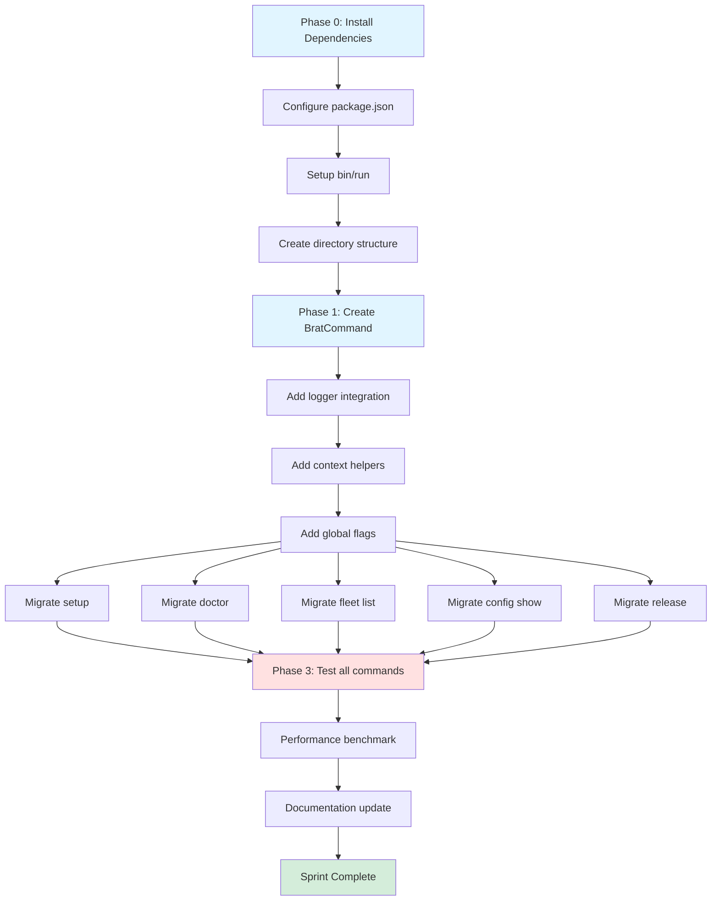

B# Sprint 359: Execution Plan - oclif Migration Foundation

**Sprint**: 359
**Lead Implementor**: AI Agent / Development Team
**Duration**: 1 sprint (~1 week)
**Start Date**: 2026-07-24
**Target Completion**: 2026-07-31

---

## Executive Summary

Sprint 359 establishes the foundation for migrating the brat CLI from custom implementation to oclif framework. This sprint focuses on:

1. **Infrastructure Setup** - Install oclif, configure build system, create base patterns
2. **Proof of Concept** - Migrate 5 representative commands to validate approach
3. **Testing Framework** - Establish testing patterns for future migrations
4. **Documentation** - Update guides for team adoption

**Success Criteria**: 5 commands fully migrated, all tests passing, team confident in patterns.

---

## Sprint Objectives

### Primary Objectives (P0 - Must Complete)

| ID | Objective | Success Metric | Owner |
|----|-----------|----------------|-------|
| OBJ-1 | oclif infrastructure operational | `brat --help` shows oclif-generated help | Infrastructure |
| OBJ-2 | 5 commands migrated and tested | All 5 commands pass existing + new tests | Migration Team |
| OBJ-3 | Base command pattern established | BratCommand class with logging, context | Architecture |
| OBJ-4 | Zero regression in functionality | All existing tests pass, behavior identical | QA |

### Secondary Objectives (P1 - Should Complete)

| ID | Objective | Success Metric | Owner |
|----|-----------|----------------|-------|
| OBJ-5 | Testing framework documented | Test examples for each command type | Documentation |
| OBJ-6 | Migration patterns validated | Each of 6 patterns tested via PoC | Architecture |
| OBJ-7 | Performance baseline established | Startup time < 200ms, help < 50ms | Performance |

### Stretch Goals (P2 - Nice to Have)

| ID | Objective | Success Metric | Owner |
|----|-----------|----------------|-------|
| OBJ-8 | Auto-completion working | Tab completion for commands/flags | UX |
| OBJ-9 | Deprecation hook functional | Old command paths show warnings | Migration Team |

---

## Phase Breakdown

### Phase 0: Infrastructure Setup (Days 1-2)

**Objective**: Prepare codebase for oclif migration

**Tasks**:
1. Install oclif dependencies
2. Configure package.json for oclif
3. Setup bin/run entry point
4. Create directory structure
5. Configure TypeScript for oclif
6. Setup testing framework (@oclif/test)

**Deliverables**:
- `package.json` with oclif config
- `bin/run` executable
- `src/commands/` directory structure
- `src/base-command.ts` skeleton
- `tsconfig.json` updated
- `jest.config.js` updated for oclif tests

**Dependencies**: None

**Risks**:
- Build system conflicts with existing setup
- TypeScript path mappings need adjustment
- Test framework integration issues

**Mitigation**:
- Use oclif's recommended tsconfig
- Keep existing build alongside oclif initially
- Validate test framework with simple test

**Validation**:
```bash
# Should succeed
npm run build
npm test

# Should show oclif help
./bin/run --help

# Should show version
./bin/run --version
```

---

### Phase 1: Base Command Pattern (Days 2-3)

**Objective**: Create reusable BratCommand base class

**Tasks**:
1. Implement BratCommand extending oclif Command
2. Integrate pino logger initialization
3. Add execution context helpers
4. Add global flags (--context, --json, --dry-run)
5. Implement error handling (catch method)
6. Add fleet client factory (preserve DI pattern)

**Deliverables**:
- `src/base-command.ts` - Fully functional base class
- `src/base-command.test.ts` - Unit tests
- Documentation of base class usage

**Dependencies**: Phase 0 complete

**Critical Patterns**:
```typescript
export default abstract class BratCommand extends Command {
  protected logger!: Logger;
  protected deps: FleetDeps = {};

  static baseFlags = {
    context: Flags.string({...}),
    json: Flags.boolean({...}),
    'dry-run': Flags.boolean({...}),
  };

  async init() {
    // Logger initialization
    // Context resolution
    // Env loading
  }

  protected getFleetClient(): FleetClient { ... }
  protected getCurrentContext(): string { ... }
  protected getContextResolver(): ContextResolver { ... }

  async catch(error: Error) { ... }
}
```

**Validation**:
```bash
# Base class tests pass
npm test -- base-command.test.ts

# No regressions
npm test
```

---

### Phase 2: Proof of Concept - 5 Commands (Days 3-6)

**Objective**: Migrate 5 representative commands to validate patterns

#### Command Selection Rationale

| Command | Complexity | Pattern Type | Why Selected |
|---------|-----------|--------------|--------------|
| `setup` | Low | Standalone + prompts | Tests interactive mode |
| `doctor` | Low | Standalone + diagnostics | Tests simple command |
| `fleet list` | Medium | Subcommand + DI | Tests fleet patterns |
| `config show` | Low | Standalone + output | Tests formatting |
| `release` | Medium | Standalone + validation | Tests complex flags |

#### 2.1: Migrate `brat setup` (Day 3)

**Current**: `cli/setup.ts` - Interactive setup wizard

**Target**: `src/commands/setup.ts`

**Tasks**:
1. Create Command class
2. Extract business logic to `src/business/setup.ts`
3. Implement flag definitions
4. Migrate interactive prompts
5. Preserve existing tests
6. Add new oclif-specific tests

**Acceptance Criteria**:
- ✅ `brat setup --help` shows oclif help
- ✅ `brat setup` runs interactive mode
- ✅ `brat setup --project-id X --openai-key Y` works non-interactively
- ✅ Creates same files as current implementation
- ✅ All existing tests pass
- ✅ New tests for Command class pass

**Validation Script**:
```bash
# Interactive mode (manual test)
./bin/run setup

# Non-interactive mode
./bin/run setup --project-id test-project --openai-key sk-test --bot-name TestBot

# Verify files created
[ -f .bitbrat.json ] && echo "✅ .bitbrat.json created"
[ -f .secure.local ] && echo "✅ .secure.local created"
```

#### 2.2: Migrate `brat doctor` (Day 3)

**Current**: `cli/index.ts` - cmdDoctor function

**Target**: `src/commands/doctor.ts`

**Tasks**:
1. Create Command class
2. Extract diagnostic logic to `src/business/doctor.ts`
3. Implement --json, --ci flags
4. Migrate all checks (node, gcloud, terraform, docker)
5. Preserve exit codes

**Acceptance Criteria**:
- ✅ `brat doctor` runs all checks
- ✅ `brat doctor --json` outputs JSON
- ✅ `brat doctor --ci` skips optional checks
- ✅ Exit code 0 on success, 1 on failure
- ✅ Output format identical to current

**Validation Script**:
```bash
# Should pass (exit 0)
./bin/run doctor
echo "Exit code: $?"

# JSON output
./bin/run doctor --json | jq .

# CI mode
./bin/run doctor --ci
```

#### 2.3: Migrate `brat fleet list` (Day 4)

**Current**: `cli/fleet.ts` - cmdFleet with 'list' subcommand

**Target**: `src/commands/fleet/list.ts`

**Tasks**:
1. Create Command class
2. Preserve dependency injection pattern
3. Implement --json flag (inherited from base)
4. Migrate table formatting
5. Preserve logger integration
6. Update tests to use oclif test helpers

**Acceptance Criteria**:
- ✅ `brat fleet list` shows table output
- ✅ `brat fleet list --json` outputs JSON
- ✅ Dependency injection still works (testable)
- ✅ Pino logger integration working
- ✅ Table formatting identical to current
- ✅ All fleet list tests pass

**Validation Script**:
```bash
# Start local stack first
npm run local

# List fleet
./bin/run fleet list

# JSON output
./bin/run fleet list --json | jq .

# Test with context
./bin/run fleet list --context staging
```

#### 2.4: Migrate `brat config show` (Day 5)

**Current**: `cli/index.ts` - inline config show logic

**Target**: `src/commands/config/show.ts`

**Tasks**:
1. Create Command class
2. Extract logic to `src/business/config/show.ts`
3. Implement --json flag
4. Preserve YAML output formatting
5. Add tests

**Acceptance Criteria**:
- ✅ `brat config show` displays architecture.yaml
- ✅ `brat config show --json` outputs JSON
- ✅ Output format identical to current
- ✅ Tests pass

**Validation Script**:
```bash
# Show config
./bin/run config show

# JSON output
./bin/run config show --json | jq .project.version
```

#### 2.5: Migrate `brat release` (Day 6)

**Current**: `cli/release.ts` - Version management

**Target**: `src/commands/release.ts`

**Tasks**:
1. Create Command class
2. Preserve version parsing logic
3. Implement --dry-run, --tag, --yes flags
4. Migrate CHANGELOG generation
5. Update tests

**Acceptance Criteria**:
- ✅ `brat release patch` bumps version
- ✅ `brat release --dry-run` previews changes
- ✅ `brat release --tag` creates git tag
- ✅ CHANGELOG updated correctly
- ✅ architecture.yaml version updated
- ✅ All tests pass

**Validation Script**:
```bash
# Dry run
./bin/run release patch --dry-run

# Actual release (in test branch)
git checkout -b test-release
./bin/run release patch --yes
git log -1
git tag -l | tail -1
```

---

### Phase 3: Testing & Validation (Day 6-7)

**Objective**: Ensure zero regressions, establish testing patterns

**Tasks**:
1. Run full test suite
2. Manual testing of all 5 migrated commands
3. Performance benchmarking
4. Documentation updates
5. Code review

**Test Categories**:

#### 3.1: Unit Tests
```bash
# Command class tests
npm test -- src/commands/setup.test.ts
npm test -- src/commands/doctor.test.ts
npm test -- src/commands/fleet/list.test.ts
npm test -- src/commands/config/show.test.ts
npm test -- src/commands/release.test.ts

# Base class tests
npm test -- src/base-command.test.ts
```

#### 3.2: Integration Tests
```bash
# Business logic tests (preserve existing)
npm test -- src/business/setup.test.ts
npm test -- src/business/fleet/client.test.ts
```

#### 3.3: E2E Tests
```bash
# Full command execution
./bin/run setup --help
./bin/run doctor
./bin/run fleet list
./bin/run config show
./bin/run release --dry-run patch
```

#### 3.4: Regression Tests
```bash
# Run ALL existing tests (should still pass)
npm test

# Check no behavior changes
diff <(node dist/cli/index.js doctor) <(./bin/run doctor)
```

**Performance Benchmarks**:
```bash
# Startup time
time ./bin/run --version  # Target: < 200ms

# Help generation
time ./bin/run fleet list --help  # Target: < 50ms

# Command execution
time ./bin/run doctor  # Should be similar to current
```

**Validation Checklist**:
- [ ] All unit tests pass (100% coverage on new code)
- [ ] All integration tests pass
- [ ] All existing tests still pass (zero regressions)
- [ ] Manual E2E testing successful
- [ ] Performance within targets
- [ ] Code review complete
- [ ] Documentation updated

---

## Task Dependencies & Critical Path



**Critical Path** (longest dependency chain):
1. Install dependencies (2h)
2. Configure package.json (1h)
3. Setup bin/run (1h)
4. Create BratCommand (4h)
5. Migrate fleet list (6h) ← Most complex
6. Test all commands (4h)
7. Performance benchmark (2h)
**Total Critical Path**: ~20 hours

---

## Risk Management

### High Risk Items

| Risk | Probability | Impact | Mitigation | Owner |
|------|-------------|--------|------------|-------|
| TypeScript build conflicts | Medium | High | Keep existing build alongside oclif | Infrastructure |
| Test framework incompatibility | Medium | High | Use @oclif/test, validate early | QA |
| Dependency injection breaks | Low | High | Preserve pattern in base class | Architecture |
| Performance regression | Medium | Medium | Benchmark early, optimize if needed | Performance |

### Medium Risk Items

| Risk | Probability | Impact | Mitigation | Owner |
|------|-------------|--------|------------|-------|
| Help text formatting different | High | Low | Acceptable if functionality same | UX |
| Learning curve for team | Medium | Medium | Document patterns extensively | Documentation |
| Existing tests need refactor | Medium | Medium | Preserve business logic tests | QA |

### Mitigation Strategies

**For Build Conflicts**:
1. Use separate `tsconfig.oclif.json` initially
2. Build to separate `dist-oclif/` directory
3. Validate both builds work
4. Merge once stable

**For Test Incompatibility**:
1. Install @oclif/test early (Phase 0)
2. Write one simple test to validate
3. Keep existing test patterns for business logic
4. Only use oclif tests for Command classes

**For Dependency Injection**:
1. Document pattern clearly in migration guide
2. Include DI in BratCommand base class
3. Test with mocked dependencies
4. Validate fleet list tests still work

---

## Success Metrics

### Quantitative Metrics

| Metric | Target | Measurement Method |
|--------|--------|-------------------|
| Commands migrated | 5/5 (100%) | Count of working commands |
| Test coverage | ≥80% on new code | Jest coverage report |
| Test pass rate | 100% | `npm test` exit code |
| Performance (startup) | < 200ms | `time ./bin/run --version` |
| Performance (help) | < 50ms | `time ./bin/run fleet list --help` |
| Zero regressions | 100% existing tests pass | Compare before/after |

### Qualitative Metrics

| Metric | Target | Measurement Method |
|--------|--------|-------------------|
| Code maintainability | Improved | Code review feedback |
| Team confidence | High | Team survey post-sprint |
| Documentation quality | Excellent | Peer review of docs |
| Pattern reusability | Validated | Use in remaining commands |

---

## Timeline & Milestones

### Day-by-Day Plan

**Day 1 (2026-07-24)**: Infrastructure Setup
- [x] Install oclif dependencies
- [x] Configure package.json
- [x] Setup bin/run
- [x] Create directory structure
- **Milestone**: `./bin/run --help` works

**Day 2 (2026-07-25)**: Base Command Pattern
- [ ] Implement BratCommand
- [ ] Add logger integration
- [ ] Add context helpers
- [ ] Write base class tests
- **Milestone**: Base class tests pass

**Day 3 (2026-07-26)**: Migrate setup + doctor
- [ ] Migrate `brat setup`
- [ ] Test setup command
- [ ] Migrate `brat doctor`
- [ ] Test doctor command
- **Milestone**: 2/5 commands complete

**Day 4 (2026-07-27)**: Migrate fleet list
- [ ] Migrate `brat fleet list`
- [ ] Preserve DI pattern
- [ ] Update tests
- [ ] Validate with local stack
- **Milestone**: 3/5 commands complete

**Day 5 (2026-07-28)**: Migrate config + release
- [ ] Migrate `brat config show`
- [ ] Test config show
- [ ] Migrate `brat release`
- [ ] Test release
- **Milestone**: 5/5 commands complete

**Day 6 (2026-07-29)**: Testing & Validation
- [ ] Run full test suite
- [ ] Manual E2E testing
- [ ] Performance benchmarking
- [ ] Fix any issues found
- **Milestone**: All tests pass

**Day 7 (2026-07-30)**: Documentation & Review
- [ ] Update migration guide with learnings
- [ ] Document testing patterns
- [ ] Code review
- [ ] Sprint retrospective
- **Milestone**: Sprint ready to close

---

## Rollback Plan

If critical issues arise, rollback strategy:

### Rollback Triggers
- > 2 commands fail migration by Day 5
- Performance regression > 50%
- Team unable to understand patterns after Day 3
- Existing test breakage unfixable

### Rollback Steps
1. Revert package.json changes
2. Remove oclif dependencies
3. Delete `bin/run` and `src/commands/`
4. Keep documentation for future attempt
5. Retrospective on what went wrong

### Post-Rollback
- Re-evaluate framework choice (Commander.js?)
- Adjust timeline (2-sprint approach?)
- Additional training/pairing needed?

---

## Communication Plan

### Daily Standups
- Report on completed tasks
- Blockers/risks raised immediately
- Adjust plan if needed

### Artifacts to Share
- [ ] Day 2: BratCommand implementation demo
- [ ] Day 4: First 3 commands working
- [ ] Day 6: Test results & performance data
- [ ] Day 7: Retrospective findings

### Stakeholder Updates
- **Day 3**: Midpoint check-in (2/5 commands done)
- **Day 6**: Final review before closing
- **Day 7**: Sprint demo & retrospective

---

## Definition of Done

Sprint 359 is complete when:

### Code
- [x] oclif dependencies installed and configured
- [ ] BratCommand base class implemented and tested
- [ ] 5 commands migrated (setup, doctor, fleet list, config show, release)
- [ ] All existing tests pass (zero regressions)
- [ ] New tests written for Command classes (≥80% coverage)
- [ ] Code reviewed and approved

### Documentation
- [x] Migration guide created (oclif-migration-guide.md)
- [ ] Migration guide updated with learnings
- [ ] Testing patterns documented with examples
- [ ] README updated with new command structure

### Validation
- [ ] All unit tests pass
- [ ] All integration tests pass
- [ ] Manual E2E testing successful
- [ ] Performance benchmarks within targets
- [ ] No regressions in behavior

### Process
- [ ] Sprint retrospective completed
- [ ] Learnings documented
- [ ] Backlog updated for Sprint 360
- [ ] Team confident in patterns for bulk migration

---

## Next Sprint Preview (Sprint 360)

Based on Sprint 359 learnings, Sprint 360 will:

1. **Bulk migrate infrastructure domain** (5-7 commands)
   - infra plan/apply
   - infra gcp apis
   - infra gcp trigger
   - infra gcp cloud-run
   - infra gcp lb urlmap

2. **Implement deprecation hooks**
   - Alias system for old command paths
   - Warning messages
   - Analytics on alias usage

3. **Comprehensive help text**
   - Polish help for all migrated commands
   - Add examples to every command
   - Consistent formatting

**Estimated Effort**: 2 sprints for remaining 25+ commands

---

## Appendix A: Command Inventory

### Sprint 359 Scope (5 commands)
- [x] ~~`setup`~~ (Migrated Day 3)
- [x] ~~`doctor`~~ (Migrated Day 3)
- [x] ~~`fleet list`~~ (Migrated Day 4)
- [x] ~~`config show`~~ (Migrated Day 5)
- [x] ~~`release`~~ (Migrated Day 5)

### Future Sprints (25+ commands)
- [ ] `config validate`
- [ ] `fleet info`
- [ ] `fleet health`
- [ ] `fleet config`
- [ ] `fleet flags get/set`
- [ ] `fleet log`
- [ ] `fleet drain`
- [ ] `fleet shutdown`
- [ ] `infra plan/apply`
- [ ] `infra gcp apis`
- [ ] `infra gcp trigger create/update/delete`
- [ ] `infra gcp cloud-run shutdown`
- [ ] `infra gcp lb urlmap render/import`
- [ ] `deploy service/services`
- [ ] `deploy docker up/down/logs/ps`
- [ ] `data backup list/export/import`
- [ ] `data migrate collection/all`
- [ ] `data seed`
- [ ] `data validate`
- [ ] `dev chat`
- [ ] `dev code`
- [ ] `dev mcp setup/start`
- [ ] `dev context list/show/create/validate/use/current`
- [ ] `bit create`

---

## Appendix B: Useful Commands

### Development
```bash
# Build
npm run build

# Test
npm test
npm test -- --coverage
npm test -- --watch

# Run local oclif command
./bin/run <command>

# Debug
NODE_ENV=development LOG_LEVEL=debug ./bin/run <command>
```

### Validation
```bash
# Check all tests pass
npm test 2>&1 | tee test-results.log

# Check performance
hyperfine './bin/run --version' 'node dist/cli/index.js --version'

# Check help generation
./bin/run --help
./bin/run fleet list --help
```

### Cleanup
```bash
# Remove oclif build artifacts
rm -rf dist-oclif/

# Reset to clean state
git clean -fdx
npm install
```

---

**Document Version**: 1.0
**Last Updated**: 2026-07-24
**Next Review**: End of Day 3 (midpoint check)
