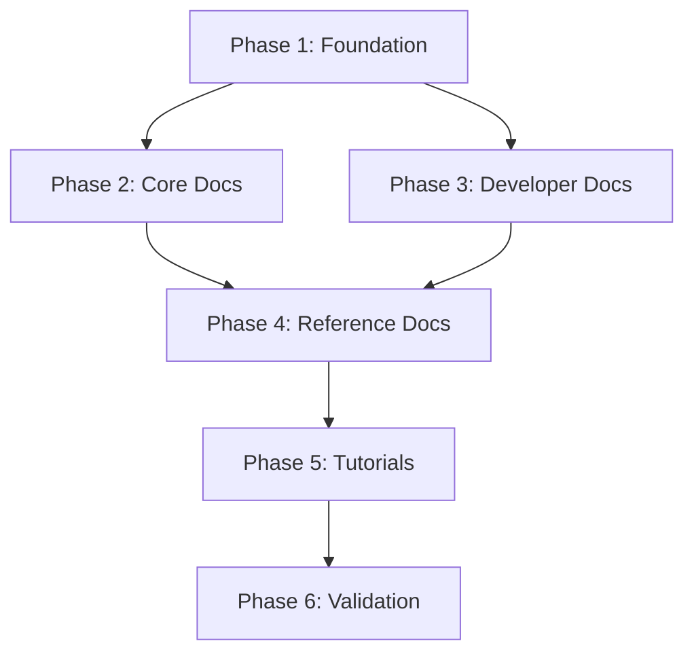

# Documentation Refactor: Execution Plan
**Sprint:** Documentation Refactor - Platform vs Domain Bits
**Date:** 2026-07-07
**Role:** Technical Writer

## Objective

Comprehensively update BitBrat documentation to reflect the Platform vs Domain Bits architecture and integrate the Reflex bit's deterministic execution model into the conceptual framework.

---

## Scope

### In Scope
- All user-facing documentation (README, concepts, guides, tutorials)
- architecture.yaml updates (add `category` field, update glossary)
- CLAUDE.md updates for LLM-assisted development
- Diagram updates (mermaid, conceptual flows)
- Cross-reference consistency across all docs

### Out of Scope
- Code changes (except architecture.yaml metadata)
- API documentation generation (focus on concepts/guides)
- Video tutorials or interactive demos
- Internationalization (English only for now)
- Deep technical architecture docs (those are already good)

---

## Approach

### Phase 1: Foundation (Architecture & Core Concepts)
**Goal:** Establish authoritative definitions and update canonical sources

1. Update `architecture.yaml` with `category` field
2. Create Platform vs Domain concept page
3. Create Reflex concept page
4. Create Dual Execution Paths concept page
5. Update Bit Model concept page

**Deliverables:**
- architecture.yaml with category metadata
- 3 new concept pages
- 1 updated concept page

**Rationale:** Start with foundational definitions so all subsequent updates reference consistent terminology.

---

### Phase 2: Core Documentation (README & Primary Flows)
**Goal:** Update the most-read documentation with new architecture

1. Update README.md architecture section
2. Update README.md agent-loop mapping table
3. Update README.md mermaid diagram
4. Update README.md "Extending BitBrat" section
5. Update Platform Flow concept page
6. Update Platform Flow diagrams

**Deliverables:**
- Updated README.md (4 sections)
- Updated platform-flow.md with dual-path diagram

**Rationale:** README is the entry point; Platform Flow is the core conceptual model. These must be updated early.

---

### Phase 3: Developer Documentation (CLAUDE.md & Guides)
**Goal:** Update developer-facing docs and LLM guidance

1. Update CLAUDE.md with new terminology
2. Update CLAUDE.md glossary
3. Update `brat bit create` guidance in tools/brat.md
4. Create "Choosing Platform vs Domain" guide
5. Update Quickstart guide with reflex mention

**Deliverables:**
- Updated CLAUDE.md
- Updated tools/brat.md
- New guide: choosing-platform-vs-domain.md
- Updated quickstart.md

**Rationale:** Developers and LLMs need updated guidance for creating new Bits with proper categorization.

---

### Phase 4: Reference & Supporting Documentation
**Goal:** Ensure all supporting docs are consistent

1. Update Capability Profiles page (clarify profile ≠ category)
2. Update Event Router & Rules page (mention reflex routing)
3. Update Bit Control-Plane reference (add examples from both categories)
4. Create Reflex API reference (MCP tools: reflex.create, reflex.list, etc.)
5. Cross-reference audit and fixes

**Deliverables:**
- 3 updated reference pages
- 1 new reference page
- Cross-reference consistency report

**Rationale:** Reference docs must be precise and consistent. Do this after core concepts are stable.

---

### Phase 5: Tutorials & Examples
**Goal:** Provide practical examples of both categories

1. Update "Creating a !lurk Command" tutorial
2. Create "Creating a Reflex" tutorial
3. Create "Creating a Domain MCP Server" tutorial
4. Update evaluating-bitbrat.md with reflex example

**Deliverables:**
- 1 updated tutorial
- 2 new tutorials
- Updated evaluation guide

**Rationale:** Tutorials cement understanding. Do these last when all concepts are stable.

---

### Phase 6: Validation & Polish
**Goal:** Ensure quality and consistency

1. Cross-reference audit (all internal links work)
2. Terminology consistency check
3. Diagram visual consistency
4. Test with "fresh eyes" reader
5. Update CHANGELOG.md

**Deliverables:**
- Validation report
- Updated CHANGELOG.md
- Quality checklist

**Rationale:** Final quality pass before considering sprint complete.

---

## Task Dependencies

**Critical Path:** Phase 1 → Phase 2 → Phase 4 → Phase 6
**Parallel Work:** Phase 3 can proceed alongside Phase 2

---

## Detailed Task Breakdown

### Phase 1: Foundation

#### Task 1.1: Update architecture.yaml
**Priority:** P0 (Blocker)
**Effort:** 1 hour
**Owner:** Technical Writer

**Subtasks:**
1. Add `category: platform|domain` field to all active services
2. Update `llm_guidance.glossary` with category definition
3. Update `llm_guidance.glossary.bit` to mention category
4. Add validation schema comment for category field
5. Document rationale for each categorization (comment)

**Acceptance Criteria:**
- All active services have `category` field
- Glossary defines `platform_bit` and `domain_bit`
- Comments explain categorization rationale

---

#### Task 1.2: Create Platform vs Domain Bits Concept Page
**Priority:** P0
**Effort:** 3 hours
**Owner:** Technical Writer
**Dependencies:** Task 1.1 complete

**Content Outline:**
1. Introduction - Why this distinction matters
2. Platform Bits Definition & Characteristics
3. Domain Bits Definition & Characteristics
4. Current Categorization Table (from architecture.yaml)
5. Decision Criteria & Examples
6. Gray Areas & Evolution
7. Relationship to Profiles and Exposure

**Acceptance Criteria:**
- Clear definitions with examples
- Table listing all Platform and Domain Bits with rationale
- Guidance for choosing category
- Cross-references to bit-model.md and capability-profiles.md

---

#### Task 1.3: Create Reflex Deterministic Execution Concept Page
**Priority:** P0
**Effort:** 4 hours
**Owner:** Technical Writer

**Content Outline:**
1. Introduction - What reflexes are
2. Architecture - Pattern matching, MCP tool execution
3. Performance Characteristics (<150ms, sub-LLM)
4. When to Use Reflexes vs LLM
5. Reflex Lifecycle (create, match, execute, observe)
6. Integration with Event Router
7. Examples (chat commands, simple automations)
8. Limitations & Trade-offs

**Acceptance Criteria:**
- Clear explanation of deterministic execution model
- Performance benchmarks documented
- Decision tree: when to use reflex vs LLM
- Code examples of reflex definitions
- Cross-references to platform-flow.md and event-router-rules.md

---

#### Task 1.4: Create Dual Execution Paths Concept Page
**Priority:** P0
**Effort:** 3 hours
**Owner:** Technical Writer
**Dependencies:** Task 1.3 complete

**Content Outline:**
1. Introduction - Two paths through the platform
2. Deterministic Path (Reflex) - Flow diagram, characteristics
3. LLM-Based Path (Traditional) - Flow diagram, characteristics
4. Routing Decision Points (Event Router rules)
5. Performance Comparison Table
6. Cost Comparison Table
7. Use Case Matrix
8. Shared Infrastructure (ingress, router, tool-gateway, persistence)

**Acceptance Criteria:**
- Side-by-side flow diagrams
- Performance and cost comparison tables
- Clear guidance on when to use each path
- Examples of routing rules that select each path

---

#### Task 1.5: Update Bit Model Concept Page
**Priority:** P0
**Effort:** 2 hours
**Owner:** Technical Writer
**Dependencies:** Task 1.2 complete

**Updates:**
1. Add "Platform vs Domain Categorization" section after "The three rings"
2. Clarify that `profile:` is orthogonal to category
3. Add examples from both Platform and Domain categories
4. Update "Declaring a Bit" section with category guidance
5. Add cross-reference to platform-vs-domain-bits.md

**Acceptance Criteria:**
- Clear distinction between profile (capability) and category (role)
- Examples show both Platform and Domain Bits
- No confusion between profile and category

---

### Phase 2: Core Documentation

#### Task 2.1: Update README Architecture Section
**Priority:** P0
**Effort:** 3 hours
**Owner:** Technical Writer
**Dependencies:** Phase 1 complete

**Updates:**
1. Revise "Architecture" section to categorize services
2. Add Platform Bits subsection with table
3. Add Domain Bits subsection with table
4. Update introductory paragraph to mention dual paths
5. Add cross-references to new concept pages

**Acceptance Criteria:**
- Services clearly categorized
- Rationale for categorization provided
- Links to detailed concept pages

---

#### Task 2.2: Update README Agent-Loop Mapping Table
**Priority:** P0
**Effort:** 1 hour
**Owner:** Technical Writer
**Dependencies:** Task 1.3, 1.4 complete

**Updates:**
1. Add reflex row to agent-loop mapping table
2. Update description to show dual paths for "Act" stage
3. Add performance notes (deterministic <150ms, LLM 2-10s)
4. Link to dual-execution-paths.md

**Acceptance Criteria:**
- Reflex appears in agent-loop table
- Dual paths clearly shown for "Act" stage
- Performance characteristics documented

---

#### Task 2.3: Update README Mermaid Diagram
**Priority:** P1
**Effort:** 2 hours
**Owner:** Technical Writer
**Dependencies:** Task 1.4 complete

**Updates:**
1. Add reflex node parallel to llm-bot
2. Show router routing to both reflex and llm-bot
3. Add visual distinction for Platform vs Domain Bits (colors/shapes)
4. Update legend to explain categorization
5. Show both paths converging at tool-gateway

**Acceptance Criteria:**
- Diagram shows dual execution paths
- Reflex clearly visible
- Legend explains colors/shapes
- Diagram remains readable (not too cluttered)

---

#### Task 2.4: Update README "Extending BitBrat" Section
**Priority:** P1
**Effort:** 2 hours
**Owner:** Technical Writer
**Dependencies:** Task 1.2 complete

**Updates:**
1. Add guidance on choosing Platform vs Domain when creating Bits
2. Update `brat bit create` examples with category context
3. Add link to choosing-platform-vs-domain.md guide
4. Show example of creating both Platform and Domain Bits

**Acceptance Criteria:**
- Clear guidance on category selection
- Examples show both categories
- Cross-reference to detailed guide

---

#### Task 2.5: Update Platform Flow Concept Page
**Priority:** P0
**Effort:** 3 hours
**Owner:** Technical Writer
**Dependencies:** Task 1.3, 1.4 complete

**Updates:**
1. Add "Dual Execution Paths" section
2. Create split diagram showing deterministic and LLM paths
3. Update stage descriptions to mention reflex
4. Add decision flowchart for routing
5. Update examples with reflex scenarios

**Acceptance Criteria:**
- Diagram shows both paths clearly
- Reflex integrated into existing flow
- Decision logic explained
- Cross-references to dual-execution-paths.md

---

### Phase 3: Developer Documentation

#### Task 3.1: Update CLAUDE.md Terminology
**Priority:** P1
**Effort:** 2 hours
**Owner:** Technical Writer
**Dependencies:** Phase 1 complete

**Updates:**
1. Add platform_bit and domain_bit to glossary
2. Update bit definition to mention category
3. Add reflex to glossary
4. Update invariants if needed
5. Add cross-references to new concept pages

**Acceptance Criteria:**
- Glossary includes all new terms
- Definitions consistent with concept pages
- LLM has clear guidance on terminology

---

#### Task 3.2: Update brat bit create Documentation
**Priority:** P1
**Effort:** 2 hours
**Owner:** Technical Writer
**Dependencies:** Task 1.2 complete

**Updates:**
1. Add category selection guidance
2. Show examples for both Platform and Domain creation
3. Update command reference with --category flag (if added)
4. Explain relationship between profile and category

**Acceptance Criteria:**
- Developers understand when to create Platform vs Domain
- Examples cover both categories
- Command reference is accurate

---

#### Task 3.3: Create "Choosing Platform vs Domain" Guide
**Priority:** P1
**Effort:** 3 hours
**Owner:** Technical Writer
**Dependencies:** Task 1.2 complete

**Content Outline:**
1. Decision Tree Flowchart
2. Checklist of Questions to Ask
3. Examples of Each Category
4. Common Mistakes to Avoid
5. When to Refactor Category
6. Architecture Review Process

**Acceptance Criteria:**
- Clear decision-making process
- Actionable checklist
- Real examples from platform
- Guidance on category migration

---

#### Task 3.4: Update Quickstart with Reflex
**Priority:** P2
**Effort:** 1 hour
**Owner:** Technical Writer
**Dependencies:** Task 1.3 complete

**Updates:**
1. Mention reflex in architecture overview
2. Add reflex example to chat session
3. Link to reflex concept page

**Acceptance Criteria:**
- Reflex mentioned in context
- Example shows deterministic execution
- Link to detailed docs

---

### Phase 4: Reference Documentation

#### Task 4.1: Update Capability Profiles Page
**Priority:** P1
**Effort:** 2 hours
**Owner:** Technical Writer
**Dependencies:** Task 1.2 complete

**Updates:**
1. Add clarification: profile ≠ category
2. Show examples from both Platform and Domain Bits
3. Add cross-reference to platform-vs-domain-bits.md
4. Update tables with category column

**Acceptance Criteria:**
- Clear that profile is capability, category is role
- Examples from both categories
- No confusion between concepts

---

#### Task 4.2: Update Event Router & Rules Page
**Priority:** P1
**Effort:** 2 hours
**Owner:** Technical Writer
**Dependencies:** Task 1.3 complete

**Updates:**
1. Add section on routing to reflex
2. Show example rules that trigger reflex
3. Explain reflex routing vs llm-bot routing
4. Update rule examples

**Acceptance Criteria:**
- Reflex routing documented
- Examples show reflex rules
- Clear when router chooses reflex vs llm-bot

---

#### Task 4.3: Update Bit Control-Plane Reference
**Priority:** P2
**Effort:** 1 hour
**Owner:** Technical Writer

**Updates:**
1. Add examples from both Platform and Domain Bits
2. Show bit.info output from reflex
3. Clarify RBAC applies to both categories

**Acceptance Criteria:**
- Examples represent both categories
- No bias toward one category

---

#### Task 4.4: Create Reflex MCP Tools Reference
**Priority:** P1
**Effort:** 3 hours
**Owner:** Technical Writer
**Dependencies:** Task 1.3 complete

**Content Outline:**
1. reflex.create - Full schema and examples
2. reflex.list - Query and filtering
3. reflex.update - Modifying reflexes
4. reflex.delete - Removal
5. reflex.test - Testing reflexes
6. reflex.stats - Performance metrics
7. Error Handling
8. Best Practices

**Acceptance Criteria:**
- All MCP tools documented
- Schema details accurate
- Examples show common use cases
- Error messages explained

---

#### Task 4.5: Cross-Reference Audit
**Priority:** P2
**Effort:** 3 hours
**Owner:** Technical Writer
**Dependencies:** All previous tasks

**Process:**
1. Extract all internal links from all markdown files
2. Verify each link resolves
3. Check for broken references
4. Update outdated cross-references
5. Add missing cross-references
6. Generate cross-reference map

**Acceptance Criteria:**
- All internal links work
- Related pages cross-reference each other
- No orphaned pages
- Cross-reference map generated

---

### Phase 5: Tutorials & Examples

#### Task 5.1: Update "Creating a !lurk Command" Tutorial
**Priority:** P2
**Effort:** 2 hours
**Owner:** Technical Writer

**Updates:**
1. Mention this could be done with reflex
2. Add comparison section: Event Router rule vs Reflex
3. Show when to use each approach

**Acceptance Criteria:**
- Tutorial updated with reflex context
- Comparison helps reader choose
- Links to reflex tutorial

---

#### Task 5.2: Create "Creating a Reflex" Tutorial
**Priority:** P1
**Effort:** 4 hours
**Owner:** Technical Writer
**Dependencies:** Task 1.3, 4.4 complete

**Content Outline:**
1. Introduction & Use Case
2. Designing the Pattern Match
3. Using reflex.create MCP tool
4. Testing with reflex.test
5. Monitoring with reflex.stats
6. Debugging Common Issues
7. Performance Optimization

**Acceptance Criteria:**
- Step-by-step walkthrough
- Complete example from start to finish
- Debugging guidance
- Cross-references to concept and reference pages

---

#### Task 5.3: Create "Creating a Domain MCP Server" Tutorial
**Priority:** P2
**Effort:** 4 hours
**Owner:** Technical Writer
**Dependencies:** Task 1.2 complete

**Content Outline:**
1. Introduction & Use Case
2. Using `brat bit create --profile mcp-server`
3. Implementing Domain Tools
4. Testing with tool-gateway
5. Deploying and Registering
6. Best Practices for Domain Bits

**Acceptance Criteria:**
- Complete example MCP server
- Shows integration with tool-gateway
- Deployment process documented
- Best practices for Domain Bits

---

#### Task 5.4: Update Evaluating BitBrat Guide
**Priority:** P2
**Effort:** 1 hour
**Owner:** Technical Writer

**Updates:**
1. Add reflex to "what to try" section
2. Show quick reflex example
3. Link to reflex tutorial

**Acceptance Criteria:**
- Reflex mentioned in evaluation path
- Example shows deterministic execution

---

### Phase 6: Validation & Polish

#### Task 6.1: Terminology Consistency Check
**Priority:** P1
**Effort:** 2 hours
**Owner:** Technical Writer
**Dependencies:** All content tasks complete

**Process:**
1. Extract all uses of key terms (Bit, Platform, Domain, Reflex, etc.)
2. Check for inconsistent capitalization
3. Check for inconsistent phrasing
4. Check for outdated terminology
5. Create terminology consistency report
6. Fix inconsistencies

**Acceptance Criteria:**
- Terminology used consistently
- Style guide documented
- Consistency report shows <5 violations

---

#### Task 6.2: Diagram Visual Consistency
**Priority:** P2
**Effort:** 2 hours
**Owner:** Technical Writer

**Process:**
1. Review all diagrams (mermaid and other)
2. Standardize colors and shapes
3. Ensure legend consistency
4. Check for visual clarity
5. Update diagrams to match style guide

**Acceptance Criteria:**
- Consistent visual language across all diagrams
- Legends explain all symbols
- Diagrams are accessible (color-blind friendly)

---

#### Task 6.3: Test with Fresh Eyes
**Priority:** P1
**Effort:** 4 hours
**Owner:** External Reviewer (if available)

**Process:**
1. Recruit developer unfamiliar with recent changes
2. Ask them to read updated docs and build understanding
3. Collect feedback on clarity
4. Identify remaining gaps
5. Implement fixes based on feedback

**Acceptance Criteria:**
- Fresh reader can understand Platform vs Domain
- Fresh reader can explain dual execution paths
- Fresh reader can create a simple reflex
- Feedback incorporated

---

#### Task 6.4: Update CHANGELOG.md
**Priority:** P1
**Effort:** 1 hour
**Owner:** Technical Writer

**Updates:**
1. Add sprint entry for documentation refactor
2. List all major documentation changes
3. Note breaking changes (if any)
4. Credit contributors

**Acceptance Criteria:**
- CHANGELOG reflects all documentation updates
- Entry follows project conventions

---

## Timeline Estimation

**Total Effort:** ~60 hours of technical writing

**Phase Estimates:**
- Phase 1: Foundation - 13 hours
- Phase 2: Core Docs - 11 hours
- Phase 3: Developer Docs - 10 hours
- Phase 4: Reference Docs - 11 hours
- Phase 5: Tutorials - 11 hours
- Phase 6: Validation - 9 hours

**Suggested Schedule (1 writer, 2 weeks):**
- Week 1: Phases 1-3 (34 hours)
- Week 2: Phases 4-6 (26 hours)

**Parallel Work Opportunities:**
- Phase 3 can be done alongside Phase 2
- Individual concept pages can be parallelized
- Tutorials can be written concurrently

---

## Risks & Mitigation

### Risk 1: Architecture Changes During Sprint
**Probability:** Medium
**Impact:** High
**Mitigation:** Freeze architecture decisions at sprint start; defer changes to next sprint

### Risk 2: Scope Creep
**Probability:** High
**Impact:** Medium
**Mitigation:** Strict adherence to backlog; maintain "out of scope" list; timebox tasks

### Risk 3: Terminology Debates
**Probability:** Medium
**Impact:** Medium
**Mitigation:** Get stakeholder sign-off on Phase 1 definitions before proceeding

### Risk 4: Fresh Eyes Unavailable
**Probability:** Low
**Impact:** Low
**Mitigation:** Use AI assistant to simulate fresh reader; self-review with time gap

---

## Success Metrics

- [ ] All 6 phases completed
- [ ] 100% of internal links functional
- [ ] Terminology consistency >95%
- [ ] Fresh reader can explain Platform vs Domain
- [ ] Fresh reader can explain dual execution paths
- [ ] Fresh reader can create a reflex using docs
- [ ] Zero architectural inaccuracies
- [ ] CHANGELOG updated

---

## Next Steps

1. Review execution plan with stakeholder
2. Get approval on Phase 1 definitions
3. Create YAML backlog with task IDs
4. Begin Phase 1 execution
5. Daily progress updates
6. Phase-end reviews before proceeding

